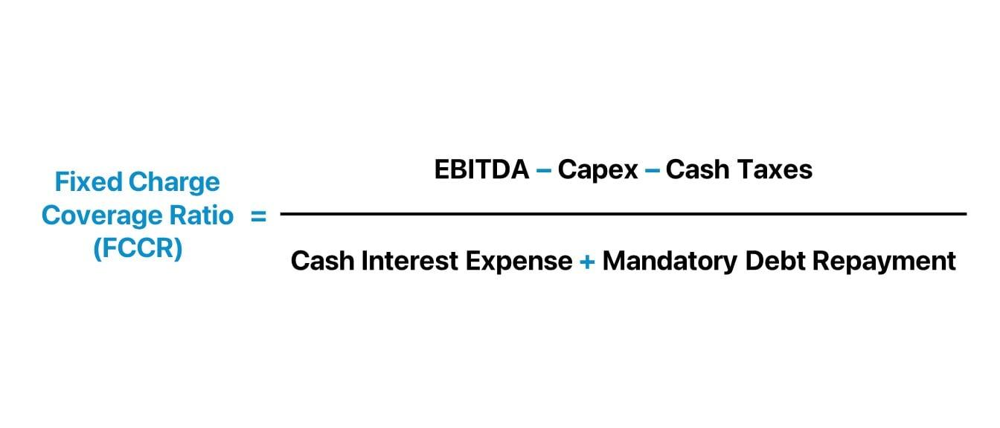

## Table of Contents

## What is the Fixed-Charge Coverage Ratio (FCCR)?

The Fixed-Charge Coverage Ratio (FCCR) is a financial metric that shows how well a company can pay its fixed charges, like interest and lease payments, with its earnings. It helps investors and lenders see if a company makes enough money to cover these costs. To calculate FCCR, you take the company's earnings before interest, taxes, depreciation, and amortization (EBITDA) and divide it by its fixed charges.

FCCR is important because it gives a clear picture of a company's financial health. If the FCCR is high, it means the company is in a good position to handle its fixed costs. On the other hand, a low FCCR might mean the company is struggling and could have trouble paying its bills. This ratio is often used by banks and investors to decide if they should lend money or invest in a company.

## How is the Fixed-Charge Coverage Ratio calculated?

The Fixed-Charge Coverage Ratio (FCCR) is calculated by dividing a company's earnings before interest, taxes, depreciation, and amortization (EBITDA) by its fixed charges. Fixed charges usually include things like interest payments on loans and lease payments. To find the FCCR, you start with the EBITDA, which is a measure of a company's operating performance. Then, you add back any lease payments to the EBITDA and divide the total by the sum of interest expenses and lease payments.

This formula helps show how well a company can cover its fixed costs with its earnings. For example, if a company has an EBITDA of $100,000, interest expenses of $20,000, and lease payments of $10,000, the FCCR would be calculated as follows: First, add the lease payments to the EBITDA to get $110,000. Then, add the interest expenses and lease payments together to get $30,000. Finally, divide $110,000 by $30,000 to get an FCCR of 3.67. This means the company's earnings are 3.67 times its fixed charges, indicating a strong ability to cover these costs.

## Why is the Fixed-Charge Coverage Ratio important for businesses?

The Fixed-Charge Coverage Ratio (FCCR) is important for businesses because it shows how easily they can pay their fixed costs, like interest on loans and lease payments, with the money they earn. This is key for business owners and managers because it helps them see if their company is making enough money to handle these regular expenses. If the FCCR is high, it means the business is in a good spot financially and can easily cover its fixed costs. But if the FCCR is low, it might mean the business could struggle to pay its bills, which can be a warning sign.

Lenders and investors also look at the FCCR to decide if they should give money to a business. A high FCCR tells them the business is likely to pay back loans on time, making it a safer bet for lending or investing. This can help businesses get loans with better terms or attract more investors. On the flip side, a low FCCR might make lenders and investors think twice, as it suggests the business might have trouble paying back what it owes. So, keeping an eye on the FCCR helps businesses stay financially healthy and build trust with those who might lend them money or invest in them.

## What does a high FCCR indicate about a company's financial health?

A high Fixed-Charge Coverage Ratio (FCCR) means a company is doing well financially. It shows that the company makes enough money to easily pay its fixed costs, like interest on loans and lease payments. This is good because it means the company is not struggling to keep up with its bills. When a company has a high FCCR, it has a strong financial cushion, which can help it weather tough times or take advantage of new opportunities.

People who lend money or invest in the company also like to see a high FCCR. It tells them the company is a safe bet because it can easily cover its fixed costs. This can make it easier for the company to get loans with good terms or attract more investors. Overall, a high FCCR is a sign of a healthy, stable business that can handle its financial responsibilities without trouble.

## What does a low FCCR suggest, and what are the potential risks?

A low FCCR means a company might have trouble paying its fixed costs like interest on loans and lease payments. It shows that the company's earnings are not enough to easily cover these regular expenses. When a company has a low FCCR, it might need to use all its money just to stay afloat, leaving little room for growth or unexpected costs.

The risks of a low FCCR are big. Lenders and investors might see the company as risky and be less willing to give money or invest. This can make it hard for the company to get loans, and if it does, the terms might be bad. If the company can't pay its fixed costs, it could default on loans, hurt its credit, and even face bankruptcy. So, a low FCCR is a warning sign that the company needs to find ways to make more money or cut costs to stay healthy financially.

## Can you provide an example of how to compute the FCCR using a company's financial data?

Let's say we have a company called ABC Corp. ABC Corp has an EBITDA of $150,000, interest expenses of $30,000, and lease payments of $20,000. To find the FCCR, we start by adding the lease payments back to the EBITDA. So, $150,000 plus $20,000 gives us $170,000. Next, we add the interest expenses and lease payments together to get the total fixed charges. That's $30,000 plus $20,000, which equals $50,000.

Now, we divide the adjusted EBITDA by the total fixed charges to find the FCCR. So, $170,000 divided by $50,000 gives us an FCCR of 3.4. This means ABC Corp's earnings are 3.4 times its fixed charges. A ratio of 3.4 is pretty good, showing that ABC Corp can easily cover its fixed costs with its earnings.

## How does the FCCR differ from other financial ratios like the Debt Service Coverage Ratio (DSCR)?

The Fixed-Charge Coverage Ratio (FCCR) and the Debt Service Coverage Ratio (DSCR) both help show how well a company can pay its bills, but they look at different things. The FCCR looks at all the fixed costs a company has to pay, like interest on loans and lease payments. It uses a company's earnings before interest, taxes, depreciation, and amortization (EBITDA) to see if there's enough money to cover these costs. So, the FCCR gives a broad view of a company's ability to handle its regular payments.

The DSCR, on the other hand, focuses just on a company's ability to pay back its debts. It compares a company's net operating income to its debt payments, which include both interest and principal. This ratio is important for lenders who want to know if a company can pay back the money it borrows. While the FCCR gives a wider picture of financial health by including all fixed charges, the DSCR zeroes in on debt repayment, making it a key tool for understanding a company's debt management.

## What are the industry benchmarks for a good Fixed-Charge Coverage Ratio?

Industry benchmarks for a good Fixed-Charge Coverage Ratio (FCCR) can change a lot depending on the type of business and the economy. But, a general rule is that an FCCR of 1.5 or higher is seen as healthy. This means the company's earnings are 1.5 times its fixed costs, showing it can easily pay its bills. For industries that need a lot of money to run, like manufacturing or utilities, a higher FCCR, like 2 or more, might be needed to show strong financial health.

In tough times or industries with a lot of ups and downs, like retail or hospitality, a higher FCCR can be even more important. It gives the company a cushion to handle unexpected costs or drops in earnings. Lenders and investors often look at these benchmarks to decide if a company is a safe bet. So, knowing the right FCCR for your industry can help a business plan better and stay financially strong.

## How can a company improve its Fixed-Charge Coverage Ratio?

A company can improve its Fixed-Charge Coverage Ratio by increasing its earnings. This can be done by finding new ways to make more money, like selling more products or services, raising prices, or expanding into new markets. Another way is to cut costs. By looking closely at where money is being spent and finding ways to spend less, like reducing waste or negotiating better deals with suppliers, the company can keep more of its earnings. This boost in earnings helps the company cover its fixed costs more easily, which in turn improves the FCCR.

Another way to improve the FCCR is to manage fixed costs better. If a company can lower its fixed costs, like interest on loans or lease payments, it will have less to pay each month. This can be done by paying off debt faster, refinancing loans at lower interest rates, or renegotiating lease terms. By reducing these fixed costs, the company's earnings will go further in covering them, leading to a higher FCCR. Both increasing earnings and managing fixed costs well are key to making the company's financial health stronger.

## What are the limitations of using the Fixed-Charge Coverage Ratio as a financial metric?

One big limitation of the Fixed-Charge Coverage Ratio (FCCR) is that it only looks at a small part of a company's financial health. It focuses on fixed costs like interest and lease payments, but it doesn't tell you about other important things like how much the company owes overall, how fast it's growing, or how well it's managing its money day-to-day. So, while the FCCR can show if a company can pay its fixed costs, it doesn't give the whole picture of the company's financial situation.

Another limitation is that the FCCR can be different in different industries. What's a good FCCR for one type of business might not be good for another. For example, a tech company might have a very different FCCR than a manufacturing company because their costs and earnings are different. This means you have to know the industry well to understand if a company's FCCR is good or not. Also, the FCCR uses EBITDA, which can be changed by things like how a company accounts for its costs, so it's not always the most accurate way to measure a company's ability to pay its fixed costs.

## How does the FCCR impact a company's ability to secure loans or investments?

The Fixed-Charge Coverage Ratio (FCCR) is really important when a company wants to get a loan or attract investors. A high FCCR shows that the company makes enough money to easily pay its fixed costs, like interest on loans and lease payments. Lenders and investors like to see a high FCCR because it means the company is less risky. They feel more confident that the company will be able to pay back the money it borrows or give them a good return on their investment. So, a strong FCCR can help a company get loans with better terms or attract more investors.

On the other hand, a low FCCR can make it hard for a company to secure loans or investments. If the FCCR is low, it means the company might struggle to pay its fixed costs, which is a big worry for lenders and investors. They might think the company is too risky and decide not to lend money or invest. If they do decide to lend or invest, they might ask for higher interest rates or stricter terms to make up for the risk. So, a company with a low FCCR might have to work harder to show lenders and investors that it can improve its financial health.

## In what ways can changes in economic conditions affect a company's FCCR?

Changes in economic conditions can have a big impact on a company's Fixed-Charge Coverage Ratio (FCCR). When the economy is doing well, businesses usually make more money because people are buying more stuff. This means their earnings go up, which can make their FCCR higher. They can cover their fixed costs like interest on loans and lease payments more easily. But if the economy goes into a downturn, businesses might sell less, and their earnings could drop. This can make it harder for them to pay their fixed costs, leading to a lower FCCR.

Economic changes can also affect the costs that go into the FCCR. For example, if interest rates go up because of changes in the economy, the interest payments on a company's loans will be higher. This means the company's fixed charges will increase, which can lower the FCCR. On the other hand, if interest rates go down, the company's fixed charges might get smaller, helping to improve the FCCR. So, both the earnings and the costs side of the FCCR can be influenced by what's happening in the economy.

## What is the Fixed-Charge Coverage Ratio (FCCR) and how is it understood?

The Fixed-Charge Coverage Ratio (FCCR) is a critical financial metric used to evaluate a company's ability to honor its fixed financial commitments through its earnings. These fixed charges typically consist of obligations such as debt payments, lease agreements, and interest expenditures. By focusing on these elements, FCCR serves as a comprehensive indicator of financial stability and operational efficiency.

To calculate FCCR, the formula is expressed as:

$$
\text{FCCR} = \frac{\text{EBIT} + \text{Fixed Charges Before Tax}}{\text{Fixed Charges Before Tax} + \text{Interest Expenses}}
$$

Where:

- **EBIT** stands for Earnings Before Interest and Taxes, which represents a company's profitability from its operations.
- **Fixed Charges Before Tax** include expenses such as lease payments, as these need to be covered regardless of the tax implications.
- **Interest Expenses** are the costs incurred by the company to service its debt.

The resultant ratio illustrates how many times a company can cover its fixed charges with its current operating earnings. A higher FCCR indicates stronger financial health, implying that the company generates sufficient earnings to comfortably meet its fixed obligations. This robustness makes it a valuable tool for lenders when assessing creditworthiness and for investors trying to gauge a company's financial risk and stability.

For companies with significant debt loads or those exploring new financing avenues, an in-depth understanding of FCCR is indispensable. By ensuring that earnings can adequately cover fixed charges, companies can secure better loan terms and attract potential investors, thereby enhancing their financial strategies and stability in both short and long-term perspectives.

## How do you calculate FCCR: A Step-by-step Guide?

To calculate the Fixed-Charge Coverage Ratio (FCCR), start by identifying the earnings before interest and taxes (EBIT) from the company's income statement. This figure represents the company's operating profit before the deduction of interest expenses and income tax expenses.

Next, add back any fixed charges incurred before tax, such as lease payments and interest expenses. These fixed charges are typically regular, predictable obligations that the company must meet, regardless of its financial performance.

The formula for the FCCR is:

$$
\text{FCCR} = \frac{\text{EBIT} + \text{Fixed Charges Before Tax}}{\text{Fixed Charges Before Tax} + \text{Interest Expenses}}
$$

The numerator consists of the sum of EBIT and fixed charges before tax, reflecting the total earnings available to cover fixed financial obligations.

The denominator is the sum of fixed charges before tax plus interest expenses. This total represents the company's fixed financial obligations that need to be covered.

For instance, consider a company with an EBIT of $300,000, fixed charges of $200,000, and interest expenses of $50,000. The calculation would be:

$$
\text{FCCR} = \frac{300,000 + 200,000}{200,000 + 50,000} = \frac{500,000}{250,000} = 2.0
$$

This result indicates that the company can cover its fixed financial obligations two times over with its earnings, suggesting strong financial stability. A higher FCCR generally reflects a lower risk of default on fixed obligations, making the company more attractive to lenders and investors.

## What are some examples and real-world applications?

Consider Company A, which reports an Earnings Before Interest and Taxes (EBIT) of $300,000, along with lease payments amounting to $200,000 and interest expenses of $50,000. The Fixed-Charge Coverage Ratio (FCCR) for Company A is calculated as follows:

$$
\text{FCCR} = \frac{\text{EBIT} + \text{Fixed Charges Before Tax}}{\text{Fixed Charges Before Tax} + \text{Interest Expenses}} = \frac{300,000 + 200,000}{200,000 + 50,000} = 2.0
$$

This FCCR of 2.0 indicates that Company A is capable of covering its fixed financial obligations twice over with its current earnings. This ratio not only highlights the company's financial resilience but also plays a multifaceted role in practical financial scenarios.

From the perspective of lenders, a high FCCR such as this one suggests financial stability, making Company A a more attractive candidate for favorable loan terms. Lenders often rely on FCCR as a measure of creditworthiness, and a higher ratio increases the likelihood of securing loans with lower interest rates and more favorable conditions.

In [algorithmic trading](/wiki/algorithmic-trading), the significance of FCCR is equally profound. A company with a robust FCCR, like 2.0, might trigger a buy order within trading algorithms. This dictates a lower credit risk and suggests that the company is less likely to default on its obligations, presenting a more secure investment opportunity during volatile market conditions.

Furthermore, investment firms often incorporate FCCR into broader financial analyses. By using FCCR alongside other [liquidity](/wiki/liquidity-risk-premium) ratios, firms can gain a comprehensive understanding of a company’s cash flow adequacy. This assists in making informed decisions about client investments, ensuring that cash flows are sufficient to meet ongoing operational needs and enhance shareholder value.

Lastly, the application and analysis of FCCR are prevalent in governance and stakeholder communications. It is routinely included in annual financial reports and presentations, serving as a key indicator of financial health to stakeholders. By ensuring that a company's earnings sufficiently surpass fixed charges, FCCR reinforces a narrative of financial stability and operational efficiency in these reporting environments.

## References & Further Reading

[1]: ["Principles of Corporate Finance"](https://www.mheducation.com/highered/product/principles-corporate-finance-brealey-myers/M9781264080946.html) by Richard A. Brealey, Stewart C. Myers, and Franklin Allen

[2]: ["Financial Ratio Analysis: A Handy Guidebook"](https://www.amazon.com/Financial-Ratio-Analysis-Handy-Guidebook/dp/1425105262) by H. Kent Baker

[3]: ["Analyzing Financial Statements"](https://www.investopedia.com/terms/f/financial-statement-analysis.asp) by Thomas Ittelson

[4]: ["Algorithmic Trading: Winning Strategies and Their Rationale"](https://www.wiley.com/en-us/Algorithmic+Trading%3A+Winning+Strategies+and+Their+Rationale-p-9781118460146) by Ernie Chan

[5]: Altman, E. I. (1968). ["Financial Ratios, Discriminant Analysis and the Prediction of Corporate Bankruptcy"](https://www.semanticscholar.org/paper/FINANCIAL-RATIOS%2C-DISCRIMINANT-ANALYSIS-AND-THE-OF-Altman/a193120975be25b4ba2764e6d7bf9dc01588aafb), The Journal of Finance, 23(4), 589-609. 

[6]: ["Credit Risk: From Transaction to Portfolio Management"](https://archive.org/details/creditriskfromtr0000kimb) by Andrew Kimber