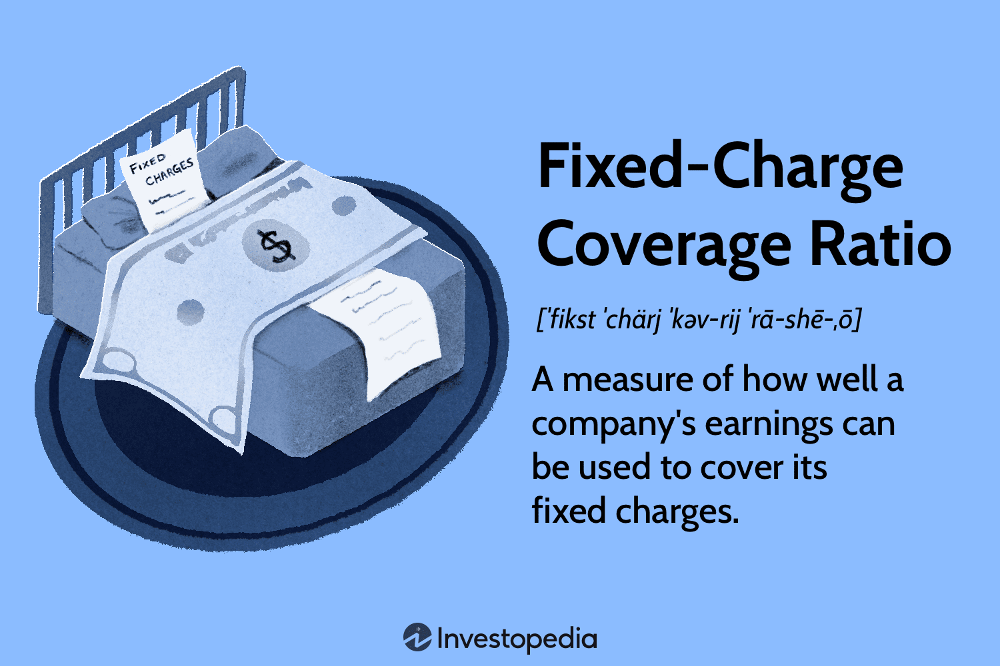

In today's financial landscape, understanding financial ratios is crucial for companies seeking to improve their creditworthiness and identify new growth opportunities. A key metric in this domain is the Fixed-Charge Coverage Ratio (FCCR), which plays an essential role in assessing a company's financial health. FCCR is particularly effective in evaluating a company's ability to meet its fixed financial obligations, which include lease payments, interest expenses, and other set charges. This metric is essential not only for ensuring operational stability but also for maintaining investor confidence and lender trust.

Algorithmic trading—the automated buying and selling of financial instruments based on pre-set algorithms—depends heavily on precise and reliable data. Integrating the FCCR within trading algorithms can offer a substantial competitive edge. By assessing whether a company's earnings can cover its fixed charges, traders gain valuable insights that inform their decisions regarding investments and lending. This information is critical, especially during periods of economic uncertainty or market volatility, when understanding a company's financial resilience becomes paramount.

The focus of this article will be to explain the FCCR in detail, covering its calculation method and the implications it holds for algorithmic trading. The ratio is calculated by dividing the sum of earnings before interest and taxes (EBIT) and fixed charges before tax by the sum of fixed charges before tax plus interest expenses. By mastering this calculation, traders and analysts can enhance their understanding of a company's financial stability, thus refining their trading strategies for better outcomes.

Moreover, the article will examine the impacts of FCCR within the broader context of financial ratios, showcasing why it represents a valuable tool for traders and traditional financial analysts. With its ability to provide a clear picture of a company's fiscal responsibilities and capabilities, FCCR stands out as an integral part of comprehensive financial analysis. This in-depth understanding aids analysts and investors in making informed decisions that align with the overarching financial goals of both individuals and organizations.

Lastly, the article will address practical applications and inherent limitations of the FCCR, ensuring a balanced comprehension of its utility. By exploring real-world scenarios and potential drawbacks, readers will gain a nuanced perspective of how this metric can be harnessed effectively while being mindful of its constraints. This balanced view underscores the importance of integrating FCCR with other financial ratios and metrics to form robust, reliable strategies that advance both risk management and growth-oriented objectives.

## Table of Contents

## Understanding the Fixed-Charge Coverage Ratio (FCCR)

The Fixed-Charge Coverage Ratio (FCCR) is a critical financial metric used to evaluate a company's ability to honor its fixed financial commitments through its earnings. These fixed charges typically consist of obligations such as debt payments, lease agreements, and interest expenditures. By focusing on these elements, FCCR serves as a comprehensive indicator of financial stability and operational efficiency.

To calculate FCCR, the formula is expressed as:

$$
\text{FCCR} = \frac{\text{EBIT} + \text{Fixed Charges Before Tax}}{\text{Fixed Charges Before Tax} + \text{Interest Expenses}}
$$

Where:

- **EBIT** stands for Earnings Before Interest and Taxes, which represents a company's profitability from its operations.
- **Fixed Charges Before Tax** include expenses such as lease payments, as these need to be covered regardless of the tax implications.
- **Interest Expenses** are the costs incurred by the company to service its debt.

The resultant ratio illustrates how many times a company can cover its fixed charges with its current operating earnings. A higher FCCR indicates stronger financial health, implying that the company generates sufficient earnings to comfortably meet its fixed obligations. This robustness makes it a valuable tool for lenders when assessing creditworthiness and for investors trying to gauge a company's financial risk and stability.

For companies with significant debt loads or those exploring new financing avenues, an in-depth understanding of FCCR is indispensable. By ensuring that earnings can adequately cover fixed charges, companies can secure better loan terms and attract potential investors, thereby enhancing their financial strategies and stability in both short and long-term perspectives.

## Calculating FCCR: A Step-by-step Guide

To calculate the Fixed-Charge Coverage Ratio (FCCR), start by identifying the earnings before interest and taxes (EBIT) from the company's income statement. This figure represents the company's operating profit before the deduction of interest expenses and income tax expenses.

Next, add back any fixed charges incurred before tax, such as lease payments and interest expenses. These fixed charges are typically regular, predictable obligations that the company must meet, regardless of its financial performance.

The formula for the FCCR is:

$$
\text{FCCR} = \frac{\text{EBIT} + \text{Fixed Charges Before Tax}}{\text{Fixed Charges Before Tax} + \text{Interest Expenses}}
$$

The numerator consists of the sum of EBIT and fixed charges before tax, reflecting the total earnings available to cover fixed financial obligations.

The denominator is the sum of fixed charges before tax plus interest expenses. This total represents the company's fixed financial obligations that need to be covered.

For instance, consider a company with an EBIT of $300,000, fixed charges of $200,000, and interest expenses of $50,000. The calculation would be:

$$
\text{FCCR} = \frac{300,000 + 200,000}{200,000 + 50,000} = \frac{500,000}{250,000} = 2.0
$$

This result indicates that the company can cover its fixed financial obligations two times over with its earnings, suggesting strong financial stability. A higher FCCR generally reflects a lower risk of default on fixed obligations, making the company more attractive to lenders and investors.

## Significance of FCCR in Algorithmic Trading

In [algorithmic trading](/wiki/algorithmic-trading), the integration of the Fixed-Charge Coverage Ratio (FCCR) plays a crucial role in forming effective trading strategies. This financial metric provides essential insights into a company's capacity to manage its fixed financial obligations, thereby allowing traders to gauge financial resilience. 

A higher FCCR suggests that a company is more capable of covering its fixed charges from its earnings, reflecting strong financial stability. This stability is particularly attractive in volatile market conditions, making such companies safer investment targets. For instance, companies with an FCCR greater than 1.0 are generally considered more financially robust, as they can meet their fixed financial commitments at least once over with their current earnings.

Algorithmic models benefit from using FCCR in combination with other financial ratios, facilitating automated identification of investment opportunities that aim to minimize risk while optimizing returns. By analyzing these metrics, algorithms can more effectively screen out companies that present poor financial health, thus reducing the potential for portfolio underperformance. This approach aligns perfectly with strategies aimed at risk management and return maximization, providing a comprehensive analytical framework for investment decision-making.

For hedge funds and portfolio managers, particularly those concentrating on long-term returns, FCCR offers a valuable dimension to financial analysis. These professionals can leverage FCCR to enhance the precision of trading algorithms, ensuring that the selection of investment opportunities is based on sound credit and risk assessments. The ability to filter and select high-performing stocks through FCCR helps maintain a balanced and profitable portfolio, even in an unpredictable market landscape.

Overall, the application of FCCR in algorithmic trading underscores its importance as a tool for evaluating financial health and stability, making it indispensable for informed trading and investment strategy development.

## Examples and Real-World Applications

Consider Company A, which reports an Earnings Before Interest and Taxes (EBIT) of $300,000, along with lease payments amounting to $200,000 and interest expenses of $50,000. The Fixed-Charge Coverage Ratio (FCCR) for Company A is calculated as follows:

$$
\text{FCCR} = \frac{\text{EBIT} + \text{Fixed Charges Before Tax}}{\text{Fixed Charges Before Tax} + \text{Interest Expenses}} = \frac{300,000 + 200,000}{200,000 + 50,000} = 2.0
$$

This FCCR of 2.0 indicates that Company A is capable of covering its fixed financial obligations twice over with its current earnings. This ratio not only highlights the company's financial resilience but also plays a multifaceted role in practical financial scenarios.

From the perspective of lenders, a high FCCR such as this one suggests financial stability, making Company A a more attractive candidate for favorable loan terms. Lenders often rely on FCCR as a measure of creditworthiness, and a higher ratio increases the likelihood of securing loans with lower interest rates and more favorable conditions.

In algorithmic trading, the significance of FCCR is equally profound. A company with a robust FCCR, like 2.0, might trigger a buy order within trading algorithms. This dictates a lower credit risk and suggests that the company is less likely to default on its obligations, presenting a more secure investment opportunity during volatile market conditions.

Furthermore, investment firms often incorporate FCCR into broader financial analyses. By using FCCR alongside other [liquidity](/wiki/liquidity-risk-premium) ratios, firms can gain a comprehensive understanding of a company’s cash flow adequacy. This assists in making informed decisions about client investments, ensuring that cash flows are sufficient to meet ongoing operational needs and enhance shareholder value.

Lastly, the application and analysis of FCCR are prevalent in governance and stakeholder communications. It is routinely included in annual financial reports and presentations, serving as a key indicator of financial health to stakeholders. By ensuring that a company's earnings sufficiently surpass fixed charges, FCCR reinforces a narrative of financial stability and operational efficiency in these reporting environments.

## Limitations of FCCR and Considerations

While the Fixed-Charge Coverage Ratio (FCCR) offers a valuable perspective on a company's ability to cover its fixed financial obligations, it is not without limitations. One significant drawback is its inability to account for rapid shifts in capital demands. Growing companies, which might require substantial changes in capital, could find FCCR less reflective of their actual financial dynamics. As a static measure, FCCR does not readily accommodate such fluctuations, potentially providing an outdated snapshot of financial health.

Another limitation is FCCR's exclusion of non-cash items such as depreciation and amortization. These accounting entries, though not involving immediate cash outflows, can materially affect a company's financial portrayal. By ignoring these costs, FCCR might misrepresent a company's true financial flexibility, particularly for businesses where depreciation constitutes a large portion of expenses.

The reliance on historical financial data further constrains FCCR's utility. This backward-looking nature of FCCR means it may not effectively predict future financial performance, especially as market conditions evolve. Rapid or significant changes in the economic environment might render past data less relevant for current analyses, highlighting the need for more dynamic financial evaluation techniques.

Incorporating FCCR into analyses should be done with the understanding that it is but one lens through which to view financial health. For a comprehensive evaluation, FCCR should be used in conjunction with other financial ratios and metrics. Such a combined approach allows for a more nuanced understanding of a company's risk profile and operational robustness.

Industry-specific factors also necessitate careful consideration when applying FCCR. Companies in capital-intensive sectors, like manufacturing or utilities, often inherently exhibit lower FCCRs due to higher baseline fixed charges. Thus, comparing FCCR across different industries without adjusting for these variances could lead to misleading conclusions about financial strength or credit risk. Therefore, contextually adjusting FCCR evaluations according to industry norms and specific company scenarios is crucial for accurate financial interpretation.

## Conclusion

The Fixed-Charge Coverage Ratio (FCCR) plays a vital role in financial analysis, as it provides an insightful measure of a company's capacity to handle its fixed financial obligations. This metric is indispensable for assessing financial resilience and creditworthiness, offering a quantifiable view of how comfortably a company can meet its fixed charges with its current earnings.

Incorporating FCCR into algorithmic trading frameworks significantly refines decision-making processes. By offering a clearer picture of a company's financial stability, FCCR helps traders identify viable investment opportunities with reduced credit risk. This metric serves as a powerful tool, especially when integrated with other financial ratios, to automate and optimize portfolio management strategies.

Despite its inherent limitations, such as its reliance on historical data and the exclusion of non-cash items like depreciation, FCCR continues to be a crucial gauge for evaluating credit risk. Additionally, its effectiveness is amplified when used alongside other financial metrics, ensuring a comprehensive analysis of a company's financial health.

A balanced approach that taps into FCCR's utility in both fundamental financial analysis and automated trading algorithms can greatly enhance trading efficacy. By understanding and leveraging this metric, traders and analysts can formulate robust investment strategies designed to achieve a harmonious balance between risk management and growth. Ultimately, FCCR stands as a pivotal component in the toolkit of financial analysts aiming to navigate the complexities of investment and credit assessment.

## References & Further Reading

[1]: ["Principles of Corporate Finance"](https://www.mheducation.com/highered/product/principles-corporate-finance-brealey-myers/M9781264080946.html) by Richard A. Brealey, Stewart C. Myers, and Franklin Allen

[2]: ["Financial Ratio Analysis: A Handy Guidebook"](https://www.amazon.com/Financial-Ratio-Analysis-Handy-Guidebook/dp/1425105262) by H. Kent Baker

[3]: ["Analyzing Financial Statements"](https://www.investopedia.com/terms/f/financial-statement-analysis.asp) by Thomas Ittelson

[4]: ["Algorithmic Trading: Winning Strategies and Their Rationale"](https://www.wiley.com/en-us/Algorithmic+Trading%3A+Winning+Strategies+and+Their+Rationale-p-9781118460146) by Ernie Chan

[5]: Altman, E. I. (1968). ["Financial Ratios, Discriminant Analysis and the Prediction of Corporate Bankruptcy"](https://www.semanticscholar.org/paper/FINANCIAL-RATIOS%2C-DISCRIMINANT-ANALYSIS-AND-THE-OF-Altman/a193120975be25b4ba2764e6d7bf9dc01588aafb), The Journal of Finance, 23(4), 589-609. 

[6]: ["Credit Risk: From Transaction to Portfolio Management"](https://archive.org/details/creditriskfromtr0000kimb) by Andrew Kimber