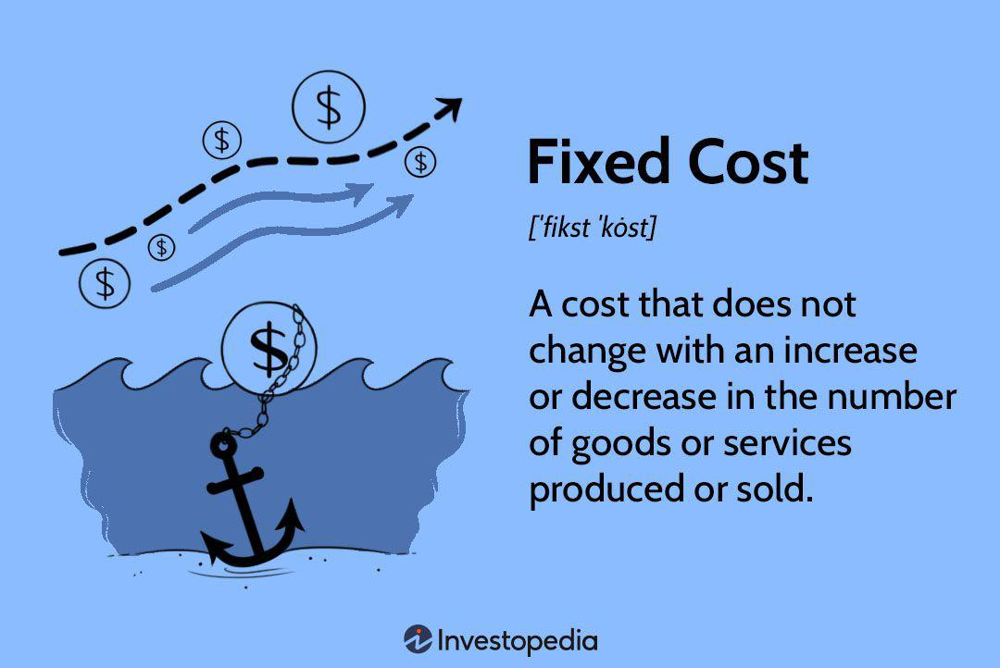

In today's competitive business environment, effective cost management is essential for profitability. Businesses are continuously seeking ways to streamline operations, minimize expenses, and enhance financial outcomes. A critical aspect of this process is understanding the intersection of fixed costs, business finance, cost management, and algorithmic trading.

Fixed costs are those business expenses that do not fluctuate with production levels or sales volume. These include necessary expenditures such as rent, salaries, and insurance. The challenge for businesses is to manage these costs efficiently, as they directly influence the break-even point and overall profitability. Therefore, developing strategies to optimize fixed costs is vital for maintaining financial health and operational efficiency.

Cost management encompasses the planning and controlling of a company's budget to ensure financial discipline and sustainability. Implementing robust strategies in cost management allows businesses to allocate resources effectively, reduce waste, and improve decision-making through techniques like budgeting and variance analysis.

Algorithmic trading has emerged as an innovative tool in finance management, leveraging automated and pre-programmed systems to execute trades based on specified criteria. This technology offers significant advantages in optimizing financial operations, reducing transaction costs, and improving investment outcomes. By integrating algorithmic trading into cost management systems, businesses can enhance their financial strategies, making data-driven decisions that align with their cost management goals.

In this article, we will explore the critical role fixed costs play in business finance, strategies for effective cost management, and how algorithmic trading can optimize financial operations. Understanding these concepts is crucial for businesses to remain agile, maximize profitability, and navigate the ever-evolving financial landscape.

## Table of Contents

## Understanding Fixed Costs in Business Finance

Fixed costs in business finance refer to expenses that remain unchanged regardless of the level of goods or services produced by a company. Common examples include rent, salaries, and insurance—expenses that businesses must consistently pay, irrespective of their production output. For financial stability, it is crucial to understand and manage these costs effectively, as they influence a company’s break-even point, the level of operation where total revenues equal total costs.

### Characteristics of Fixed Costs

Fixed costs are essential components in calculating the break-even point, often represented through the formula:

$$
\text{Break-even Point (Units)} = \frac{\text{Fixed Costs}}{\text{Selling Price per Unit} - \text{Variable Cost per Unit}}
$$

This formula demonstrates that fixed costs directly impact how much a business needs to sell in order to cover its costs and start making a profit. For instance, companies with high fixed costs require a higher sales [volume](/wiki/volume-trading-strategy) to reach their break-even point.

### Strategy for Optimizing Fixed Costs

Optimizing fixed costs involves several strategic approaches:

1. **Leasing vs. Owning**: Businesses should evaluate whether leasing property or equipment might be more cost-effective than owning. Leasing can reduce the need for large capital outlays and provide flexibility.

2. **Negotiating Better Terms**: Regularly renegotiating contracts for expenses such as rent and insurance can lead to significant cost savings. Companies can leverage market conditions to secure more favorable terms.

3. **Utilizing Space Efficiently**: Optimize the utilization of workspace to avoid unnecessary rent for unused capacity. This might involve relocating or subleasing idle spaces.

4. **Streamlining Operations**: Implementing process improvements can lead to reduced costs. Streamlined operations often involve adopting new technologies or methodologies to enhance efficiency.

5. **Shared Services**: Adopting a shared services model, especially for administrative functions like HR and IT, can consolidate fixed costs across different parts of a business.

### Evaluating Fixed Cost Structures

Evaluating existing fixed cost structures can reveal opportunities for improved financial stability. This involves:

- **Fixed Cost Analysis**: Examine each element of the fixed costs to assess whether they align with business objectives and deliver value.

- **Benchmarking**: Compare fixed costs with industry standards to identify areas where a business might be overspending.

- **Scenario Planning**: Use scenario analysis to estimate the impact of changes in business conditions on fixed costs. This helps in understanding potential vulnerabilities and preparing for them.

Effective management and optimization of fixed costs are imperative for businesses aiming to increase operational efficiency and enhance their financial stability. By carefully analyzing fixed cost structures and employing strategic approaches, businesses can not only improve their break-even analysis but also increase their resilience against market fluctuations.

## Effective Cost Management Strategies

Cost management is a crucial aspect of ensuring a business's financial health and long-term sustainability. It encompasses the planning and controlling of the company's finances to ensure that expenses do not surpass revenues. Effective cost management requires several strategies, including budgeting, benchmarking, variance analysis, and the integration of technology.

Budgeting is the foundation of cost management, allowing businesses to set financial targets and allocate resources efficiently. A well-prepared budget reflects a company's operational goals and financial constraints, guiding management on spending decisions. For example, creating a detailed monthly budget helps identify areas where cost savings can be achieved without compromising quality or productivity.

Benchmarking, another essential technique, involves comparing a company's performance metrics with industry standards or competitors. This practice helps businesses identify areas where they lag behind and implement improvements. By understanding best practices within the industry, companies can adopt strategies to optimize their operations and reduce unnecessary expenses.

Variance analysis is crucial for monitoring financial performance by measuring the difference between budgeted and actual figures. It helps identify discrepancies and their causes, such as higher-than-expected production costs or deviations in sales projections. Businesses can take corrective actions based on variance analysis findings, thereby enhancing financial stability and resource allocation.

Technology plays a significant role in modern cost management, particularly through automation. Automation can streamline repetitive tasks, reduce labor costs, and minimize human error. For instance, implementing automated accounting software not only speeds up financial reporting but also provides real-time insights into cash flows and expenses, enabling quicker decision-making.

Developing a culture of cost-consciousness within an organization is vital for effective cost management. This involves fostering an environment where employees are aware of financial constraints and encouraged to identify cost-saving opportunities. Encouraging financial discipline requires clear communication of financial goals and regular training sessions to ensure that cost-saving is a shared responsibility across the organization.

Implementing robust cost management strategies can lead to enhanced financial efficiency and profitability. Businesses that focus on budgeting, benchmarking, variance analysis, and leverage technology effectively often enjoy improved financial outcomes. Moreover, cultivating a culture of cost awareness and discipline ensures that these gains are sustainable, positioning the company for long-term success in a competitive business environment.

## The Role of Algorithmic Trading in Finance Management

Algorithmic trading employs automated, pre-programmed systems to execute financial trades with high speed and precision. By harnessing complex algorithms and vast datasets, [algorithmic trading](/wiki/algorithmic-trading) offers notable improvements in the efficiency of financial operations. This system is designed to assess multiple market variables, enabling financial institutions and traders to execute large volumes of trades without manual intervention.

The integration of algorithmic trading into finance management provides a strategic advantage in managing finance costs. Firstly, through automation, these systems reduce the margin for human error while drastically cutting down the time taken to make trading decisions. Automation facilitates real-time analysis and execution, allowing firms to respond swiftly to market conditions. Consequently, companies can achieve better management of their financial resources by minimizing the opportunity cost of missed market signals.

Algorithmic trading significantly reduces transaction costs. Its ability to execute trades at optimal times reduces the impact of adverse price movements commonly associated with large trades, known as market impact costs. Additionally, algorithmic strategies often involve sophisticated methods like [arbitrage](/wiki/arbitrage), [market making](/wiki/market-making), and [statistical arbitrage](/wiki/statistical-arbitrage), which seek to exploit market inefficiencies, ensuring better trade prices and higher profitability.

Real-world case studies demonstrate the successful implementation of algorithmic trading. For instance, Renaissance Technologies, a prominent [hedge fund](/wiki/hedge-fund-trading-strategies), applies mathematical and statistical models to guide its trading decisions. Their Medallion Fund has reported impressive returns due to its algorithmic trading approach. Similarly, Goldman Sachs employs algorithmic trading to optimize its trading operations and reduce costs. These examples illustrate the tangible benefits of integrating algorithmic trading into financial management systems.

Algorithmic trading not only contributes to reducing costs but also improves investment outcomes by enabling more sophisticated risk management strategies. By utilizing algorithms to forecast market trends and simulate various scenarios, companies can enhance their decision-making processes, ultimately leading to better financial outcomes.

In conclusion, the role of algorithmic trading in finance management is transformative, providing substantial cost efficiencies and improved investment performance. As technology advances and financial markets become more complex, the integration of algorithmic solutions will continue to be a critical component of effective financial management.

## Integrating Algo Trading with Cost Management Systems

Integrating algorithmic trading with cost management systems is a sophisticated task that necessitates the use of cutting-edge technology alongside thorough strategic planning. A structured approach is essential for aligning algorithmic trading systems with existing financial operations. Initially, businesses should evaluate their current financial processes and identify areas where automation can enhance efficiency. This involves conducting a comprehensive technology audit to assess the compatibility of current systems with potential algorithmic trading solutions.

Steps to align these systems commence with setting clear financial objectives and establishing key performance indicators (KPIs) to measure the impact of algorithmic trading. Integration must support these objectives while ensuring seamless communication between trading algorithms and other financial software. Advanced APIs (Application Programming Interfaces) can facilitate data exchange, offering real-time updates and reinforcing decision-making processes.

A critical aspect of this integration is leveraging data analytics to improve cost forecasts and financial decision-making. By analyzing historical and real-time data, algorithmic trading systems can identify patterns and trends, providing actionable insights. For instance, predictive analytics can be employed to forecast market movements, thereby optimizing transaction timings and enhancing cost efficiency. Python libraries, such as Pandas for data manipulation and Scikit-learn for [machine learning](/wiki/machine-learning), can be instrumental in implementing these analytics effectively.

Simultaneously, understanding the risk factors and regulatory concerns inherent in algorithmic trading is essential. Algorithmic trading systems must adhere to financial regulations to mitigate risks such as market manipulation and systemic failures. Compliance with regulations like the Markets in Financial Instruments Directive (MiFID II) in Europe and the Securities Exchange Act in the USA ensures transparency and stability in trading operations. Businesses should implement robust risk management frameworks and continuously update their systems to align with changing regulatory landscapes.

The future of finance management is poised to benefit significantly from increasing algo trading adoption. Advancements in [artificial intelligence](/wiki/ai-artificial-intelligence) and machine learning are expected to enhance the sophistication of trading algorithms, offering more precise and adaptive strategies. As algorithmic trading becomes more prevalent, businesses must remain proactive, investing in both technology and human expertise to maintain a competitive edge.

By continuously evaluating performance and adjusting strategies, companies can ensure that algorithmic trading integrations deliver sustained financial benefits. In conclusion, strategic planning and state-of-the-art technology are central to successful algo trading integration with cost management systems, facilitating improved financial decision-making and organizational efficiency.

## Conclusion

Fixed costs and effective cost management are fundamental components of achieving financial success in today's business environment. Fixed costs, which include expenditures such as rent, salaries, and insurance, remain constant regardless of production levels but can significantly affect a company's financial health by influencing its break-even point. Consequently, optimizing these costs is essential for maintaining financial stability and enhancing profitability.

Algorithmic trading presents innovative solutions to refine financial management strategies. By automating trading processes, businesses can enhance transactional efficiency, reduce costs, and deliver improved investment returns. The integration of algorithmic trading into financial operations allows companies to harness data analytics and technology to make more informed and timely financial decisions. This leads to better resource allocation and potential cost reductions, thereby improving overall efficiency.

The rapidly evolving financial landscape necessitates continuous adaptation and strategic foresight. Businesses must remain vigilant and proactive in adopting technologies and methodologies that promote cost efficiency and financial optimization. This requires a strategic blend of resource management, technological adoption, and continuous process improvement. As algorithms evolve and data availability increases, the capacity to predict and manage financial outcomes will similarly expand, making it essential for companies to keep pace with these advancements.

Encouraging agility and a tech-savvy approach is crucial for navigating future financial challenges. Companies must build a culture that values innovation and flexibility, ensuring they can adapt to both market changes and emerging technological trends. This agile mindset will position businesses to capitalize on opportunities in cost management and algorithmic trading, securing a competitive edge in the marketplace. By implementing the discussed strategies, businesses can optimize financial operations, boost profitability, and ensure sustainable growth in an ever-changing economic environment.

## References & Further Reading

[1]: Brealey, R. A., Myers, S. C., & Allen, F. (2019). ["Principles of Corporate Finance"](https://www.mheducation.com/highered/product/Principles-of-Corporate-Finance-Brealey.html). McGraw-Hill Education.

[2]: Horngren, C. T., Datar, S. M., & Rajan, M. V. (2017). ["Cost Accounting: A Managerial Emphasis"](https://www.semanticscholar.org/paper/Cost-Accounting%3A-A-Managerial-Emphasis-Horngren-Datar/0a40f19b3c7611bb798e8fc8641cd15bfc5eeaeb). Pearson.

[3]: Jones, C. P. (2013). ["Investments: Analysis and Management"](https://books.google.com/books/about/Investments.html?id=ad7BDwAAQBAJ). Wiley.

[4]: Narang, R. K. (2013). ["Inside the Black Box: The Simple Truth About Quantitative Trading"](https://onlinelibrary.wiley.com/doi/book/10.1002/9781118267738). Wiley.

[5]: Hull, J. C. (2018). ["Options, Futures, and Other Derivatives"](https://www.semanticscholar.org/paper/Options%2C-Futures%2C-and-Other-Derivatives-Hull/89bdee500c8623864fc9eb7a471546aa713acc44). Pearson.

[6]: Knight, J. (2013). ["Financial Software Engineering"](https://link.springer.com/book/10.1007/978-3-030-14050-2). CreateSpace Independent Publishing Platform.