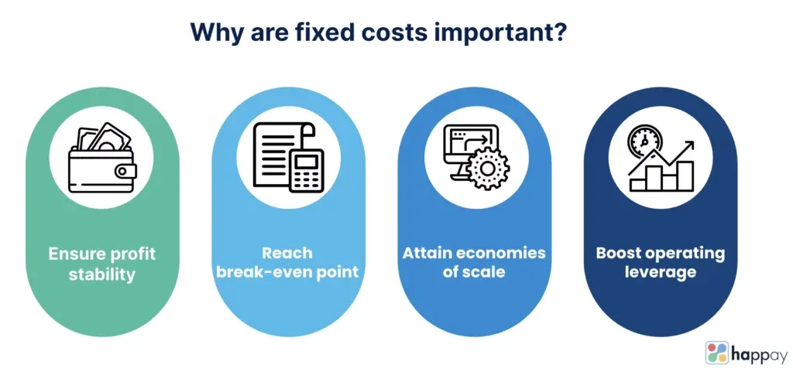

## Table of Contents

## What is a fixed cost?

A fixed cost is a type of expense that does not change, no matter how much a business produces or sells. For example, rent for a store or salaries for employees are fixed costs because they stay the same every month, even if the business makes more or less money.

Understanding fixed costs is important for businesses because it helps them plan their budgets and predict their profits. If a business knows its fixed costs, it can figure out how much it needs to sell to cover those costs and start making a profit. This can help business owners make better decisions about pricing, production, and growth.

## How do fixed costs differ from variable costs?

Fixed costs and variable costs are two types of expenses that businesses have. Fixed costs stay the same no matter how much a business produces or sells. For example, if a business pays $1,000 a month for rent, that cost doesn't change whether they sell 10 items or 10,000 items. Fixed costs are important because they help a business know how much money it needs just to keep the doors open.

Variable costs, on the other hand, change depending on how much a business produces or sells. These costs go up when production goes up and go down when production goes down. For example, if a business makes toys and needs plastic to make them, the more toys they make, the more plastic they need to buy. So, the cost of plastic is a variable cost. Understanding variable costs helps a business figure out how much it costs to make each item they sell.

Both fixed and variable costs are important for a business to understand. By knowing their fixed costs, a business can figure out the minimum amount of money they need to make to break even. By understanding their variable costs, they can see how much it costs to increase production and how that affects their profits. Together, these costs help a business plan and make smart decisions.

## Can you provide examples of fixed costs in a business?

Fixed costs are expenses that stay the same no matter how much a business sells or produces. For example, rent is a fixed cost. If a business rents a store, they have to pay the same amount of rent every month, even if they sell a lot or a little. Another example of a fixed cost is salaries for employees. If a business has employees who get paid the same amount every month, those salaries are fixed costs. They don't change based on how much the business sells.

Insurance is another example of a fixed cost. A business might have to pay for insurance to protect their property or their employees. The cost of insurance usually stays the same every month, so it's a fixed cost. Also, loan payments can be fixed costs. If a business takes out a loan to buy equipment or expand, the monthly payments on that loan are usually the same, so they are fixed costs too.

## Why is understanding fixed costs important for budgeting?

Understanding fixed costs is important for budgeting because it helps a business know how much money they need to cover their basic expenses. Fixed costs, like rent and salaries, don't change no matter how much the business sells. So, if a business knows their fixed costs, they can figure out the minimum amount of money they need to make each month just to keep the business running.

This knowledge is crucial for making a budget. A budget is a plan for how a business will spend its money. By knowing the fixed costs, a business can set realistic goals for how much they need to earn to cover those costs and start making a profit. This helps them avoid running out of money and makes it easier to plan for the future.

## How do fixed costs impact the break-even point for a business?

Fixed costs have a big impact on a business's break-even point. The break-even point is when a business makes enough money to cover all its costs, so it doesn't lose money but doesn't make a profit either. Fixed costs, like rent and salaries, don't change no matter how much a business sells. So, if a business has high fixed costs, they need to sell more to reach the break-even point. For example, if a business has to pay $5,000 a month in fixed costs, they need to make at least $5,000 to break even.

Understanding fixed costs helps a business figure out their break-even point. If they know how much their fixed costs are, they can calculate how much they need to sell to cover those costs. This is important because it helps them set goals and make plans. For example, if a business knows they need to sell 100 items to cover their fixed costs, they can work towards that goal. If they can sell more than 100 items, they start making a profit. So, fixed costs are a key part of figuring out the break-even point and planning for success.

## What strategies can businesses use to manage fixed costs?

Businesses can manage fixed costs by looking for ways to lower them. One way is to negotiate with landlords to get a lower rent or find a cheaper place to work. Another way is to see if they can change some fixed costs into variable costs. For example, instead of hiring full-time employees with fixed salaries, a business might hire part-time workers or freelancers who get paid based on the work they do. This can help the business save money when they don't have a lot of work.

Another strategy is to use technology to cut down on fixed costs. For example, a business might use online tools instead of paying for office space. They can also use software to do tasks that would normally need more employees. This can help them save money on rent and salaries. By being smart about how they manage their fixed costs, businesses can make sure they have enough money to keep running and grow.

## How do fixed costs affect pricing strategies?

Fixed costs play a big role in how businesses set their prices. If a business has high fixed costs, like a lot of rent or employee salaries, they need to make sure their prices are high enough to cover those costs. If they don't, they might lose money. For example, if a business pays $2,000 a month in rent and needs to sell 100 items to cover that cost, they have to make sure their prices are high enough to make at least $2,000 when they sell 100 items.

Understanding fixed costs also helps businesses decide if they can lower their prices to sell more. If a business knows how much money they need to cover their fixed costs, they can see if lowering prices a little bit will help them sell enough to still make a profit. This is important because sometimes selling more items at a lower price can be better than selling fewer items at a higher price. By thinking about fixed costs, businesses can find the right balance to make sure they are making enough money to stay open and grow.

## In what ways can fixed costs influence business scalability?

Fixed costs can make it harder for a business to grow bigger. When a business wants to get bigger, they might need more space or more employees. These things can make their fixed costs go up. If a business has high fixed costs, they need to make a lot more money to cover those costs before they can start making a profit. This can make it risky to grow because if the business doesn't make enough money, they might lose money instead.

But, if a business can keep their fixed costs low, it can be easier to grow. For example, if a business can work from home or use online tools instead of paying for an office, their fixed costs stay low. This means they don't need to make as much money to cover their costs, so it's easier to start making a profit. By keeping fixed costs low, a business can grow bigger without taking as much risk.

## How do fixed costs play a role in long-term financial planning?

Fixed costs are important for long-term financial planning because they help a business know how much money they need to make to keep going. When a business makes a plan for the future, they need to think about how much money they will have to spend on things like rent and salaries. These costs don't change, so the business can predict them and plan how to cover them. If a business knows their fixed costs, they can set goals for how much they need to sell to make enough money to stay open and grow.

Fixed costs also help a business decide if they can take on new projects or expand. If a business wants to open a new store or hire more employees, they need to think about how that will change their fixed costs. If the fixed costs go up a lot, the business needs to be sure they can make enough money to cover those costs. By understanding their fixed costs, a business can make smart choices about growing and planning for the future.

## Can fixed costs be negotiated or reduced, and if so, how?

Fixed costs can often be negotiated or reduced, but it takes some effort and smart thinking. For example, a business might talk to their landlord about lowering the rent. They could explain that they are a good tenant and ask for a lower rent in exchange for signing a longer lease. Another way to reduce fixed costs is to see if some expenses can be changed from fixed to variable. Instead of hiring full-time employees with fixed salaries, a business might hire part-time workers or freelancers who get paid based on the work they do. This can help save money when there's less work.

Technology can also help lower fixed costs. A business might use online tools instead of paying for office space, which can save a lot of money on rent. They can also use software to do tasks that would normally need more employees, which can help cut down on salaries. By being smart about how they manage their fixed costs, businesses can make sure they have enough money to keep running and grow.

## What are the implications of fixed costs on profit margins during economic downturns?

During economic downturns, fixed costs can really hurt a business's profit margins. When people have less money to spend, they buy less stuff. So, a business might sell fewer items. But even if they sell less, they still have to pay the same amount for things like rent and salaries. These fixed costs don't change, so if a business is making less money, it can be hard to cover them. This can make the business's profit margins smaller because they are spending the same amount of money but making less.

To deal with this, businesses might try to cut their fixed costs. They could talk to their landlord about lowering the rent or find ways to use less office space. They might also change some fixed costs into variable costs, like hiring part-time workers instead of full-time employees. By doing these things, a business can try to keep their profit margins up even when times are tough. But it's not always easy, and sometimes businesses have to make tough choices to stay open.

## How can advanced financial modeling help in optimizing fixed costs for multinational corporations?

Advanced financial modeling can help multinational corporations figure out the best ways to manage their fixed costs. These models use a lot of data and math to predict how changes in fixed costs will affect the business. For example, a model might show how moving to a cheaper office or using technology to cut down on staff could save money. By looking at different scenarios, a multinational corporation can find the best way to lower their fixed costs without hurting their business.

These models are especially useful for big companies because they have a lot of different parts to their business. A multinational corporation might have offices in many countries, each with its own fixed costs. Advanced financial modeling can help them see how changes in one place affect the whole company. This can help them make smart decisions about where to cut costs and how to use their money in the best way. By using these models, multinational corporations can keep their fixed costs under control and stay profitable, even when things change around the world.

## What is the understanding of fixed costs in business finance?

Fixed costs in business finance refer to expenses that remain unchanged regardless of the level of goods or services produced by a company. Common examples include rent, salaries, and insurance—expenses that businesses must consistently pay, irrespective of their production output. For financial stability, it is crucial to understand and manage these costs effectively, as they influence a company’s break-even point, the level of operation where total revenues equal total costs.

### Characteristics of Fixed Costs

Fixed costs are essential components in calculating the break-even point, often represented through the formula:

$$
\text{Break-even Point (Units)} = \frac{\text{Fixed Costs}}{\text{Selling Price per Unit} - \text{Variable Cost per Unit}}
$$

This formula demonstrates that fixed costs directly impact how much a business needs to sell in order to cover its costs and start making a profit. For instance, companies with high fixed costs require a higher sales [volume](/wiki/volume-trading-strategy) to reach their break-even point.

### Strategy for Optimizing Fixed Costs

Optimizing fixed costs involves several strategic approaches:

1. **Leasing vs. Owning**: Businesses should evaluate whether leasing property or equipment might be more cost-effective than owning. Leasing can reduce the need for large capital outlays and provide flexibility.

2. **Negotiating Better Terms**: Regularly renegotiating contracts for expenses such as rent and insurance can lead to significant cost savings. Companies can leverage market conditions to secure more favorable terms.

3. **Utilizing Space Efficiently**: Optimize the utilization of workspace to avoid unnecessary rent for unused capacity. This might involve relocating or subleasing idle spaces.

4. **Streamlining Operations**: Implementing process improvements can lead to reduced costs. Streamlined operations often involve adopting new technologies or methodologies to enhance efficiency.

5. **Shared Services**: Adopting a shared services model, especially for administrative functions like HR and IT, can consolidate fixed costs across different parts of a business.

### Evaluating Fixed Cost Structures

Evaluating existing fixed cost structures can reveal opportunities for improved financial stability. This involves:

- **Fixed Cost Analysis**: Examine each element of the fixed costs to assess whether they align with business objectives and deliver value.

- **Benchmarking**: Compare fixed costs with industry standards to identify areas where a business might be overspending.

- **Scenario Planning**: Use scenario analysis to estimate the impact of changes in business conditions on fixed costs. This helps in understanding potential vulnerabilities and preparing for them.

Effective management and optimization of fixed costs are imperative for businesses aiming to increase operational efficiency and enhance their financial stability. By carefully analyzing fixed cost structures and employing strategic approaches, businesses can not only improve their break-even analysis but also increase their resilience against market fluctuations.

## References & Further Reading

[1]: Brealey, R. A., Myers, S. C., & Allen, F. (2019). ["Principles of Corporate Finance"](https://www.mheducation.com/highered/product/Principles-of-Corporate-Finance-Brealey.html). McGraw-Hill Education.

[2]: Horngren, C. T., Datar, S. M., & Rajan, M. V. (2017). ["Cost Accounting: A Managerial Emphasis"](https://www.semanticscholar.org/paper/Cost-Accounting%3A-A-Managerial-Emphasis-Horngren-Datar/0a40f19b3c7611bb798e8fc8641cd15bfc5eeaeb). Pearson.

[3]: Jones, C. P. (2013). ["Investments: Analysis and Management"](https://books.google.com/books/about/Investments.html?id=ad7BDwAAQBAJ). Wiley.

[4]: Narang, R. K. (2013). ["Inside the Black Box: The Simple Truth About Quantitative Trading"](https://onlinelibrary.wiley.com/doi/book/10.1002/9781118267738). Wiley.

[5]: Hull, J. C. (2018). ["Options, Futures, and Other Derivatives"](https://www.semanticscholar.org/paper/Options%2C-Futures%2C-and-Other-Derivatives-Hull/89bdee500c8623864fc9eb7a471546aa713acc44). Pearson.

[6]: Knight, J. (2013). ["Financial Software Engineering"](https://link.springer.com/book/10.1007/978-3-030-14050-2). CreateSpace Independent Publishing Platform.