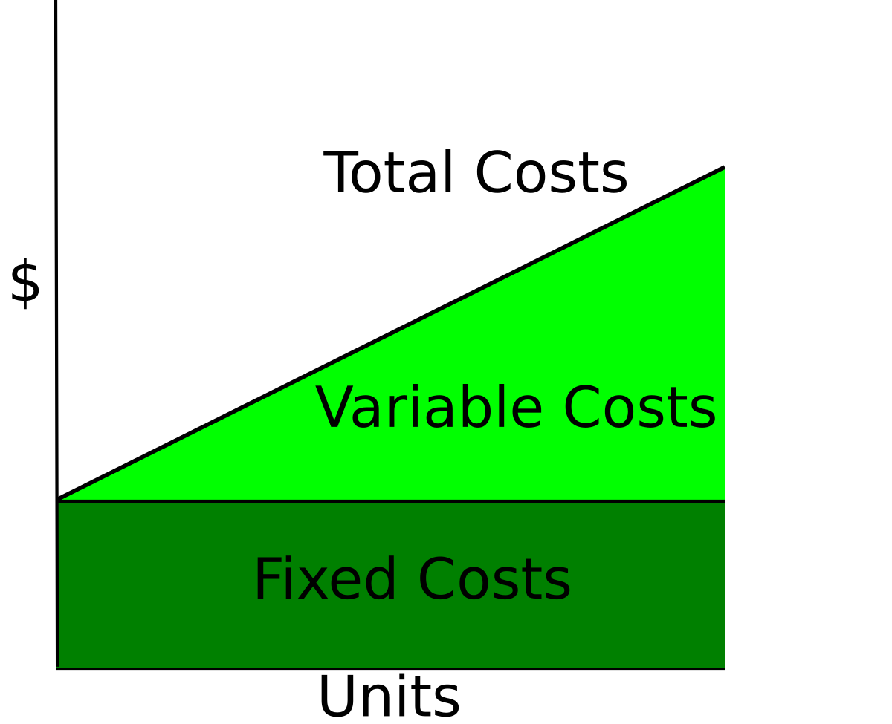

## Table of Contents

## What are fixed costs in economics?

Fixed costs in economics are expenses that do not change with the level of production or sales. These costs remain the same whether a business produces a lot or a little, or even if it produces nothing at all. Examples of fixed costs include rent for a building, salaries for permanent staff, and insurance premiums. These costs are essential for a business to operate, but they do not vary with the business's output.

Understanding fixed costs is important for businesses because they need to cover these expenses regardless of their sales volume. For example, a bakery must pay rent for its space every month, even if it doesn't sell any bread. This means that fixed costs can impact a company's profitability, especially when sales are low. By knowing their fixed costs, businesses can better plan their budgets and make informed decisions about pricing and production levels.

## Can you provide examples of fixed costs for a typical business?

Fixed costs are costs that stay the same no matter how much a business makes or sells. For a typical business, rent is a big fixed cost. This means that every month, the business has to pay the same amount of money for its building, whether it's busy or not. Another common fixed cost is the salary for permanent employees. These are the workers who get paid the same amount every month, no matter how much the business produces or sells. Insurance is also a fixed cost. Businesses need to pay for insurance to protect against risks, and this cost doesn't change with the level of business activity.

Some other examples of fixed costs include loan payments and property taxes. If a business has taken out a loan to start or grow, it has to make the same monthly payments no matter how well it's doing. Property taxes are another cost that stays the same, as they are based on the value of the property and not on how much the business earns. These fixed costs are important because they help keep the business running, but they can also make it harder for the business to make a profit if sales are low.

## How do fixed costs differ from variable costs?

Fixed costs and variable costs are two types of expenses that businesses have. Fixed costs are expenses that stay the same no matter how much a business produces or sells. For example, if a business pays $1,000 a month for rent, that cost doesn't change whether they make a lot of products or none at all. On the other hand, variable costs change based on how much a business produces or sells. If a business makes more products, its variable costs, like the cost of raw materials, will go up. If it makes fewer products, these costs will go down.

Understanding the difference between fixed and variable costs is important for businesses. Fixed costs are like a steady bill that a business has to pay every month, no matter what. This means that even if a business isn't making any money, it still has to cover these costs. Variable costs, however, can be managed by changing how much the business produces. If a business can sell more, it might be able to cover its variable costs more easily. Knowing these costs helps businesses plan better and make decisions about pricing and production.

## Why are fixed costs important for businesses to understand?

Fixed costs are really important for businesses to understand because they are the costs that don't change no matter how much the business makes or sells. For example, if a business pays rent for its building, that rent stays the same every month, even if the business isn't making any money. Knowing these fixed costs helps a business figure out how much money it needs to make just to cover these regular expenses. If a business doesn't understand its fixed costs, it might struggle to stay open because it won't know how much money it needs to keep running.

Understanding fixed costs also helps businesses make better decisions about pricing and production. For instance, if a business knows it has to pay a certain amount of money every month for things like rent and salaries, it can set its prices to make sure it covers these costs. This can be especially important when sales are low, because the business still needs to pay its fixed costs. By understanding these costs, a business can plan better and make sure it stays profitable, even when times are tough.

## How do fixed costs impact the break-even point for a business?

Fixed costs are really important when a business tries to figure out its break-even point. The break-even point is when a business makes enough money to cover all its costs, both fixed and variable. Fixed costs, like rent and salaries, don't change no matter how much the business sells. So, if a business has high fixed costs, it needs to sell more to reach the break-even point. For example, if a business pays a lot for rent, it needs to make more sales to cover that cost before it starts making a profit.

Understanding fixed costs helps a business set the right prices and plan how much it needs to sell. If a business knows its fixed costs are high, it might need to charge more for its products or find ways to lower those costs. This way, it can reach the break-even point faster. For example, if a business pays $2,000 a month in rent and other fixed costs, it needs to make at least $2,000 from sales just to break even, before it can start making a profit. Knowing this helps the business make smart decisions about how to operate and grow.

## What strategies can businesses use to manage high fixed costs?

Businesses can manage high fixed costs by finding ways to lower them. One way is to negotiate better deals with landlords or service providers. For example, a business might talk to its landlord about lowering the rent or switching to a cheaper building. Another way is to cut down on other fixed costs like salaries by reducing the number of permanent staff or finding ways to make their work more efficient. Businesses can also look at their insurance policies and see if they can find cheaper options that still provide enough coverage.

Another strategy is to increase revenue to cover the high fixed costs. This can be done by raising prices, but businesses need to be careful not to lose customers. They can also try to sell more products or services by expanding their market or offering new products. Sometimes, businesses can find new ways to use their space or resources to bring in more money. For example, a restaurant might rent out its space for events when it's not open to the public. By thinking creatively and planning carefully, businesses can find ways to manage their high fixed costs and keep making a profit.

## How do fixed costs affect pricing strategies?

Fixed costs are the costs that stay the same no matter how much a business sells. When a business has high fixed costs, like rent or salaries, it needs to make sure it can cover these costs with its sales. This means that the business might need to set higher prices for its products or services. By charging more, the business can make enough money to pay for its fixed costs and still make a profit. If the prices are too low, the business might not make enough money to cover its fixed costs, which can lead to financial problems.

Another way fixed costs can affect pricing strategies is by making a business think about how many products it needs to sell. If a business knows it has to pay a lot in fixed costs every month, it might set prices in a way that encourages more sales. For example, the business might offer discounts or special deals to get more customers to buy its products. This way, even if the price per product is lower, the business can still make enough money from selling more products to cover its fixed costs. Understanding fixed costs helps a business make smart decisions about how to price its products to stay profitable.

## In what ways do fixed costs influence a company's operational decisions?

Fixed costs play a big role in a company's operational decisions because they are costs that don't change no matter how much the company sells. For example, if a company pays a lot in rent every month, it might decide to use its space more efficiently. This could mean moving to a smaller building to lower the rent or finding new ways to use the space to bring in more money. Fixed costs like salaries might also make a company think about how many employees it needs. If the salaries are high, the company might try to find ways to do more with fewer people or look for cheaper ways to get the work done.

Another way fixed costs influence operational decisions is by affecting how a company plans its production. If the fixed costs are high, the company might need to produce and sell more to cover those costs. This could lead the company to work longer hours or find ways to make its production process more efficient. Understanding fixed costs helps a company make smart choices about how to operate. For example, if the company knows it needs to sell a certain amount to cover its fixed costs, it might focus on selling more products or finding new customers. This way, the company can keep running smoothly and make a profit.

## How do fixed costs behave over different levels of production?

Fixed costs are the costs that stay the same no matter how much a business produces. For example, if a business pays $1,000 a month for rent, that cost doesn't change whether the business makes a lot of products or none at all. This means that even if the business decides to produce more or less, the fixed costs like rent, salaries for permanent staff, and insurance will still be the same every month.

Understanding how fixed costs behave over different levels of production is important for businesses. No matter if the business is making a little or a lot, these costs don't go up or down. This can make it harder for a business to make a profit if it's not producing enough to cover these costs. But if the business can produce and sell more, it can spread these fixed costs over more products, which can help lower the cost per product and make the business more profitable.

## What is the role of fixed costs in long-term financial planning?

Fixed costs are really important for a business when it's planning for the future. These are the costs that stay the same no matter how much the business makes or sells. Things like rent, salaries for permanent staff, and insurance are fixed costs. When a business is making long-term plans, it needs to know how much it has to pay for these costs every month. This helps the business figure out how much money it needs to make to keep running and to grow. If the fixed costs are high, the business might need to find ways to make more money or lower these costs to stay profitable in the long run.

Understanding fixed costs also helps a business make smart decisions about big investments. For example, if a business is thinking about buying new equipment or moving to a bigger building, it needs to think about how these decisions will change its fixed costs. If the new equipment or bigger building means higher fixed costs, the business needs to make sure it can cover these costs over time. By planning carefully and knowing its fixed costs, a business can make sure it has enough money to keep going and reach its long-term goals.

## How do fixed costs impact economies of scale?

Fixed costs are important when a business tries to grow bigger and take advantage of economies of scale. Economies of scale happen when a business can make more products for less money per product. Fixed costs, like rent and salaries, don't change no matter how much a business makes. So, if a business can produce more, it can spread these fixed costs over more products. This means the cost per product goes down, which can help the business make more profit.

For example, if a business pays $1,000 a month for rent, that cost stays the same whether it makes 100 products or 1,000 products. If the business can make 1,000 products, the rent cost per product is much lower than if it only makes 100 products. By understanding how fixed costs work, a business can plan to grow bigger and use economies of scale to become more profitable. This is why knowing about fixed costs is so important for long-term planning and growth.

## Can you discuss the impact of fixed costs on a company's financial leverage and risk?

Fixed costs can affect a company's financial leverage and risk in important ways. Financial leverage is when a company uses borrowed money to grow or invest. If a company has high fixed costs, like rent or salaries, it might need to borrow more money to cover these costs when sales are low. This can increase the company's financial leverage because it has more debt. If the company can't pay back the debt, it faces a higher risk of financial trouble. So, high fixed costs can make a company more risky because it has to make sure it can cover these costs no matter what.

On the other hand, if a company can manage its fixed costs well, it can use them to its advantage. For example, if the company can produce and sell more products, it can spread its fixed costs over more items, which can lower the cost per product. This can help the company make more profit and reduce its financial risk. By understanding and planning for its fixed costs, a company can make smart decisions about how much to borrow and how to grow, which can help it stay stable and successful in the long run.

## What is the importance of understanding fixed costs in business?

Fixed costs are an essential component of business expenses, characterized by their constancy irrespective of changes in production [volume](/wiki/volume-trading-strategy). Exemplifying these costs are expenses such as rent, salaries, insurance, and licenses, which are fundamental for sustaining business operations. By their nature, fixed costs do not fluctuate with the level of goods or services produced, thus offering stability and predictability in financial planning.

From a financial perspective, fixed costs hold significant influence over a company's financial health and operating leverage. Operating leverage refers to the degree to which a company uses fixed costs in its cost structure. A higher proportion of fixed costs can amplify the impact of changes in sales on operating income, thereby affecting the overall profitability. Companies with high operating leverage experience more significant variations in profit margins with changes in sales levels compared to companies with lower operating leverage.

The predictability of fixed costs enables businesses to forecast expenses with greater accuracy, facilitating more reliable budgeting and planning processes. This aspect of fixed costs can serve as a stabilizing force in financial planning, aiding businesses in developing consistent and efficient cost management strategies. The predictability also allows for more precise determination of break-even points, which are critical for setting sales targets and pricing strategies.

Efficient management of fixed costs can enhance economies of scale. Economies of scale refer to the cost advantages a business achieves by increasing its level of production. As production scales up, the fixed cost per unit decreases, potentially leading to higher profit margins. This is particularly advantageous in high-output production environments where spreading fixed costs over a larger output can significantly lower the average cost per unit, thereby increasing competitiveness and profitability.

To illustrate, consider a company with a fixed cost of $100,000 and a variable cost of $10 per unit. If the company produces 10,000 units, the total cost would be:

$$
\text{Total Cost} = \text{Fixed Costs} + (\text{Variable Cost per Unit} \times \text{Quantity})
$$

$$
\text{Total Cost} = 100,000 + (10 \times 10,000)
$$

$$
\text{Total Cost} = 200,000
$$

The average cost per unit would then be:

$$
\text{Average Cost per Unit} = \frac{\text{Total Cost}}{\text{Quantity}}
$$

$$
\text{Average Cost per Unit} = \frac{200,000}{10,000} = 20
$$

If the production increases to 20,000 units, the new average cost per unit becomes:

$$
\text{Total Cost} = 100,000 + (10 \times 20,000)
$$

$$
\text{Total Cost} = 300,000
$$

$$
\text{Average Cost per Unit} = \frac{300,000}{20,000} = 15
$$

By increasing production, the average fixed cost per unit decreases, demonstrating the principle of economies of scale. This example highlights how effective management of fixed costs not only aids in financial stability but also contributes to strategic growth and improved operational efficiencies.

## What are the advantages of managing fixed costs in trading?

Proper management of fixed costs in trading can significantly enhance both operational efficiency and profit margins. Fixed costs, by their nature, offer predictability, allowing trading firms to develop robust financial strategies that accommodate market [volatility](/wiki/volatility-trading-strategies) without impacting their core operations. By maintaining a strong grip on these expenses, firms can concentrate on refining algorithms and performing in-depth market analysis without distraction.

One key advantage of managing fixed costs lies in strategic planning and investment in innovative trading solutions. Analyzing fixed costs provides firms with critical insights into their financial baseline, enabling them to make informed decisions about where to allocate resources. This insight is crucial for investing in new technologies and enhancing existing trading infrastructures. By optimizing fixed costs, companies hold a clear understanding of their breakeven points, which is essential in identifying the threshold at which revenues cover both fixed and variable costs. The breakeven point ($Q$) can be articulated using the formula:

$$
Q = \frac{FC}{P - VC}
$$

where $FC$ is fixed costs, $P$ is price per unit, and $VC$ is variable cost per unit. This equation reiterates how managing fixed costs can enhance decision-making processes regarding volume and pricing strategies.

Furthermore, the management of fixed costs maximizes operating leverage. A higher proportion of fixed costs in a company's total cost structure means that any increase in sales will lead to a disproportionately larger increase in operating profit. Operating leverage thus empowers firms to increase profits with minimal additional costs, provided sales are growing.

In addition to these financial benefits, efficient management of fixed costs can deliver a sustained competitive advantage. By aligning fixed cost strategies with long-term business goals, trading firms can allocate resources more effectively, invest in technology advancements, and introduce new trading strategies without undergoing extensive cost-benefit analyses for each decision. This proactive approach shields businesses from the unpredictability of market swings, allowing them to stay focused on long-term growth and innovation.

In conclusion, robust management of fixed costs forms the backbone of stable and progressive trading operations, supporting firms in achieving a scalable and profitable growth trajectory.

## References & Further Reading

[1]: Bergstra, J., Bardenet, R., Bengio, Y., & Kégl, B. (2011). ["Algorithms for Hyper-Parameter Optimization."](https://dl.acm.org/doi/10.5555/2986459.2986743) Advances in Neural Information Processing Systems 24.

[2]: ["Advances in Financial Machine Learning"](https://www.amazon.com/Advances-Financial-Machine-Learning-Marcos/dp/1119482089) by Marcos Lopez de Prado

[3]: ["Evidence-Based Technical Analysis: Applying the Scientific Method and Statistical Inference to Trading Signals"](https://www.amazon.com/Evidence-Based-Technical-Analysis-Scientific-Statistical/dp/0470008741) by David Aronson

[4]: ["Machine Learning for Algorithmic Trading"](https://github.com/stefan-jansen/machine-learning-for-trading) by Stefan Jansen

[5]: ["Quantitative Trading: How to Build Your Own Algorithmic Trading Business"](https://books.google.com/books/about/Quantitative_Trading.html?id=j70yEAAAQBAJ) by Ernest P. Chan