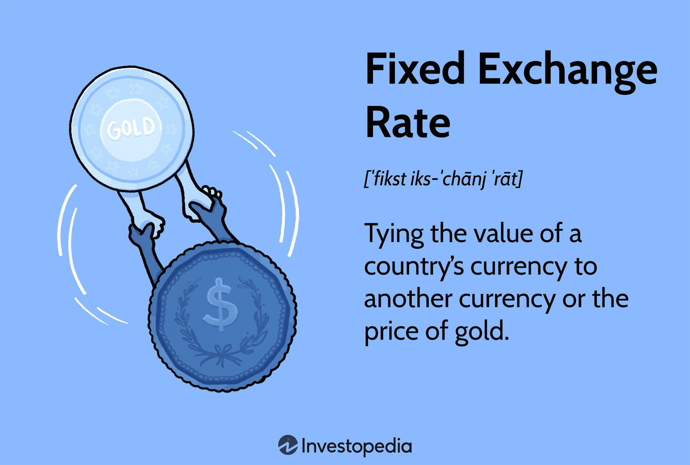

## Table of Contents

## What is a fixed exchange rate?

A fixed exchange rate is when a country decides to keep its currency's value the same compared to another currency or to something like gold. They do this by setting a specific rate and then using their money reserves to buy or sell their currency to keep the rate steady. For example, if a country's currency is getting weaker, the government might use its reserves to buy more of its own currency, which helps keep the value strong.

Having a fixed exchange rate can make trade easier because businesses know exactly how much their money is worth in another country. It can also help keep the economy stable because there are no big surprises in currency values. But, it can be hard to keep the rate fixed, especially if the economy is not doing well. The government might run out of money to keep the rate steady, or they might have to make tough choices like raising interest rates to stop people from selling their currency.

## How does a fixed exchange rate system work?

A fixed exchange rate system works by a country deciding to tie its currency's value to another currency or to something like gold. The country sets a specific rate and then uses its money reserves to buy or sell its own currency to keep the rate the same. For example, if the country's currency starts to get weaker, the government will use its reserves to buy more of its own currency. This helps to keep the value strong and steady.

Keeping a fixed exchange rate can be good for trade because businesses know exactly how much their money is worth in another country. It can also help keep the economy stable because there are no big surprises in currency values. But, it can be hard to keep the rate fixed, especially if the economy is not doing well. The government might run out of money to keep the rate steady, or they might have to make tough choices like raising interest rates to stop people from selling their currency.

## What are the advantages of a fixed exchange rate?

One big advantage of a fixed exchange rate is that it makes trade easier. When a country's currency is fixed to another currency, businesses know exactly how much their money is worth in another country. This makes it easier for them to plan and do business because they don't have to worry about the currency value changing suddenly. It can also help keep prices stable, which is good for both businesses and consumers.

Another advantage is that a fixed exchange rate can help keep the economy stable. When the currency value is fixed, there are no big surprises or changes that can cause problems for the economy. This can make people feel more confident about the economy, which can lead to more spending and investment. It can also help prevent inflation, which is when prices go up a lot, because the government can control the money supply to keep the currency value steady.

## What are the disadvantages of a fixed exchange rate?

One big problem with a fixed exchange rate is that it can be hard to keep it steady. If the economy is not doing well, the government might run out of money to buy its own currency and keep the rate the same. This can be a big problem because the government might have to make tough choices, like raising interest rates, to stop people from selling their currency. If the government can't keep the rate fixed, it can lead to a big drop in the currency value, which can cause a lot of problems for the economy.

Another disadvantage is that a fixed exchange rate can make it harder for the economy to adjust to changes. If the economy is growing too fast, a fixed exchange rate can make it harder to slow down and stop inflation. On the other hand, if the economy is doing badly, a fixed exchange rate can make it harder to boost the economy by making the currency weaker. This can lead to problems like high unemployment or slow growth. Keeping the exchange rate fixed can also make it harder for the government to use other tools, like changing interest rates, to help the economy.

## How is a fixed exchange rate different from a floating exchange rate?

A fixed exchange rate is when a country decides to keep its currency's value the same compared to another currency or something like gold. They do this by setting a specific rate and then using their money reserves to buy or sell their own currency to keep the rate steady. For example, if the country's currency starts to get weaker, the government will use its reserves to buy more of its own currency to keep the value strong. This can help make trade easier and keep the economy stable because businesses know exactly how much their money is worth in another country.

On the other hand, a floating exchange rate is when a country lets its currency's value change based on what people think it's worth. The value goes up or down depending on how much people want to buy or sell the currency. For example, if more people want to buy the currency, its value will go up. If more people want to sell it, the value will go down. This can make trade harder because businesses don't know exactly how much their money will be worth in another country, but it can also help the economy adjust to changes more easily.

The main difference between the two is how the currency's value is controlled. With a fixed exchange rate, the government tries to keep the value the same, which can be hard if the economy is not doing well. With a floating exchange rate, the value changes on its own, which can be good for adjusting to changes but can also make trade harder.

## Can you explain the role of a central bank in maintaining a fixed exchange rate?

The central bank plays a big role in keeping a fixed exchange rate. It does this by using its money reserves to buy or sell the country's currency. For example, if the country's currency starts to get weaker, the central bank will use its reserves to buy more of its own currency. This helps to keep the value strong and steady. The central bank also has to keep an eye on the economy and make sure it has enough money to keep the rate fixed.

Sometimes, keeping a fixed exchange rate can be hard for the central bank. If the economy is not doing well, the central bank might run out of money to buy its own currency. This can be a big problem because the central bank might have to make tough choices, like raising interest rates, to stop people from selling their currency. If the central bank can't keep the rate fixed, it can lead to a big drop in the currency value, which can cause a lot of problems for the economy.

## What historical examples illustrate the use of fixed exchange rates?

One famous example of a fixed exchange rate is the Bretton Woods system. This system was set up after World War II and lasted until the early 1970s. Under Bretton Woods, many countries agreed to fix their currencies to the US dollar, and the US dollar was fixed to gold. This meant that each country's currency had a set value compared to the US dollar, and the US dollar had a set value compared to gold. The system helped make trade easier and more stable after the war, but it became hard to keep going because of economic problems in the US and other countries.

Another example is the European Exchange Rate Mechanism (ERM), which was used in the 1980s and 1990s. The ERM was a way for European countries to fix their currencies to each other to prepare for the Euro. Each country's currency had a set value compared to other currencies in the ERM, and central banks would buy or sell their currencies to keep the rates steady. The ERM faced big problems during the 1992-1993 crisis, when some countries, like the UK, had to leave the system because they couldn't keep their currency values fixed. This showed how hard it can be to keep a fixed exchange rate when the economy is not doing well.

## How do fixed exchange rates impact international trade?

Fixed exchange rates make international trade easier because businesses know exactly how much their money is worth in other countries. When a country fixes its currency to another currency, it sets a specific rate that stays the same. This means that businesses can plan their costs and prices without worrying about sudden changes in the currency value. For example, if a company in one country wants to buy goods from another country, they know exactly how much it will cost in their own currency. This can help businesses trade more and grow their markets.

However, fixed exchange rates can also create problems for international trade. If a country can't keep its currency value steady, it can lead to big changes in the rate. This can cause problems for businesses that have already made plans based on the old rate. For example, if a country's currency suddenly gets weaker, the cost of importing goods can go up a lot, which can hurt businesses that rely on those imports. Also, if a country has to make tough choices like raising interest rates to keep the rate fixed, it can slow down the economy and make it harder for businesses to trade.

## What are the mechanisms used to defend a fixed exchange rate?

To defend a fixed exchange rate, a country's central bank uses its money reserves to buy or sell its own currency. If the country's currency starts to get weaker, the central bank will use its reserves to buy more of its own currency. This helps keep the value strong and steady. The central bank keeps a close eye on the economy to make sure it has enough money to keep the rate fixed. Sometimes, the central bank might also work with other countries' central banks to help keep the rate steady.

However, keeping a fixed exchange rate can be hard. If the economy is not doing well, the central bank might run out of money to buy its own currency. This can be a big problem because the central bank might have to make tough choices, like raising interest rates, to stop people from selling their currency. If the central bank can't keep the rate fixed, it can lead to a big drop in the currency value, which can cause a lot of problems for the economy. Sometimes, the government might also use other tools, like controlling the money supply or making rules about how much money can move in and out of the country, to help keep the rate steady.

## How do currency pegs relate to fixed exchange rates?

A currency peg is a type of fixed exchange rate where a country decides to tie its currency's value to another currency or to something like gold. When a country pegs its currency, it sets a specific rate and then uses its money reserves to buy or sell its own currency to keep the rate the same. For example, if the country's currency starts to get weaker, the government will use its reserves to buy more of its own currency. This helps to keep the value strong and steady. A currency peg can make trade easier because businesses know exactly how much their money is worth in another country.

However, keeping a currency peg can be hard, especially if the economy is not doing well. The government might run out of money to keep the rate steady, or they might have to make tough choices like raising interest rates to stop people from selling their currency. If the government can't keep the peg, it can lead to a big drop in the currency value, which can cause a lot of problems for the economy. So, a currency peg is just a specific way of using a fixed exchange rate, but it comes with its own set of challenges.

## What are the economic implications of devaluing a currency under a fixed exchange rate system?

Devaluing a currency under a fixed exchange rate system means the government decides to lower the value of its currency compared to other currencies. This can happen when the country can't keep the fixed rate anymore because its economy is not doing well. When a currency is devalued, it makes the country's goods and services cheaper for other countries to buy. This can help the country sell more things to other countries, which can be good for businesses that export goods. It can also make it easier for the country to pay back debts in other currencies because it takes less of their own money to do so.

However, devaluing a currency can also cause problems. It can make things that the country needs to buy from other countries, like oil or machines, more expensive. This can hurt businesses that rely on imports and can lead to higher prices for people living in the country. Also, if people think the currency might be devalued again, they might start to lose trust in it and want to use other currencies instead. This can make it even harder for the government to keep the economy stable. So, while devaluing a currency can help in some ways, it can also lead to new problems that the country has to deal with.

## How do speculative attacks affect a country's ability to maintain a fixed exchange rate?

Speculative attacks happen when people think a country won't be able to keep its currency's value the same under a fixed exchange rate. They start selling the country's currency because they think it will get weaker soon. When lots of people do this, it puts a lot of pressure on the country's central bank. The central bank has to use its money reserves to buy back its own currency to keep the rate steady. If the central bank runs out of money, it can't keep the rate fixed anymore, and the currency value might drop a lot.

These attacks can make it really hard for a country to keep its fixed exchange rate. If the central bank can't stop the attack, the country might have to let the currency value change or even devalue it on purpose. This can cause big problems for the economy, like making things the country buys from other places more expensive and making people lose trust in the currency. So, speculative attacks can be a big challenge for countries trying to keep their currency's value the same.

## References & Further Reading

[1]: ["Fixed vs. Floating Exchange Rates"](https://www.investopedia.com/trading/floating-rate-vs-fixed-rate/) by Jeffrey A. Frankel and Shang-Jin Wei

[2]: ["Exchange Rate Regimes and Economic Performance"](https://www.imf.org/External/Pubs/FT/staffp/2000/00-00/ls.pdf) by Kenneth Rogoff and Carmen Reinhart

[3]: ["Algorithmic and High-Frequency Trading"](https://assets.cambridge.org/97811070/91146/frontmatter/9781107091146_frontmatter.pdf) by Álvaro Cartea, Sebastian Jaimungal, and José Penalva

[4]: ["The Economics of Foreign Exchange and Global Finance"](https://link.springer.com/book/10.1007/978-3-662-59271-7) by Peijie Wang

[5]: ["The Mechanics of the Hong Kong Dollar Linked Exchange Rate System"](https://www.hkma.gov.hk/eng/news-and-media/insight/2023/05/20230503/) by the Hong Kong Monetary Authority