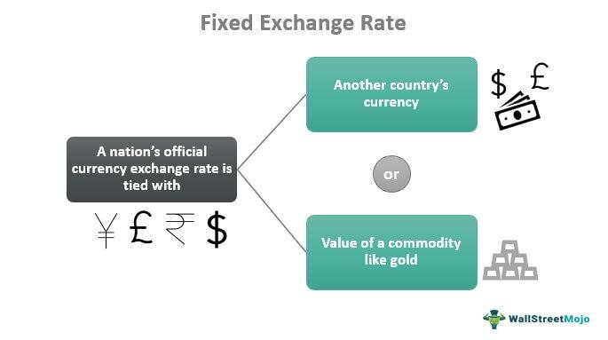

Understanding the dynamics of exchange rates is crucial for economic stability and investment strategies. The fixed exchange rate system is a specific type of exchange rate framework where a country's currency value is tied to another major currency or a basket of currencies. This system is pivotal within monetary policy, influencing how countries manage their economic health and engage in international trade. By maintaining a stable exchange rate, nations can minimize currency value fluctuations, potentially enhancing economic predictability and supporting global commerce. 

With the advent of global economic integration, comprehending the complexities of fixed exchange rates becomes essential for policymakers, investors, and traders. These systems necessitate the management of foreign reserves and often require countries to adopt specific monetary and fiscal policies to maintain the peg. This article discusses the growing field of algorithmic trading within such frameworks, where technology plays a significant role in currency markets, even with the constraints these systems present. Algorithmic trading, aided by technological advancements, has carved a space for itself by increasing trading efficiency through improved speed, precision, and reduced transaction costs.

As global economies become more interconnected, the effectiveness of fixed exchange rate systems is continuously tested. Understanding these elements provides valuable insights into the balance between maintaining currency stability and responding to global economic changes. Join us as we explore these crucial and multifaceted aspects of economic strategy and currency systems.

## Table of Contents

## What is a Fixed Exchange Rate?

A fixed exchange rate, also referred to as a pegged exchange rate, is a mechanism where a nation's currency value is anchored to a major currency or a selected basket of currencies. This strategy is designed to ensure exchange rate stability by minimizing currency fluctuations, which is beneficial for international trade. By providing a predictable and stable currency conversion rate, countries can reduce the risks associated with currency volatility, attracting foreign investment and facilitating smoother international trade transactions.

For a country to sustain a fixed exchange rate, it often needs to maintain substantial reserves of the foreign currency to which its currency is pegged. This reserve acts as a buffer to defend the currency's value against market pressures. For example, if the demand for the local currency decreases in foreign exchange markets, the country can use its foreign reserves to buy back the local currency, thereby supporting its value. Conversely, if the demand increases, the country can sell more of its currency to maintain the pegged rate.

Globally, numerous countries have adopted fixed exchange rate systems. One prominent example is Hong Kong, which has pegged its currency, the Hong Kong Dollar (HKD), to the United States Dollar (USD) since 1983 at a rate of approximately 7.8 HKD per USD. This has provided economic stability and predictability in cross-border trade and investment. However, such systems also come with challenges, requiring meticulous economic and monetary management to maintain the currency peg amidst global economic changes.

## Monetary Policy in Fixed Exchange Rate Systems

Monetary policy in a fixed exchange rate system is constrained, primarily because it restricts a country's ability to adjust interest rates independently. This rigidity arises from the need to keep the domestic currency's value pegged to a foreign currency or basket of currencies, which can be complex in the face of external economic pressures.

To maintain the peg, central banks must often intervene in the foreign exchange market. This intervention typically involves buying or selling foreign reserves to influence the currency's value. For instance, if a domestic currency is under downward pressure, the central bank might sell substantial amounts of its foreign exchange reserves to buy its currency, thereby bolstering its value. Conversely, to manage upward pressure, the central bank would purchase foreign currency, increasing its reserves.

Balancing the fixed exchange rate while addressing domestic economic conditions can be particularly challenging. For example, if the domestic economy experiences inflationary pressures, the typical monetary policy response would be to raise interest rates to tighten the money supply. However, in a fixed exchange rate system, increasing interest rates might attract foreign capital, leading to further upward pressure on the currency, complicating the maintenance of the fixed peg. Conversely, lowering interest rates to stimulate economic growth might result in capital flight, depleting foreign reserves and threatening the currency's stability.

Given these constraints, fiscal policy often plays a more significant role in economic stabilization. Governments may resort to fiscal measures, such as altering tax rates or increasing public spending, to influence economic activity. These measures can help manage inflation and stimulate economic growth without altering the fixed exchange rate.

Additionally, the stability provided by a fixed exchange rate system can enhance international trade by reducing exchange rate risk, encouraging cross-border investment. However, maintaining this stability can come at the cost of limited monetary autonomy, necessitating a delicate balance between global currency expectations and domestic economic needs. This underscores the importance of carefully crafted fiscal strategies and maintaining a robust reserve of foreign currencies to navigate the inherent challenges of a fixed exchange rate system effectively. 

In summary, while central banks and governments face constraints under fixed exchange rate regimes, a combination of vigilant foreign reserve management and strategic fiscal policies can help navigate these challenges, ensuring economic stability and growth.

## Impact on Currency Systems

Fixed exchange rates play a crucial role in shaping currency systems by fostering predictability in international transactions. This stability is achieved by anchoring a currency's value to another major currency, such as the US dollar or the euro, or to a basket of currencies. As a result, businesses can engage in cross-border trade with reduced exposure to currency risk, leading to an enhanced trade environment. However, maintaining such systems demands robust foreign exchange reserves and comprehensive regulatory measures to ensure fiscal discipline.

Foreign exchange reserves are vital for upholding a fixed exchange rate as they provide the necessary imports and maintain confidence in the national currency. A country must amass substantial reserves of the currency to which it is pegged, allowing it to buy or sell its currency to stabilize the exchange rate. This requirement can strain a nation's financial resources, particularly during economic downturns or when domestic demand for foreign currency surges.

The sustainability of fixed exchange rate systems has historically been questioned, as evidenced by currency crises. For example, the Bretton Woods system collapsed in the early 1970s due to imbalances and speculative attacks. Similarly, the European Exchange Rate Mechanism (ERM) faced significant challenges, with the UK withdrawing from the system on "Black Wednesday" in 1992 after failing to maintain its currency within the agreed limits due to speculative pressure.

Globalization further impacts the effectiveness of fixed exchange rate systems. As economies become more interdependent, a country with a fixed exchange rate may experience pressure to align with broader international economic policies, potentially limiting its monetary policy autonomy. Additionally, capital flows have become more volatile, prompting central banks to develop strategies to manage these fluctuations and maintain the desired exchange rate level.

In conclusion, while fixed exchange rates provide predictability and reduce currency risk, their sustainability hinges on substantial foreign exchange reserves and stringent fiscal discipline. Historical examples of currency crises highlight the challenges inherent in maintaining fixed exchange systems, and globalization adds another layer of complexity, influencing their efficacy and resilience.

## Algo Trading and Fixed Exchange Rates

Algorithmic trading, often referred to as algo trading, has become a critical component of currency markets, providing traders with tools that allow for swift execution, enhanced precision, and minimized transaction costs. In currency systems with fixed exchange rates, the utility of [algorithmic trading](/wiki/algorithmic-trading) introduces unique characteristics due to the reduced market [volatility](/wiki/volatility-trading-strategies) typically associated with pegged currency systems.

### Advantages of Algorithmic Trading

The primary advantage of algorithmic trading is its ability to execute orders at a much higher speed and accuracy than manual trading, driven by sophisticated algorithms that analyze market data and execute trades instantaneously. This speed ensures that trades are placed at the optimal moment, minimizing slippage. Furthermore, algo trading reduces transaction costs by optimizing trade execution and eliminating human emotions, which can lead to inefficient decision-making.

Additionally, algorithms can handle large volumes of data and trades simultaneously, making them particularly effective in high-frequency trading environments. This computational power allows traders to exploit [arbitrage](/wiki/arbitrage) opportunities that may arise, even in markets characterized by lower volatility due to fixed exchange rates.

### Adaptation of Algo Trading Strategies

In markets with fixed exchange rates, algorithmic trading strategies must be adapted to account for reduced volatility. Traditional strategies that thrive on price fluctuations might be less effective. Instead, traders may focus on arbitrage strategies that benefit from minor price discrepancies across markets or timeframes. Additionally, algo strategies could focus on [interest rate](/wiki/interest-rate-trading-strategies) differentials inherent in [carry](/wiki/carry-trading) trade opportunities, where traders exploit differences between interest rates in different countries pegged under fixed exchange regimes.

Developers of algorithmic trading systems in these environments often incorporate data from macroeconomic indicators and central bank policy announcements, ensuring their algorithms can react to changes in fiscal policy that might affect the fixed exchange rate.

### Case Studies and Technological Advancements

Real-world examples demonstrate the impact of technological advancements in algorithmic trading within fixed exchange rate environments. For instance, during periods of economic uncertainty or speculative attacks, algorithms have been designed to detect these market conditions quickly and execute predefined strategies to stabilize positions or capitalize on short-term opportunities.

One of the notable case studies involves the Hong Kong Monetary Authority (HKMA), which operates under a fixed exchange rate system by pegging the Hong Kong dollar to the US dollar. During episodes of targeted speculative attacks, advanced algorithmic trading systems were employed by market participants to execute trades that aligned with the anticipated responses from the HKMA, such as interventions to maintain their currency peg.

Moreover, advancements in [machine learning](/wiki/machine-learning) have introduced complex algorithms capable of predictive analytics, offering traders insights into potential central bank actions or shifts in foreign exchange reserves that could impact the fixed exchange rate. These algorithms continuously adjust strategies based on new data inputs, improving efficacy over time.

In conclusion, while fixed exchange rate systems present a unique environment with lower volatility, algorithmic trading remains profoundly impactful due to its ability to leverage speed, precision, and advanced data analysis. The adaptation of strategies and continued technological advancements further cement its role in these currency markets. As algorithms evolve, their integration with policies and economic conditions specific to fixed exchange rate regimes will deepen, offering increasingly sophisticated tools for traders and financial institutions alike.

## Case Studies and Real-world Examples

### Case Studies and Real-world Examples

Fixed exchange rate systems have had varied applications across the globe, offering critical insights into both successful implementations and notable challenges. Examining real-world examples provides an understanding of the dynamics that contribute to their performance and pitfalls.

#### Hong Kong's Peg to the US Dollar

A prominent example of a successful fixed exchange rate system is Hong Kong's currency peg to the US dollar. Since 1983, Hong Kong has maintained a stable exchange rate, tying its currency to the US dollar at a rate of approximately HK$7.80/USD. This peg has played a crucial role in stabilizing Hong Kong's financial system, promoting trade and investment by reducing exchange rate risk. The Hong Kong Monetary Authority (HKMA) employs a currency board arrangement, necessitating substantial reserves of US dollars to back all the Hong Kong dollars in circulation, thus ensuring the stability of the peg. This system has demonstrated resilience, even during financial crises, due to its robust regulatory framework and substantial foreign reserves.

#### The European Exchange Rate Mechanism (ERM)

Contrastingly, the European Exchange Rate Mechanism (ERM), established in 1979 as part of the European Monetary System, presents a case of challenging execution. The ERM aimed to reduce exchange rate variability and achieve monetary stability in preparation for the Economic and Monetary Union and the introduction of a single European currency. However, the system faced significant difficulties, most famously during the early 1990s. Currency speculation, differing national economic policies, and severe economic pressures culminated in the crises of 1992-1993, leading to the forced [exit](/wiki/exit-strategy) of the UK from the ERM, an event often referred to as "Black Wednesday." The ERM's challenges underscore the difficulties of maintaining fixed exchange rates amid economic divergence and speculative attacks.

#### Lessons Learned

Several key lessons emerge from these case studies. Hong Kong's experience highlights the importance of robust financial reserves and credible policy frameworks in maintaining a fixed exchange rate system. It demonstrates that strong economic fundamentals and prudent fiscal policies are essential to support such a regime. On the other hand, the ERM crisis illustrates the vulnerabilities associated with fixed exchange rates when there is a lack of economic convergence among participating countries. It underscores the need for mechanisms to address speculative pressures and the importance of flexibility in policy coordination across differing economic environments.

These lessons are pivotal for future monetary policy decisions, particularly in today's rapidly evolving economic landscape. Policymakers must weigh the benefits of exchange rate stability against the potential constraints on monetary policy flexibility. The delicate balance of maintaining confidence in the currency while responding to global and domestic economic shifts remains a significant challenge. Understanding historical precedents and adapting to current technological and economic changes will be crucial for the effective implementation and sustainability of fixed exchange rate systems in the future.

## Challenges and Opportunities in a Fixed Exchange Rate System

Maintaining a fixed exchange rate system poses significant challenges, particularly when confronted with economic shocks and fluctuations in foreign reserves. Economic shocks—such as sudden changes in monetary flows, trade imbalances, or geopolitical events—can severely disrupt the stability of a fixed exchange rate. For instance, a country may experience a sudden loss of investor confidence, leading to capital flight and a depletion of foreign reserves. Such situations require the country to utilize its foreign reserves to defend the peg, often prompting significant political and economic trade-offs.

Moreover, shifts in foreign reserves are critical. Countries adhering to a fixed exchange rate system must constantly monitor and manage their reserves to support the pegged exchange rate. This often necessitates maintaining substantial reserves of the anchor currency, requiring prudent fiscal and economic management. Failure to sustain adequate reserves can lead to a currency crisis, forcing countries to devalue or abandon the fixed exchange rate.

Despite these challenges, fixed exchange rate systems offer opportunities for economic stabilization and enhanced trade relations. By providing predictable exchange rates, these systems reduce the uncertainty associated with fluctuating currency values, thereby fostering a conducive environment for international trade and investment. This stability can particularly benefit small, open economies that rely heavily on trade. 

Furthermore, innovation within fixed exchange rate systems is gaining traction, driven by technological advancements and global cooperation. Digital currencies and blockchain technology, for example, present new possibilities for how these systems might operate. Enhanced data analytics allow countries to better predict and manage economic variables that impact their exchange rates, thus optimizing reserve allocations and policy interventions.

As global economies face rapid economic and technological changes, the future outlook of fixed exchange rates hinges on the ability to balance these pressures with the need for economic stability. There is a growing recognition of the potential for hybrid models that combine elements of fixed and flexible exchange rate systems, allowing countries to reap the benefits of stability while maintaining a degree of monetary policy autonomy. Such innovative approaches, supported by ongoing global cooperation and technological progress, might redefine how fixed exchange rate systems operate in a dynamic global economy.

## Conclusion

In this comprehensive exploration of fixed exchange rate systems and their interplay with monetary policy, we have highlighted how these systems function and the significant roles they play in global economics. Fixed exchange rate systems peg a nation’s currency to another, fostering stability and predictability in international trade by reducing currency fluctuation risks. This stability, however, comes with challenges, particularly in monetary policy, as it constrains a country's ability to modify interest rates and deal with domestic economic variability.

Technological advancements, particularly in algorithmic trading, have further impacted these systems by introducing efficiency and precision in currency markets. Algo trading has adapted to the constraints and opportunities presented by fixed exchange rates, especially considering the reduced volatility characteristic of these systems. The growing capabilities of technology provide new avenues for innovation, potentially reshaping how fixed exchange rate mechanisms operate in a more interconnected world economy.

When analyzing fixed exchange rate systems, it's crucial for policymakers, investors, and economists to consider both historical contexts—such as past currency crises and successful implementations—and current technological trajectories. Understanding the balance between sustaining stability and adapting to shifting global economic landscapes is imperative. These systems must evolve to address the dual need for economic stability and the agility required in a rapidly changing economic environment, highlighting the ongoing dialogue between tradition and innovation in monetary policy.

## References & Further Reading

[1]: ["Fixed vs. Floating Exchange Rates"](https://www.investopedia.com/trading/floating-rate-vs-fixed-rate/) by Jeffrey A. Frankel and Shang-Jin Wei

[2]: ["Exchange Rate Regimes and Economic Performance"](https://www.imf.org/External/Pubs/FT/staffp/2000/00-00/ls.pdf) by Kenneth Rogoff and Carmen Reinhart

[3]: ["Algorithmic and High-Frequency Trading"](https://assets.cambridge.org/97811070/91146/frontmatter/9781107091146_frontmatter.pdf) by Álvaro Cartea, Sebastian Jaimungal, and José Penalva

[4]: ["The Economics of Foreign Exchange and Global Finance"](https://link.springer.com/book/10.1007/978-3-662-59271-7) by Peijie Wang

[5]: ["The Mechanics of the Hong Kong Dollar Linked Exchange Rate System"](https://www.hkma.gov.hk/eng/news-and-media/insight/2023/05/20230503/) by the Hong Kong Monetary Authority