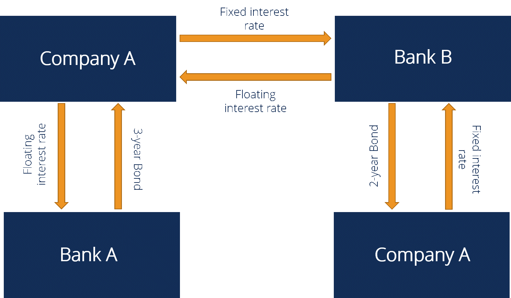

## Table of Contents

## What is a fixed-for-fixed interest rate swap?

A fixed-for-fixed interest rate swap is a type of financial agreement where two parties exchange interest payments based on different fixed interest rates. In this swap, one party agrees to pay a fixed interest rate on a notional principal amount, while the other party agrees to pay a different fixed interest rate on the same notional principal amount. The key feature here is that both interest rates are fixed and do not change over the life of the swap.

This type of swap is often used by companies or investors to manage their exposure to interest rate fluctuations or to take advantage of differences in interest rates between different currencies or markets. For example, if a company has a loan with a fixed interest rate that is higher than the market rate, it might enter into a fixed-for-fixed swap to effectively lower its interest expense by receiving a higher fixed rate and paying a lower fixed rate. This can help the company save money and better manage its financial obligations.

## How does a fixed-for-fixed interest rate swap differ from other types of swaps?

A fixed-for-fixed interest rate swap is different from other types of swaps because it involves exchanging two fixed interest rates instead of a fixed rate for a floating rate or two floating rates. In a typical interest rate swap, one party might pay a fixed rate and receive a floating rate based on an index like LIBOR or SOFR. This helps them manage the risk of interest rate changes. But in a fixed-for-fixed swap, both rates are set and do not change, so it's not about managing variable rate risk but rather about taking advantage of differences in fixed rates.

Another type of swap is a currency swap, where payments are exchanged in different currencies. This can be fixed-for-fixed, but it involves currency exchange as well, which adds another layer of complexity and risk related to currency fluctuations. In contrast, a fixed-for-fixed [interest rate](/wiki/interest-rate-trading-strategies) swap is simpler because it deals only with interest rates in one currency. So, while other swaps might be used to hedge against various types of risks, a fixed-for-fixed swap focuses specifically on the difference between two fixed interest rates, making it a more straightforward tool for specific financial strategies.

## What are the main components of a fixed-for-fixed interest rate swap?

A fixed-for-fixed interest rate swap has a few main parts that make it work. First, there is the notional principal amount, which is like a pretend amount of money that the swap is based on. No real money changes hands with this amount, but it's used to figure out how much interest needs to be paid. Then, there are the two fixed interest rates that the two sides agree to swap. One side pays one fixed rate, and the other side pays a different fixed rate. These rates stay the same for the whole time the swap is active.

The other important parts are the payment dates and the term of the swap. Payment dates are when the two sides exchange the interest payments. These dates are set at the start and happen regularly, like every six months. The term of the swap is how long the swap will last, which could be a few years or even longer. All these parts together make up the fixed-for-fixed interest rate swap, helping the two sides manage their interest payments in a way that suits their needs.

## Who are the typical participants in a fixed-for-fixed interest rate swap?

The typical participants in a fixed-for-fixed interest rate swap are usually big companies, banks, or financial institutions. These organizations use swaps to manage their money better. For example, a company might have a loan with a high fixed interest rate. By doing a swap, they can exchange this high rate for a lower fixed rate from another company, saving money on interest payments.

Sometimes, investors or hedge funds also take part in these swaps. They might see a chance to make money if they think one fixed interest rate will be better than another over time. So, they enter the swap to try to earn more on their investments. Both types of participants, whether they are managing their finances or looking to profit, help make the swap market work smoothly.

## What are the primary motivations for entering into a fixed-for-fixed interest rate swap?

One main reason for entering into a fixed-for-fixed interest rate swap is to save money. A company might have a loan with a high fixed interest rate. By swapping this high rate for a lower fixed rate from another company, they can reduce their interest expenses. This helps them manage their finances better and keep more money in their pockets. Both companies might benefit from this swap if they have different views on where interest rates are headed or if they have different loans with different rates.

Another motivation is to take advantage of market opportunities. Investors or financial institutions might see a chance to make a profit if they think one fixed interest rate will be better than another over time. They can enter into a swap to earn more on their investments. This kind of swap allows them to use their knowledge of the market to gain an edge. So, whether it's about saving money or making a profit, fixed-for-fixed interest rate swaps offer a way for participants to reach their financial goals.

## How is the swap rate determined in a fixed-for-fixed interest rate swap?

In a fixed-for-fixed interest rate swap, the swap rate is figured out by looking at what's going on in the market. People think about things like what other fixed interest rates are available, how much risk there is, and what they think will happen with interest rates in the future. They might also look at how much each side wants to do the swap and how easy or hard it is to find someone to swap with. All these things together help decide what the swap rates will be.

When two sides agree to do the swap, they use this market info to set the two fixed rates. One rate might be a bit higher than the other, depending on what's happening in the market and what each side needs. The goal is to find rates that both sides are happy with, so they can make the swap work for them. This way, they can either save money or make a profit, depending on why they're doing the swap.

## What are the risks associated with fixed-for-fixed interest rate swaps?

One risk of fixed-for-fixed interest rate swaps is that one side might not be able to pay what they promised. This is called credit risk. If a company agrees to swap payments but then runs into money problems, they might not be able to keep up with the payments. This can leave the other side in a tough spot, because they were counting on getting those payments.

Another risk is that the swap might not work out as planned. If interest rates change a lot, or if the market moves in a way that wasn't expected, one side might end up paying more than they thought they would. Even though both rates are fixed, if the rates were set based on guesses about the future, and those guesses turn out to be wrong, it can lead to losses. So, it's important for both sides to think carefully about the risks before they agree to a swap.

## How does the valuation of a fixed-for-fixed interest rate swap work?

Valuing a fixed-for-fixed interest rate swap means figuring out how much it's worth right now. To do this, you look at the present value of the future cash flows from both sides of the swap. The present value is what those future payments would be worth today, considering the time value of money. You use a discount rate, which is often based on the current market interest rates, to figure out the present value of each payment. Then, you subtract the present value of the payments you have to make from the present value of the payments you'll get. The difference is the value of the swap.

Sometimes, the value of the swap can change over time because market interest rates move around. If interest rates go up, the value of the swap might go down, and if rates go down, the value might go up. This happens because the fixed rates in the swap don't change, but the market rates used to value the swap do change. So, both sides need to keep an eye on these changes to understand how the swap's value is doing. This helps them know if they're making money or losing money on the swap.

## Can you explain the process of entering into and managing a fixed-for-fixed interest rate swap?

Entering into a fixed-for-fixed interest rate swap starts with a company or investor looking to either save money or make a profit. They'll talk to a bank or a financial institution that helps set up swaps. Together, they'll look at the current market to figure out what fixed rates to use. Once they agree on the rates, they'll decide on the notional amount, how long the swap will last, and when payments will happen. After everything is set, they sign a contract that spells out all the details. This contract is important because it makes sure both sides know exactly what they're supposed to do.

Managing a fixed-for-fixed interest rate swap means keeping track of the payments and watching how the swap's value changes. On the payment dates, both sides swap the interest payments based on the fixed rates they agreed on. They need to make sure these payments happen on time. Also, they should keep an eye on the market to see if the value of the swap goes up or down. If the value changes a lot, they might need to talk about it with the other side or their bank. This helps them know if they're doing well with the swap or if they need to make any changes.

## What are the accounting and tax implications of fixed-for-fixed interest rate swaps?

When a company enters into a fixed-for-fixed interest rate swap, it needs to follow certain accounting rules. The swap has to be shown on the company's financial statements. Usually, it's listed as a derivative on the balance sheet. The company has to keep track of how much the swap is worth and update this value regularly. If the value of the swap goes up or down, the company has to report this change in value on its income statement. This can make the company's profits or losses look different, even though no real money has changed hands yet. It's important for the company to follow these rules so that its financial statements show a true picture of its situation.

There are also tax rules that the company needs to think about. The interest payments that the company makes and receives from the swap can affect its taxes. If the company pays more interest than it gets, it might be able to deduct that extra amount from its taxable income. But if it gets more interest than it pays, that extra amount might be taxable. It's a good idea for the company to talk to a tax expert to make sure it's doing everything right. The tax rules can be different depending on where the company is and what kind of swap it's doing, so it's important to get good advice.

## How have regulatory changes affected the use of fixed-for-fixed interest rate swaps?

Regulatory changes have had a big impact on how fixed-for-fixed interest rate swaps are used. After the 2008 financial crisis, governments and financial regulators around the world made new rules to make the financial system safer. One big change was that banks and other big players had to report their swap deals to special places called swap data repositories. This helped keep better track of what was happening in the swap market. Also, some swaps had to be traded on special platforms called swap execution facilities, making the market more open and fair.

These changes made it a bit harder for companies to use fixed-for-fixed interest rate swaps, because there were more rules to follow. But they also made the market safer and more transparent. Companies had to spend more time and money to make sure they were following all the new rules. But in the end, these changes helped make sure that the swap market was working well and that companies could still use swaps to manage their money better.

## What advanced strategies can be employed using fixed-for-fixed interest rate swaps?

One advanced strategy using fixed-for-fixed interest rate swaps is called a basis swap. In a basis swap, a company might use two fixed-for-fixed swaps to take advantage of the difference between two different fixed interest rates. For example, a company could enter into one swap to pay a fixed rate based on a government bond and receive a fixed rate based on a corporate bond. If the company thinks the difference between these two rates will change in a way that benefits them, they can make money from the swap. This strategy can be tricky because it depends a lot on guessing how the rates will move, but it can be a smart way to make extra money if done right.

Another strategy is to use fixed-for-fixed swaps to manage the risk of a big project or investment. Let's say a company is building a new factory and they need to borrow money to do it. They might take out a loan with a fixed interest rate, but they think they can get a better deal by swapping that rate for a different fixed rate. By doing this, they can lower their borrowing costs and make the project more affordable. This helps them manage their money better and makes sure the project stays on track financially. Both of these strategies show how fixed-for-fixed swaps can be used in smart ways to help companies reach their goals.

## What is an Interest Rate Swap?

Interest rate swaps are financial derivatives that enable two parties to exchange financial obligations related to interest payments. Typically, this involves one party agreeing to pay a fixed interest rate while receiving a floating interest rate from the other party, based on a notional principal amount. Conversely, the second party pays the floating rate while receiving fixed payments from the first party.

The primary utility of interest rate swaps is to manage the risk associated with fluctuations in interest rates, thereby providing cash flow stability. Companies often enter into these swaps to tailor their interest rate exposure to better align with their financial strategies. For instance, a company with variable-rate debt may opt to swap to a fixed rate to lock in interest payments and protect against potential rate increases. This conversion from floating to fixed essentially transforms the company's debt profile and aids in budgeting and financial planning by providing predictable costs.

Conversely, a company anticipating a decline in interest rates might swap from a fixed rate to a floating rate to exploit potential decreases in borrowing costs. In this scenario, the company pays the floating rate and receives a fixed rate, which can lead to financial gains if interest rates drop.

Here's a basic illustration of the cash flows in a fixed-to-floating interest rate swap:

Assume Party A agrees to pay a fixed interest rate of 5% per annum on a notional principal of $100 million to Party B. Simultaneously, Party B will pay a floating rate based on the 6-month LIBOR, which is reset every six months, to Party A. The net payment at each period depends on the difference between the fixed rate and the calculated floating rate:

$$
\text{Net Payment} = (\text{Fixed Rate} - \text{Floating Rate}) \times \text{Notional Principal}
$$

Interest rate swaps have become fundamental tools for financial management and strategy, enabling companies to modulate their interest rate exposure in a targeted manner that aligns with their broader financial goals.

## References & Further Reading

For an in-depth understanding of financial derivatives, including interest rate swaps and their applications in modern finance and trading strategies, several authoritative texts and resources are recommended:

1. **"Principles of Financial Engineering" by Salih N. Neftci**: This book provides comprehensive coverage of financial engineering principles, including the intricate structures and functions of derivatives such as interest rate swaps. It is an essential resource for understanding how derivatives are structured and utilized in different financial contexts.

2. **"Interest Rate Swaps and Other Derivatives" by Howard Corb**: Corb's work investigates into the specifics of interest rate swaps and related derivatives, offering insights into their pricing, economic rationale, and practical applications. This book is particularly useful for those looking to grasp the complexities of interest rate risks and swap strategies.

3. **"Advances in Financial Machine Learning" by Marcos Lopez de Prado**: This book is instrumental for anyone interested in the intersection of finance, technology, and data science. It explores how machine learning techniques can optimize trading strategies, including the use of interest rate swaps. The integration of advanced algorithms in trading scenarios is discussed with practical examples and Python code snippets.

To further explore the mathematical underpinnings and quantitative aspects of financial derivatives and trading algorithms, the following resources may also be considered:

- **Jupyter Notebooks and Python Libraries**: Tools such as NumPy, pandas, and scikit-learn in Python are invaluable for modeling, analyzing, and simulating interest rate scenarios and trading strategies. Leveraging these tools can enhance understanding and application of theoretical concepts in practical environments.

- **Academic Journals and Publications**: Journals like the Journal of Finance and the Journal of Financial Economics frequently publish research articles on the latest developments in financial derivatives and algorithmic trading, providing cutting-edge insights into these dynamic fields.

These resources collectively offer a well-rounded foundation for both academic study and practical application of financial derivatives, particularly in understanding and implementing interest rate swaps in modern trading strategies.

