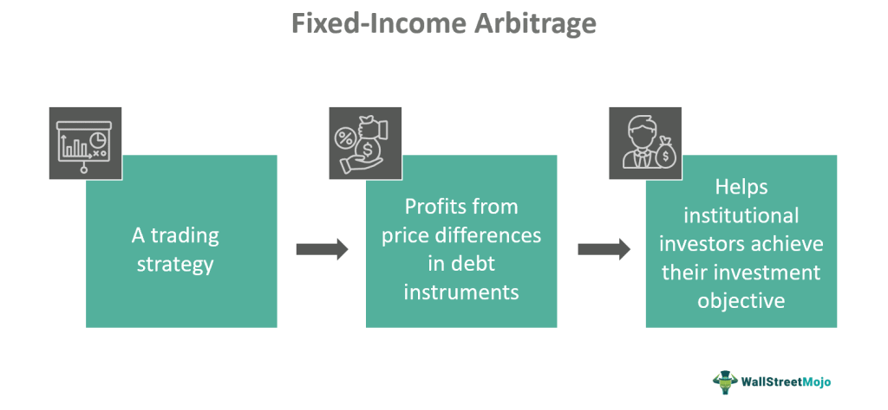

## Table of Contents

## What is fixed-income arbitrage?

Fixed-income arbitrage is a strategy used by investors to make money from the price differences in bonds and other fixed-income securities. It involves buying and selling these securities at the same time to take advantage of small price differences. The goal is to make a profit from these small differences, which can add up over time.

This type of arbitrage often uses complex mathematical models and computer algorithms to find and exploit these price differences. It can be risky because the price differences are usually very small, and the costs of trading can eat into the profits. However, for those who are good at it, fixed-income arbitrage can be a way to make steady returns with less risk than other types of investing.

## What are the basic types of fixed-income securities involved in arbitrage?

Fixed-income arbitrage often involves trading with government bonds, corporate bonds, and mortgage-backed securities. Government bonds are loans to the government that pay interest over time. Corporate bonds are similar but are issued by companies. Mortgage-backed securities are bundles of home loans that investors can buy and sell.

These securities can have different interest rates, times until they mature, and levels of risk. Arbitrageurs look for small differences in the prices of these securities. For example, they might buy a government bond and sell a corporate bond at the same time if they think the price difference between them will change in their favor. By doing this, they hope to make a profit from the small price changes.

## How does fixed-income arbitrage differ from other types of arbitrage?

Fixed-income [arbitrage](/wiki/arbitrage) is different from other types of arbitrage because it focuses on bonds and other fixed-income securities, like government bonds, corporate bonds, and mortgage-backed securities. Other types of arbitrage might look at stocks, commodities, or currencies. In fixed-income arbitrage, the goal is to make money from small price differences between these securities. Traders use complex math and computer programs to find these small differences and make trades quickly.

Unlike other arbitrage strategies, fixed-income arbitrage often involves dealing with securities that have different interest rates, maturity dates, and levels of risk. For example, a trader might buy a government bond and sell a corporate bond at the same time, betting that the price difference between them will change in their favor. This type of arbitrage can be riskier because the price differences are usually very small, and the costs of trading can eat into the profits. However, for skilled traders, it can offer steady returns with less risk than other types of investing.

## What are the common strategies used in fixed-income arbitrage?

One common strategy in fixed-income arbitrage is called yield curve arbitrage. This involves looking at the yield curve, which shows the interest rates of bonds with different maturity dates. Traders try to find small differences in the prices of bonds along the yield curve. They might buy a bond with a short maturity and sell a bond with a long maturity if they think the price difference between them will change in their favor. This strategy can be tricky because it relies on predicting how the yield curve will move.

Another strategy is called relative value arbitrage. This involves comparing the prices of similar bonds, like two corporate bonds from different companies. Traders look for small differences in the prices of these bonds and make trades to take advantage of these differences. For example, they might buy a bond from one company and sell a bond from another company if they think the price difference will change. This strategy requires a good understanding of the factors that affect bond prices, like the creditworthiness of the companies issuing the bonds.

A third strategy is called swap-spread arbitrage. This involves trading in [interest rate](/wiki/interest-rate-trading-strategies) swaps and government bonds. An interest rate swap is an agreement to exchange interest payments between two parties. Traders look for small differences between the swap rate and the yield on government bonds. They might buy a government bond and enter into an interest rate swap at the same time if they think the difference between the swap rate and the bond yield will change in their favor. This strategy can be complex because it involves understanding both the bond market and the swap market.

## What is the role of interest rate swaps in fixed-income arbitrage?

Interest rate swaps play an important role in fixed-income arbitrage, especially in a strategy called swap-spread arbitrage. In this strategy, traders look at the difference between the interest rate on a swap and the yield on a government bond. They might buy a government bond and enter into an interest rate swap at the same time if they think the difference between the swap rate and the bond yield will change in their favor. This can help them make a profit from small price changes.

Using interest rate swaps in fixed-income arbitrage can be complex because it involves understanding both the bond market and the swap market. Traders need to predict how interest rates will move and how this will affect the prices of bonds and swaps. If they get it right, they can make money from the small differences between the swap rate and the bond yield. But if they get it wrong, they could lose money. So, it's a strategy that requires a lot of skill and careful analysis.

## How do market participants identify mispricing opportunities in fixed-income markets?

Market participants identify mispricing opportunities in fixed-income markets by using complex math models and computer programs. These tools help them look at lots of data about bonds and other fixed-income securities. They check things like interest rates, how long until the bonds mature, and how risky the bonds are. By doing this, they can spot small differences in prices that might not be obvious at first. For example, they might see that two similar bonds have slightly different prices, and they can make trades to take advantage of this.

Another way they find mispricing is by watching how the market changes over time. They pay attention to news and economic reports that can affect bond prices. If they think a bond's price is going to change because of something happening in the economy, they can make trades to profit from this change. This requires a good understanding of the market and the factors that can move bond prices. By combining data analysis with market knowledge, they can find and use mispricing opportunities to make money.

## What are the risks associated with fixed-income arbitrage?

Fixed-income arbitrage can be risky because the price differences that traders try to make money from are usually very small. This means that even small costs, like the fees for buying and selling bonds, can eat into the profits. If the market moves in the wrong direction, even by a little bit, traders can lose money instead of making it. This is called market risk, and it's a big worry for people doing fixed-income arbitrage.

Another risk is called model risk. This happens when the math models and computer programs that traders use to find mispricing opportunities don't work as expected. If the models are wrong, traders might make bad trades and lose money. Also, fixed-income arbitrage often involves borrowing money to make bigger trades, which can lead to more risk. If the trades don't go well, traders might have trouble paying back the money they borrowed, which can lead to big losses.

## How does leverage impact fixed-income arbitrage strategies?

Leverage is when traders borrow money to make bigger trades in fixed-income arbitrage. This can help them make more money if their trades go well. For example, if a trader sees a small price difference between two bonds, they can use borrowed money to buy more of the cheaper bond and sell more of the more expensive bond. If the price difference changes in their favor, they can make a bigger profit than if they had used only their own money.

But leverage also makes fixed-income arbitrage riskier. If the trades don't go well and the price difference changes in the wrong direction, traders can lose more money than they would have if they hadn't borrowed. This is because they still have to pay back the borrowed money, even if their trades lose money. So, while leverage can help traders make bigger profits, it can also lead to bigger losses if things don't go as planned.

## What are some historical examples of successful fixed-income arbitrage?

One famous example of successful fixed-income arbitrage is the work of Long-Term Capital Management (LTCM) in the 1990s. LTCM was a [hedge fund](/wiki/hedge-fund-trading-strategies) run by smart people, including some who won the Nobel Prize. They used fixed-income arbitrage to make money from small price differences in bonds. At first, they did really well and made a lot of money. But then, in 1998, things went wrong when Russia defaulted on its debt, and the market moved in ways they didn't expect. LTCM lost a lot of money and almost caused a big problem in the financial markets. Even though LTCM ended badly, it showed how fixed-income arbitrage could be very profitable when it worked.

Another example is the success of Citadel, a big hedge fund that has been good at fixed-income arbitrage for many years. Citadel uses complex math and computer programs to find small price differences in bonds and other fixed-income securities. They make trades quickly to take advantage of these differences. Citadel has been able to make steady profits from fixed-income arbitrage, even when other parts of the market are doing badly. This shows that with the right skills and tools, fixed-income arbitrage can be a successful strategy over the long term.

## How have regulatory changes affected fixed-income arbitrage practices?

Regulatory changes have had a big impact on fixed-income arbitrage practices. After the financial crisis in 2008, governments and financial watchdogs made new rules to make the markets safer. These rules include things like more reporting of trades and limits on how much money traders can borrow. These changes made it harder for arbitrageurs to find and use small price differences in bonds and other fixed-income securities. The new rules also made trading more expensive because of the extra work needed to follow them.

Despite these challenges, some arbitrageurs have found ways to keep making money. They use new technology and smarter math models to find opportunities that are harder to spot. They also work with regulators to make sure they are following the rules while still trying to make profits. So, while regulatory changes have made fixed-income arbitrage more difficult, they haven't stopped it completely. Skilled traders can still find ways to succeed in this complex and changing environment.

## What advanced quantitative models are used in fixed-income arbitrage?

In fixed-income arbitrage, traders use advanced quantitative models to find small price differences in bonds and other fixed-income securities. One common model is the Black-Scholes model, which helps traders predict how the prices of bonds will change based on interest rates and other factors. Another model is the Heath-Jarrow-Morton (HJM) framework, which looks at how the entire yield curve might move over time. These models use a lot of math and data to make predictions, helping traders decide when to buy and sell bonds to make a profit.

These models also help traders manage risk. For example, the Value at Risk (VaR) model tells traders how much money they could lose in a bad situation. This helps them understand the risks of their trades and make better decisions. By using these advanced models, traders can find opportunities that are hard to see and make money from small price changes in the market. But these models are not perfect, and traders need to be careful because the market can be unpredictable.

## How does technology and automation influence modern fixed-income arbitrage strategies?

Technology and automation have changed fixed-income arbitrage a lot. Traders now use fast computers and special software to look at a huge amount of data about bonds and other fixed-income securities. These tools help them find small price differences quickly, which is important because these differences can disappear fast. Automation also lets traders make trades without waiting, so they can take advantage of opportunities as soon as they see them. This makes fixed-income arbitrage more efficient and can help traders make more money.

But technology and automation also bring new challenges. The costs of using these advanced tools can be high, and traders need to keep up with new technology to stay competitive. Also, because everyone can use these tools, it's harder to find mispricing opportunities. The market moves fast, and traders need to be careful because even small mistakes can lead to big losses. So, while technology and automation help a lot, they also make fixed-income arbitrage more complex and risky.

## References & Further Reading

[1]: ["Advances in Financial Machine Learning"](https://www.amazon.com/Advances-Financial-Machine-Learning-Marcos/dp/1119482089) by Marcos Lopez de Prado

[2]: ["Evidence-Based Technical Analysis: Applying the Scientific Method and Statistical Inference to Trading Signals"](https://www.amazon.com/Evidence-Based-Technical-Analysis-Scientific-Statistical/dp/0470008741) by David Aronson

[3]: ["Machine Learning for Algorithmic Trading"](https://github.com/stefan-jansen/machine-learning-for-trading) by Stefan Jansen

[4]: ["Quantitative Trading: How to Build Your Own Algorithmic Trading Business"](https://www.amazon.com/Quantitative-Trading-Build-Algorithmic-Business/dp/1119800064) by Ernest P. Chan

[5]: ["Interest Rate Markets: A Practical Approach to Fixed Income"](https://onlinelibrary.wiley.com/doi/book/10.1002/9781119200949) by Siddhartha Jha