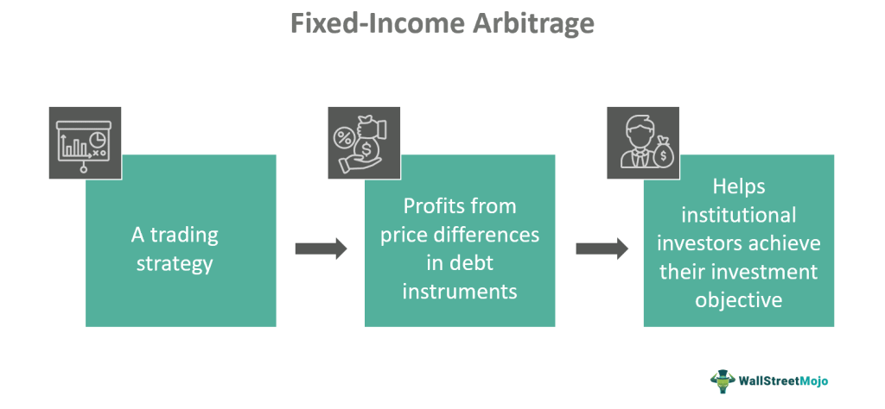

Fixed-income arbitrage is a sophisticated investment strategy that traders use to capitalize on discrepancies in interest rates across various fixed-income securities. At its core, this approach is market-neutral, meaning it seeks to make a profit regardless of broad market movements by exploiting inefficiencies within specific markets.

The primary mechanism of fixed-income arbitrage involves identifying situations where similar or related fixed-income instruments are priced differently. Traders then buy undervalued securities while simultaneously selling overvalued ones. Over time, as the market corrects these pricing anomalies, arbitrageurs benefit from the convergence of the asset prices, thus securing a profit. For example, if the yield on a corporate bond is higher than that of a comparable Treasury bond, traders might exploit the spread difference, assuming these yields will eventually align.



In recent years, algorithmic trading has become an integral part of fixed-income arbitrage. Algorithms can process vast datasets and execute trades at lightning speeds, identifying and capitalizing on minute inefficiencies that human traders might overlook. This technological integration not only enhances market efficiency by swiftly correcting pricing errors but also injects much-needed liquidity into the fixed-income markets.

As financial markets continue to grow more complex, the role of fixed-income arbitrage remains critical. By ensuring that prices reflect true market values, this strategy contributes to a healthier financial ecosystem where capital is allocated more efficiently. The ongoing evolution of algorithmic trading techniques promises even further advancements in execution accuracy and speed, shaping the future of fixed-income arbitrage.

## Table of Contents

## Understanding Fixed-Income Securities

Fixed-income securities are essential tools in the financial market, serving as debt instruments through which entities like governments and corporations raise funds. These securities offer investors a reliable income stream through regular interest payments, making them attractive for individuals seeking predictable returns. At their core, fixed-income securities represent a loan made by an investor to an issuer, with the understanding that the issuer will repay the principal amount at maturity along with scheduled interest payments.

Common examples include Treasury bills, corporate bonds, and municipal bonds. Treasury bills, issued by the government, are considered low-risk investments due to the backing of government credit. Corporate bonds, on the other hand, are issued by companies and typically offer higher yields compared to Treasury bills, reflecting the increased risk of corporate default. Municipal bonds are issued by state or local governments and often provide tax advantages to investors, making them appealing for those in higher tax brackets.

The process of fixed-income investment can be likened to a straightforward transaction: the investor provides capital to the issuer in exchange for a commitment to periodic interest payments and the return of the principal at maturity. This exchange creates a win-win scenario; issuers benefit from the essential capital for operations or projects, while investors gain a steady income through interest payments.

Investing in fixed-income securities requires understanding key concepts such as yield, which represents the returns an investor can expect from the investment relative to its price. Yield calculations, which might include current yield or yield to maturity, help investors assess the potential profitability of a security.

Overall, fixed-income securities serve as a foundational pillar in financial portfolios, offering diversification and stability. By understanding their structure and various forms, investors can strategically allocate capital to align with financial goals, risk tolerance, and market conditions.

## Mechanics of Fixed-Income Arbitrage

Fixed-income [arbitrage](/wiki/arbitrage) involves identifying discrepancies in the pricing of fixed-income securities to capitalize on expected price movements. These discrepancies can arise due to market inefficiencies, temporary imbalances, or anomalies in the yield curves of similar securities. The strategy predominantly relies on the expectation that these mispricings will eventually be corrected, presenting an opportunity for arbitrageurs to secure a profit.

Arbitrageurs use long and short positions to exploit these pricing inefficiencies. Going long involves buying undervalued securities with the expectation that their prices will rise, while shorting overpriced securities involves selling them with the anticipation of a future price decline. The profits are realized when the price differences converge to their theoretical values.

Hedge funds and investment banks are the primary players in fixed-income arbitrage, primarily due to the strategy's complexity and significant capital demands. These institutions have the resources and expertise to deploy sophisticated models and quantitative techniques that are essential for identifying mispricings and executing trades efficiently. Given the potential for substantial [volatility](/wiki/volatility-trading-strategies) in [interest rate](/wiki/interest-rate-trading-strategies)s and other macroeconomic [factor](/wiki/factor-investing)s, participants must also engage in rigorous risk management to protect their investments.

Successful fixed-income arbitrage strategies often require deep understanding of the bond markets and the factors influencing interest rates. This includes knowledge of monetary policies, economic indicators, and geopolitical events that can impact bond prices. Moreover, leveraging technology and quantitative tools to analyze vast datasets allows for more accurate predictions of price movements and quick execution of trades, which are essential for maintaining a competitive edge in this domain.

## Popular Fixed-Income Arbitrage Strategies

Swap Spread Arbitrage: This strategy exploits the yield discrepancy between interest-rate swaps and Treasury bonds, aiming to capitalize on the difference between the fixed rate of a swap and the yield of a corresponding maturity Treasury bond. Traders buy the swap if its yield is higher than the Treasury bond’s yield and short sell the Treasury bond, anticipating that the spreads will converge. This convergence might occur due to various factors, including changes in interest rates or credit risk perceptions, making it profitable when the spread normalizes. The formula for the swap spread can be expressed as:

$$
\text{Swap Spread} = \text{Swap Rate} - \text{Treasury Yield}
$$

Yield Curve Arbitrage: This strategy takes advantage of pricing discrepancies along the yield curve, which graphs interest rates of bonds having equal credit quality but differing maturity dates. The yield curve's shape can change due to different macroeconomic factors, leading to temporary mispricing. Traders engage in this strategy by taking long and short positions on bonds of varying maturities, betting on a return to normal yield curve shapes. This method requires sophisticated modeling to predict shifts accurately and often involves using derivatives to hedge against potential risks.

Mortgage Arbitrage: This involves trading mortgage-backed securities (MBS) to profit from the spread between MBS yields and those of hedge instruments, like government bonds. The complexity of MBS arises from prepayment risk, where homeowners may pay off mortgages earlier than expected, affecting the securities' cash flows. By identifying favorable spreads and effectively managing prepayment risks, traders can achieve returns. This strategy also frequently involves hedging interest rate risks through the use of swaps or options on Treasuries to protect against adverse movements in interest rates.

These strategies require a careful analysis of market conditions and a robust understanding of the underlying drivers of interest rate movements and credit spreads. Traders must leverage advanced modeling techniques and real-time data analytics to remain competitive in these sophisticated financial strategies.

## Algorithmic Trading in Fixed-Income Arbitrage

Algorithmic trading significantly enhances fixed-income arbitrage by enabling rapid and precise execution of trades, thereby capitalizing on even the slightest market inefficiencies. Modern algorithms leverage vast amounts of data, analyzing them almost instantaneously to identify pricing anomalies in fixed-income securities. This ability allows traders to exploit opportunities that may otherwise remain undetected through traditional methods.

One of the key benefits of [algorithmic trading](/wiki/algorithmic-trading) in fixed-income arbitrage is its ability to swiftly adapt to changing market conditions. Algorithms can be programmed to automatically adjust their strategies based on predefined parameters, reducing exposure to unforeseen risks and optimizing outcomes. For example, an algorithm may monitor the yield differentials between various fixed-income instruments and execute trades when these exceed a certain threshold, indicating a mispricing. 

The advancements in data processing and machine learning play a critical role in refining arbitrage strategies. Machine learning models can analyze historical data to predict future price movements and identify patterns that signify potential arbitrage opportunities. These models improve over time as they continuously learn from new data inputs, enhancing their predictive accuracy and decision-making capabilities.

Here's a simple Python example demonstrating how one might utilize a basic algorithm to identify yield discrepancies:

```python
import numpy as np
import pandas as pd

# Sample data for yields of two different bonds
bond_yields = pd.DataFrame({
    'Bond_A': np.random.normal(2.5, 0.05, 100),  # Mean yield of 2.5%
    'Bond_B': np.random.normal(2.7, 0.05, 100)   # Mean yield of 2.7%
})

# Calculate the difference between the two yields
bond_yields['Spread'] = bond_yields['Bond_B'] - bond_yields['Bond_A']

# Identify arbitrage opportunities where the spread is greater than a threshold
threshold = 0.2
arb_opportunities = bond_yields[bond_yields['Spread'] > threshold]

print(arb_opportunities)
```

In this example, `Bond_A` and `Bond_B` represent yields from two different bonds. The script calculates the spread between their yields and identifies potential arbitrage opportunities when the spread exceeds a specified threshold. Although this example is simplified, it illustrates the concept of leveraging algorithms to detect and exploit arbitrage opportunities in fixed-income markets.

The integration of algorithmic trading into fixed-income arbitrage not only boosts efficiency but also reduces risk by enabling more sophisticated risk management strategies. As technology continues to evolve, these algorithms will likely become more comprehensive and integral to the landscape of fixed-income trading, making the practice more accessible and robust for market participants.

## Risk Management in Fixed-Income Arbitrage

Fixed-income arbitrage strategies, though profitable, are fraught with risks primarily stemming from interest rate fluctuations and [liquidity](/wiki/liquidity-risk-premium) conditions. Interest rate risk refers to the potential for investment losses due to changes in interest rates, which can affect the value of fixed-income securities. For instance, an unexpected rise in interest rates typically leads to a decline in bond prices, impacting positions that rely on specific interest rate movements.

Liquidity risk in fixed-income arbitrage is the danger that an asset cannot be traded quickly enough in the market to prevent a loss or realize the necessary profit. This risk is particularly acute in times of market stress when the usual traders might withdraw, leaving fewer counterparties to execute trades. 

Effective risk management strategies are crucial in fixed-income arbitrage. Diversification is a key tactic, as it spreads exposure across various instruments and markets, thereby reducing the impact of a loss in any single position. Furthermore, volatility arbitrage acts as a hedge by capitalizing on discrepancies between expected and actual volatility, allowing traders to adjust their positions based on market movements.

Adapting to market conditions and changes in wider economic settings is essential to reduce risks in fixed-income arbitrage. Skilled risk assessment involves constantly monitoring global economic indicators, monetary policy announcements, and geopolitical events that could affect interest rates or liquidity levels.

Utilizing mathematical models and simulations, such as the Monte Carlo simulation, can help assess and predict potential risks by simulating thousands of scenarios to understand the range of potential outcomes. This quantitative approach complements traditional risk management techniques, enabling more informed decision-making.

```python
import numpy as np

def monte_carlo_simulation(initial_price, volatility, time_horizon, num_simulations):
    results = []
    for _ in range(num_simulations):
        price = initial_price
        for _ in range(time_horizon):
            price += np.random.normal(0, volatility)
        results.append(price)
    return np.mean(results), np.std(results)

# Example usage
initial_price = 100  # initial price of the security
volatility = 1.5     # assumed volatility of 1.5%
time_horizon = 252   # one trading year
num_simulations = 1000  # number of simulations

mean_price, std_dev = monte_carlo_simulation(initial_price, volatility, time_horizon, num_simulations)
```

By leveraging both quantitative tools and traditional methods, participants in fixed-income arbitrage can better manage the intricate risks associated with these strategies, potentially enhancing returns while safeguarding against adverse outcomes.

## Who Uses Fixed-Income Arbitrage and Why?

Fixed-income arbitrage is predominantly employed by [hedge fund](/wiki/hedge-fund-trading-strategies)s and large financial institutions. These entities are drawn to this strategy largely because of its capital-intensive nature, which requires significant financial resources to effectively exploit small pricing inefficiencies across various fixed-income securities. By committing substantial assets, hedge funds and financial institutions strive to achieve higher returns, even when the pricing discrepancies are minimal.

One of the primary motivations behind using fixed-income arbitrage is the potential to generate steady, albeit modest, returns. Unlike more volatile investment strategies, fixed-income arbitrage can offer a stream of returns that, although small, tend to be relatively consistent over time. This consistency is particularly appealing to hedge funds and institutions that prioritize portfolio stability and incremental return growth.

Moreover, fixed-income arbitrage is an effective tool for diversification. It adds a dimension to investment portfolios that is not directly correlated with traditional equity or bond investments. This diversification benefit is crucial for financial entities looking to spread risk across various asset classes and strategies, thereby enhancing the overall resilience of their investment portfolios.

In summary, the primary users of fixed-income arbitrage—hedge funds and large financial institutions—opt for this strategy to tap into small yet consistent returns and diversify their portfolios. By leveraging their extensive capital, they can capitalize on minute market inefficiencies while safeguarding their investments against more volatile market shifts.

## Conclusion

Fixed-income arbitrage is crucial in maintaining market efficiency and liquidity. By capitalizing on price discrepancies between various fixed-income securities, this strategy helps balance the scales, ensuring that asset prices align more closely with their intrinsic values. The introduction of algorithmic trading has significantly enhanced the implementation of fixed-income arbitrage. Through the rapid execution of trades and the ability to handle vast datasets, algorithmic trading transforms traditional market operations by improving both speed and accuracy. This technological integration allows for the seamless identification and execution of arbitrage opportunities, ultimately leading to more effective and less risky strategies.

As financial markets continue to evolve, ongoing advancements in arbitrage techniques and technology are set to reshape the future of fixed-income trading. Innovations such as [machine learning](/wiki/machine-learning) and [artificial intelligence](/wiki/ai-artificial-intelligence) will likely provide even finer tools for analyzing and responding to market movements, offering new avenues for optimizing arbitrage strategies. Adapting to these changes will be essential for market participants aiming to leverage fixed-income arbitrage successfully, ensuring that it remains an indispensable tool for sustaining market health and providing substantial investment returns.

## References & Further Reading

[1]: Lopez de Prado, M. (2018). ["Advances in Financial Machine Learning."](https://www.amazon.com/Advances-Financial-Machine-Learning-Marcos/dp/1119482089) Wiley.

[2]: Fabozzi, F. J., & Mann, S. V. (2005). ["The Handbook of Fixed Income Securities."](https://www.mhebooklibrary.com/doi/book/10.1036/9781260473902?contentTab=true) McGraw-Hill.

[3]: Chan, E. P. (2009). ["Quantitative Trading: How to Build Your Own Algorithmic Trading Business."](https://github.com/ftvision/quant_trading_echan_book) Wiley.

[4]: Jansen, S. (2020). ["Machine Learning for Algorithmic Trading: Predictive models to extract signals from market and alternative data for systematic trading strategies with Python."](https://www.amazon.com/Machine-Learning-Algorithmic-Trading-alternative/dp/1839217715) Packt Publishing.

[5]: Fabozzi, F. J., Nguyen, D., & Fabozzi, P. A. (2017). ["Fixed Income Analysis."](https://onlinelibrary.wiley.com/doi/book/10.1002/9781118266649) Wiley Finance.