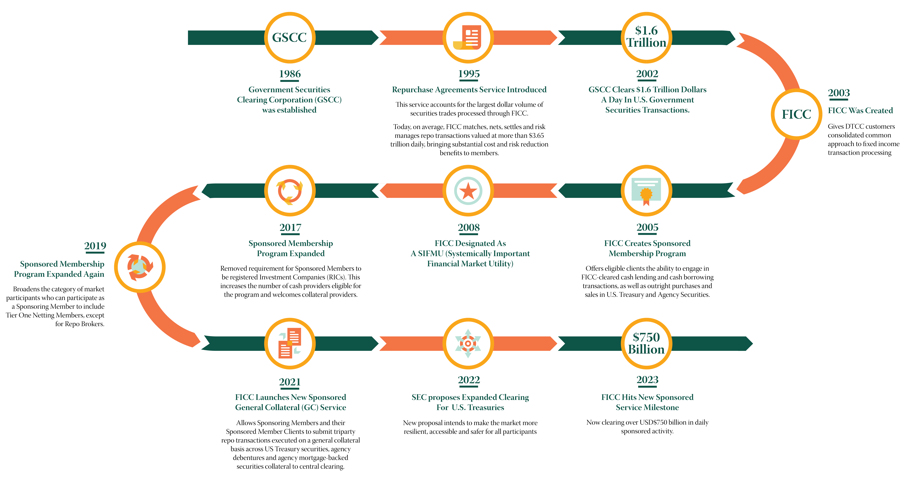

## Table of Contents

## What is the Fixed Income Clearing Corporation (FICC)?

The Fixed Income Clearing Corporation (FICC) is a part of the Depository Trust & Clearing Corporation (DTCC). It helps make trading safer and easier for people who buy and sell bonds and other fixed income securities. FICC does this by being in the middle of the trades, making sure that if one side of the trade can't pay, the other side still gets their money or securities.

FICC has two main parts: the Government Securities Division (GSD) and the Mortgage-Backed Securities Division (MBSD). The GSD handles trades of U.S. government securities, like Treasury bonds. The MBSD deals with mortgage-backed securities, which are investments based on home loans. By managing these trades, FICC helps keep the market stable and trustworthy.

## When was the Fixed Income Clearing Corporation established?

The Fixed Income Clearing Corporation (FICC) was established in 2003. Before that, it was part of the National Securities Clearing Corporation (NSCC), which was created in 1976. FICC was made to help make trading safer for people who buy and sell bonds and other fixed income securities.

FICC became its own company in 2003 to focus more on bonds and other fixed income securities. It is now a part of the Depository Trust & Clearing Corporation (DTCC), which helps make sure that all kinds of trading in the financial markets are safe and reliable.

## What are the main functions of the FICC?

The Fixed Income Clearing Corporation (FICC) acts as a middleman in the trading of bonds and other fixed income securities. It helps make trading safer by stepping in between buyers and sellers. If one side of the trade can't pay, FICC makes sure the other side still gets what they are owed. This reduces the risk for everyone involved in the trade.

FICC has two main parts: the Government Securities Division (GSD) and the Mortgage-Backed Securities Division (MBSD). The GSD deals with U.S. government securities, like Treasury bonds. The MBSD handles mortgage-backed securities, which are investments based on home loans. By managing these trades, FICC helps keep the market stable and trustworthy, making it easier for people to buy and sell these securities.

## How does the FICC contribute to the stability of the financial markets?

The Fixed Income Clearing Corporation (FICC) helps keep financial markets stable by acting as a middleman in trades of bonds and other fixed income securities. When someone buys or sells these securities, FICC steps in to make sure the trade goes through safely. If one side of the trade can't pay, FICC makes sure the other side still gets their money or securities. This reduces the risk for everyone involved, making people more confident to trade.

FICC has two parts: the Government Securities Division (GSD) and the Mortgage-Backed Securities Division (MBSD). The GSD deals with U.S. government securities like Treasury bonds, while the MBSD handles mortgage-backed securities, which are investments based on home loans. By managing these trades, FICC helps keep the market running smoothly. This stability is important because it helps prevent big problems in the financial markets, making it easier for people to buy and sell securities without worrying too much about risk.

## What types of securities does the FICC clear and settle?

The Fixed Income Clearing Corporation (FICC) clears and settles two main types of securities: U.S. government securities and mortgage-backed securities. U.S. government securities include Treasury bonds, which are loans to the government that pay interest over time. FICC's Government Securities Division (GSD) handles these trades, making sure they go smoothly and safely.

The other type of security FICC deals with is mortgage-backed securities. These are investments based on home loans, where the payments from the loans are used to pay investors. FICC's Mortgage-Backed Securities Division (MBSD) manages these trades. By clearing and settling these securities, FICC helps keep the market stable and trustworthy, reducing the risk for everyone involved in the trades.

## Who are the members of the FICC?

The members of the Fixed Income Clearing Corporation (FICC) are mostly banks, broker-dealers, and other financial firms that buy and sell bonds and other fixed income securities. These members use FICC's services to make their trades safer and easier. By being a member, they can trade with less worry about the other side of the trade not paying up.

FICC has two main parts: the Government Securities Division (GSD) and the Mortgage-Backed Securities Division (MBSD). The GSD's members are firms that trade U.S. government securities, like Treasury bonds. The MBSD's members are firms that trade mortgage-backed securities, which are investments based on home loans. Both types of members rely on FICC to help manage their trades and keep the market stable.

## How has the role of the FICC evolved since its inception?

The Fixed Income Clearing Corporation (FICC) started in 2003 as a way to make trading bonds and other fixed income securities safer. Before that, it was part of the National Securities Clearing Corporation (NSCC), which was created in 1976. When FICC became its own company, it focused more on handling trades of bonds and other fixed income securities. This was important because it helped make trading safer for banks, broker-dealers, and other financial firms that buy and sell these securities.

Over time, FICC's role has grown to help keep the financial markets more stable. It does this by acting as a middleman in trades, making sure that if one side of the trade can't pay, the other side still gets their money or securities. FICC has two main parts: the Government Securities Division (GSD) and the Mortgage-Backed Securities Division (MBSD). The GSD deals with U.S. government securities like Treasury bonds, while the MBSD handles mortgage-backed securities, which are investments based on home loans. By managing these trades, FICC helps keep the market running smoothly and reduces the risk for everyone involved in the trades.

## What major events or crises has the FICC navigated through its history?

Since its start in 2003, the Fixed Income Clearing Corporation (FICC) has faced some big challenges. One of the most important events was the 2008 financial crisis. During this time, many big banks and financial firms were in trouble. FICC played a key role in keeping the bond market stable. It did this by making sure trades went through even when some firms couldn't pay. This helped prevent even bigger problems in the financial markets.

Another big event was the introduction of new rules and technologies. After the 2008 crisis, the government made new rules to make the financial markets safer. FICC had to change how it worked to follow these new rules. It also started using new technology to handle more trades and make them safer. These changes helped FICC keep the bond market stable and trustworthy, even during tough times.

## What technological advancements has the FICC implemented to improve its services?

Since its start, the Fixed Income Clearing Corporation (FICC) has used new technology to make its services better. One big change was moving to electronic trading and clearing systems. This means that instead of using paper and calling on the phone, trades are now done on computers. This makes things faster and less likely to have mistakes. FICC also started using something called real-time trade matching, which means that as soon as a trade happens, it is checked and confirmed right away. This helps make sure everything is correct and reduces the chance of problems.

Another important technology FICC has used is called risk management systems. These systems help FICC keep an eye on how much risk is in the market. They use special math and computer programs to figure out if there might be problems with trades. This helps FICC step in quickly if something goes wrong, making the market safer for everyone. By using these new technologies, FICC has been able to handle more trades and make them safer, which is really important for keeping the bond market stable.

## How does the FICC interact with other financial market infrastructures?

The Fixed Income Clearing Corporation (FICC) works closely with other parts of the financial world to make sure trading stays safe and smooth. It is part of the Depository Trust & Clearing Corporation (DTCC), which is a big group that helps with lots of different trades. FICC talks to other clearing houses and trade groups to share information and make sure everyone follows the same rules. This teamwork helps keep the whole financial system stable, making it easier for people to buy and sell bonds and other fixed income securities without too much risk.

FICC also connects with banks and other financial firms that are its members. These firms use FICC's services to make their trades safer. FICC makes sure that if one side of a trade can't pay, the other side still gets their money or securities. By working together with these other groups, FICC helps keep the market running smoothly. This is really important because it helps prevent big problems in the financial markets, making it easier for everyone to trade with confidence.

## What regulatory changes have impacted the operations of the FICC over the years?

Since it started in 2003, the Fixed Income Clearing Corporation (FICC) has had to change how it works because of new rules from the government. After the big financial crisis in 2008, the government made new laws to make the financial markets safer. One big change was the Dodd-Frank Act, which said that more trades had to go through clearing houses like FICC. This was to make sure that if one side of a trade couldn't pay, the other side would still get their money or securities. FICC had to set up new systems to handle these extra trades and make sure everything was done correctly.

Another important change was the rules from the Securities and Exchange Commission (SEC) and the Commodity Futures Trading Commission (CFTC). These rules made FICC keep more money on hand, called margin, to cover any problems with trades. This meant FICC had to change how it managed risk and make sure it had enough money to step in if needed. These changes helped make the bond market more stable and trustworthy, but they also made FICC's job more complicated. By following these new rules, FICC has been able to keep the market running smoothly and safely.

## What are some of the challenges and future directions for the FICC in the evolving financial landscape?

The Fixed Income Clearing Corporation (FICC) faces several challenges as the financial world keeps changing. One big challenge is dealing with new technology. As more trades happen online and with computers, FICC has to keep up with these changes to make sure everything stays safe and works well. Another challenge is keeping up with new rules from the government. These rules can be hard to follow and might need FICC to change how it does things. Also, FICC needs to handle more trades as the market grows, which means it has to find ways to do more work without making mistakes.

Looking ahead, FICC is thinking about how to use new technology even more to make its services better. This could mean using things like [artificial intelligence](/wiki/ai-artificial-intelligence) and blockchain to make trades faster and safer. FICC also wants to work more closely with other parts of the financial world to share information and make sure everyone follows the same rules. By doing these things, FICC hopes to keep the bond market stable and trustworthy, even as the financial world keeps changing.

## References & Further Reading

[1]: Bergstra, J., Bardenet, R., Bengio, Y., & Kégl, B. (2011). ["Algorithms for Hyper-Parameter Optimization."](https://papers.nips.cc/paper/4443-algorithms-for-hyper-parameter-optimization) Advances in Neural Information Processing Systems 24.

[2]: ["Advances in Financial Machine Learning"](https://www.amazon.com/Advances-Financial-Machine-Learning-Marcos/dp/1119482089) by Marcos Lopez de Prado

[3]: ["Evidence-Based Technical Analysis: Applying the Scientific Method and Statistical Inference to Trading Signals"](https://www.amazon.com/Evidence-Based-Technical-Analysis-Scientific-Statistical/dp/0470008741) by David Aronson

[4]: ["Machine Learning for Algorithmic Trading"](https://github.com/stefan-jansen/machine-learning-for-trading) by Stefan Jansen

[5]: ["Quantitative Trading: How to Build Your Own Algorithmic Trading Business"](https://www.amazon.com/Quantitative-Trading-Build-Algorithmic-Business/dp/1119800064) by Ernest P. Chan