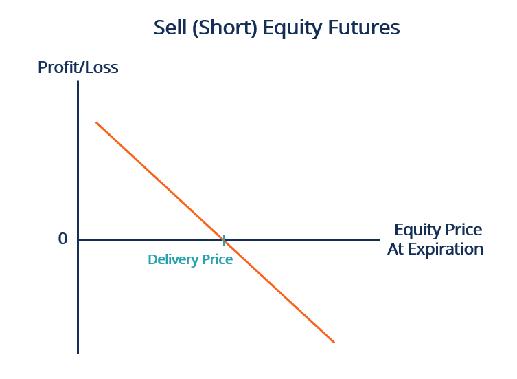

In the ever-evolving world of finance, derivatives play a key role in shaping investment strategies, particularly in the sphere of fixed income investments. Financial derivatives, such as options, futures, and forward contracts, are sophisticated financial instruments that derive their value from underlying assets like stocks, bonds, and interest rates. These instruments allow investors to hedge against potential market risks, offering opportunities to achieve higher returns by leveraging existing assets. The strategic application of derivatives is pivotal for investors aiming to manage risk and maximize returns effectively.

This article explores the nuances of financial derivatives within the context of fixed income investments and forward contracting. In fixed income markets, derivatives provide critical risk management and speculative opportunities, empowering investors to navigate the complexities of bond markets. Forward contracts, a specific type of derivative, enable investors to lock in prices for future transactions, thus mitigating the risks associated with interest rate fluctuations and market volatility.

Additionally, we'll discuss the transformative impact of algorithmic trading on fixed income markets. Algorithmic trading, which relies on computer programs to execute trades based on predefined criteria, has revolutionized trading by analyzing vast datasets and identifying trends with precision. This technological advance enhances trading efficiency and reduces human error, making it an indispensable tool for modern investors.

Understanding these concepts is crucial for investors looking to optimize their portfolios and hedge against market volatility. By the end of this article, you'll have a solid grasp of the complexities and opportunities that fixed income derivatives trading presents. This knowledge is imperative as the interplay between technology and finance continues to evolve, offering innovative strategies for successful investment navigation.

## Table of Contents

## Understanding Financial Derivatives

Financial derivatives are specialized financial contracts whose values are intricately tied to underlying assets. These assets can include stocks, bonds, and interest rates, which form the basis for the derivative's price behavior. Derivatives serve multiple purposes in financial markets, primarily risk management and the potential for enhanced returns through leverage. They allow market participants to hedge against adverse price movements in underlying assets, offering a mechanism to transfer and offset risk.

The landscape of derivatives encompasses various instruments, among which options, futures, and forwards are prominent. Each type of derivative comes with distinct characteristics and trading methodologies. Options grant the holder the right, but not the obligation, to buy or sell an asset at a predetermined price within a specified timeframe. Futures are standardized contracts obligating the parties to transact an asset at a preset price on a future date, typically traded on established exchanges. In contrast, forwards are more customized contracts negotiated directly between parties (over-the-counter), without standard terms set by exchanges.

For investors engaged in fixed income securities, derivatives become vital tools for hedging [interest rate](/wiki/interest-rate-trading-strategies) risks and exploiting speculative opportunities in bond markets. By using derivatives, such investors can protect their portfolios from [volatility](/wiki/volatility-trading-strategies) in bond prices and yield changes. Market conditions, such as interest rate trends and economic indicators, heavily influence the pricing models and effectiveness of derivative instruments. 

To utilize derivatives effectively, understanding their pricing mechanisms is crucial. The valuation of derivatives often involves models such as the Black-Scholes for options, which considers factors like volatility, time to expiration, and the risk-free interest rate. Accordingly, proficiency in both quantitative analysis and market dynamics is imperative for investors aiming to harness the full potential of derivatives. 

Overall, derivatives are powerful financial instruments, providing both risk management capabilities and opportunities for leveraging returns. Navigating their complexities requires a robust understanding of market conditions, pricing models, and the specific characteristics of each derivative type.

## Fixed Income Investments and Forward Contracts

Fixed income investments are financial instruments that offer investors periodic returns through interest payments over a specified period. These instruments are generally considered less volatile compared to equities, as they are often backed by governmental or corporate entities with obligations to pay fixed amounts to investors. Common examples of fixed income investments include government bonds, corporate bonds, and municipal bonds. They offer a predictable stream of income, which makes them an attractive choice for risk-averse investors and those seeking portfolio diversification.

Forward contracts on fixed income securities provide investors the ability to lock in transaction prices for future dates. This forward pricing mechanism is particularly valuable for managing the risk associated with interest rate fluctuations, which directly impacts bond prices. By agreeing on a set price in advance, investors can hedge against adverse movements in interest rates that could diminish the value of their bond holdings.

Unlike futures contracts, forward contracts are not traded on standardized exchanges and can be customized to fit the needs of the contracting parties. This flexibility in terms and conditions, such as the contract size, expiration date, and underlying securities, allows for more tailored risk management solutions. However, the lack of standardization can also lead to increased counterparty risk, as the settlement of a forward contract relies on the fulfillment by the parties involved without the guarantee of an exchange.

Investors considering forward contracts in fixed income markets should be aware of several underlying factors that influence bond yields and prices. Key determinants include prevailing interest rates, inflation expectations, credit risk associated with the issuer, and macroeconomic conditions. Changes in these factors can lead to significant shifts in bond valuations. It is crucial for investors to employ robust valuation models and conduct thorough market analysis to make informed decisions when utilizing forward contracts. 

To quantitatively assess the impact of interest rate changes on bond prices, investors frequently use duration and convexity measures. Duration provides an estimate of a bond's price sensitivity to changes in interest rates, while convexity accounts for the curvature in the price-yield relationship of a bond. These metrics offer insight into the potential price movements of bonds and help investors manage the risks associated with forward contracts.

## Algorithmic Trading in Fixed Income Markets

Algorithmic trading in fixed income markets harnesses the power of computer programs to execute trades based on predefined criteria. This approach has transformed the trading landscape by leveraging technology to analyze vast datasets, enabling traders to identify trends and execute trades at optimal times. The adoption of [algorithmic trading](/wiki/algorithmic-trading) in these markets has significantly improved efficiency, reducing human errors traditionally associated with manual trading.

In fixed income markets, algorithmic trading strategies such as market-making, statistical [arbitrage](/wiki/arbitrage), and automated order execution are prevalent. Market-making algorithms continuously provide [liquidity](/wiki/liquidity-risk-premium) by quoting both buy and sell prices, facilitating smoother transactions. Statistical arbitrage exploits pricing inefficiencies between related bonds or financial instruments, using advanced statistical models to identify opportunities.

Automated order execution is another vital strategy, where algorithms execute large trade orders incrementally to minimize market impact. This technique ensures that large trades do not disrupt market prices, maintaining market integrity while fulfilling investment goals.

Algorithmic trading also offers notable benefits in terms of liquidity and transaction costs. By enabling faster trade execution, algorithms enhance market liquidity, allowing investors to enter and [exit](/wiki/exit-strategy) positions more swiftly. Furthermore, the automation of trades leads to lower transaction costs by minimizing the bid-ask spread and reducing the need for manual intervention, which often incurs higher costs.

Overall, algorithmic trading represents a significant advancement in fixed income markets, offering enhanced trading efficiency, improved liquidity, and reduced costs for investors. These benefits highlight the critical role of technology in modernizing and optimizing trading strategies within fixed income investments.

## Advantages and Risks of Algo Trading in Fixed Income

Algorithmic trading in fixed income securities offers notable advantages, primarily in terms of speed, efficiency, and the ability to manage complex strategies. The implementation of algorithms allows investors to execute trades at speeds unattainable by human traders, thereby capitalizing on minute price inefficiencies in the market. This speed is crucial in the fixed income market, where large volumes of trades necessitate quick decision-making. Algorithms can efficiently process and analyze substantial datasets, identifying optimal entry and exit points for trades, which enhances liquidity and reduces transaction costs.

The efficiency aspects of algorithmic trading are evident in the systematic approach to executing trades. Algorithms are able to handle large volumes of fixed income securities, providing consistency and precision in trade execution. This systematic approach minimizes human errors and biases, allowing for more reliable and predictable outcomes. Moreover, the complexity management feature of algorithmic trading enables traders to implement sophisticated trading strategies, including market-making and [statistical arbitrage](/wiki/statistical-arbitrage), which can optimize portfolio performance.

However, algorithmic trading is not without its risks. A significant risk is technological failure, which can disrupt trading operations and lead to substantial financial losses. Systems must be equipped with robust fail-safes and backup plans to ensure continuity in the event of technical malfunctions. Additionally, there is the risk of market manipulation. If not properly monitored, algorithms might engage in unintended disruptive trading behaviors that could manipulate market conditions. This necessitates rigorous oversight and ethical guidelines.

Regulatory challenges also pose a risk to algorithmic trading. The rapidly evolving nature of financial markets and technologies requires traders to stay abreast of compliance requirements. Algorithms must be designed to adhere to regulatory standards, which can vary by jurisdiction and are subject to frequent updates. Failure to comply with these regulations can lead to legal repercussions and damage to an investor’s reputation.

To mitigate these risks, robust risk management frameworks are imperative. These frameworks should include comprehensive testing and validation of algorithms, as well as real-time monitoring of trading activities to detect and rectify anomalies swiftly. Moreover, transparency in the algorithmic trading process is vital to ensure that all actions align with market regulations and ethical practices.

In summary, while algorithmic trading in fixed income securities offers substantial benefits in terms of speed, efficiency, and complexity management, it also carries risks that require diligent management. Investors must ensure that their algorithmic systems are resilient to technological failures, adhere to ethical standards, and comply with ever-changing regulatory landscapes to harness the full potential of this trading strategy.

## Future Trends in Fixed Income Derivatives and Algo Trading

The integration of [artificial intelligence](/wiki/ai-artificial-intelligence) (AI) and [machine learning](/wiki/machine-learning) (ML) is significantly transforming algorithmic trading within fixed income markets. These technologies enhance trading strategies through sophisticated data analysis and predictive modeling, offering a more nuanced understanding of market dynamics. Real-time data analysis powered by AI allows investors to capitalize on fleeting market opportunities, providing a competitive edge in making informed trading decisions.

The increasing focus on sustainable investing and Environmental, Social, and Governance ([ESG](/wiki/esg-investing)) criteria is influencing the development of new derivative products. As investor priorities shift towards sustainability, there is a growing demand for derivatives that align with ESG principles. This has led to innovative product offerings designed to meet ethical standards and address climate-related financial risks, thus broadening the scope of fixed income derivatives.

Increased transparency and improved regulatory frameworks are also shaping the future of the derivatives market. Regulators are emphasizing the importance of market integrity and investor protection, leading to enhanced reporting standards and risk management practices. These regulatory advancements aim to foster trust and stability within the marketplace, encouraging broader participation in derivative trading.

To stay competitive, investors and financial institutions must remain informed about technological and regulatory changes. The dynamic nature of these developments requires continuous adaptation and learning. By leveraging AI and ML technologies in compliance with emerging regulations, market participants can unlock new opportunities, optimize trading strategies, and effectively manage risk in fixed income markets. 

This evolving landscape of fixed income derivatives, coupled with algorithmic trading innovations, presents vast potential for reshaping investment strategies and enhancing market efficiencies. As these trends unfold, stakeholders must adapt to seize emerging prospects, ensuring their strategies are aligned with technological advancements and regulatory expectations.

## Conclusion

Financial derivatives and algorithmic trading have become essential components in contemporary fixed income investment strategies. These sophisticated tools enable investors to improve portfolio performance while effectively managing risk. The use of derivatives allows investors to hedge against market fluctuations, thus providing a measure of security in unstable financial environments. Algorithmic trading, on the other hand, enhances the ability to execute trades swiftly and efficiently, capitalizing on market opportunities that would otherwise be missed due to human limitations.

As technology and financial markets continue to evolve, the importance of continuous learning and adaptation cannot be overstated. The integration of advanced technologies such as artificial intelligence and machine learning in trading systems represents the future frontier of finance, offering unprecedented capabilities in predictive analysis and decision-making. By understanding and incorporating these technologies, investors can gain a competitive edge.

Staying informed about market trends and leveraging cutting-edge trading solutions is vital for effectively navigating the complexities of fixed income markets. These markets are influenced by numerous factors, including interest rate changes, macroeconomic indicators, and geopolitical events. A comprehensive grasp of these dynamics, facilitated by advanced analytics and data processing, can significantly enhance investment strategies.

The evolving interplay between technology and finance offers exciting prospects for future investment strategies. Innovations in algorithmic trading and derivative products are likely to provide novel opportunities for investors, promoting greater market efficiency and financial inclusion. By embracing these advancements and maintaining a proactive approach to learning, investors can position themselves advantageously in this dynamic landscape, ready to capitalize on emerging opportunities.

## References & Further Reading

[1]: Hull, John C. (2017). ["Options, Futures, and Other Derivatives,"](https://www.semanticscholar.org/paper/Options%2C-Futures%2C-and-Other-Derivatives-Hull/89bdee500c8623864fc9eb7a471546aa713acc44) 10th Edition. Pearson.

[2]: Black, Fischer and Scholes, Myron (1973). "The Pricing of Options and Corporate Liabilities." Journal of Political Economy, 81(3), 637–654. 

[3]: Jarrow, Robert A. (2019). ["Modelling Fixed Income Securities and Interest Rate Options,"](https://www.taylorfrancis.com/books/mono/10.1201/9780429432842/modeling-fixed-income-securities-interest-rate-options-robert-jarrow) 2nd Edition. Stanford Business Books.

[4]: Lopez de Prado, Marcos (2018). ["Advances in Financial Machine Learning,"](https://www.amazon.com/Advances-Financial-Machine-Learning-Marcos/dp/1119482089) Wiley.

[5]: Johnson, Miles V. (2020). ["Algorithmic Trading: Winning Strategies and Their Rationale,"](https://www.wiley.com/en-us/Algorithmic+Trading%3A+Winning+Strategies+and+Their+Rationale-p-9781118746912) Wiley.

[6]: Glasserman, Paul (2003). ["Monte Carlo Methods in Financial Engineering,"](https://link.springer.com/book/10.1007/978-0-387-21617-1) Springer.

[7]: Chincarini, Ludwig B. and Kim, Daehwan (2006). ["Quantitative Equity Portfolio Management: An Active Approach to Portfolio Construction and Management,"](https://www.amazon.com/Quantitative-Equity-Portfolio-Management-Construction/dp/0071459391) McGraw-Hill.