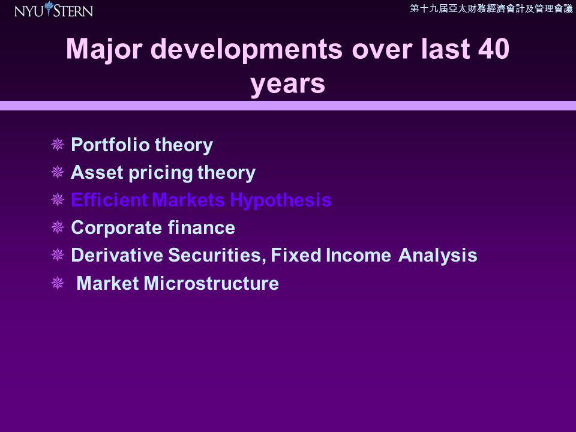

Fixed income trading is experiencing significant transformation with the implementation of algorithmic trading. This method utilizes automated trading instructions to execute orders with precision and speed, reshaping the landscape of financial markets. Algorithmic trading is particularly impactful in fixed income markets, which include a broad array of securities such as government and corporate bonds. These securities possess distinctive features and market dynamics that necessitate complex trading strategies.

The characteristics of fixed income securities demand sophisticated approaches due to their sensitivity to interest rates, credit risk, and liquidity factors. As a result, understanding the microstructure of fixed income markets is essential. These markets operate with unique mechanisms for price formation and trade execution, significantly distinct from equities markets. Algorithmic trading enhances these processes by improving efficiency and facilitating accurate price discovery.

This evolution of fixed income trading through algorithmic methodologies offers substantial benefits to both traders and investors. Algorithms are tailored to efficiently manage the myriad factors that influence fixed income trading, optimizing execution and minimizing costs. By leveraging these technologies, market participants are better equipped to achieve optimal trading outcomes.

In this article, we investigate the structural composition of fixed income algorithms and the advantages they provide. These insights will empower traders and investors to harness technology effectively within this evolving market framework. Understanding these developments is crucial for those seeking to maintain competitive advantage and capitalize on the integration of technology in financial trading.

## Table of Contents

## The Basics of Fixed Income Trading

Fixed income securities are a cornerstone of the financial markets, providing investors with returns through fixed periodic payments and the return of principal upon maturity. These instruments, which include government bonds, corporate bonds, and mortgage-backed securities, are utilized primarily to diversify portfolios and secure stable income streams. While similar in some respects to equity trading, the trading of fixed income securities presents unique challenges and opportunities due to distinct attributes.

**Interest Rate Sensitivity:** Fixed income securities are highly sensitive to interest rate changes. When interest rates rise, existing bonds with lower yields become less attractive, causing their prices to fall. Conversely, when interest rates decline, existing bonds with higher yields increase in value. This relationship underscores the importance of understanding yield curves and interest rate risk when dealing with fixed income securities.

**Credit Risk:** Another critical factor in fixed income trading is credit risk, the possibility that an issuer may default on payments. Credit ratings, provided by agencies like Moody's and Standard & Poor's, help investors assess this risk. Higher-rated securities typically offer lower yields due to their perceived safety, while lower-rated securities, or "junk bonds," offer higher yields to compensate for increased risk.

**Liquidity Concerns:** Fixed income markets can experience varying levels of liquidity. Government bonds, especially those issued by stable economies, are typically more liquid due to frequent trading and lower risk. In contrast, corporate bonds might encounter liquidity challenges, making it essential for traders to consider bid-ask spreads and market depth.

The key participants in the fixed income market encompass a diverse range of entities. Governments issue bonds to finance public spending, while corporations issue bonds to raise capital for expansion and operations. Investment funds, such as mutual funds and exchange-traded funds (ETFs), aggregate investors' capital to invest in a diversified portfolio of fixed income securities. Individual investors, seeking stable income or a conservative investment strategy, also actively participate in this market.

In summary, understanding the basics of fixed income trading is crucial for navigating its complexity. The inherent attributes like [interest rate](/wiki/interest-rate-trading-strategies) sensitivity, credit risk, and [liquidity](/wiki/liquidity-risk-premium) must be carefully considered. These factors, combined with the diverse array of market participants, shape the landscape of fixed income trading and underscore the necessity for informed decision-making and strategic planning.

## Market Microstructure of Fixed Income

Market microstructure focuses on the mechanics of how financial securities, including fixed income instruments, are traded. In fixed income markets, this involves a complex interplay of buyers, sellers, and intermediaries, each contributing to the overall trading ecosystem. Two primary market environments facilitate the trading of fixed income securities: over-the-counter (OTC) and exchange-traded platforms.

OTC markets are decentralized and less transparent than exchange-traded markets. In this setting, trades occur directly between parties, sometimes with the aid of intermediaries like brokers or dealers. The lack of a centralized exchange means that pricing information is not as readily available, which can lead to less price transparency and higher transaction costs than exchange-traded markets. However, the OTC market offers greater flexibility, as customized transactions can better accommodate the specific needs of market participants.

Exchange-traded platforms, in contrast, provide a centralized venue where fixed income securities can be traded in a more regulated and transparent environment. The presence of a central exchange enhances price discovery mechanisms since bid-ask prices are visible to all market participants, facilitating more efficient trading conditions. However, the rigid structures and standardized contracts common in these environments may not suit all investors' needs, particularly those requiring bespoke solutions.

Market makers and liquidity providers play pivotal roles in both OTC and exchange-traded markets. They ensure that buy and sell orders are matched efficiently, helping stabilize the market through continuous bid and offer quotations. By absorbing temporary imbalances of supply and demand, market makers contribute to price stability and liquidity, which are essential for efficient market functioning.

Several elements influence the microstructure of fixed income markets, including order flow, which refers to the sequence and [volume](/wiki/volume-trading-strategy) of buy and sell orders in the market. This order flow shapes the short-term price movements of securities. Pricing mechanisms are also critical, as they dictate how securities are valued and traded. In OTC markets, prices may be derived from negotiations between parties, while exchanges rely on transparent and competitive bidding systems.

Regulatory environments significantly impact market microstructure by enforcing rules that promote fair trading practices and mitigate systemic risk. Regulations may include requirements for trade reporting, transparency mandates, and capital requirements for market participants, all of which seek to foster a stable and efficient trading environment.

Understanding these facets of market microstructure is essential for grasping the efficiencies and challenges inherent in fixed income trading. The balance between transparency and flexibility, the critical role of intermediaries, and the impact of regulatory standards all shape the dynamics of trading fixed income securities, influencing the strategies and outcomes for market participants.

## Algorithmic Trading in Fixed Income Markets

Algorithmic trading has fundamentally transformed fixed income markets by enabling the rapid and precise execution of trades. These algorithms are crafted to enhance various trading strategies, including spread optimization, liquidity targeting, and managing interest rate risks. The role of these algorithms in fixed income trading cannot be overstated, as they bring a level of efficiency and accuracy that manual trading cannot match.

Execution algorithms are instrumental in optimizing order placement, ensuring that trades are carried out at the best possible prices while swiftly adapting to changing market conditions. They utilize real-time market data to determine the most advantageous times and platforms for trade execution, often resulting in significant cost savings. Pricing algorithms, on the other hand, are crucial for establishing competitive bid-ask spreads. By assessing numerous data points simultaneously, these algorithms can identify favorable pricing opportunities more quickly than traditional methods.

Machine learning and advanced analytics play a pivotal role in the development and refinement of these trading algorithms. These technologies enable predictive analytics and automated decision-making processes that continually learn and improve from historical data. For instance, [machine learning](/wiki/machine-learning) models can discern patterns and correlations in vast datasets that might be imperceptible to human traders, thereby informing more strategic trading decisions.

The strategic use of algorithms in fixed income markets significantly improves market efficiency and transparency. By continuously scanning markets and executing trades based on pre-set parameters, these systems minimize the time and cost associated with human intervention. Furthermore, the precision of [algorithmic trading](/wiki/algorithmic-trading) reduces the risk of errors, contributing to more stable market conditions and enhanced investor confidence.

In conclusion, the integration of algorithmic trading in fixed income markets represents a significant leap forward in trading methodologies, providing market participants with tools for achieving superior trading outcomes. As the technology driving these algorithms continues to advance, their importance and influence on fixed income trading are expected to grow even further.

## Challenges and Future Prospects

Fixed income algorithmic trading, despite its transformative benefits, encounters several significant challenges. Market fragmentation is a primary concern, resulting from a plethora of trading venues and platforms, each governed by distinct protocols and standards. This fragmentation can obstruct liquidity and impede efficient price discovery as orders get dispersed across various channels with differing levels of transparency and responsiveness. Traders may need to deploy sophisticated systems that can navigate and consolidate orders across these fragmented arenas to maintain execution efficiency.

Data quality is another critical issue. Algorithmic strategies are heavily reliant on accurate and high-frequency data feeds to execute trades effectively. Any latency or errors in data can lead to suboptimal trading decisions, potentially causing significant financial impacts. Ensuring that datasets are comprehensive and free from inconsistencies is essential for maintaining the reliability of algorithmic operations.

Regulatory constraints also challenge the adoption of algorithmic trading. Compliance with diverse regulatory standards across different jurisdictions demands significant resources from trading firms. Regulations like the MiFID II in Europe and Dodd-Frank in the U.S. impose stringent reporting and operational requirements that firms must continuously adhere to. These regulations aim to increase transparency and reduce systemic risks, but they also require ongoing adjustments to algorithmic practices to remain compliant.

As technology evolves, algorithm developers must adapt to changing market conditions and regulatory landscapes. Algorithms need continuous refinement and innovation to remain effective, incorporating advances in machine learning, data processing, and computational capabilities. Cybersecurity, in particular, is a growing concern as trading systems become more integrated and complex. Protecting these systems from cyber threats is crucial to safeguard sensitive financial data and maintain the integrity of trading operations.

Looking towards the future, the integration of [artificial intelligence](/wiki/ai-artificial-intelligence) (AI) and quantum computing holds promise for enhancing algorithmic trading strategies. AI can improve the prediction accuracy of market movements, adapt to dynamic conditions, and optimize execution strategies. Quantum computing, with its potential for exponential increases in processing power, could revolutionize data analysis and algorithmic complexity, enabling solutions to previously intractable problems.

These opportunities highlight the importance of developing robust infrastructures capable of supporting advanced computing technologies. Firms must invest in cutting-edge technology and maintain a proactive stance towards regulatory adjustments to harness the full potential of these innovations in algorithmic trading. This proactive approach will not only adapt to emerging challenges but also position market participants advantageously in the evolving landscape of fixed income trading.

## Conclusion

Algorithmic trading's integration into fixed income markets represents a transformative shift in financial trading, offering significant benefits such as increased efficiency, transparency, and speed in trade execution. Traders and investors who comprehend the complex structure of fixed income markets and the operational mechanisms of trading algorithms gain an edge in making informed decisions. As technology continues to progress, the role of algorithmic trading in these markets is set to expand further, fundamentally altering how trades are conducted and strategies are formulated.

A detailed understanding of fixed income market microstructure and algorithmic functionality empowers market participants to harness these innovations effectively. This knowledge facilitates not only enhanced trading strategies but also improved risk management practices, offering a competitive edge in a rapidly evolving marketplace. The seamless integration of finance and technology indicates that the future of fixed income trading holds vast potential, characterized by new opportunities for growth and innovation.

The trajectory of algorithmic trading suggests that it will increasingly shape fixed income markets, driving developments in areas such as artificial intelligence and machine learning. These advancements promise to refine trading strategies and improve market outcomes further. For market participants, a thorough grasp of these evolving technologies is essential to capitalize on the benefits they offer and to stay ahead in an increasingly competitive landscape. The promising future of fixed income trading lies in the continuous interplay between technological advancements and financial market dynamics, paving the way for exciting developments ahead.

## References & Further Reading

[1]: Harris, L. (2003). ["Trading and Exchanges: Market Microstructure for Practitioners."](https://www.amazon.com/Trading-Exchanges-Market-Microstructure-Practitioners/dp/0195144708) Oxford University Press.

[2]: Narang, R. P. (2009). ["Inside the Black Box: A Simple Guide to Quantitative and High-Frequency Trading."](https://onlinelibrary.wiley.com/doi/book/10.1002/9781118267738) Wiley.

[3]: Fabozzi, F. J., Modigliani, F., & Jones, F. J. (2016). ["Foundations of Financial Markets and Institutions."](https://www.amazon.com/Foundations-Financial-Markets-Institutions-International/dp/1292021772) Pearson.

[4]: Lopez de Prado, M. (2018). ["Advances in Financial Machine Learning."](https://www.amazon.com/Advances-Financial-Machine-Learning-Marcos/dp/1119482089) Wiley.

[5]: Treynor, J. L. (2008). ["What Does It Take to Win the Trading Game?"](https://onlinelibrary.wiley.com/doi/10.1002/9781119196679.ch37) Financial Analysts Journal.

[6]: Aldridge, I. (2013). ["High-Frequency Trading: A Practical Guide to Algorithmic Strategies and Trading Systems."](https://onlinelibrary.wiley.com/doi/pdf/10.1002/9781119203803.fmatter) Wiley.

[7]: Dodd, R., & Mills, P. (2008). ["Outlook for Algorithmic Trading."](https://www.imf.org/external/pubs/ft/fandd/2008/06/dodd.htm) International Monetary Fund.

[8]: Hasbrouck, J. (2007). ["Empirical Market Microstructure: The Institutions, Economics, and Econometrics of Securities Trading."](https://academic.oup.com/book/52241) Oxford University Press.