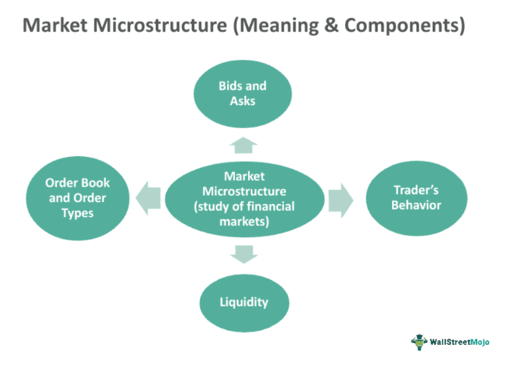

## Table of Contents

## What is fixed income microstructure?

Fixed income microstructure refers to the detailed mechanics and processes involved in trading bonds and other fixed income securities. It looks at how these securities are bought and sold, including the roles of different market participants like dealers, brokers, and investors. It also examines the impact of market structure, such as trading platforms and regulations, on the efficiency and liquidity of fixed income markets.

Understanding fixed income microstructure is important because it helps investors and policymakers see how trades happen and how prices are set. For example, it can show why some bonds are easier to buy or sell than others, or why prices might change quickly. By studying these details, people can make better decisions about when and how to trade, and regulators can work to improve how the market functions.

## Why is fixed income microstructure important for investors?

Fixed income microstructure is important for investors because it helps them understand how bond markets work. By knowing the details of how bonds are traded, investors can make better choices about when to buy or sell. For example, understanding how dealers set prices can help investors get a better deal. Also, knowing about the different trading platforms can help investors find the best place to trade their bonds.

Another reason fixed income microstructure matters is that it affects how easy or hard it is to buy or sell bonds. This is called [liquidity](/wiki/liquidity-risk-premium). If the market is easy to trade in, investors can quickly buy or sell without big changes in price. But if the market is hard to trade in, it might be tough to sell bonds when you need to, and prices might move a lot. By understanding microstructure, investors can pick the right times and places to trade, which can help them make more money or lose less.

## How does the microstructure of fixed income markets differ from equity markets?

The microstructure of fixed income markets is different from equity markets in several ways. One big difference is how they trade. Fixed income markets often use over-the-counter (OTC) trading, where dealers buy and sell bonds directly with each other or with investors. This means there's no central place like a stock exchange where all trades happen. On the other hand, equity markets usually trade on big stock exchanges, like the New York Stock Exchange, where all trades go through the same place. This makes equity markets more transparent because everyone can see the prices and trades.

Another difference is in the types of securities and how they're priced. Fixed income securities, like bonds, have a lot of variety. Each bond can be different, with its own [interest rate](/wiki/interest-rate-trading-strategies), maturity date, and credit risk. This makes it harder to compare prices and find the best deal. In contrast, equity markets deal with stocks, which are more standardized. Stocks of the same company are all the same, so it's easier to see and compare prices. Also, fixed income markets can be less liquid, meaning it can be harder to buy or sell bonds quickly without affecting the price. Equity markets usually have more liquidity because there are more traders and more trading happening all the time.

## What are the main components of fixed income microstructure?

The main components of fixed income microstructure include the participants in the market, the trading mechanisms, and the impact of regulations. Market participants like dealers, brokers, and investors all play different roles. Dealers buy and sell bonds, often holding an inventory to make trading easier. Brokers help connect buyers and sellers without taking on the risk of holding bonds themselves. Investors, from big institutions to individual people, are the ones buying and selling bonds to meet their financial goals. Understanding who these players are and how they interact helps explain how the market works.

Trading mechanisms are another key part of fixed income microstructure. Most fixed income trading happens over-the-counter (OTC), meaning trades are done directly between two parties without a central exchange. This can make the market less transparent because not all trades are visible to everyone. Electronic trading platforms have become more common, helping to make trading faster and easier. But even with these platforms, the OTC nature of fixed income markets means that finding the best price can be tricky. Regulations also shape the microstructure by setting rules on how trading can happen, who can trade, and what information needs to be shared. These rules can affect how easy or hard it is to buy and sell bonds, and how much it costs to trade.

## How do liquidity and transaction costs impact fixed income microstructure?

Liquidity and transaction costs play a big role in how the fixed income market works. Liquidity means how easy it is to buy or sell a bond without changing its price too much. If a bond is very liquid, you can trade it quickly and easily. But if it's not liquid, it can be hard to sell, and you might have to accept a lower price. This affects the whole market because people might not want to buy bonds that are hard to sell later. Liquidity can change based on things like how many people are trading, the size of the bond market, and even the time of day.

Transaction costs are the fees and other expenses you pay when you trade a bond. These costs can make a big difference in how much money you make or lose. In the fixed income market, these costs can come from dealers who charge more to cover their own costs and risks, or from the fees charged by trading platforms. High transaction costs can make people trade less because it's more expensive to buy and sell. This can make the market less liquid, creating a cycle where high costs lead to less trading, which then makes it even harder to trade. Understanding these costs helps investors pick the best times and places to trade, which can save them money.

## What role do dealers play in the fixed income market microstructure?

Dealers are very important in the fixed income market. They buy and sell bonds directly with other dealers or with investors. This is different from stock markets where trading happens on a central exchange. Because fixed income trading often happens over-the-counter (OTC), dealers help make the market work smoothly. They keep an inventory of bonds, which means they hold bonds in case someone wants to buy them. This makes it easier for people to trade because they can go to a dealer instead of having to find someone else who wants to sell.

Dealers also help set prices in the fixed income market. When they buy and sell bonds, they add a little extra to the price to cover their costs and make a profit. This is called the bid-ask spread. The spread can affect how much it costs to trade and can make the market less liquid if it's too big. Dealers also provide information about bond prices and help keep the market running, even when there aren't a lot of trades happening. By doing all these things, dealers play a big role in making the fixed income market work well.

## How have electronic trading platforms affected fixed income microstructure?

Electronic trading platforms have changed the way the fixed income market works. Before, most trading happened over the phone or in person. Now, with electronic platforms, people can trade bonds quickly and easily online. This has made the market more efficient because it's faster to find someone to trade with. It also helps make the market more transparent because more people can see the prices and trades happening. This can help investors get better deals and make smarter choices about when to buy or sell.

But electronic platforms have also brought some challenges. For example, because trading is now so fast, prices can change very quickly. This can make the market more volatile, which means prices can go up and down a lot. Also, while electronic platforms have made some parts of the market more liquid, not all bonds are easy to trade online. Some bonds are still hard to buy and sell, especially if they're not very common. So, while electronic trading has helped in many ways, it hasn't solved all the problems in the fixed income market.

## What are the challenges in modeling fixed income microstructure?

Modeling fixed income microstructure can be tough because of how complex and different each bond is. Unlike stocks, which are pretty much the same for each company, bonds can have different interest rates, maturity dates, and credit risks. This makes it hard to come up with one model that works for all bonds. Also, because most bond trading happens over-the-counter instead of on a big exchange, it's harder to get good data on all the trades. This means that models might not have all the information they need to work well.

Another challenge is that the fixed income market can change a lot. Things like new rules from the government, changes in how much people want to buy or sell bonds, and new technology can all affect how the market works. This means that models need to be updated a lot to stay useful. Plus, because the market can be hard to predict, models might not always get it right. This makes it important for people using these models to understand their limits and not rely on them too much.

## How does market fragmentation influence fixed income microstructure?

Market fragmentation means that the fixed income market is split into many different parts. Instead of one big place where everyone trades, there are lots of smaller places. This can make it harder for people to find the best price for a bond because they have to look in many different places. It can also make the market less liquid because it's harder to buy and sell bonds quickly when trades are spread out.

But market fragmentation isn't all bad. It can give people more choices about where to trade, which can help them find better deals. Some places might have lower fees or better technology, which can make trading easier. So while it can make things more complicated, it can also help the market work better in some ways.

## What advanced techniques are used to analyze fixed income microstructure data?

To understand how the fixed income market works, people use advanced techniques to look at the data. One way is using [machine learning](/wiki/machine-learning). This is when computers learn from the data to find patterns and make predictions. For example, machine learning can help figure out how prices change or how easy it is to buy and sell bonds. Another technique is called high-frequency trading data analysis. This looks at trades that happen very quickly, often in milliseconds. By studying this data, people can see how the market reacts to new information and how trading strategies work.

Another important technique is network analysis. This helps see how different people in the market are connected. It can show how dealers and investors interact and how information moves around. This can be useful for understanding how the market works and spotting risks. Also, people use econometric models to study things like how prices are set and how much it costs to trade. These models use math to make sense of the data and can help predict what might happen in the future. By using these advanced techniques, people can get a better picture of the fixed income market and make smarter choices.

## How do regulatory changes impact the microstructure of fixed income markets?

Regulatory changes can have a big impact on how the fixed income market works. When the government makes new rules, it can change who can trade, how they can trade, and what information they need to share. For example, if new rules make it harder for dealers to trade, it might make the market less liquid because there are fewer people buying and selling bonds. Also, if the rules make trading more expensive, it can affect how much it costs to buy and sell bonds. This can make people trade less, which can make the market even less liquid.

On the other hand, some regulatory changes can help make the market better. For example, rules that make trading more transparent can help people see prices and trades more easily. This can make it easier to find the best deals and can make the market more fair. But it's not always easy to predict how new rules will affect the market. Sometimes, changes can have unexpected effects, like making some parts of the market harder to trade in. So, it's important for people in the market to keep an eye on new rules and understand how they might change things.

## What are the future trends and developments expected in fixed income microstructure?

In the future, we might see more technology being used in the fixed income market. Electronic trading platforms are already making a big difference, and they could become even more important. This could make trading faster and easier, but it might also make the market more complicated. People are also starting to use things like [artificial intelligence](/wiki/ai-artificial-intelligence) and machine learning to understand the market better. These tools can help find patterns in the data and make better predictions about what might happen next.

Another trend could be more rules and regulations. Governments around the world are trying to make the market safer and more fair. This might mean new rules about who can trade, how they can trade, and what information they need to share. These changes can make the market more transparent, but they might also make trading more expensive or harder in some ways. It's important for people in the market to keep up with these changes and understand how they might affect things.

Overall, the fixed income market is likely to keep changing as new technology and rules come into play. People will need to stay on top of these trends to make the best choices about when and how to trade. By understanding these future developments, investors and dealers can be better prepared for what's coming next.

## References & Further Reading

[1]: Harris, L. (2003). ["Trading and Exchanges: Market Microstructure for Practitioners."](https://www.amazon.com/Trading-Exchanges-Market-Microstructure-Practitioners/dp/0195144708) Oxford University Press.

[2]: Narang, R. P. (2009). ["Inside the Black Box: A Simple Guide to Quantitative and High-Frequency Trading."](https://onlinelibrary.wiley.com/doi/book/10.1002/9781118267738) Wiley.

[3]: Fabozzi, F. J., Modigliani, F., & Jones, F. J. (2016). ["Foundations of Financial Markets and Institutions."](https://www.amazon.com/Foundations-Financial-Markets-Institutions-International/dp/1292021772) Pearson.

[4]: Lopez de Prado, M. (2018). ["Advances in Financial Machine Learning."](https://www.amazon.com/Advances-Financial-Machine-Learning-Marcos/dp/1119482089) Wiley.

[5]: Treynor, J. L. (2008). ["What Does It Take to Win the Trading Game?"](https://onlinelibrary.wiley.com/doi/10.1002/9781119196679.ch37) Financial Analysts Journal.

[6]: Aldridge, I. (2013). ["High-Frequency Trading: A Practical Guide to Algorithmic Strategies and Trading Systems."](https://onlinelibrary.wiley.com/doi/pdf/10.1002/9781119203803.fmatter) Wiley.

[7]: Dodd, R., & Mills, P. (2008). ["Outlook for Algorithmic Trading."](https://www.imf.org/external/pubs/ft/fandd/2008/06/dodd.htm) International Monetary Fund.

[8]: Hasbrouck, J. (2007). ["Empirical Market Microstructure: The Institutions, Economics, and Econometrics of Securities Trading."](https://academic.oup.com/book/52241) Oxford University Press.