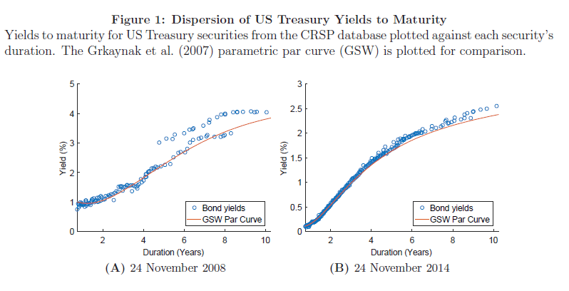

## Table of Contents

## What is fixed-income relative-value investing?

Fixed-income relative-value investing is a strategy where investors try to find the best value among different fixed-income securities, like bonds. Instead of just picking one bond, they compare many bonds to see which ones offer a better return for the risk involved. The goal is to find bonds that are undervalued or overpriced compared to others, and then buy the undervalued ones or sell the overpriced ones.

This approach involves looking at many factors, such as interest rates, credit ratings, and how long the bond will take to mature. By carefully comparing these factors, investors can make smarter choices about which bonds to buy or sell. It's like shopping for the best deals, but instead of buying groceries, you're buying bonds to make the most out of your investment.

## How does fixed-income relative-value investing differ from other investment strategies?

Fixed-income relative-value investing is different from other investment strategies because it focuses on comparing different bonds to find the best value. Instead of just buying one type of bond, like a government bond, investors look at many bonds to see which ones are a better deal. They might find that one bond is undervalued, meaning it's cheaper than it should be, or another bond is overpriced, meaning it's more expensive than it should be. This strategy involves a lot of analysis and comparison, looking at things like interest rates, credit ratings, and how long the bond will last.

Other investment strategies might focus on different things. For example, some investors might use a buy-and-hold strategy, where they buy bonds and keep them until they mature, without worrying too much about comparing them to other bonds. Another strategy could be income investing, where the main goal is to get regular interest payments from bonds, and the investor might not care as much about the bond's value compared to others. Fixed-income relative-value investing is unique because it's all about finding the best value through careful comparison, rather than just holding onto bonds or focusing on income.

## What are the main types of fixed-income securities involved in relative-value investing?

In fixed-income relative-value investing, the main types of securities involved are government bonds, corporate bonds, and mortgage-backed securities. Government bonds are issued by governments and are considered very safe because they are backed by the government's ability to pay. Corporate bonds are issued by companies and can vary in risk depending on the company's financial health. Mortgage-backed securities are made up of home loans bundled together, and their risk can depend on how likely homeowners are to pay back their loans.

When investors use relative-value investing, they compare these different types of bonds to find the best deals. For example, they might look at a government bond and a corporate bond with similar interest rates and decide that the corporate bond is a better value because it offers a higher return for a little more risk. They might also compare different corporate bonds to see which company's bond is undervalued. By looking at all these different securities and comparing them, investors try to find the best opportunities to make more money.

## What are the key factors to consider when analyzing fixed-income securities for relative value?

When analyzing fixed-income securities for relative value, one of the main things to look at is the interest rate, or yield, that the bond offers. A bond with a higher yield might seem like a better deal, but you also have to think about the risk. Bonds with higher yields often come with more risk, like the chance that the company issuing the bond might not be able to pay it back. So, it's important to compare the yield to the risk and see if the bond is a good value compared to other bonds with similar risks.

Another key factor is the bond's credit rating, which tells you how safe the bond is. A bond with a high credit rating is seen as safer, but it might offer a lower yield. On the other hand, a bond with a lower credit rating might offer a higher yield, but it's riskier. Investors need to compare the credit ratings of different bonds to see which ones are undervalued or overvalued. They also need to think about how long it will take for the bond to mature, because longer-term bonds can be riskier but might offer higher yields.

Finally, the overall market conditions and economic factors play a big role in relative-value investing. Interest rates set by central banks can affect the value of bonds, and changes in the economy can make some bonds more or less attractive. By looking at all these factors together, investors can get a better sense of which bonds offer the best value and make smarter investment choices.

## How can an investor identify mispriced securities in the fixed-income market?

To identify mispriced securities in the fixed-income market, an investor needs to compare different bonds and look for ones that seem to offer a better deal than others. This means checking the yield, or interest rate, of each bond and seeing if it's higher or lower than what you would expect for the level of risk involved. For example, if a bond from a company with a good credit rating offers a high yield, it might be undervalued because it's giving you more return for less risk than other similar bonds. On the other hand, if a bond with a low credit rating has a low yield, it might be overvalued because it's not giving you enough return for the risk you're taking.

Another way to spot mispriced securities is by looking at the bond's credit rating and comparing it to other bonds with similar ratings. If a bond has a lower yield than other bonds with the same credit rating, it could be overvalued. But if it has a higher yield, it might be undervalued. Investors also need to think about how long it will take for the bond to mature, because longer-term bonds can be riskier but might offer higher yields. By carefully comparing all these factors, investors can find bonds that are priced differently than they should be, based on their risk and return.

Market conditions and economic factors also play a big role in identifying mispriced securities. For instance, if interest rates are expected to go up, bonds with longer maturities might be seen as riskier and could be undervalued. On the other hand, if the economy is doing well, bonds from companies in strong industries might be overvalued because everyone wants to buy them. By keeping an eye on these broader trends, investors can get a better sense of which bonds are mispriced and make smarter investment choices.

## What role do interest rates play in fixed-income relative-value investing?

Interest rates are really important in fixed-income relative-value investing because they affect how much money, or yield, a bond gives you. When interest rates go up, new bonds usually offer higher yields to attract buyers. This can make older bonds with lower yields less attractive, causing their prices to drop. On the other hand, when interest rates go down, new bonds have lower yields, which can make older bonds with higher yields more valuable, pushing their prices up. So, investors need to keep an eye on interest rates to see if a bond's yield is a good deal compared to others.

By comparing the yields of different bonds, investors can find ones that are undervalued or overvalued. For example, if a bond's yield is higher than similar bonds because interest rates have gone up, it might be a good buy if the investor thinks rates will stay the same or go down. But if interest rates are expected to keep going up, that bond might not be such a good deal. So, understanding how interest rates work and how they might change in the future helps investors make smarter choices about which bonds to buy or sell to get the best value.

## What are some common strategies used in fixed-income relative-value investing?

In fixed-income relative-value investing, one common strategy is yield curve trading. This involves looking at how the yields of bonds change over different lengths of time, or maturities. Investors might buy short-term bonds and sell long-term bonds if they think short-term interest rates will go up more than long-term rates. Or, they might do the opposite if they think long-term rates will go up more. By comparing the yields across the curve, they try to find the best value and make money from the differences in how bond prices move.

Another strategy is credit spread trading, where investors compare bonds with different credit ratings. They might buy bonds from companies with lower credit ratings and sell bonds from companies with higher ratings if they think the difference in yields, or the credit spread, will get smaller. This can happen if the market thinks the risk of the lower-rated bonds is going down. On the other hand, if they think the credit spread will get bigger, they might do the opposite. By carefully looking at the credit ratings and how they affect bond prices, investors try to find undervalued or overvalued bonds and make money from the changes in these spreads.

A third strategy is sector rotation, where investors move their money between different parts of the bond market, like government bonds, corporate bonds, or mortgage-backed securities. They might move into sectors they think will do better because of changes in the economy or interest rates. For example, if they think the economy is getting better, they might buy more corporate bonds because companies are likely to do well. But if they think the economy is getting worse, they might move into safer government bonds. By shifting their investments based on what's happening in the market, they try to find the best value and make the most out of their investments.

## How can an investor use yield curve analysis in fixed-income relative-value investing?

Yield curve analysis is a key part of fixed-income relative-value investing because it helps investors see how the yields of bonds change over different lengths of time. When you look at the yield curve, you're looking at a line that shows the yields of bonds with different maturities. If the line is going up, it means longer-term bonds have higher yields than shorter-term bonds. Investors can use this to find the best value by comparing bonds with different maturities. For example, if they think short-term interest rates will go up more than long-term rates, they might buy short-term bonds and sell long-term bonds to make money from the difference in how their prices move.

Another way to use yield curve analysis is to look for changes in the shape of the yield curve. If the yield curve is getting steeper, it means the difference between short-term and long-term yields is getting bigger. This might happen if people think the economy is going to do well, so they want higher yields for long-term bonds. On the other hand, if the yield curve is getting flatter, it means the difference is getting smaller, which might happen if people think the economy is going to slow down. By watching these changes and comparing the yields of different bonds, investors can find ones that are undervalued or overvalued and make smarter choices about which bonds to buy or sell.

## What are the risks associated with fixed-income relative-value investing?

Fixed-income relative-value investing comes with some risks. One big risk is interest rate risk. This means that if interest rates change, the value of the bonds you own can go up or down. If rates go up, the price of your bonds might drop because new bonds will offer higher yields. If rates go down, the price of your bonds might go up, but you could miss out on better deals from new bonds with higher yields. Another risk is credit risk, which is the chance that the company or government that issued the bond might not be able to pay you back. If a company's financial health gets worse, the value of its bonds can drop a lot.

There's also market risk, which means the whole bond market might go down because of things like changes in the economy or big events in the world. This can affect all your bonds, even if you picked them carefully. Another risk is liquidity risk, which means you might not be able to sell your bonds quickly or at a good price if you need to. If fewer people want to buy the bonds you're selling, you might have to sell them for less than you wanted. All these risks mean that even though you're trying to find the best value, things can still go wrong and affect your investments.

## How can advanced quantitative models enhance fixed-income relative-value investing strategies?

Advanced quantitative models can really help with fixed-income relative-value investing by making it easier to find the best deals on bonds. These models use math and computers to look at a lot of information about bonds, like their interest rates, how long they last, and how risky they are. By using these models, investors can compare many bonds at once and see which ones are undervalued or overvalued. For example, a model might show that a bond from one company is a better buy than a similar bond from another company because it offers a higher return for the same level of risk. This helps investors make smarter choices and find the best value in the bond market.

These models also help investors understand how different things, like changes in interest rates or the economy, might affect the value of bonds. They can run different scenarios to see what might happen if interest rates go up or down, or if the economy gets better or worse. This helps investors plan ahead and make better decisions about which bonds to buy or sell. By using these advanced models, investors can get a clearer picture of the bond market and make more informed choices, which can lead to better returns on their investments.

## What are the latest trends and innovations in fixed-income relative-value investing?

One of the latest trends in fixed-income relative-value investing is the use of [artificial intelligence](/wiki/ai-artificial-intelligence) (AI) and [machine learning](/wiki/machine-learning). These technologies help investors look at huge amounts of data quickly and find patterns that might be hard to see otherwise. For example, AI can help spot when a bond might be undervalued or overvalued by looking at things like interest rates, credit ratings, and economic news. This can make it easier for investors to find the best deals and make smarter choices about which bonds to buy or sell. As AI gets better, more and more investors are using it to improve their relative-value investing strategies.

Another big trend is the focus on environmental, social, and governance ([ESG](/wiki/esg-investing)) factors. More investors are looking at how companies handle things like climate change, fair labor practices, and good management when they choose bonds. This means they might pick bonds from companies that are doing well in these areas, even if the yield is a bit lower, because they think these companies will be safer and more successful in the long run. Innovations in data analysis and reporting are making it easier to see how well companies are doing on ESG issues, so investors can use this information to find the best value in the bond market.

## How do macroeconomic factors influence fixed-income relative-value investment decisions?

Macroeconomic factors like interest rates, inflation, and economic growth play a big role in fixed-income relative-value investing. When interest rates change, the value of bonds goes up or down. If interest rates go up, new bonds will offer higher yields, making older bonds with lower yields less attractive, so their prices drop. On the other hand, if rates go down, older bonds with higher yields become more valuable, and their prices go up. Inflation also matters because it affects how much money a bond's interest payments are worth over time. If inflation is high, the real value of the interest you get from a bond goes down, which can make some bonds less appealing.

Economic growth is another important factor. When the economy is doing well, companies are likely to do better, so bonds from these companies might be seen as safer and more valuable. But if the economy is slowing down, people might worry about companies not being able to pay back their bonds, which can make these bonds riskier and less attractive. By keeping an eye on these macroeconomic factors, investors can make better choices about which bonds to buy or sell. They can compare different bonds and see which ones offer the best value based on what's happening in the economy.

## What is Understanding Fixed-Income Relative-Value Investing?

Fixed-Income Relative-Value Investing (FI-RV) is a sophisticated investment approach focusing on identifying and capitalizing on price discrepancies between fixed-income securities. Unlike traditional investing, which often involves taking directional bets on markets, FI-RV seeks to exploit valuation inefficiencies between related financial instruments, typically involving government bonds, [interest rate](/wiki/interest-rate-trading-strategies) swaps, and futures contracts. These strategies are grounded in the expectation that temporary mispricings will eventually revert to their fair value, thus allowing investors to capture profits with minimal exposure to broader market movements.

Key markets for FI-RV investments include the government bond market, where securities issued by governments are traded. These bonds serve as a foundation for many relative-value strategies due to their [liquidity](/wiki/liquidity-risk-premium) and established creditworthiness. Interest rate swaps are another vital instrument, representing agreements between two parties to exchange interest rate cash flows. Swaps allow investors to manage risk and adjust their exposure to interest rate movements without disrupting their bond holdings. Futures contracts come into play as agreements to buy or sell a bond at a predetermined price on a future date. Futures are particularly useful for hedge strategies and enhancing leverage, given their standardized nature and high liquidity.

Opportunities in FI-RV often arise from inefficiencies and market dynamics that disrupt the relative pricing of fixed-income instruments. These inefficiencies can result from [factor](/wiki/factor-investing)s such as market segmentation, regulatory constraints, or behavioral biases among market participants. For instance, disparities in yield spreads due to credit risk perceptions, taxation differences, or supply-demand imbalances present valuable avenues for relative-value investors. Additionally, non-economic factors, including central bank policies or fiscal interventions, can cause temporary pricing distortions, creating chances for profit.

Mathematically, FI-RV strategies may involve analyzing yield curves, which plot the interest rates of bonds with equal credit quality but differing maturities. Investors look for anomalies, such as kinks or odd shapes in the curve, to identify mispriced securities. A key concept is the spread, calculated as:

$$
\text{Spread} = \text{Yield Bond A} - \text{Yield Bond B}
$$

A relative-value trade might seek to profit from spreads anticipated to narrow, capturing the differential as it normalizes. Through quantitative models, investors analyze historical and current data, applying statistical techniques to ascertain the likelihood of price convergence, thereby formulating strategies to exploit these pricing anomalies effectively.

## References & Further Reading

[1]: Lowenstein, R. (2000). ["When Genius Failed: The Rise and Fall of Long-Term Capital Management."](https://archive.org/details/whengeniusfailed00lowe) Random House.

[2]: Lopez de Prado, M. (2018). ["Advances in Financial Machine Learning."](https://www.amazon.com/Advances-Financial-Machine-Learning-Marcos/dp/1119482089) John Wiley & Sons.

[3]: Jansen, S. (2020). ["Machine Learning for Algorithmic Trading: Predictive models to extract signals from market and alternative data for systematic trading strategies with Python."](https://www.amazon.com/Machine-Learning-Algorithmic-Trading-alternative/dp/1839217715) Packt Publishing.

[4]: Chan, E. P. (2008). ["Quantitative Trading: How to Build Your Own Algorithmic Trading Business."](https://github.com/ftvision/quant_trading_echan_book) John Wiley & Sons.

[5]: Fabozzi, F. J., & Mann, S. V. (2011). ["Handbook of Fixed-Income Securities."](https://www.mhebooklibrary.com/doi/book/10.1036/9781260473902?contentTab=true) McGraw-Hill Professional.

[6]: Chincarini, L. B., & Kim, D. (2006). ["Quantitative Equity Portfolio Management: An Active Approach to Portfolio Construction and Management."](https://www.amazon.com/Quantitative-Equity-Portfolio-Management-Construction/dp/0071459391) McGraw-Hill.