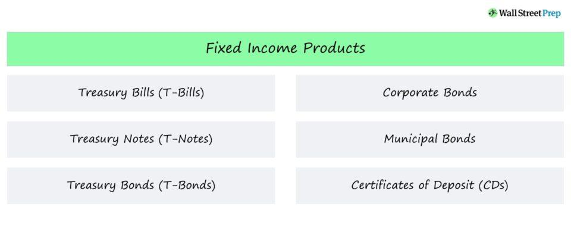

## Table of Contents

## What are fixed-income securities?

Fixed-income securities are investments that provide a steady stream of income to investors, usually in the form of regular interest payments. These securities are called "fixed-income" because they typically offer a fixed interest rate over the life of the investment. Common examples include government and corporate bonds, where an investor loans money to the issuer in exchange for interest payments and the return of the principal amount at the end of the bond's term.

These securities are popular among investors looking for a more predictable income stream, especially those who are retired or nearing retirement. They are generally considered less risky than stocks because the payments and the return of principal are more predictable. However, they are not without risk; for instance, if interest rates rise, the value of existing bonds with lower rates may decrease. Despite this, fixed-income securities play a crucial role in diversifying an investment portfolio and providing stability.

## What are the main types of fixed-income securities?

Fixed-income securities come in different forms, but the most common ones are bonds and money market instruments. Bonds are like IOUs where you lend money to a government or a company. In return, they promise to pay you back the money you lent them, plus interest, over a certain period. There are government bonds, which are issued by national governments, and corporate bonds, which are issued by companies. Government bonds are usually seen as safer because governments are less likely to go bankrupt than companies.

Another type of fixed-income security is money market instruments. These are short-term investments that usually last less than a year. Examples include Treasury bills, which are issued by the government, and commercial paper, which is issued by companies. Money market instruments are considered very safe and are used by investors who want to keep their money safe while earning a small amount of interest.

Lastly, there are also mortgage-backed securities and asset-backed securities. These are a bit more complex. Mortgage-backed securities are created when banks pool together home loans and sell them to investors. Asset-backed securities work similarly but are backed by other types of assets, like car loans or credit card debt. These securities can offer higher returns but also come with more risk.

## How do bonds work as a type of fixed-income security?

Bonds are a type of fixed-income security where you lend money to a government or a company. When you buy a bond, you're giving them money, and in return, they promise to pay you back that money after a certain time, which is called the bond's maturity date. They also pay you interest regularly, usually every six months, until the bond matures. This interest is called the coupon, and it's a fixed amount based on the bond's face value and its interest rate.

For example, if you buy a $1,000 bond with a 5% annual interest rate, you'll get $50 every year, usually in two payments of $25 every six months. When the bond reaches its maturity date, you get your $1,000 back. Bonds are popular because they provide a steady income and are generally safer than stocks. However, if you need to sell your bond before it matures and interest rates have gone up, you might get less than what you paid for it because new bonds would be paying more interest.

## What are the differences between government and corporate bonds?

Government bonds and corporate bonds are both types of fixed-income securities, but they come from different places. Government bonds are issued by governments, like the U.S. government or other countries. They are generally seen as safer because governments are less likely to go bankrupt and not pay back the money. These bonds help governments raise money to pay for things like roads, schools, and other public projects. The interest rates on government bonds are usually lower because they are safer.

Corporate bonds, on the other hand, are issued by companies. These bonds help companies raise money to grow their business or pay for other big expenses. Because companies can go bankrupt, corporate bonds are riskier than government bonds. To make up for this higher risk, corporate bonds usually offer higher interest rates. This means you can earn more money with corporate bonds, but there's also a bigger chance you might not get your money back if the company fails.

## Can you explain what Treasury securities are and their types?

Treasury securities are types of government bonds issued by the U.S. Department of the Treasury. They are considered very safe because they are backed by the full faith and credit of the U.S. government. This means the government promises to pay back the money you lend them, plus interest. Treasury securities are popular among investors who want a safe place to put their money and get a steady income.

There are three main types of Treasury securities: Treasury bills, Treasury notes, and Treasury bonds. Treasury bills, or T-bills, are short-term securities that mature in a few days to a year. They don't pay interest in the traditional sense; instead, you buy them at a discount and get the full face value when they mature. Treasury notes, or T-notes, are medium-term securities that mature in 2 to 10 years. They pay interest every six months. Treasury bonds, or T-bonds, are long-term securities that mature in 20 to 30 years. Like T-notes, they also pay interest every six months.

## What are municipal bonds and why might investors choose them?

Municipal bonds, or "munis," are bonds issued by local governments, like cities or states, to raise money for public projects like schools, roads, or hospitals. When you buy a municipal bond, you're lending money to that local government, and they promise to pay you back with interest. These bonds are popular because they are usually very safe, especially if the local government is stable and has a good credit rating. Another big reason people like them is that the interest you earn is often free from federal income tax, and sometimes from state and local taxes too, if you live in the state that issued the bond.

Investors might choose municipal bonds for a few reasons. First, they want a safe place to put their money and get a steady income. Second, the tax benefits can make them a good deal, especially for people in higher tax brackets. If you don't have to pay taxes on the interest you earn, it's like getting a higher return on your investment. So, even though the interest rate on municipal bonds might be lower than other bonds, the tax savings can make them more attractive.

## How do mortgage-backed securities function and what risks do they carry?

Mortgage-backed securities (MBS) are a type of investment where banks take a bunch of home loans and bundle them together to sell to investors. When you buy an MBS, you're not lending money directly to homeowners, but you're buying a piece of all those loans. The money you get back comes from the monthly mortgage payments that homeowners make. These payments include both the interest and the part of the loan that's being paid off, called the principal. The idea is that by spreading the risk across many loans, it's safer than if you just lent money to one person.

However, MBS can be risky. One big risk is that if a lot of homeowners stop making their mortgage payments, like during a housing crisis, the value of the MBS can drop a lot. This is called default risk. Another risk is interest rate risk. If interest rates go up, the value of the MBS can go down because new loans will offer higher interest rates, making the older loans in the MBS less attractive. Also, because MBS can be complex, there's a risk that investors might not fully understand what they're buying, which can lead to bad investment decisions.

## What are asset-backed securities and what assets typically back them?

Asset-backed securities (ABS) are investments where a bunch of loans or other types of debt are put together and sold to investors. When you buy an ABS, you're not lending money directly to the people who took out the loans, but you're buying a piece of all those loans. The money you get back comes from the payments that the borrowers make on their loans. This can include things like car loans, credit card debt, or student loans. The idea is that by spreading the risk across many loans, it's safer than if you just lent money to one person.

However, asset-backed securities can be risky. If a lot of people stop making their payments, like if there's an economic downturn, the value of the ABS can drop a lot. This is called default risk. Another risk is interest rate risk. If interest rates go up, the value of the ABS can go down because new loans will offer higher interest rates, making the older loans in the ABS less attractive. Also, because ABS can be complex, there's a risk that investors might not fully understand what they're buying, which can lead to bad investment decisions.

## How do high-yield bonds differ from investment-grade bonds?

High-yield bonds and investment-grade bonds are both types of corporate bonds, but they are different in how safe they are and how much money they pay. High-yield bonds, also called junk bonds, are from companies that might have a harder time paying back the money they borrowed. Because they are riskier, these bonds pay more interest to make up for the chance that the company might not pay back the loan. People who buy high-yield bonds are usually looking for a bigger return and are okay with taking more risk.

On the other hand, investment-grade bonds are from companies that are seen as more reliable and less likely to go bankrupt. These bonds are safer, so they pay less interest. Investors who buy investment-grade bonds are usually looking for a steady income and want to keep their money safe. The difference between these two types of bonds is important for investors to think about when they are deciding where to put their money.

## What role do fixed-income securities play in portfolio diversification?

Fixed-income securities are important for making your investment portfolio more diverse. When you have different types of investments, like stocks and bonds, it helps spread out the risk. If one type of investment goes down in value, the others might not, which can protect your money. Fixed-income securities, like bonds, usually don't go up and down as much as stocks. This means they can help keep your portfolio more stable, especially when the stock market is having a rough time.

Adding fixed-income securities to your portfolio can also give you a steady income. Bonds pay interest regularly, which can be helpful if you need money coming in every month. This is different from stocks, where you might get money from selling them at a higher price or from dividends, but it's not as predictable. By having both stocks and fixed-income securities, you can balance the risk and reward in your investments, making your portfolio safer and more likely to grow over time.

## How can interest rate changes affect the value of fixed-income securities?

When interest rates change, it can affect the value of fixed-income securities like bonds. If interest rates go up, new bonds that are issued will have higher interest rates. This makes the older bonds, which have lower interest rates, less attractive to investors. As a result, the value of these older bonds goes down because people are willing to pay less for them. On the other hand, if you already own a bond with a fixed interest rate and interest rates go up, you're stuck with the lower rate, which means you're not getting as good a deal as you could with new bonds.

However, if interest rates go down, the opposite happens. The older bonds with higher interest rates become more valuable because they pay more than the new bonds being issued. This means the value of your existing bonds goes up because people are willing to pay more for them. If you're holding onto a bond and interest rates drop, you're in a good position because you're getting a higher interest rate than what's available on new bonds. This is why interest rate changes are important to keep an eye on if you're investing in fixed-income securities.

## What advanced strategies can investors use with fixed-income securities to optimize returns?

One advanced strategy investors can use with fixed-income securities is called bond laddering. This means buying bonds that mature at different times. For example, you might buy some bonds that mature in one year, some in two years, and some in three years. When the one-year bonds mature, you can take that money and buy new bonds. This way, you can take advantage of changes in interest rates. If rates go up, you can buy new bonds with higher rates. If rates go down, you still have some bonds paying the old, higher rates. This strategy helps spread out the risk and can give you a steady income over time.

Another strategy is called active management. This means keeping a close eye on the bond market and making changes to your investments based on what's happening. For example, if you think interest rates are going to go up, you might sell some of your bonds before their value drops too much. Or, if you think a company's credit rating is going to get worse, you might sell their bonds to avoid the risk of them not paying you back. Active management takes more work and knowledge, but it can help you make more money if you're good at it.

A third strategy is to invest in bond funds or exchange-traded funds (ETFs) that focus on fixed-income securities. These funds pool money from many investors to buy a variety of bonds. This can help you diversify your investments without having to buy each bond yourself. Some funds might focus on high-yield bonds for higher returns, while others might focus on government bonds for safety. By choosing the right kind of fund, you can match your investment goals and risk level. This can be a simpler way to get into fixed-income investing and can help you optimize your returns.

## What are the key aspects of exploring fixed-income securities?

Fixed-income securities are a fundamental category of financial instruments defined by their role as debt instruments providing returns through predetermined interest payments over the life of the investment. These securities typically prioritize the preservation of capital alongside a steady income stream, making them attractive to investors seeking stability and predictability.

Among the various types of fixed-income securities, government bonds, corporate bonds, municipal bonds, and certificates of deposit (CDs) are notable examples. 

1. **Government Bonds**: Issued by national governments, these bonds are deemed low-risk investments due to the issuing government's obligation to repay, supported by its ability to tax and print currency. The predictability of government bonds is typically reflected in lower yields compared to corporate counterparts.

2. **Corporate Bonds**: These are issued by corporations looking to raise capital. Corporate bonds often offer higher interest rates compared to government bonds, compensating for the elevated risk attributed to the corporate entity's creditworthiness. The assessment of risk and potential return is crucial when investing in corporate bonds.

3. **Municipal Bonds**: Issued by local or regional governments, municipal bonds frequently benefit from tax exemptions, providing an additional incentive for investors in certain jurisdictions. These bonds finance public projects and services, with risk levels varying depending on the issuing entity's financial health.

4. **Certificates of Deposit (CDs)**: Offered by banks and financial institutions, CDs are time deposits with fixed maturity dates and specified interest rates. They offer relatively higher interest rates than savings accounts in exchange for the depositor agreeing to leave a lump sum untouched for a predefined period, thus ensuring predictable income.

Fixed-income securities deliver income through periodic interest payments, calculated as a percentage of the principal (face value), with the formula for total interest income over the bond's term being:

$$
\text{Total Interest Income} = C \times \left( \frac{t}{T} \right)
$$

where $C$ is the coupon payment per period, $t$ represents the number of periods for which payments are received, and $T$ is the total number of periods in a year.

These securities are pivotal in offering predictable cash flows, thus enabling investors to align their income with future financial commitments. Moreover, by emphasizing the return of the principal investment at maturity, fixed-income securities serve as a stabilization element in diversified investment portfolios, moderating [volatility](/wiki/volatility-trading-strategies) and preserving capital amidst market fluctuations.

## References & Further Reading

[1]: Fabozzi, F. J. (2012). ["Bond Markets, Analysis, and Strategies"](https://books.google.com/books/about/Bond_Markets_Analysis_and_Strategies_ten.html?id=bQpNEAAAQBAJ). Prentice Hall.

[2]: ["Fixed Income Securities: Tools for Today's Markets"](https://www.amazon.com/Fixed-Income-Securities-Markets-Finance/dp/1119835550) by Bruce Tuckman and Angel Serrat

[3]: ["Algorithmic Trading: Winning Strategies and Their Rationale"](https://www.wiley.com/en-us/Algorithmic+Trading%3A+Winning+Strategies+and+Their+Rationale-p-9781118460146) by Ernie Chan

[4]: ["Handbook of Fixed-Income Securities"](https://www.amazon.com/Handbook-Fixed-Income-Securities-Ninth/dp/1260473899) by Frank J. Fabozzi

[5]: Choudhry, M. (2010). ["The Bond and Money Markets: Strategy, Trading, Analysis"](https://www.sciencedirect.com/book/9780750646772/the-bond-and-money-markets). Elsevier Science.