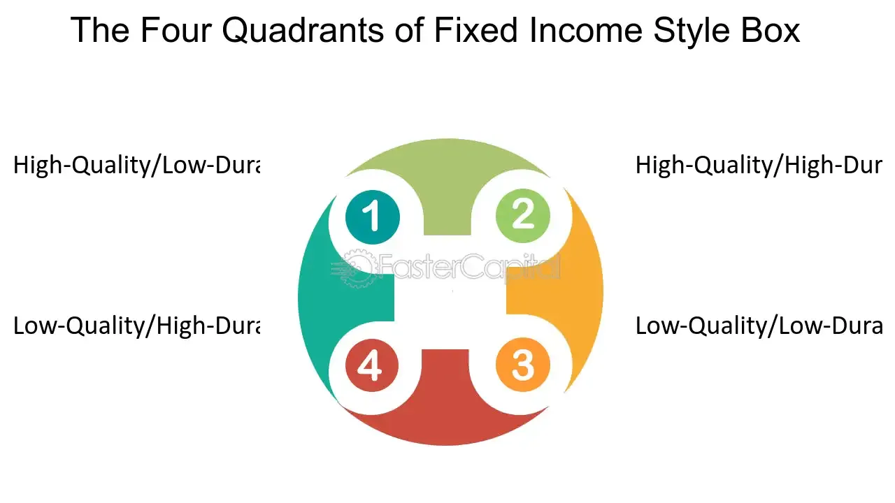

## Table of Contents

## What is a fixed-income style box?

A fixed-income style box is a tool used to categorize bonds and other fixed-income investments based on their credit quality and maturity. It helps investors understand the risk and potential return of their bond investments. The box is divided into a grid, usually with credit quality on one axis and maturity on the other. Credit quality can range from high (investment-grade) to low (speculative or junk bonds), while maturity can be short-term, intermediate-term, or long-term.

By using a fixed-income style box, investors can easily see where their investments fall within these categories. For example, a bond with a high credit quality and a short maturity would be placed in the top-left corner of the box. This visual representation helps investors build a diversified bond portfolio that matches their risk tolerance and investment goals. It's a simple yet effective way to manage and analyze fixed-income investments.

## Who created the fixed-income style box and why was it developed?

The fixed-income style box was created by Morningstar, a company that helps people make better investment decisions. They developed it to make it easier for investors to understand and compare bonds. Before the style box, it was hard to see at a glance how risky a bond was or how long it would take to get your money back. The style box solved this by putting bonds into a simple grid.

Morningstar wanted to give investors a clear way to see where their money was going. By using the style box, people could quickly tell if a bond was safe or risky, and if it would mature soon or much later. This helped investors pick bonds that fit their needs and build a balanced portfolio. The style box became a popular tool because it made investing in bonds much simpler and more transparent.

## What are the main components of a fixed-income style box?

A fixed-income style box has two main parts: credit quality and maturity. Credit quality shows how safe a bond is. It goes from high, which means the bond is very safe, to low, which means the bond is riskier. Maturity tells you how long you have to wait to get your money back. It can be short-term, which is less than 3 years, intermediate-term, which is 3 to 10 years, or long-term, which is more than 10 years.

These two parts make a grid. The top of the grid has the safest bonds, and the bottom has the riskiest ones. The left side shows bonds that will pay back soon, and the right side shows bonds that will take a long time to pay back. By looking at where a bond is on this grid, you can quickly see if it's safe or risky and how long you'll have to wait for your money. This helps you pick the right bonds for your investment goals.

## How does the interest rate sensitivity axis work in a fixed-income style box?

In a fixed-income style box, the interest rate sensitivity axis is another way to look at bonds, focusing on how much their prices change when interest rates go up or down. This axis is often shown along with the credit quality and maturity axes. Bonds that are very sensitive to interest rates will see their prices drop a lot if interest rates go up, and rise a lot if interest rates go down. These bonds are usually long-term bonds because they have more time for interest rate changes to affect them.

On the other hand, bonds that are less sensitive to interest rates won't change much in price when interest rates move. These are often short-term bonds because they have less time for interest rate changes to impact them. By looking at where a bond falls on the interest rate sensitivity axis, investors can better understand how their bond investments might react to changes in interest rates. This helps them pick bonds that fit their comfort level with risk and their investment goals.

## What does the credit quality axis represent in a fixed-income style box?

The credit quality axis in a fixed-income style box shows how safe a bond is. It goes from high to low. High credit quality means the bond is very safe, like investment-grade bonds. These bonds are less likely to have problems with the company not being able to pay back the money. Low credit quality means the bond is riskier, like junk bonds. These bonds have a higher chance that the company might not pay back the money.

This axis helps investors see the risk of their bond investments at a glance. If a bond is at the top of the axis, it's safer. If it's at the bottom, it's riskier. By looking at where a bond falls on this axis, investors can pick bonds that match how much risk they are okay with. It's a simple way to understand if a bond is likely to be paid back or not.

## How can investors use a fixed-income style box to assess bond funds?

Investors can use a fixed-income style box to assess bond funds by looking at where the fund's bonds fall on the grid. The grid shows the credit quality and maturity of the bonds in the fund. If the fund has a lot of bonds at the top of the grid, it means the fund is safer because those bonds have high credit quality. If the bonds are on the left side of the grid, it means the fund's money will come back sooner because those bonds have short maturities. By looking at the style box, investors can see if the bond fund matches their comfort with risk and how long they want to wait for their money.

They can also use the style box to compare different bond funds. If one fund has most of its bonds in the bottom right corner of the grid, it means the fund is riskier and the money will take longer to come back. Another fund might have its bonds in the top left corner, showing it's safer and the money will come back sooner. This helps investors pick the right bond fund for their needs. The style box makes it easy to see these differences and choose a fund that fits their investment goals.

## What are the differences between the equity style box and the fixed-income style box?

The equity style box and the fixed-income style box are tools that help investors understand and compare different types of investments. The equity style box is used for stocks and looks at two things: the size of the company (market capitalization) and how the stock's price moves (value or growth). The size can be small, medium, or large, and the style can be value, blend, or growth. This helps investors see if they are investing in big or small companies and if those companies are expected to grow a lot or are more stable.

The fixed-income style box, on the other hand, is used for bonds and looks at credit quality and maturity. Credit quality shows how safe the bond is, ranging from high (very safe) to low (riskier). Maturity tells you how long you have to wait to get your money back, which can be short-term, intermediate-term, or long-term. This helps investors understand the risk and timing of their bond investments. Both style boxes help make investing easier to understand, but they focus on different things because stocks and bonds are different kinds of investments.

## Can you explain how to plot a bond or bond fund on a fixed-income style box?

To plot a bond or bond fund on a fixed-income style box, you need to know two things about the bond: its credit quality and its maturity. Credit quality tells you how safe the bond is. You can find this out by looking at the bond's rating from agencies like Moody's or Standard & Poor's. If the bond has a high rating, like AAA or AA, it goes at the top of the box because it's very safe. If it has a low rating, like BB or below, it goes at the bottom because it's riskier. Maturity tells you how long you have to wait to get your money back. If the bond will pay back in less than 3 years, it's short-term and goes on the left side of the box. If it's between 3 to 10 years, it's intermediate-term and goes in the middle. If it's more than 10 years, it's long-term and goes on the right side.

For a bond fund, you look at the average credit quality and average maturity of all the bonds in the fund. If most of the bonds in the fund are high-quality and short-term, you would plot the fund in the top-left corner of the box. If most of the bonds are low-quality and long-term, you would plot it in the bottom-right corner. By doing this, you can see at a glance where the bond or bond fund fits in terms of risk and how long you'll have to wait for your money. This helps you pick bonds or bond funds that match what you're comfortable with and what you're trying to achieve with your investments.

## What are the limitations of using a fixed-income style box for investment decisions?

Using a fixed-income style box can help investors understand bonds better, but it has some limits. One big limit is that it only shows two things about a bond: how safe it is and how long you have to wait for your money. But there are other important things about bonds that the box doesn't show, like how much interest the bond pays or how the bond's price might change if interest rates go up or down. These things can be very important for deciding if a bond is a good investment.

Another limit is that the style box can make things seem simpler than they really are. For example, a bond might be in the middle of the box, but that doesn't tell you everything about it. The bond could still have other risks that the box doesn't show, like the chance that the company might not be able to pay back the money. Also, the box doesn't change over time, but bonds can change as interest rates move or as the company's situation changes. So, while the style box is a helpful tool, it's important to look at more than just where a bond is on the box when making investment choices.

## How has the application of the fixed-income style box evolved over time?

When the fixed-income style box was first made by Morningstar, it was a simple way to help people understand bonds. It showed where a bond fit based on how safe it was and how long you had to wait for your money. This made it easier for people to pick bonds that matched what they wanted. Over time, more people started using the style box because it was easy to understand and helped them make better choices about their investments.

As time went on, the way people used the style box changed a bit. They started using it not just for single bonds, but also for bond funds. This meant looking at the average safety and time to get money back for all the bonds in the fund. People also began to think about other things that the style box didn't show, like how much interest a bond paid or how its price might change with interest rates. Even though the style box stayed the same, how people used it got more detailed and they started using it along with other tools to make smarter investment choices.

## What advanced strategies can investors implement using the fixed-income style box?

Investors can use the fixed-income style box to build a balanced bond portfolio. They can pick bonds or bond funds from different parts of the box to spread out their risk. For example, they might choose some safe, short-term bonds from the top-left corner and some riskier, long-term bonds from the bottom-right corner. This way, they can have some money coming back soon and some that might grow more over time. By looking at the style box, investors can make sure they have a mix of bonds that fits their comfort with risk and their goals for when they need their money.

Another advanced strategy is to use the style box to adjust their bond investments as the economy changes. If they think interest rates might go up, they might move more of their money into short-term bonds on the left side of the box. These bonds are less affected by interest rate changes. If they think the economy might get riskier, they might move more money into safer, high-quality bonds at the top of the box. By keeping an eye on the style box and making changes, investors can try to protect their money and maybe even make more of it as things change.

## How do institutional investors utilize the fixed-income style box in portfolio management?

Institutional investors, like big companies or pension funds, use the fixed-income style box to help them manage their bond investments. They look at the box to see where their bonds fit in terms of how safe they are and how long it will take to get their money back. This helps them make sure their bond portfolio is spread out in a way that matches their goals and how much risk they are okay with. For example, they might choose to have some bonds that are very safe and will pay back soon, and some that are riskier but might pay back more over time. By using the style box, they can keep their bond investments balanced and in line with what they want to achieve.

Institutional investors also use the style box to make changes to their bond portfolio as the economy changes. If they think interest rates might go up, they might move more of their money into short-term bonds, which are less affected by interest rate changes. If they think the economy might get riskier, they might move more money into safer, high-quality bonds. This way, they can try to protect their money and maybe even make more of it as things change. The style box helps them see at a glance where their bonds are and make smart choices about what to do next.

## References & Further Reading

[1]: ["Morningstar's Guide to Style Box Investing"](https://www.morningstar.com/insights/2019/06/17/what-is-the-morningstar-style-box) - Morningstar

[2]: ["Fixed Income Analysis"](https://en.wikipedia.org/wiki/Fixed_income_analysis) by Frank J. Fabozzi

[3]: Aldridge, I. (2013). ["High-Frequency Trading: A Practical Guide to Algorithmic Strategies and Trading Systems"](https://onlinelibrary.wiley.com/doi/pdf/10.1002/9781119203803.fmatter) Wiley.

[4]: ["Algorithmic Trading and DMA: An introduction to direct access trading strategies"](https://archive.org/details/algorithmictradi0000john) by Barry Johnson

[5]: ["The Handbook of Fixed Income Securities"](https://www.amazon.com/Handbook-Fixed-Income-Securities-Ninth/dp/1260473899) by Frank J. Fabozzi

[6]: ["Quantitative Equity Portfolio Management: An Active Approach to Portfolio Construction and Management"](https://www.amazon.com/Quantitative-Equity-Portfolio-Management-Construction/dp/0071459391) by Ludwig Chincarini and Daehwan Kim