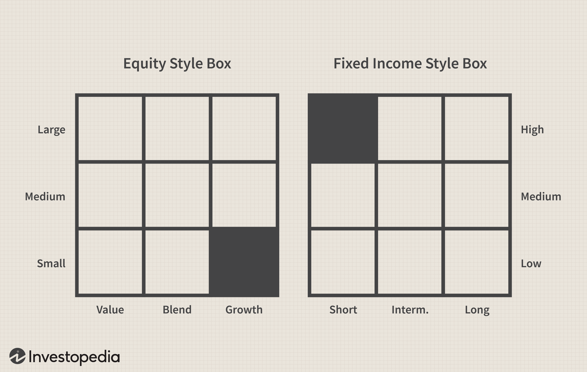

The world of investment provides a vast array of opportunities, particularly within fixed-income securities and algorithmic trading. As financial markets evolve, investors are continually seeking methods to improve portfolio performance and manage risks. This article focuses on style box investment, a strategic framework designed to classify and evaluate fixed-income investments. These style boxes, pioneered by firms like Morningstar, enable investors to visualize maturity and credit quality, aiding in informed decision-making.

In parallel, algorithmic trading has emerged as a crucial component of modern financial markets. This approach employs advanced algorithms and technologies to execute trades with greater speed and accuracy. It allows for optimization based on specific criteria such as price, timing, and volume, enhancing the efficiency and effectiveness of trade executions in the fixed-income sector.



Throughout this article, we will explore the benefits and challenges associated with these strategies. By understanding style boxes and algorithmic trading, both novice and experienced investors can gain insights that help navigate the complexities of fixed-income markets. This comprehensive guide seeks to equip investors with the necessary tools and knowledge to make smarter investment choices in an ever-changing financial landscape.

## Table of Contents

## Understanding Fixed-Income Style Box

A fixed-income style box serves as a comprehensive framework to classify and evaluate fixed-income investments, aiding investors in understanding their portfolios' risk and return potential. Developed by influential financial research firms such as Morningstar, the style box provides an organized visual representation, focusing on two primary dimensions: maturity and credit quality. This dual-axis model is instrumental for investors seeking to make informed decisions regarding their fixed-income holdings.

The foundation of the style box lies in its grid structure, which categorizes investments into nine distinct boxes. This structure is analogous to the style box used for equities but is tailored to reflect the unique characteristics of bonds and other fixed-income securities. The horizontal axis represents the maturity spectrum, typically divided into short, intermediate, and long-term periods. Short-term bonds usually have maturities of up to three years, intermediate-term bonds range from three to ten years, and long-term bonds exceed ten years.

On the vertical axis, the style box classifies securities based on credit quality, segmented into high, medium, and low categories. High-quality bonds often encompass those rated AAA to AA, reflecting a lower default risk and generally offering lower yields. Medium credit quality includes A to BBB ratings, presenting a moderate risk-yield balance. Low credit quality, often referred to as high-yield or "junk" bonds, encompasses ratings from BB and below, characterized by higher risk and potentially higher returns.

Investors utilize the fixed-income style box to gauge the sensitivity of their portfolio to [interest rate](/wiki/interest-rate-trading-strategies) changes, a crucial [factor](/wiki/factor-investing) in fixed-income investing. Interest-rate sensitivity, or duration, is an essential metric that signifies how much a bond's price is expected to change with fluctuations in interest rates. For instance, bonds with longer durations are more susceptible to interest rate risks, while shorter durations are less affected.

Understanding how to read and interpret a fixed-income style box can significantly enhance portfolio management strategies. Investors can evaluate their exposure to different maturity buckets and credit qualities, aligning their investments with personal financial goals, risk tolerance, and market outlook. For example, risk-averse investors might favor high-quality, short-term bonds to mitigate default and interest rate risks. Conversely, those seeking higher returns might opt for lower-quality, longer-term options, despite the higher associated risks.

Furthermore, by providing a standardized method for investment evaluation, the style box facilitates comparison between different funds and securities. This is particularly beneficial for investors aiming to diversify their portfolios across various fixed-income sectors. By clearly illustrating a fund's positioning across the maturity and credit quality spectrum, the style box aids in identifying potential investment gaps and opportunities for reallocation.

In summary, the fixed-income style box is a vital analytical tool that empowers investors to make strategic decisions based on a well-defined framework of interest rate sensitivity and credit quality. Understanding and employing this model can lead to more robust investment choices tailored to achieving desired financial outcomes.

## The Role of Algorithmic Trading in Fixed-Income Investments

Algorithmic trading, often referred to as "algo trading," is the use of computer systems to execute trading orders based on pre-set rules and algorithms. In the context of fixed-income investments, such as bonds and other debt securities, [algorithmic trading](/wiki/algorithmic-trading) can significantly enhance the speed and accuracy of trade execution. The application of algorithmic trading in fixed-income markets not only streamlines processes but also optimizes them according to specific criteria such as price, timing, and [volume](/wiki/volume-trading-strategy).

One of the primary advantages of algorithmic trading in the fixed-income market is its ability to handle large volumes of trades at exceptionally high speeds. This rapid execution is particularly beneficial in fixed-income markets that may experience low [liquidity](/wiki/liquidity-risk-premium) and higher transaction costs compared to equity markets. By executing trades more efficiently, algorithmic trading reduces slippage and ensures that trades occur at the best possible prices.

Algorithmic trading strategies in fixed-income markets can be largely categorized into those that aim to exploit price efficiencies and those that focus on execution optimization. Price efficiency strategies often involve statistical [arbitrage](/wiki/arbitrage), where algorithms identify and exploit discrepancies in bond prices. These discrepancies might arise due to market inefficiencies or temporary imbalances in supply and demand.

Execution optimization strategies, on the other hand, primarily focus on minimizing the market impact and the total cost of trading. Algorithms in these strategies use advanced techniques like time-weighted average price (TWAP) or volume-weighted average price (VWAP) to execute trades gradually over time, thus avoiding any adverse price movements due to large trades.

Investors can leverage algorithmic trading to improve the performance of their fixed-income portfolios by automating the decision-making process. This involves setting up criteria such as interest rate thresholds or credit spread triggers, which when met, automatically execute buy or sell orders. As an example, Python code can be used to simulate and backtest these strategies to estimate performance:

```python
import numpy as np
import pandas as pd

# Simulating bond price data
np.random.seed(42)
bond_prices = np.random.normal(100, 2, 100)
time_index = pd.date_range('2023-01-01', periods=100)

# Creating a DataFrame
bond_data = pd.DataFrame(data=bond_prices, index=time_index, columns=['Price'])

# Simple moving average strategy
bond_data['SMA20'] = bond_data['Price'].rolling(window=20).mean()

# Generating trading signals
bond_data['Signal'] = 0
bond_data.loc[bond_data['Price'] > bond_data['SMA20'], 'Signal'] = 1
bond_data.loc[bond_data['Price'] < bond_data['SMA20'], 'Signal'] = -1

# Displaying the first few rows
print(bond_data.head())
```

The understanding of these algorithms plays a crucial role in navigating the complex market dynamics of fixed-income securities. As markets evolve, so too do the models and algorithms, necessitating continuous research and adaptation. Thus, while algorithmic trading provides significant advantages, including enhanced execution and potential cost savings, it requires investors to stay informed and agile to ensure strategies remain effective amidst changing market conditions.

Integrating algorithmic trading into fixed-income investments requires careful planning and a deep understanding of the algorithms and models employed. Investors should therefore commit to ongoing education and adaptation to remain competitive in this technologically advanced domain of investing.

## Evaluating Investment Strategies

Investment strategies encompass a spectrum of approaches, aiming to balance risk and return according to investor objectives. The fixed-income style box serves as a crucial tool for investors to evaluate and compare various fixed-income options within this spectrum. By categorizing investments based on interest-rate sensitivity and credit quality, the style box aids in fine-tuning investment portfolios to fit specific risk-return profiles.

The integration of style box investing with algorithmic trading introduces an advanced layer of strategy enhancement. Algorithmic trading, defined by its use of automatic, rules-based systems to execute trades, provides efficiencies and precision that manual trading cannot. This synergy between style box investing and trading algorithms can optimize investment outcomes in fixed-income markets. As these algorithms continue to evolve, they allow investors to quickly adapt to shifts in market conditions, thereby maintaining desired portfolio characteristics over time.

When utilizing a style box, investors should focus on two primary factors: interest-rate sensitivity, often measured by duration, and credit quality, typically represented by credit ratings. A fixed-income style box generally divides investment opportunities into nine distinct categories, facilitating easy comparison and selection. By examining these factors within the context of their own investment goals—be it income generation, capital preservation, or growth—investors can identify top-performing funds aligned with their objectives.

Algorithmic trading complements this approach by providing the means to implement strategy decisions at scale, optimizing both entry and [exit](/wiki/exit-strategy) points based on market data and trends. For instance, an investor targeting lower interest-rate risk may prefer funds with shorter durations, while higher credit quality can assure reduced default risk. Through algorithmic trading, adjustments to such allocations can be executed efficiently, maximizing return potential while managing exposure to adverse conditions.

Selecting the optimal combination of strategy and technology requires an understanding of each component's strengths and limitations. Investors are advised to thoroughly research and backtest strategies within simulated environments before deployment, ensuring alignment with personal risk tolerances and market expectations. In addition, continuous monitoring and adjustment, supported by algorithmic insights, can further enhance portfolio stability and performance.

In conclusion, investment strategies enriched by style box analytics and algorithmic trading present sophisticated opportunities for fixed-income investors. By leveraging these tools, investors can navigate the complexities of financial markets more effectively, tailor their portfolios to specific needs, and potentially achieve superior investment outcomes. Through deliberate strategy selection and technological integration, investors can enhance their ability to respond dynamically to an ever-changing market environment.

## Challenges and Considerations

In the rapidly evolving landscape of investment, style box investing and algorithmic trading offer compelling advantages, such as improved decision-making through classification systems and enhanced trading efficiency, respectively. However, these strategies also come with challenges that investors must navigate to achieve optimal portfolio outcomes.

**Market Volatility:** One of the primary challenges in both style box investing and algorithmic trading is market volatility. The fixed-income market can be affected by fluctuations in interest rates, economic data releases, and geopolitical events. For instance, unexpected changes in central bank policies can lead to rapid shifts in bond prices, impacting the returns of investments categorized within the fixed-income style box. Algorithmic trading, while designed to capitalize on such market movements, may sometimes exacerbate volatility, particularly during periods of low liquidity or when algorithms simultaneously execute similar trading strategies.

**Technological Disruptions:** Dependence on technology in algorithmic trading introduces concerns related to system reliability and cybersecurity. Technical glitches or software errors can lead to unintended trades, resulting in financial losses. Moreover, advancements in technology constantly reshape the trading landscape, pushing algorithms towards obsolescence if not regularly updated. Staying current with technological advancements is essential to maintain a competitive edge.

To address these challenges, investors need to:

1. **Stay Informed on Market Trends:** Continuously monitoring economic indicators, market news, and policy changes can help investors anticipate potential impacts on their portfolios. This awareness enables proactive adjustments to investment strategies.

2. **Understand Strategy Limitations:** Recognizing the constraints of style boxes, such as their reliance on historical data and assumptions about interest-rate sensitivity, is critical. Similarly, understanding that algorithmic models are only as good as the data they are trained on helps in setting realistic expectations and preparing for anomalies.

3. **Embrace Diversification:** Diversification within fixed-income portfolios can mitigate risks associated with market volatility. By spreading investments across various credit qualities and maturities within the style box, investors can shield their portfolios from specific sector downturns.

4. **Update Algorithmic Models:** Regularly reviewing and updating algorithms to incorporate the latest data and market conditions can enhance their efficacy. Testing algorithms under different scenarios, known as backtesting, can also provide insights into their performance during past volatile periods.

5. **Risk Management Strategies:** Employing risk management tools, such as stop-loss orders and position limits, can help control losses during adverse market movements. Additionally, integrating human oversight in automated trading systems ensures that unusual market activities are reviewed promptly.

6. **Adapt to Evolving Investor Needs:** Investor preferences evolve, influenced by demographic shifts, regulatory changes, and new financial products. Adapting strategies to meet these changing needs involves both leveraging technological tools and understanding emerging market dynamics.

Investors who actively manage these considerations by remaining vigilant and adaptable will be better positioned to capitalize on the opportunities presented by style box investing and algorithmic trading, while effectively mitigating the associated risks.

## Conclusion

Style box investment and algorithmic trading are essential instruments for successfully managing fixed-income markets. By effectively understanding and implementing these strategies, investors have the potential to significantly enhance their portfolio performance. These tools classify investments and optimize trade execution, thereby presenting numerous possibilities for maximizing returns while managing risk.

Given the ever-evolving nature of financial markets, continuous learning and adaptation remain pivotal. As market conditions fluctuate and technological advancements emerge, the ability to assimilate new information and adjust strategies accordingly becomes increasingly important. This adaptability not only aids in navigating current challenges but also prepares investors to anticipate future market changes.

This article has provided a detailed overview of the connected roles of style box investment and algorithmic trading in fixed-income investment management. The exploration of these disciplines demonstrates their complementary nature in creating robust and nuanced investment strategies. Investors who integrate these insights and tools into their decision-making process are well-positioned to achieve and sustain success.

In conclusion, embracing the dynamic interplay between style box classifications and algorithmic methodologies can unlock substantial opportunities. Investors are encouraged to apply these findings to optimize their investment approaches, thereby fostering resilience and growth in a demanding financial landscape.

## References & Further Reading

[1]: ["Morningstar's Guide to Style Box Investing"](https://www.morningstar.com/insights/2019/06/17/what-is-the-morningstar-style-box) - Morningstar

[2]: ["Fixed Income Analysis"](https://en.wikipedia.org/wiki/Fixed_income_analysis) by Frank J. Fabozzi

[3]: Aldridge, I. (2013). ["High-Frequency Trading: A Practical Guide to Algorithmic Strategies and Trading Systems"](https://onlinelibrary.wiley.com/doi/pdf/10.1002/9781119203803.fmatter) Wiley.

[4]: ["Algorithmic Trading and DMA: An introduction to direct access trading strategies"](https://archive.org/details/algorithmictradi0000john) by Barry Johnson

[5]: ["The Handbook of Fixed Income Securities"](https://www.amazon.com/Handbook-Fixed-Income-Securities-Ninth/dp/1260473899) by Frank J. Fabozzi

[6]: ["Quantitative Equity Portfolio Management: An Active Approach to Portfolio Construction and Management"](https://www.amazon.com/Quantitative-Equity-Portfolio-Management-Construction/dp/0071459391) by Ludwig Chincarini and Daehwan Kim