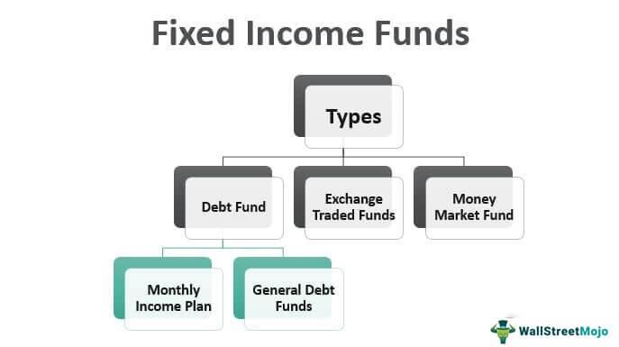

Investing in fixed income securities and bonds is a crucial component of effective portfolio management. These investment vehicles, including an array of bond types, act as essential instruments for generating consistent income and reducing exposure to market volatility. Bonds compensate investors through regular interest payments, providing a predictable income stream, which is particularly appealing to those seeking stability.

This article explores widely-used investment strategies in fixed income and bonds. These strategies are tailored to align with various investor profiles, addressing different financial objectives and risk tolerances. Understanding the characteristics and purposes of different bond types will aid investors in crafting strategies that optimize income while managing risk.

Furthermore, the bond market has recently experienced significant transformation with the adoption of algorithmic trading. This advanced approach is reshaping traditional methodologies, offering increased speed, precision, and efficiency. By analyzing large datasets, algorithmic trading can unveil opportunities that might be missed by human traders, thus enhancing decision-making processes.

By comprehending these developments and strategy nuances, readers will be empowered with the knowledge required to navigate the bond market effectively. With a deeper grasp on both fundamental strategies and cutting-edge technologies, investors can make informed decisions to meet their income needs and manage risks prudently.

## Table of Contents

## Understanding Fixed Income and Bonds

Fixed income refers to a class of investment securities that affords investors returns at regular intervals through interest payments or dividends. A significant component of this category is bonds, which act as a primary vehicle for fixed income investing. These instruments are issued by both governmental entities and corporate bodies to raise capital for various projects and operational needs.

### Characteristics of Bonds

Bonds exhibit several fundamental characteristics that define their appeal and risk profile:

1. **Maturity**: This denotes the date when the principal amount of a bond is repaid to the bondholder. Bonds can range from short-term maturities, generally up to three years, to long-term, which can extend beyond a decade. The maturation schedule impacts a bond's sensitivity to interest rate changes and credit risk.

2. **Coupon Rates**: This is the interest rate that the bond issuer agrees to pay bondholders annually or semi-annually. The coupon typically reflects the issuer's credit quality and overarching market interest rates at issuance. Fixed-rate bonds offer predictable income, whereas floating-rate bonds adjust the interest payout according to changes in a benchmark interest rate.

3. **Face Value (Par Value)**: Commonly, bonds are issued with a face value of $1,000. This value is the amount the bondholder receives upon maturity. Trading prices, however, can fluctuate above or below the par value based on market conditions and interest rate movements.

4. **Yield**: Yield is an essential measure for investors, representing the return on bond investment. Yield to maturity (YTM) is a prevalent metric, indicating the total anticipated return if the bond is held until maturity. It considers the coupon payments, the difference between the purchase price and the face value, and the time remaining until maturity. The formula for YTM considers factors such as:
$$
   YTM = \frac{C + \frac{F - P}{n}}{\frac{F + P}{2}}

$$

   where $C$ is the annual coupon payment, $F$ is the face value, $P$ is the price, and $n$ is the number of years to maturity.

### Role of Bonds in Investment Portfolios

Bonds offer stabilization and income generation within an investment portfolio, playing a crucial role in asset allocation strategies by providing predictability and security compared to equities. They are generally considered lower-risk investments that can diversify and balance out the [volatility](/wiki/volatility-trading-strategies) associated with stock market investments, thus preserving capital while delivering consistent income streams.

### Distinction from Other Fixed Income Securities

While bonds are central to fixed income investing, they are not the only instruments available. Other types include preferred stocks and certificates of deposit (CDs), each possessing unique attributes:

- **Preferred Stocks**: These resemble bonds more closely than common stock as they typically offer fixed dividend payments and have higher claim priority on assets in the event of liquidation, yet they do not carry the same principal repayment guarantee at maturity that bonds provide.

- **Certificates of Deposit (CDs)**: Issued by banks, CDs offer fixed interest rates over specified terms until maturity. Unlike bonds, they usually involve early withdrawal penalties, making them less liquid.

By thoroughly understanding these elements, investors can better utilize bonds to achieve stable returns, diversify their portfolios, and minimize risk exposure.

## Types of Bonds

Bonds, as essential components of fixed income securities, come in diverse forms, each serving unique investment purposes and carrying distinct characteristics. Understanding these different types is crucial for investors aiming to optimize their portfolios.

### Government Bonds

**Treasury Bonds (T-Bonds):** Issued by the U.S. Department of the Treasury, T-Bonds are long-term bonds with maturities ranging from 10 to 30 years. They pay a fixed interest rate semi-annually and are considered one of the safest investments due to their backing by the U.S. government. The security of T-bonds comes with a relatively lower yield, but they provide a stable and predictable income.

**Treasury Inflation-Protected Securities (TIPS):** Also issued by the U.S. Treasury, TIPS offer protection against inflation. The principal of TIPS increases with inflation and decreases with deflation, as measured by the Consumer Price Index (CPI). They pay interest every six months, calculated based on the adjusted principal. This adjustment ensures that the purchasing power of the investor does not erode over time, making TIPS an invaluable asset for inflation-hedging.

### Municipal Bonds

Municipal bonds, or "munis," are issued by states, cities, and other local government entities to finance public projects such as schools, roads, and hospitals. One of the main attractions of municipal bonds is their potential tax advantages; interest earned is often exempt from federal income tax and, in some cases, state and local taxes as well. This tax-exemption feature can significantly enhance the after-tax yield for investors in higher tax brackets, making munis an attractive option for income-focused portfolios.

### Corporate Bonds

Corporate bonds are debt securities issued by companies to raise capital for various purposes, including expanding operations or funding new projects. These bonds [carry](/wiki/carry-trading) a higher risk compared to government bonds due to the varying creditworthiness of issuers. The risk is reflected in the credit ratings assigned by agencies such as Moody’s and Standard & Poor’s. Despite the higher risk, corporate bonds offer higher yields, providing an opportunity for investors seeking increased income. When assessing corporate bonds, investors must carefully evaluate the issuer's financial health to gauge credit risk and yield opportunities.

### High-Yield and Junk Bonds

High-yield bonds, often referred to as junk bonds, are issued by companies with lower credit ratings, implying a higher risk of default. To compensate for this increased risk, these bonds offer higher potential returns compared to investment-grade bonds. The pursuit of higher yields can be appealing, but investors must be cognizant of the volatility and additional risks associated with junk bonds. Careful analysis of the issuer's financial stability and market conditions is imperative when considering these instruments.

In summary, bonds provide a spectrum of investment opportunities, each with distinctive risk and return profiles. Investors can tailor their bond investments to meet individual financial goals, considering factors such as security, yield expectations, tax implications, and credit risk. Each bond type plays a crucial role in a well-diversified investment strategy, balancing income generation with risk mitigation.

## Fixed Income Investment Strategies

Fixed income investment strategies are vital tools for managing risk and generating steady returns. 

The traditional buy-and-hold strategy is favored by conservative investors who prefer stability over the volatility. This approach involves purchasing a bond and holding it until it matures, allowing investors to benefit from predictable income through periodic coupon payments, while avoiding the need to react to market fluctuations.

Bond laddering is a structured approach that involves purchasing bonds with staggered maturities. By doing so, investors ensure a consistent income stream while mitigating [interest rate](/wiki/interest-rate-trading-strategies) risks. As bonds mature, the proceeds can be reinvested into new bonds at current interest rates, helping to smooth out the impact of rate changes. This strategy allows investors to maintain [liquidity](/wiki/liquidity-risk-premium) and achieve a degree of flexibility in managing their portfolios.

The core-satellite strategy utilizes a mix of bonds and other asset classes to achieve diversification. In this strategy, the "core" of the portfolio typically consists of stable, high-quality bonds that provide a secure foundation and steady income. The "satellite" portion might include riskier assets like high-yield bonds, equities, or alternative investments, which aim for higher returns and capital growth. This approach helps balance risk and return by blending stability with growth potential.

Yield curve strategies are predicated on anticipating changes in interest rates and adjusting bond portfolios accordingly. The yield curve, which plots interest rates of bonds with similar credit quality but different maturities, can signal economic expectations. Investors can adopt strategies like riding the yield curve—buying long-term bonds and selling them as they move to shorter maturities—to capitalize on shifts in expected rates.

Relative value strategies focus on identifying bonds that are mispriced relative to others with similar characteristics, offering potential for gains. Convertible bond strategies involve investing in bonds that can be converted into a predetermined number of common stock shares. Convertible bonds provide the advantage of fixed income interest payments while also offering potential for capital appreciation if the underlying stock performs well. They can be particularly attractive in volatile market conditions or when equities are expected to appreciate. 

By carefully implementing these strategies, investors can effectively manage risk and achieve their fixed income investment objectives.

## Algorithmic Trading in Fixed Income

Algorithmic trading has gained significant traction in the fixed income markets, driven by the capacity of algorithms to rapidly process and analyze large data sets. This technological advancement allows traders to identify profitable trading opportunities with greater precision and speed than ever before.

One of the key methods utilized in [algorithmic trading](/wiki/algorithmic-trading) is the processing of extensive historical and real-time data to discern patterns and anomalies that may indicate potential trading opportunities. Algorithms can be designed to scan various data sources, including financial statements, news reports, and economic indicators, to make informed decisions on bond trades. This ability to handle vast amounts of data enables traders to anticipate market movements and execute trades with optimal timing.

The benefits of algorithmic trading are numerous. Primarily, it provides enhanced speed and efficiency in executing trades, which is crucial in the fast-paced bond markets. By eliminating the delays associated with human decision-making, algorithmic systems can capitalize on short-lived market inefficiencies. Additionally, the automation of trading processes reduces the likelihood of human error, contributing to more accurate and consistent trading strategies.

Machine learning and [artificial intelligence](/wiki/ai-artificial-intelligence) (AI) are at the forefront of advancing bond trading strategies. These technologies enable the creation of sophisticated models that adapt and improve over time. Machine learning algorithms can identify complex patterns that traditional models might miss, while AI can simulate various market scenarios to optimize trading strategies. For instance, predictive models apply regression analysis, neural networks, or decision trees to understand the intricate relationships between different financial indicators and bond prices.

Several case studies showcase the successful application of algorithmic strategies in fixed income trading. For example, a quantitative [hedge fund](/wiki/hedge-fund-trading-strategies) might employ a strategy that identifies [arbitrage](/wiki/arbitrage) opportunities between different types of bonds, such as government and corporate bonds, by comparing yield spreads. Another strategy could involve using [machine learning](/wiki/machine-learning) to forecast interest rate changes and adjust bond portfolios accordingly to maximize yields.

In conclusion, algorithmic trading is revolutionizing fixed income markets by leveraging data analysis, machine learning, and AI to enhance trading strategies. Its benefits of speed, efficiency, and reduced human error are invaluable in the complex and dynamic bond markets, offering traders an edge in executing successful trades.

## Benefits and Risks of Fixed Income Investment

Fixed income investments, primarily in the form of bonds, offer several advantages that make them an integral part of diversified investment portfolios. One of the primary benefits is the provision of steady income through regular interest payments, making them attractive to investors seeking reliable cash flow. Moreover, fixed-income securities typically exhibit lower volatility compared to equities, offering a more stable asset base that can help in smoothing out the variations in an investment portfolio's value. This characteristic makes fixed income investments particularly appealing to conservative investors or those nearing retirement who prioritize capital preservation.

Diversification is another key advantage, as bonds tend to have a low correlation with stocks, providing a hedge against stock market fluctuations. This diversification can help reduce the overall risk in a portfolio, contributing to its long-term stability and performance.

However, investing in fixed income carries inherent risks that must be managed carefully. Credit risk is a primary concern, which is the risk of the bond issuer defaulting on interest or principal payments. Evaluating credit ratings from agencies like Moody's, Standard & Poor's, and Fitch can help investors assess this risk.

Interest rate risk is another significant [factor](/wiki/factor-investing), as the value of fixed-income securities inversely correlates with changes in interest rates. In a rising interest rate environment, existing bonds with lower coupon rates become less attractive, leading to a decrease in their market value. Liquidity risks also pose challenges, as some bonds may be difficult to sell quickly without significantly impacting their price, especially in less active markets.

Inflationary risks can erode the purchasing power of the fixed returns offered by bonds. To mitigate this risk, investors might consider Treasury Inflation-Protected Securities (TIPS), which adjust the principal value based on inflation rates, thereby providing a hedge against inflationary pressures.

Fixed-income investments can serve various purposes depending on an investor's profile. For low-risk tolerance investors, bonds might form the core of the portfolio, while for more aggressive investors, they serve as a counterbalance to more volatile asset classes, such as stocks.

Managing a fixed income portfolio requires a strategic approach. Investors should aim to balance risks and returns by diversifying across different types of bonds with varying maturities, credit qualities, and issuers. Bond laddering is a commonly employed strategy that involves holding bonds with different maturities to manage interest rate risk and maintain steady cash flow. Additionally, regularly reviewing and adjusting the portfolio in light of changing economic conditions and personal financial goals is vital to ensuring it continues meeting the investor's needs. 

In conclusion, while fixed income investments offer numerous benefits, they also present several risks that require careful consideration and management. By understanding these dynamics and implementing informed strategies, investors can effectively incorporate fixed income into their portfolios to achieve their financial objectives.

## Conclusion

Fixed income and bond investments are integral components of a well-diversified portfolio due to their potential to provide steady income and mitigate risk. Investors should prioritize selecting strategies that align with their financial objectives and risk appetite. For example, a conservative investor might gravitate towards a buy-and-hold strategy to capitalize on the consistent income stream offered by high-grade corporate or government bonds. Conversely, a risk-tolerant investor could explore high-yield bonds, despite their associated credit risks, to pursue greater returns.

Algorithmic trading has introduced innovative strategies that enhance traditional bond investment practices. These algorithms offer benefits such as improved trading efficiency and accuracy by analyzing vast datasets to identify profitable trading opportunities. However, the potential for enhanced returns comes with the necessity for careful planning and implementation to avoid pitfalls associated with algorithm misuse or overreliance.

An understanding of the diverse bond types is vital for optimizing investment outcomes. Government bonds, corporate bonds, municipal bonds, and inflation-protected securities each have unique features that cater to different investor needs, from risk mitigation to tax efficiency. Investors should leverage this knowledge to tailor their bond investments to their specific income goals and risk management strategies.

By employing informed strategies, investors can effectively meet their income requirements while managing associated risks. This approach allows for the balancing of a diverse asset base, leading to a more resilient investment portfolio capable of weathering various economic cycles.

## References & Further Reading

[1]: ["Fixed Income Analysis"](https://en.wikipedia.org/wiki/Fixed_income_analysis) by Barbara S. Petitt and Jerald E. Pinto

[2]: ["The Bond Book: Everything Investors Need to Know About Treasuries, Municipals, GNMAs, Corporates, Zeros, Bond Funds, Money Market Funds, and More"](https://www.amazon.com/Bond-Book-Third-Everything-Treasuries/dp/007166470X) by Annette Thau

[3]: ["Algorithmic Trading: Winning Strategies and Their Rationale"](https://www.wiley.com/en-us/Algorithmic+Trading%3A+Winning+Strategies+and+Their+Rationale-p-9781118460146) by Ernest P. Chan

[4]: ["Advances in Financial Machine Learning"](https://www.wiley.com/en-us/Advances+in+Financial+Machine+Learning-p-9781119482086) by Marcos Lopez de Prado

[5]: ["Principles of Financial Engineering"](https://www.sciencedirect.com/book/9780123735744/principles-of-financial-engineering) by Salih N. Neftci