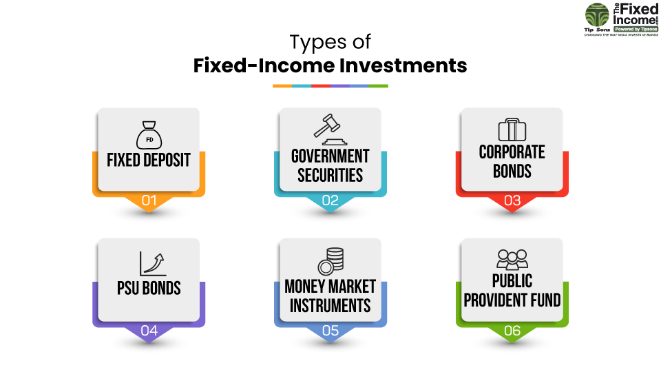

## Table of Contents

## What is fixed income and why is it important for investors?

Fixed income refers to investments that provide a steady and predictable stream of income, usually in the form of interest payments. These investments include bonds, certificates of deposit (CDs), and other types of loans. The term "fixed" comes from the fact that the payments are usually set at a specific amount and paid out on a regular schedule, like monthly or annually. This makes fixed income investments different from stocks, where the returns can go up and down a lot.

Fixed income is important for investors because it helps them create a stable financial plan. By including fixed income investments in their portfolio, investors can count on a regular income, which is especially helpful for people who are retired or need money regularly. Fixed income investments can also lower the overall risk of an investment portfolio because they are usually less risky than stocks. This balance can help investors feel more secure about their money and reach their financial goals more smoothly.

## What are the main types of fixed income securities?

Fixed income securities come in different types, but the main ones are bonds, certificates of deposit (CDs), and money market funds. Bonds are like loans that you give to a government or a company. They promise to pay you back the money you lent them, plus interest, over a certain period of time. Governments issue treasury bonds, while companies issue corporate bonds. CDs are offered by banks, where you deposit money for a fixed time and get interest in return. Money market funds invest in short-term debt and aim to keep a stable value, offering easy access to your money.

Each type of fixed income security has its own benefits and risks. Bonds can be safe if they are from a stable government or a strong company, but they can be riskier if the issuer might have trouble paying back the loan. CDs are generally very safe because they are insured by the government up to a certain amount, but you can't take your money out before the term ends without paying a penalty. Money market funds are also considered low risk, but they might not offer as high returns as other fixed income options. By understanding these differences, investors can choose the right mix of fixed income securities to meet their needs.

## How do government bonds work and what are their benefits?

Government bonds are like loans that you give to the government. When you buy a government bond, you are lending money to the government, and in return, they promise to pay you back the money you lent them, plus interest, after a certain period of time. This period can be short, like a few months, or long, like 30 years. The interest is usually paid to you every six months. Governments issue these bonds to raise money for things like building roads, schools, or to pay for other big projects.

The main benefit of government bonds is that they are very safe. Since they are backed by the government, there is a low risk that they won't pay you back. This makes them a good choice if you want to keep your money safe. Another benefit is that they provide a steady income because of the regular interest payments. This can be helpful if you need money coming in regularly, like if you are retired. Government bonds can also help balance out riskier investments in your portfolio, making your overall investments more stable.

## What are corporate bonds and how do they differ from government bonds?

Corporate bonds are like loans that you give to a company. When you buy a corporate bond, you are lending money to the company, and they promise to pay you back the money you lent them, plus interest, over a certain period of time. The interest is usually paid to you every six months. Companies issue these bonds to raise money for things like expanding their business, buying new equipment, or other big projects.

The main difference between corporate bonds and government bonds is the level of risk. Government bonds are usually seen as safer because they are backed by the government, which makes it very unlikely that they won't pay you back. Corporate bonds, on the other hand, can be riskier because the company might have trouble paying you back if it doesn't do well. Because of this higher risk, corporate bonds often offer higher interest rates to attract investors. So, while government bonds provide safety and steady income, corporate bonds can offer higher returns but come with more risk.

## Can you explain what municipal bonds are and their tax advantages?

Municipal bonds are like loans that you give to a city or a state. When you buy a municipal bond, you are lending money to the government of a city or state, and they promise to pay you back the money you lent them, plus interest, over a certain period of time. The money raised from these bonds is used to pay for things like building schools, fixing roads, or other public projects. Municipal bonds are a bit like government bonds, but they come from local governments instead of the national government.

One big advantage of municipal bonds is that they often come with tax benefits. The interest you earn from these bonds is usually not taxed by the federal government. Sometimes, if you live in the state or city that issued the bond, you might not have to pay state or local taxes on the interest either. This can make the actual return on your investment higher than it would be with other types of bonds. Because of these tax advantages, municipal bonds can be a good choice if you want to keep more of your earnings and support local projects at the same time.

## What are asset-backed securities and how do they function?

Asset-backed securities are a type of investment where a bunch of loans or other debts are put together into one big package and sold to investors. These loans can be things like car loans, student loans, or credit card debts. When people pay back these loans, the money goes to the investors who bought the asset-backed securities. This way, instead of lending money directly to someone, you can buy a piece of many loans at once.

These securities work by turning individual loans into something that can be traded on the market. A company collects a lot of loans, then divides them into pieces and sells those pieces to investors. The investors get regular payments from the borrowers' loan payments. This can be a good way for investors to earn money, but it also comes with risks. If a lot of people can't pay back their loans, the value of the asset-backed security can go down, and investors might lose money.

## How does the interest rate environment affect fixed income investments?

The interest rate environment plays a big role in how well fixed income investments do. When interest rates go up, the prices of existing bonds usually go down. This happens because new bonds will be issued with higher interest rates, making the older bonds with lower rates less attractive to investors. So, if you want to sell your bond before it matures, you might have to sell it for less than what you paid for it. On the other hand, when interest rates go down, the prices of existing bonds usually go up because they are now paying more interest than new bonds.

This relationship between interest rates and bond prices can affect how much money you make from fixed income investments. If you hold onto your bond until it matures, you will get the full amount you were promised, plus the interest. But if you need to sell your bond before it matures, the interest rate environment at that time will determine whether you make a profit or a loss. This is why it's important for investors to keep an eye on interest rates and think about how changes might impact their fixed income investments.

## What are the risks associated with investing in fixed income securities?

Investing in fixed income securities comes with some risks. One big risk is interest rate risk. When interest rates go up, the prices of bonds go down. This means if you want to sell your bond before it matures, you might have to sell it for less than what you paid. Another risk is credit risk. This is the chance that the person or company you lent money to can't pay you back. Government bonds are usually safer, but corporate bonds can be riskier because companies might have trouble paying back their loans.

Another risk to think about is inflation risk. If inflation goes up a lot, the money you get from your fixed income investments might not be worth as much as before. This can make your returns less valuable over time. There's also liquidity risk, which means you might not be able to sell your bond quickly or at a good price if you need to. All these risks can affect how much money you make from fixed income investments, so it's important to understand them before you invest.

## What is duration and how does it impact the sensitivity of fixed income investments to interest rate changes?

Duration is a way to measure how sensitive a fixed income investment, like a bond, is to changes in interest rates. It tells you how much the price of a bond will go up or down if interest rates change. Think of duration as the average time it takes to get back the money you invested in the bond through its interest payments and the return of the principal at the end. The longer the duration, the more the bond's price will change when interest rates move.

If a bond has a long duration, even a small change in interest rates can make a big difference in its price. For example, if interest rates go up, the price of a bond with a long duration will drop a lot more than a bond with a short duration. On the other hand, if interest rates go down, the price of a bond with a long duration will go up a lot more. So, understanding the duration of your fixed income investments can help you know how much risk you're taking with interest rate changes.

## What are some advanced fixed income investment strategies, such as laddering and barbelling?

Laddering is a strategy where you buy bonds that mature at different times. Imagine you have a ladder with steps at different heights. Each step is a bond that matures at a different time, like one year, two years, three years, and so on. By doing this, you get money back at different times, which can help you if interest rates change. If rates go up, you can use the money from the bonds that mature to buy new bonds with higher rates. If rates go down, you still have some bonds that are paying the higher old rates. Laddering helps you balance risk and reward by spreading out when you get your money back.

Barbelling is another strategy where you focus on buying bonds with very short and very long maturities, but not much in between. It's like holding weights on both ends of a barbell, with nothing in the middle. You might buy some bonds that mature in a few months and others that mature in many years. The short-term bonds give you money back quickly, so you can reinvest if interest rates go up. The long-term bonds can give you higher returns but are more sensitive to interest rate changes. Barbelling lets you take advantage of both short-term flexibility and long-term gains, but it can be riskier than laddering because you're more exposed to interest rate changes.

## How can fixed income be used in portfolio diversification and risk management?

Fixed income investments can help diversify a portfolio and manage risk. When you have a mix of different types of investments, like stocks and bonds, it's less likely that all your money will go down at the same time. Fixed income investments, like bonds, usually don't go up and down as much as stocks. So, if the stock market has a bad day, the steady income from your bonds can help balance out the losses. This can make your whole portfolio more stable and less risky.

Another way fixed income helps with risk management is by providing a steady income. If you need money coming in regularly, like for retirement, fixed income investments can give you that. They pay interest on a regular schedule, which can be very helpful when planning your finances. Plus, if you choose safe fixed income options, like government bonds, you're less likely to lose your money. This makes fixed income a key part of a well-rounded investment strategy, helping you manage risk and reach your financial goals.

## What are the latest trends and innovations in the fixed income market that investors should be aware of?

One of the latest trends in the fixed income market is the rise of green bonds. These are bonds that help fund projects that are good for the environment, like solar power or wind farms. More and more investors want to put their money into things that help the planet, so green bonds are becoming popular. Another trend is the use of technology, like artificial intelligence and big data, to help investors make better choices. These tools can look at a lot of information quickly and find the best bonds for an investor's needs.

Another innovation in the fixed income market is the growth of exchange-traded funds (ETFs) that focus on bonds. ETFs are like baskets of bonds that you can buy and sell easily, just like stocks. They make it easier for people to invest in fixed income without having to pick individual bonds. Also, there are more options for high-yield bonds, which can give investors bigger returns but come with more risk. Keeping up with these trends and innovations can help investors make smarter choices and find new ways to grow their money.

## What is the understanding of Fixed Income and Bonds?

Fixed income refers to a class of investment securities that affords investors returns at regular intervals through interest payments or dividends. A significant component of this category is bonds, which act as a primary vehicle for fixed income investing. These instruments are issued by both governmental entities and corporate bodies to raise capital for various projects and operational needs.

### Characteristics of Bonds

Bonds exhibit several fundamental characteristics that define their appeal and risk profile:

1. **Maturity**: This denotes the date when the principal amount of a bond is repaid to the bondholder. Bonds can range from short-term maturities, generally up to three years, to long-term, which can extend beyond a decade. The maturation schedule impacts a bond's sensitivity to interest rate changes and credit risk.

2. **Coupon Rates**: This is the interest rate that the bond issuer agrees to pay bondholders annually or semi-annually. The coupon typically reflects the issuer's credit quality and overarching market interest rates at issuance. Fixed-rate bonds offer predictable income, whereas floating-rate bonds adjust the interest payout according to changes in a benchmark interest rate.

3. **Face Value (Par Value)**: Commonly, bonds are issued with a face value of $1,000. This value is the amount the bondholder receives upon maturity. Trading prices, however, can fluctuate above or below the par value based on market conditions and interest rate movements.

4. **Yield**: Yield is an essential measure for investors, representing the return on bond investment. Yield to maturity (YTM) is a prevalent metric, indicating the total anticipated return if the bond is held until maturity. It considers the coupon payments, the difference between the purchase price and the face value, and the time remaining until maturity. The formula for YTM considers factors such as:
$$
   YTM = \frac{C + \frac{F - P}{n}}{\frac{F + P}{2}}

$$

   where $C$ is the annual coupon payment, $F$ is the face value, $P$ is the price, and $n$ is the number of years to maturity.

### Role of Bonds in Investment Portfolios

Bonds offer stabilization and income generation within an investment portfolio, playing a crucial role in asset allocation strategies by providing predictability and security compared to equities. They are generally considered lower-risk investments that can diversify and balance out the [volatility](/wiki/volatility-trading-strategies) associated with stock market investments, thus preserving capital while delivering consistent income streams.

### Distinction from Other Fixed Income Securities

While bonds are central to fixed income investing, they are not the only instruments available. Other types include preferred stocks and certificates of deposit (CDs), each possessing unique attributes:

- **Preferred Stocks**: These resemble bonds more closely than common stock as they typically offer fixed dividend payments and have higher claim priority on assets in the event of liquidation, yet they do not carry the same principal repayment guarantee at maturity that bonds provide.

- **Certificates of Deposit (CDs)**: Issued by banks, CDs offer fixed interest rates over specified terms until maturity. Unlike bonds, they usually involve early withdrawal penalties, making them less liquid.

By thoroughly understanding these elements, investors can better utilize bonds to achieve stable returns, diversify their portfolios, and minimize risk exposure.

## References & Further Reading

[1]: ["Fixed Income Analysis"](https://en.wikipedia.org/wiki/Fixed_income_analysis) by Barbara S. Petitt and Jerald E. Pinto

[2]: ["The Bond Book: Everything Investors Need to Know About Treasuries, Municipals, GNMAs, Corporates, Zeros, Bond Funds, Money Market Funds, and More"](https://www.amazon.com/Bond-Book-Third-Everything-Treasuries/dp/007166470X) by Annette Thau

[3]: ["Algorithmic Trading: Winning Strategies and Their Rationale"](https://www.wiley.com/en-us/Algorithmic+Trading%3A+Winning+Strategies+and+Their+Rationale-p-9781118460146) by Ernest P. Chan

[4]: ["Advances in Financial Machine Learning"](https://www.wiley.com/en-us/Advances+in+Financial+Machine+Learning-p-9781119482086) by Marcos Lopez de Prado

[5]: ["Principles of Financial Engineering"](https://www.sciencedirect.com/book/9780123735744/principles-of-financial-engineering) by Salih N. Neftci