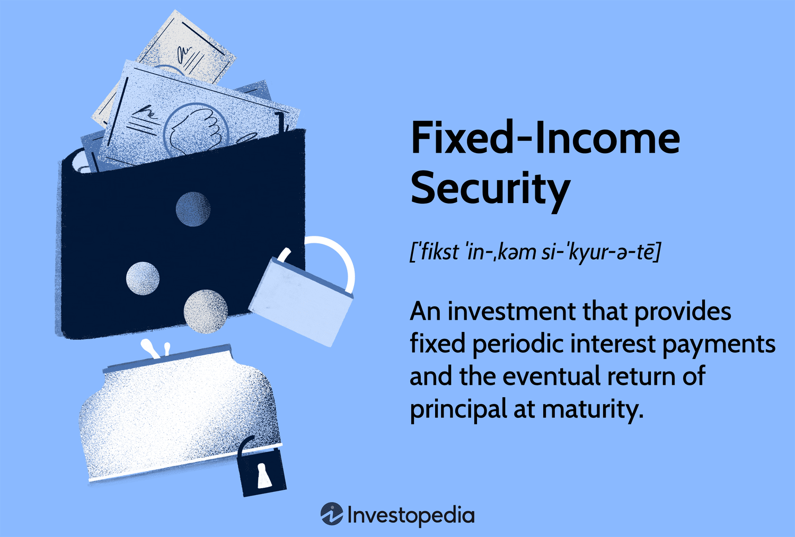

## Table of Contents

## What are fixed-interest securities?

Fixed-interest securities are investments that pay a set amount of interest regularly. They are often called bonds. When you buy a bond, you are lending money to the issuer, which could be a government or a company. In return, they promise to pay you interest at a fixed rate and to give your money back when the bond matures, which is at the end of a set period.

These securities are popular because they provide a steady income. This makes them attractive to people who want to know exactly how much money they will get and when. However, the value of the bond can go up or down in the market before it matures. If interest rates go up, the value of existing bonds usually goes down because new bonds will offer higher interest rates. If interest rates go down, the value of existing bonds usually goes up.

## How do fixed-interest securities work?

Fixed-interest securities, like bonds, are a way for you to lend money to a government or a company. When you buy a bond, you give them your money, and they agree to pay you back with interest over time. The interest rate is fixed, which means it stays the same no matter what happens in the economy. They pay you this interest regularly, often every six months, until the bond reaches its end date, called the maturity date. At that point, they give you your original money back.

These securities are popular because they give you a steady income. You know exactly how much money you will get and when, which can be reassuring. But, there's a catch. If you want to sell your bond before it matures, its price can change. If interest rates go up, new bonds will offer more interest, so your old bond might be worth less. If interest rates go down, your bond could be worth more because it pays more interest than new bonds. So, while fixed-interest securities are stable, their market value can change before they mature.

## What are the different types of fixed-interest securities?

Fixed-interest securities come in different types, like government bonds, corporate bonds, and municipal bonds. Government bonds are issued by national governments. They are seen as very safe because the government is less likely to go bankrupt. Corporate bonds are issued by companies. They can be riskier than government bonds, but they often offer higher interest rates to make up for that risk. Municipal bonds are issued by local governments or agencies. They help fund public projects like schools or roads and can offer tax benefits.

Another type of fixed-interest security is the treasury bond, which is a kind of government bond issued by the U.S. Treasury. These are considered among the safest investments because they are backed by the full faith and credit of the U.S. government. Then there are savings bonds, which are also issued by the U.S. Treasury. They are designed for individual investors and come with different features, like the Series EE and Series I bonds, which protect against inflation. Each type of fixed-interest security has its own rules and benefits, so it's good to know what you're getting into before you invest.

## Who typically invests in fixed-interest securities?

People who want a steady income often invest in fixed-interest securities. These investors might be retired and need regular money to live on. They like the fact that they know exactly how much they will get and when. This makes their financial planning easier. Also, people who don't want to take big risks with their money might choose these securities. They are seen as safer than stocks because they promise to pay back the money with interest.

Some big investors, like banks and insurance companies, also put their money into fixed-interest securities. They need to keep their money safe while still [earning](/wiki/earning-announcement) some interest. These big investors might buy a lot of bonds at once. They can handle the ups and downs of the bond market better than small investors. Overall, fixed-interest securities attract a wide range of people, from those saving for the future to those who need income right now.

## What are the benefits of investing in fixed-interest securities?

One big benefit of investing in fixed-interest securities is that they give you a steady income. When you buy a bond, you know exactly how much money you will get and when. This makes it easier to plan your finances, especially if you are retired or need a regular income. Fixed-interest securities are also seen as safer than other investments like stocks. This is because they promise to pay you back your money with interest. If you need to keep your money safe while still earning some interest, these securities can be a good choice.

Another benefit is that fixed-interest securities can help you spread out your risk. If you put all your money in one type of investment, you could lose a lot if that investment does badly. But if you have some money in bonds, some in stocks, and maybe some in other things, you are less likely to lose everything at once. Also, some types of bonds, like government bonds, are very safe because they are backed by the government. This means there is a very low chance that they will not pay you back. So, fixed-interest securities can be a good way to keep your money safe and still earn some interest.

## What are the risks associated with fixed-interest securities?

Even though fixed-interest securities are seen as safe, they still have risks. One risk is that the issuer might not be able to pay you back. This is more likely with corporate bonds from companies that are not doing well. If a company goes bankrupt, you might lose your money. Government bonds are safer, but even countries can have financial problems. Another risk is that interest rates might change. If rates go up, new bonds will pay more interest, so your old bond might be worth less if you want to sell it before it matures.

The value of fixed-interest securities can also go up and down in the market. If you need to sell your bond before it matures, you might get less money than you paid for it. This can happen if interest rates rise or if people think the issuer is less likely to pay back the money. Also, inflation can be a problem. If prices go up a lot, the interest you get from your bond might not be enough to keep up with the cost of living. So, while fixed-interest securities are safer than many other investments, they still have risks that you need to think about.

## How do interest rates affect fixed-interest securities?

Interest rates have a big effect on fixed-interest securities like bonds. When interest rates go up, new bonds start paying more interest. This makes your old bond, which pays less interest, less attractive to other people. If you want to sell your bond before it matures, you might have to sell it for less money because people will want the new bonds that pay more. On the other hand, if interest rates go down, your old bond becomes more valuable because it pays more interest than the new bonds. This means you could sell your bond for more money if you need to.

This relationship between interest rates and bond prices can be tricky. If you plan to hold onto your bond until it matures, you don't have to worry about these price changes. You will still get the same amount of interest and your money back at the end. But if you might need to sell your bond before it matures, you need to keep an eye on interest rates. They can make a big difference in how much your bond is worth in the market.

## What is the role of fixed-interest securities in a diversified investment portfolio?

Fixed-interest securities play an important role in a diversified investment portfolio. They help spread out the risk because they are usually safer than other investments like stocks. When you have different types of investments, you are less likely to lose all your money if one type does badly. Fixed-interest securities give you a steady income, which can be really helpful if you need money regularly. This makes them a good choice for people who want to keep their money safe while still earning some interest.

Another way fixed-interest securities help in a diversified portfolio is by balancing out the ups and downs of the stock market. When stocks go down, bonds might not go down as much or might even go up. This can help protect your overall investment from big losses. By having some money in bonds, you can feel more secure because you know you will get a fixed amount of interest no matter what happens in the stock market. So, fixed-interest securities can make your investment portfolio more stable and less risky.

## How can one assess the credit risk of fixed-interest securities?

Assessing the credit risk of fixed-interest securities means figuring out how likely it is that the issuer will pay you back. You can start by looking at the credit rating of the bond. Agencies like Moody's, Standard & Poor's, and Fitch give bonds ratings based on how safe they think the bond is. A high rating, like AAA, means the bond is very safe. A low rating, like BB or lower, means the bond is riskier. These ratings can help you decide if the bond is worth the risk.

Another way to assess credit risk is by looking at the financial health of the issuer. For corporate bonds, you can check the company's financial statements to see if they are making money and paying their debts. For government bonds, you can look at the country's economic situation. If a country is having financial problems, its bonds might be riskier. By doing some research, you can get a better idea of whether the issuer will be able to pay you back when the bond matures.

## What are the tax implications of investing in fixed-interest securities?

When you invest in fixed-interest securities like bonds, you need to think about taxes. The interest you earn from bonds is usually taxed as regular income. This means you will pay taxes on the interest every year, just like you do with your salary. The tax rate depends on your income and where you live. Some bonds, like municipal bonds, can be tax-free if you live in the right place. This means you don't have to pay federal taxes on the interest, and sometimes you don't have to pay state taxes either.

If you sell a bond before it matures and make a profit, you might have to pay capital gains tax. This tax is on the money you make from selling the bond for more than you paid for it. The tax rate for capital gains can be different from the tax rate for regular income. If you sell the bond for less than you paid, you might be able to claim a loss on your taxes, which can lower the amount of tax you owe. So, it's important to know how taxes work with bonds to plan your investments wisely.

## How do inflation and deflation impact the value of fixed-interest securities?

Inflation can make fixed-interest securities less valuable over time. When inflation goes up, the prices of things you buy every day also go up. But the interest you get from your bond stays the same. This means the money you earn from the bond might not be enough to keep up with the higher prices. For example, if you get $100 in interest every year, but inflation makes everything 5% more expensive, that $100 won't buy as much as it used to. So, inflation can eat away at the real value of the money you get from your bond.

Deflation, on the other hand, can make fixed-interest securities more valuable. When deflation happens, prices go down, so the money you earn from your bond can buy more than before. If you get $100 in interest every year, and prices drop by 5%, that $100 will be worth more because it can buy more things. But deflation is less common than inflation, and it can also mean that the economy is not doing well. So, while your bond might be worth more in a deflationary period, the overall economic situation could still affect your investments in other ways.

## What advanced strategies can be used to optimize returns from fixed-interest securities?

One advanced strategy to optimize returns from fixed-interest securities is called bond laddering. This means you buy bonds that mature at different times. Instead of putting all your money into one bond that matures in 10 years, you could buy bonds that mature in 2, 4, 6, 8, and 10 years. This way, you get your money back at different times. When a bond matures, you can use that money to buy a new bond with a higher interest rate if rates have gone up. This can help you earn more interest over time and also gives you more flexibility if you need some of your money sooner.

Another strategy is to look for bonds that are undervalued. Sometimes, the market might think a bond is riskier than it really is, so the price goes down. If you do your research and find that the bond is actually safer than people think, you can buy it at a lower price. When the bond matures, you get the full amount back, so you make more money because you bought it cheap. This can be a bit risky because you need to be sure the bond is safe, but it can also lead to higher returns if you get it right.

A third strategy is to use bond funds or ETFs. These are like baskets of bonds that you can buy all at once. They are managed by experts who try to pick the best bonds to buy. By investing in a bond fund or [ETF](/wiki/etf-trading-strategies), you can spread out your risk because you own a little bit of many different bonds. This can help you earn a good return without having to pick each bond yourself. Plus, it's easier to buy and sell shares in a fund than individual bonds, which can be useful if you need to change your investments quickly.

## What is the understanding of fixed-interest securities?

Fixed-interest securities, commonly referred to as bonds, play a critical role in financial markets by offering predictable returns to investors through regular interest payments. These financial instruments are especially attractive to risk-averse investors who seek stable income streams. A bond represents a loan made by an investor to a borrower, typically a government, municipality, or corporation. In exchange for the capital raised through these instruments, issuers promise to pay a fixed interest rate, known as the coupon rate, until the bond matures.

The certainty offered by the fixed coupon rate distinguishes bonds from other asset classes such as equities, contributing to their appeal as a relatively stable investment option. However, while bonds tend to exhibit lower [volatility](/wiki/volatility-trading-strategies) compared to stocks, they are not free from risks. Investors must be keenly aware of various risk factors associated with these securities.

Bonds are categorized based on the type of issuer and the projects they finance. Government bonds, such as U.S. Treasury securities, are issued to support government spending and infrastructure projects. These bonds are generally considered low-risk due to the backing of the federal government. Conversely, corporate bonds are issued by companies to finance business activities and expansion, and [carry](/wiki/carry-trading) a higher risk compared to government bonds due to the potential for corporate default.

Understanding the nuances of bond investing requires familiarity with specific terms and concepts. The coupon payment, typically made semi-annually, is calculated as follows:

$$
\text{Coupon Payment} = \frac{\text{Coupon Rate} \times \text{Face Value}}{\text{Number of Payments Per Year}}
$$

For instance, a bond with a face value of $1,000 and an annual coupon rate of 5% would pay $25 every six months. Despite the promise of stable coupon payments, bonds are susceptible to various risks, including [interest rate](/wiki/interest-rate-trading-strategies) risk, credit risk, inflation risk, and [liquidity](/wiki/liquidity-risk-premium) risk, each necessitating thorough evaluation by investors.

Ultimately, while fixed-interest securities serve as a foundation for income-focused investment strategies, prudent management of associated risks is essential for maximizing their benefits.

## References & Further Reading

Fixed Income Securities: Tools for Today's Markets by Bruce Tuckman and Angel Serrat offers a comprehensive examination of the tools and techniques prevalent in modern fixed-income markets. This resource is invaluable for gaining an understanding of the market dynamics that govern securities like bonds, providing insights into pricing, risk management, and investment strategies.

Algorithmic Trading: Winning Strategies and Their Rationale by Ernie Chan investigates into the methodologies underpinning [algorithmic trading](/wiki/algorithmic-trading), emphasizing its application across various financial instruments. The book provides strategic frameworks for developing successful trading algorithms, addressing quantitative strategies essential for navigating fixed-interest securities effectively.

AI in Algorithmic Trading emphasizes harnessing [artificial intelligence](/wiki/ai-artificial-intelligence) in optimizing algorithmic trading strategies. Through [machine learning](/wiki/machine-learning), financial algorithms can adapt to data-driven insights, crafting more efficient and predictive trading models. These advancements facilitate improved risk assessment and enhance trading performance in fixed-income markets.

The Bond Book: Everything Investors Need to Know About Treasuries, Municipals, GNMAs, Corporates, and Zeros by Annette Thau serves as a definitive guide to understanding and investing in various bond types. This book is essential for investors looking to deepen their knowledge of fixed-income securities, offering practical advice on navigating the complexities of the bond market.

Advances in Financial Machine Learning by Marcos Lopez de Prado explores cutting-edge techniques at the intersection of machine learning and finance. The book presents advanced methodologies for financial data analysis, enabling the development of more sophisticated and effective trading algorithms. It is particularly relevant for those interested in leveraging technology to enhance the management of investments in fixed-interest securities.

