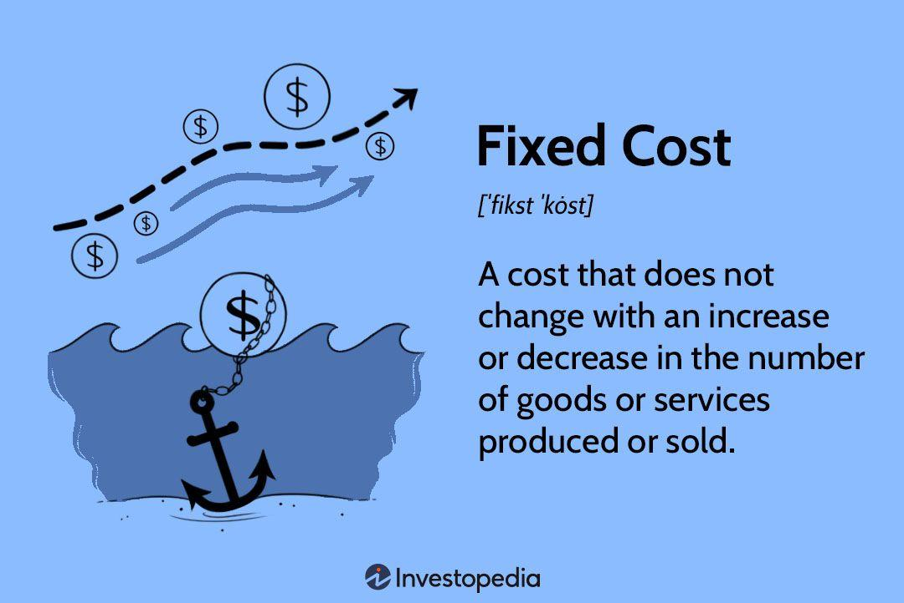

## Table of Contents

## What is a fixed price?

A fixed price is a set amount of money that you agree to pay for something. It doesn't change, no matter what happens during the work or project. For example, if you hire someone to paint your house for a fixed price of $1000, you will pay $1000 even if it takes them longer than expected or if they need more paint.

Fixed prices are good because they help you plan your budget. You know exactly how much you will spend, so you can save up the right amount of money. However, sometimes a fixed price can be risky for the person doing the work. If they find out the job is harder or takes longer than they thought, they still have to do it for the same price.

## How does a fixed price differ from other pricing models?

A fixed price is different from other pricing models because it stays the same no matter what happens. For example, if you agree on a fixed price to build a website, you will pay that price even if the work takes longer or if more people need to be involved. Other pricing models, like hourly rates or cost-plus pricing, can change based on how long the work takes or how much it costs to do the job.

Hourly rates mean you pay for each hour someone works on your project. If the job takes more time, you pay more money. This can be good if you're not sure how long the project will take, but it can also make it hard to plan your budget. Cost-plus pricing is when you pay for the actual cost of the work, plus a little extra for the person doing the job. This can be good if the costs change a lot, but it can also make the final price higher than you expected.

In summary, fixed prices give you a clear budget to plan with, but they can be risky for the person doing the work if things go wrong. Hourly rates and cost-plus pricing can be more flexible, but they can also make it harder to know how much you will end up spending. Each pricing model has its own advantages and disadvantages, and the best choice depends on what you need and what you're comfortable with.

## What are the key components of a fixed price contract?

A fixed price contract has a few important parts. The first part is the price. This is the amount of money you agree to pay for the whole job. It stays the same no matter what happens during the project. The second part is the scope of work. This is a list of all the things that need to be done. It's important because it helps both you and the person doing the work know exactly what is included in the price.

Another key part of a fixed price contract is the timeline. This is when the work will start and when it should be finished. Having a clear timeline helps everyone plan and stay on track. The last part is the payment terms. This explains when and how you will pay the agreed price. It might be all at once when the job is done, or it might be in smaller payments at different stages of the project. All these parts together make up a fixed price contract and help make sure everyone knows what to expect.

## Can you explain the mechanism of setting a fixed price?

Setting a fixed price starts with understanding the project well. You need to know all the things that need to be done, how long it might take, and what materials or resources will be needed. This helps you figure out how much the job will cost. Once you have a good idea of the costs, you can add a bit more to make sure you have enough money to cover any surprises. This extra amount is called a contingency or buffer. After adding the buffer, you have your fixed price.

Next, you talk with the person or company you want to hire. You tell them the fixed price and explain what they will get for that price. It's important to be clear about what is included in the price so there are no surprises later. If they agree to the price, you write it down in a contract. The contract should say the price, what work will be done, when it will start and finish, and how and when you will pay. Once both sides sign the contract, the fixed price is set and the work can begin.

## What are the advantages of using a fixed price model for buyers?

Using a fixed price model helps buyers know exactly how much they will spend on a project. This makes it easier to plan their budget. They don't have to worry about the price going up if the job takes longer or if more materials are needed. It gives them peace of mind and helps them feel more in control of their money.

Another advantage is that it can make the project go faster. Because the price is set, the person doing the work has a good reason to finish the job on time. They can't ask for more money if it takes longer, so they work hard to get it done within the agreed timeline. This can save the buyer time and help them start using the finished project sooner.

## What are the potential disadvantages of fixed price contracts for sellers?

Fixed price contracts can be risky for sellers because they might end up doing more work than they planned for the same amount of money. If the job turns out to be harder or takes longer than expected, the seller still has to finish it for the agreed price. This means they could lose money if they didn't guess the costs right at the start.

Another problem is that sellers might have to rush to finish the job on time. Because they can't ask for more money if it takes longer, they might cut corners or not do their best work just to meet the deadline. This can hurt their reputation and make customers unhappy. In the end, fixed price contracts can make it hard for sellers to make a good profit and keep their customers happy.

## How is risk managed in fixed price agreements?

In fixed price agreements, risk is managed by making a good plan at the start. The seller needs to think about everything that could go wrong and add a bit more money to the price to cover those risks. This extra money is called a contingency or buffer. By doing this, the seller can protect themselves if the job takes longer or costs more than they thought. It's important for the seller to talk about these risks with the buyer so everyone understands what might happen.

Even with a good plan, there can still be surprises. To handle these, the contract might have some rules about what to do if things change a lot. For example, if the buyer wants to add something new to the project, the seller might be able to ask for more money. Or, if something very unexpected happens, like a big storm that stops work, the contract might say how to deal with that. By having clear rules in the contract, both the buyer and the seller can feel safer about the risks.

## In what industries are fixed price contracts most commonly used?

Fixed price contracts are often used in construction. When someone wants to build a house or a building, they might agree on a fixed price with the builder. This helps the person paying know exactly how much they will spend. It also means the builder has to finish the job for that price, even if it takes longer or costs more than they thought. This can be good for the person paying, but it can be risky for the builder if they didn't plan well.

Fixed price contracts are also common in the technology industry, especially for software development. A company might hire a team to build a new app or website and agree on a fixed price for the whole project. This helps the company plan their budget and know what they will get for their money. For the team building the software, it means they have to stick to the agreed price, which can be challenging if the project turns out to be harder or takes longer than expected. Both industries use fixed price contracts to help manage costs and expectations.

## What are the steps to negotiate a fixed price contract?

To negotiate a fixed price contract, start by understanding the project well. You need to know what needs to be done, how long it might take, and what materials or resources will be needed. Once you have a good idea of the costs, you can add a bit more to cover any surprises. This extra amount is called a contingency or buffer. After figuring out your price, talk to the person or company you want to hire. Explain the fixed price and what they will get for that price. Make sure to be clear about what is included in the price so there are no surprises later.

Next, listen to their thoughts and be ready to discuss the price. They might want to change the price or add more things to the project. Be open to making changes if it makes sense for both of you. If you agree on a price, write it down in a contract. The contract should say the price, what work will be done, when it will start and finish, and how and when you will pay. Once both sides sign the contract, the fixed price is set and the work can begin.

## How can changes in project scope be handled under a fixed price agreement?

When you have a fixed price agreement, changes in the project scope can be tricky. If the buyer wants to add something new or change what was agreed on, it can affect the price. To handle this, the contract should have rules about what to do if the scope changes. For example, if the buyer wants to add a new feature to a software project, the seller might be able to ask for more money to cover the extra work. It's important for both sides to talk about these changes and agree on how to handle them before they happen.

Having clear rules in the contract helps manage changes in the project scope. If the contract says how to deal with changes, it can make things easier for both the buyer and the seller. They can agree on a new price or a new timeline if needed. This way, everyone knows what to expect and can plan better. Good communication and a well-written contract are key to handling changes in a fixed price agreement.

## What legal considerations should be taken into account with fixed price contracts?

When you make a fixed price contract, you need to think about some legal things. One big thing is making sure the contract is clear and says everything about the price, what work will be done, when it will start and finish, and how you will pay. If the contract is not clear, it can cause problems later. Also, you should check if the laws in your area have special rules for fixed price contracts. Some places have laws that protect buyers or sellers in certain ways, so it's good to know about them.

Another thing to think about is what happens if someone does not follow the contract. If the seller does not finish the work on time or the buyer does not pay the right amount, there should be rules in the contract about what to do. These rules can help solve problems without going to court. It's also smart to talk to a lawyer before you sign a fixed price contract. They can help make sure the contract is fair and follows the law.

## How do economic factors influence the setting and adjustment of fixed prices?

Economic factors can change how fixed prices are set and adjusted. When the economy is doing well, people might have more money to spend, so sellers might set higher fixed prices because they think buyers can pay more. But if the economy is not doing well, people might not have as much money, so sellers might need to set lower fixed prices to get buyers to agree. Also, if the cost of materials or labor goes up because of inflation or other reasons, sellers might need to raise their fixed prices to cover these higher costs. But they have to be careful because if they raise the price too much, buyers might not want to pay.

Sometimes, economic changes can make sellers and buyers want to change a fixed price contract. If the cost of something important for the project goes up a lot, the seller might ask to change the fixed price to cover the new costs. But the buyer might not want to pay more, so they need to talk and agree on what to do. If they can't agree, they might need to follow the rules in the contract about what happens if the price needs to change. This is why it's important to think about economic factors when setting a fixed price and to have clear rules in the contract about how to handle changes.

## References & Further Reading

[1]: ["Advances in Financial Machine Learning"](https://www.amazon.com/Advances-Financial-Machine-Learning-Marcos/dp/1119482089) by Marcos Lopez de Prado

[2]: ["Quantitative Trading: How to Build Your Own Algorithmic Trading Business"](https://www.amazon.com/Quantitative-Trading-Build-Algorithmic-Business/dp/1119800064) by Ernest P. Chan

[3]: ["Algorithmic Trading and DMA: An introduction to direct access trading strategies"](https://www.amazon.com/Algorithmic-Trading-DMA-introduction-strategies/dp/0956399207) by Barry Johnson

[4]: ["Evidence-Based Technical Analysis: Applying the Scientific Method and Statistical Inference to Trading Signals"](https://www.amazon.com/Evidence-Based-Technical-Analysis-Scientific-Statistical/dp/0470008741) by David Aronson

[5]: ["Market Liquidity: Asset Pricing, Risk, and Crises"](https://www.amazon.com/Market-Liquidity-Asset-Pricing-Crises/dp/0521139651) by Yakov Amihud, Haim Mendelson, and Lasse Heje Pedersen