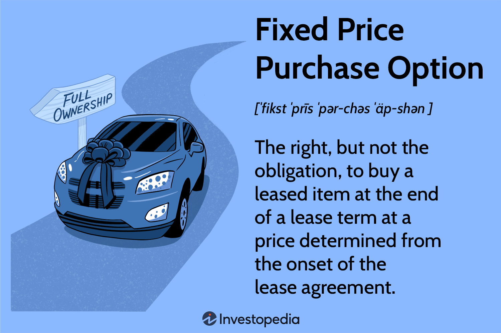

## Table of Contents

## What is a Fixed Price Purchase Option?

A Fixed Price Purchase Option is a type of agreement where a buyer can purchase an item or service at a set price that doesn't change. This option is often used in contracts to give the buyer the right, but not the obligation, to buy something at a later date for a price that was agreed upon earlier. This can be helpful because it protects the buyer from price increases over time.

For example, if you want to buy a car, you might agree with the seller on a fixed price purchase option. This means you can buy the car at any time within the agreed period for the price you set, even if the market price for the car goes up. This can be really useful if you think the price might go up in the future, or if you need some time to arrange the money to buy the item.

## How does a Fixed Price Purchase Option work?

A Fixed Price Purchase Option works by letting you agree on a price for something you want to buy later. You and the seller decide on a price today, and you can buy the item at that price anytime during the agreed time period. This means if you want to buy a house, you can set a price with the seller now, and even if house prices go up, you can still buy it at the lower price you agreed on.

This option is helpful because it protects you from price changes. If you think the price of what you want to buy might go up, you can lock in a lower price now. It gives you time to get ready to buy, like saving up money or getting a loan, without worrying about the price going up. But remember, you don't have to buy it if you change your mind; the option just gives you the chance to buy at the fixed price if you want to.

## What are the benefits of using a Fixed Price Purchase Option?

Using a Fixed Price Purchase Option can really help you save money. If you think the price of something you want to buy might go up, you can agree on a price now and buy it later at that same price. This means you don't have to worry about prices going up while you're getting ready to buy. It's like locking in a good deal for the future.

It also gives you more time to plan. You might need time to save up money or get a loan, and with a Fixed Price Purchase Option, you can take that time without rushing. You don't have to buy right away, but you know the price won't change if you decide to go ahead with the purchase. This makes planning and budgeting a lot easier.

## What are the potential drawbacks of a Fixed Price Purchase Option?

One potential drawback of a Fixed Price Purchase Option is that you might miss out if the price goes down. If you agree on a price now and the price drops later, you'll still have to pay the higher price you agreed on. This means you could end up paying more than you need to if the market changes.

Another issue is that you might have to pay for the option itself. Sometimes, sellers ask for a fee to lock in the price, and if you decide not to buy, you lose that money. This can make the whole thing more expensive, even if you don't end up buying the item.

Lastly, there's the risk that the item might not be available when you're ready to buy. If something happens to the item or the seller changes their mind, you might not be able to get it at the fixed price. This can be frustrating if you were counting on being able to buy it later.

## In what scenarios is a Fixed Price Purchase Option most useful?

A Fixed Price Purchase Option is really helpful when you think the price of something you want to buy might go up. For example, if you want to buy a house and you see that house prices are going up, you can agree on a price now and buy the house later at that same price. This means you won't have to pay more even if the market changes. It's like getting a good deal locked in for the future.

It's also useful when you need time to get ready to buy. Maybe you need to save up money or get a loan, and a Fixed Price Purchase Option gives you that time without worrying about the price changing. You don't have to buy right away, but you know the price won't go up if you decide to buy later. This makes planning and budgeting a lot easier.

In some cases, like buying a new car or a piece of equipment for your business, a Fixed Price Purchase Option can be a smart move if you expect prices to rise due to new technology or high demand. It gives you the flexibility to buy when you're ready, without the pressure of a changing market.

## How does a Fixed Price Purchase Option differ from other purchase options?

A Fixed Price Purchase Option is different from other purchase options because it lets you agree on a price now and buy later at that same price. With other options, like a variable price option, the price might change before you buy. For example, if you have a variable price option on a house, the price could go up or down before you decide to buy. But with a Fixed Price Purchase Option, the price stays the same no matter what happens in the market.

Another difference is that a Fixed Price Purchase Option gives you more control over when you buy. Some other options, like a lease-to-own agreement, might force you to buy at the end of the lease or lose your money. With a Fixed Price Purchase Option, you can choose to buy anytime during the agreed period, or not buy at all, without losing money (except maybe for the option fee). This makes it a good choice if you need time to plan or save up money without worrying about the price going up.

## What are the key elements to consider before choosing a Fixed Price Purchase Option?

Before choosing a Fixed Price Purchase Option, it's important to think about whether you expect the price of the item to go up. If you believe the price will rise, locking in a price now can save you money later. You should also consider if you need time to get ready to buy. Maybe you need to save up or get a loan, and a Fixed Price Purchase Option gives you that time without worrying about the price changing.

Another thing to think about is the cost of the option itself. Some sellers might ask for a fee to lock in the price, and if you decide not to buy, you might lose that money. Also, make sure the item will still be available when you're ready to buy. If something happens to the item or the seller changes their mind, you might not be able to get it at the fixed price. So, it's important to weigh these factors before deciding if a Fixed Price Purchase Option is right for you.

## How can one negotiate the terms of a Fixed Price Purchase Option?

To negotiate the terms of a Fixed Price Purchase Option, start by understanding what you want. Think about the price you're willing to pay and how long you need to make the purchase. When you talk to the seller, be clear about your needs and why you want a fixed price. You can say something like, "I'm interested in buying this at a set price because I think the price will go up, but I need some time to get the money ready." This helps the seller see your point of view.

Next, discuss the details of the option. Ask about any fees for locking in the price and how long the option will last. You might say, "Can we agree on a price of $X for Y months? And what would be the fee for this option?" Be ready to compromise. If the seller wants a higher price or a shorter time, see if you can meet in the middle. Maybe you can agree on a slightly higher price for a longer time, or a lower fee for a shorter period. The key is to keep talking until you both feel good about the deal.

## What are the legal implications of entering into a Fixed Price Purchase Option agreement?

When you enter into a Fixed Price Purchase Option agreement, it's important to understand the legal implications. This agreement gives you the right, but not the obligation, to buy something at a set price within a certain time. It's like a contract that says you can buy at the agreed price no matter what happens to the market. But, if you don't buy within the time limit, the option expires, and you might lose any fee you paid for the option. It's also important to make sure the agreement is written clearly so both you and the seller know exactly what you're agreeing to.

Another thing to consider is what happens if either you or the seller can't meet the terms of the agreement. If the seller can't deliver the item or if you can't pay, there might be legal consequences. It's a good idea to have a lawyer look over the agreement before you sign it to make sure it's fair and covers all the important points. This can help avoid any misunderstandings or legal problems later on. Remember, the agreement is a legal document, so it's important to take it seriously and understand all the terms before you agree.

## How do market conditions affect the effectiveness of a Fixed Price Purchase Option?

Market conditions can really change how useful a Fixed Price Purchase Option is. If prices are going up, this option can be a big help. You can agree on a price now and buy later at that same price, even if the market price goes up. This means you save money because you don't have to pay the higher price. It's like getting a good deal locked in for the future. But, if prices go down, the option might not be so helpful. You'll still have to pay the price you agreed on, even if you could get it cheaper on the market. So, it's important to think about where prices might go before choosing a Fixed Price Purchase Option.

Another thing to think about is how fast the market is changing. If the market is really unstable and prices are jumping around a lot, a Fixed Price Purchase Option can give you peace of mind. You know exactly what you'll pay, no matter what happens in the market. This can be a big relief if you need time to get ready to buy. But, if the market is stable and prices aren't changing much, the option might not be worth it. You might end up paying a fee for something that doesn't really help you save money or give you any extra time. So, it's important to look at the market and see if a Fixed Price Purchase Option will really help you.

## Can a Fixed Price Purchase Option be combined with other financial instruments?

Yes, a Fixed Price Purchase Option can be combined with other financial instruments to make a stronger plan. For example, you might use it with a loan or a savings plan. If you agree on a price to buy a house with a Fixed Price Purchase Option, you can also get a loan to help you pay for it. This way, you lock in the price and have a way to pay for it when you're ready. Or, you might save up money in a special account while you have the option, so you're sure you can buy at the agreed price.

Another way to combine it is with other types of options or contracts. For example, you might have a lease-to-own agreement and a Fixed Price Purchase Option at the same time. With the lease-to-own, you rent something with the chance to buy it later, and the Fixed Price Purchase Option lets you set the price you'll pay if you decide to buy. This can give you more time and control over when and how you buy something. It's all about making sure you have the best plan for your needs.

## What advanced strategies can be employed to maximize the benefits of a Fixed Price Purchase Option?

One advanced strategy to maximize the benefits of a Fixed Price Purchase Option is to use it as part of a larger investment plan. For example, if you think the price of a property will go up, you can agree on a fixed price now and buy it later at that price. While you wait, you can invest the money you would have used to buy the property right away in other places, like stocks or bonds, to earn more money. This way, you can make extra money while you wait, and still buy the property at the lower price you agreed on. It's like getting the best of both worlds: locking in a good price and earning more money at the same time.

Another strategy is to use a Fixed Price Purchase Option to hedge against inflation. If you expect prices to go up because of inflation, agreeing on a fixed price now can protect you from those higher prices later. You can combine this with other financial tools, like inflation-protected bonds, to make sure your money keeps its value. This way, you're not just saving money on the purchase, but also making sure your savings don't lose value over time. It's a smart way to plan for the future and make sure you're ready for whatever the economy does.

## How can one implement a strategy?

Implementing a strategy that effectively combines fixed price purchase options with algorithmic trading involves well-defined goals and methodologies. One crucial aspect is establishing a robust framework for back-testing and forward testing. Back-testing involves using historical data to simulate how a strategy would have performed in the past. This simulation helps identify potential weaknesses and strengths before any capital is at risk. Forward testing, or paper trading, involves testing strategies in real-time market conditions without financial involvement. This dual approach ensures that strategies are adaptable and resilient under various market conditions.

To facilitate evaluation and refinement, traders should leverage performance metrics. Key metrics include total return, which measures the overall profitability; drawdown, which indicates the peak-to-trough decline in the portfolio value; and the Sharpe ratio, which assesses risk-adjusted returns. The Sharpe ratio is calculated by:

$$
\text{Sharpe Ratio} = \frac{\text{Average Return} - \text{Risk-Free Rate}}{\text{Standard Deviation of Return}}
$$

This formula helps traders understand how much excess return they receive per unit of risk taken, with a higher Sharpe ratio indicating more attractive risk-adjusted returns.

Continuous learning and adaptability are paramount in trading. Traders should frequently reassess their strategies based on these performance metrics to account for evolving market dynamics. Utilizing advanced technologies like [machine learning](/wiki/machine-learning) can further enhance decision-making by identifying patterns and generating insights that might not be evident through traditional analysis.

In Python, traders can implement these testing methodologies and calculate performance metrics using libraries such as pandas for data manipulation and [backtrader](/wiki/backtrader) for back-testing. A simple example of calculating the Sharpe ratio using Python is:

```python
import numpy as np
import pandas as pd

# Example returns data
returns = pd.Series([0.02, 0.015, -0.01, 0.03, 0.025, -0.005])

# Risk-free rate (e.g., 2% annualized)
risk_free_rate = 0.02 / 252  # assuming trading days in a year

# Calculate daily excess returns
excess_returns = returns - risk_free_rate

# Calculate Sharpe ratio
sharpe_ratio = (excess_returns.mean() / excess_returns.std()) * np.sqrt(252)
print(f'Sharpe Ratio: {sharpe_ratio}')
```

This strategy should not only aim for predictive precision but also incorporate risk management elements, such as setting stop-loss levels to cap losses and using dynamic hedging tactics in response to market movements. By embracing these comprehensive measures, traders can strategically position themselves to optimize opportunities presented by fixed price purchase options combined with algorithmic trading.

## References & Further Reading

[1]: Bergstra, J., Bardenet, R., Bengio, Y., & Kégl, B. (2011). ["Algorithms for Hyper-Parameter Optimization."](https://dl.acm.org/doi/10.5555/2986459.2986743) Advances in Neural Information Processing Systems 24.

[2]: ["Advances in Financial Machine Learning"](https://www.amazon.com/Advances-Financial-Machine-Learning-Marcos/dp/1119482089) by Marcos Lopez de Prado

[3]: ["Evidence-Based Technical Analysis: Applying the Scientific Method and Statistical Inference to Trading Signals"](https://www.amazon.com/Evidence-Based-Technical-Analysis-Scientific-Statistical/dp/0470008741) by David Aronson

[4]: ["Machine Learning for Algorithmic Trading"](https://github.com/stefan-jansen/machine-learning-for-trading) by Stefan Jansen

[5]: ["Quantitative Trading: How to Build Your Own Algorithmic Trading Business"](https://www.amazon.com/Quantitative-Trading-Build-Algorithmic-Business/dp/1119800064) by Ernest P. Chan