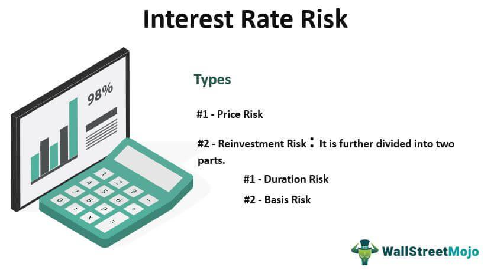

## Table of Contents

## What is a fixed rate bond?

A fixed rate bond is a type of investment where you lend money to a bank or a company for a set period of time. In return, they promise to pay you a fixed amount of interest regularly, usually every year or every month. The interest rate stays the same throughout the entire time you have the bond. This means you know exactly how much money you will earn from the bond before you buy it.

Fixed rate bonds are popular because they offer a predictable income. This can be helpful if you want to plan your finances without worrying about changes in interest rates. However, the downside is that if interest rates go up, you won't benefit from the increase because your bond's rate stays the same. Also, you usually can't take your money out early without paying a penalty, so you need to be sure you can leave your money in the bond for the full term.

## How does a fixed rate bond work?

A fixed rate bond works by you giving money to a bank or a company. They promise to give you back your money after a certain time, like one year or five years. While they have your money, they also pay you interest. The interest is a fixed amount, which means it doesn't change. You know how much interest you will get every year or every month.

When you buy a fixed rate bond, you agree to leave your money with the bank or company until the end of the term. If you need your money back before the term ends, you might have to pay a penalty. This makes fixed rate bonds good for saving money that you won't need for a while. The fixed interest helps you plan because you know exactly how much money you will earn.

## What are the benefits of investing in fixed rate bonds?

One big benefit of investing in fixed rate bonds is that they give you a steady income. You know exactly how much interest you will get because the rate stays the same the whole time. This makes it easier to plan your money because you can count on that income. It's like getting a regular paycheck from your investment.

Another benefit is that fixed rate bonds are usually safer than other types of investments. They are less likely to lose value, which makes them a good choice if you don't want to take big risks with your money. Even if the market goes up and down, your bond will keep paying the same amount of interest. This makes them a good way to keep your savings safe while still [earning](/wiki/earning-announcement) some money.

## What are the potential risks associated with fixed rate bonds?

One risk with fixed rate bonds is that you can't get your money back early without paying a penalty. If you need your money before the bond's term ends, you might lose some of the interest you were supposed to earn or even some of your original money. This means you need to be sure you can leave your money in the bond for the whole time.

Another risk is that if interest rates go up after you buy your bond, you won't get the benefit of the higher rates. Your bond will keep paying the same lower rate until it ends. This can be frustrating if you see other investments starting to offer more money.

Lastly, there's a small chance that the bank or company you lent your money to might not be able to pay you back. This is called default risk. While it's rare, especially with bonds from big, well-known companies or governments, it's still something to think about. Always check how safe the bond is before you buy it.

## How do interest rates affect fixed rate bonds?

Interest rates can affect fixed rate bonds in a big way. When you buy a fixed rate bond, the [interest rate](/wiki/interest-rate-trading-strategies) is locked in for the whole time you have the bond. If interest rates go up after you buy your bond, you won't get the higher rate. You'll keep getting the same amount of interest that was set when you bought the bond. This can be a problem if other investments start offering more money because you'll be stuck with the lower rate until your bond ends.

On the other hand, if interest rates go down after you buy your bond, you're in a good spot. Your bond will keep paying the higher rate that was set when you bought it, even if new bonds are offering less. This means you'll be earning more interest than people who buy new bonds at the lower rate. So, the timing of when you buy your fixed rate bond can make a big difference in how much money you earn.

## What is interest rate risk in the context of fixed rate bonds?

Interest rate risk is the chance that changes in interest rates will affect how much money you earn from your fixed rate bond. When you buy a fixed rate bond, the interest rate stays the same for the whole time you have the bond. If interest rates go up after you buy your bond, you won't get the new, higher rate. You'll still get the same amount of interest that was set when you bought the bond. This means if other investments start offering more money, you'll be stuck with the lower rate until your bond ends.

On the flip side, if interest rates go down after you buy your bond, you're in a good position. Your bond will keep paying the higher rate that was set when you bought it, even if new bonds are offering less. This means you'll be earning more interest than people who buy new bonds at the lower rate. So, the timing of when you buy your fixed rate bond can make a big difference in how much money you earn.

## How can changes in market interest rates impact the value of fixed rate bonds?

When market interest rates go up, the value of fixed rate bonds usually goes down. This happens because new bonds that are sold will have higher interest rates. If you want to sell your old bond, people will want to buy the new bonds instead because they offer more money. To make your old bond attractive, you might have to sell it for less than what you paid for it. This is why the value of your fixed rate bond can drop if interest rates rise.

On the other hand, if market interest rates go down, the value of your fixed rate bond can go up. This is because your bond will be paying a higher interest rate than the new bonds being sold. People will want to buy your bond because it offers more money than the new ones. So, you might be able to sell your bond for more than what you paid for it. This shows how changes in market interest rates can affect the value of fixed rate bonds in opposite ways.

## What is the relationship between bond prices and interest rates?

When interest rates go up, the price of bonds goes down. This happens because new bonds that are sold will have higher interest rates. If you want to sell your old bond, people will want to buy the new bonds instead because they offer more money. To make your old bond attractive, you might have to sell it for less than what you paid for it. This is why the value of your bond can drop if interest rates rise.

On the other hand, when interest rates go down, the price of bonds goes up. This is because your bond will be paying a higher interest rate than the new bonds being sold. People will want to buy your bond because it offers more money than the new ones. So, you might be able to sell your bond for more than what you paid for it. This shows how changes in interest rates can affect the price of bonds in opposite ways.

## How can investors mitigate interest rate risk when investing in fixed rate bonds?

Investors can mitigate interest rate risk by building a bond ladder. This means buying bonds that mature at different times. For example, you might buy one bond that ends in one year, another in two years, and another in three years. When each bond matures, you can reinvest the money into a new bond at the current interest rate. This way, you won't have all your money locked into one bond if interest rates change.

Another way to manage interest rate risk is by choosing bonds with shorter terms. Shorter-term bonds are less affected by changes in interest rates because you get your money back sooner. You can then reinvest it at the new rates. This approach gives you more flexibility and helps you take advantage of higher rates if they go up.

## What are duration and convexity, and how do they relate to interest rate risk?

Duration and convexity are two important concepts that help investors understand how sensitive a bond is to changes in interest rates. Duration measures the average time it takes to get back the bond's price through its cash flows, like interest payments and the bond's face value at maturity. It tells you how much the bond's price will change if interest rates move. A higher duration means the bond's price will change more when interest rates go up or down. For example, if a bond has a duration of 5 years, its price might drop by about 5% if interest rates go up by 1%.

Convexity adds more detail to the picture that duration gives. It shows how the bond's price responds to interest rate changes in a non-linear way. While duration gives a good first guess, convexity helps fine-tune that guess. It's especially useful for big changes in interest rates. A bond with high convexity will have less price drop when interest rates go up and a bigger price increase when interest rates go down. Together, duration and convexity give investors a better idea of how their bond's value might change with interest rate movements, helping them manage interest rate risk more effectively.

## How do macroeconomic factors influence interest rate risk for fixed rate bonds?

Macroeconomic factors like inflation, economic growth, and central bank policies can change interest rates, which affects the value of fixed rate bonds. When the economy is growing fast and inflation is going up, central banks might raise interest rates to slow things down. If interest rates go up, new bonds will have higher interest rates, making old fixed rate bonds less attractive. People might not want to buy your old bond because they can get more money from a new one. This means you might have to sell your bond for less than you paid for it, which is called a loss in value.

On the other hand, if the economy is slowing down and inflation is low, central banks might lower interest rates to help the economy grow. When interest rates go down, new bonds will have lower interest rates, making your old fixed rate bond more attractive. People might want to buy your old bond because it pays more interest than the new ones. This means you could sell your bond for more than you paid for it, which is called a gain in value. So, keeping an eye on these macroeconomic factors can help you understand and manage the interest rate risk for your fixed rate bonds.

## What advanced strategies can be used to manage interest rate risk in a fixed rate bond portfolio?

One advanced strategy to manage interest rate risk in a fixed rate bond portfolio is using interest rate swaps. An interest rate swap is like a deal between you and another investor where you agree to swap interest payments. You might agree to pay them a floating interest rate, which changes with market rates, and they pay you a fixed rate. This can help balance out the risk if you think interest rates might go up. If rates do go up, the floating rate you pay will increase, but you'll still get the fixed rate from the swap, which helps protect your bond's value.

Another strategy is using bond options, like put options or call options. A put option gives you the right to sell your bond at a set price before it matures, which can be useful if interest rates go up and the bond's value drops. A call option lets you buy a bond at a set price, which can be good if rates go down and you want to buy new bonds at a lower price. These options can help you manage the risk of changing interest rates by giving you more control over when you buy or sell bonds.

Lastly, you can use a strategy called immunization. This means matching the duration of your bond portfolio to the time when you need the money. By doing this, you can reduce the impact of interest rate changes on your portfolio's value. For example, if you know you'll need the money in 5 years, you can choose bonds with a duration of 5 years. This way, even if interest rates change, the overall value of your portfolio should stay stable until you need the money.

## How can one build a balanced bond investment strategy?

Diversification is a critical element in constructing a bond investment strategy that effectively manages risks. By diversifying bond portfolios, investors can mitigate specific risks associated with individual issuers or market sectors. Fixed rate bonds play a vital role in this diversification process due to their predictable income stream, but they should be combined with other asset types to achieve a balanced investment portfolio.

Incorporating fixed rate bonds alongside equities, commodities, or other types of bonds, like floating rate or inflation-linked bonds, can help spread risk across different interest rate environments and economic conditions. This approach reduces the potential impact of adverse market movements on the entire portfolio, enhancing overall stability and return potential.

When selecting bonds for a diversified bond investment strategy, several key factors should be considered:

1. **Duration**: Duration measures a bond's sensitivity to changes in interest rates, with longer durations indicating greater sensitivity. To balance interest rate risk, a mix of bonds with varied durations should be included. Shorter-duration bonds usually exhibit less price volatility when interest rates change, offering some protection against rising rates.
$$
    \text{Modified Duration} = \frac{\text{Macaulay Duration}}{1 + \frac{y}{n}}

$$

    Where $y$ is the bond's yield and $n$ is the number of compounding periods per year.

2. **Credit Quality**: The credit quality of a bond issuer influences the default risk associated with the bond. Bonds with higher credit quality, such as those rated AAA by credit rating agencies, tend to offer lower yields but greater safety. Including bonds with varying credit qualities can balance potential returns and credit risk exposure.

3. **Yield**: Yield provides insight into potential income and return from a bond. Higher-yielding bonds often carry higher risk, but they can enhance portfolio returns if carefully selected within a diversified strategy. Comparing yields across bonds with similar durations and credit ratings helps identify attractive investment opportunities.

By carefully considering these factors when building a bond investment strategy, investors can better manage risks and position their portfolios for long-term stability. A balanced approach, incorporating a diversified mix of fixed rate bonds and other investment vehicles, can provide a reliable income stream while maintaining resilience against market fluctuations.

## References & Further Reading

[1]: Fabozzi, F. J. (2007). ["Fixed Income Analysis."](https://books.google.com/books/about/Fixed_Income_Analysis.html?id=lujLawVLS3YC) John Wiley & Sons.

[2]: Fabozzi, F. J. (2012). ["Bond Markets, Analysis, and Strategies."](https://books.google.com/books/about/Bond_Markets_Analysis_and_Strategies_ten.html?id=bQpNEAAAQBAJ) Pearson Education.

[3]: Malkiel, B. G. (1996). ["A Random Walk Down Wall Street: Including a Life-Cycle Guide to Personal Investing."](https://books.google.com/books/about/A_Random_Walk_Down_Wall_Street.html?id=fAsZGQfmXG8C) W.W. Norton & Company.

[4]: ["Investments"](https://www.nerdwallet.com/article/investing/types-of-investments) by Zvi Bodie, Alex Kane, and Alan J. Marcus.

[5]: ["Interest Rate Risk Modeling"](https://www.fdic.gov/bank-examinations/developing-key-assumptions-analysis-interest-rate-risk) by Sanjay K. Nawalkha, Gloria M. Soto, and Natalia A. Beliaeva, Risk Books.

[6]: López de Prado, M. (2018). ["Advances in Financial Machine Learning."](https://www.amazon.com/Advances-Financial-Machine-Learning-Marcos/dp/1119482089) John Wiley & Sons.

[7]: Chan, E. P. (2009). ["Quantitative Trading: How to Build Your Own Algorithmic Trading Business."](https://github.com/ftvision/quant_trading_echan_book) John Wiley & Sons.