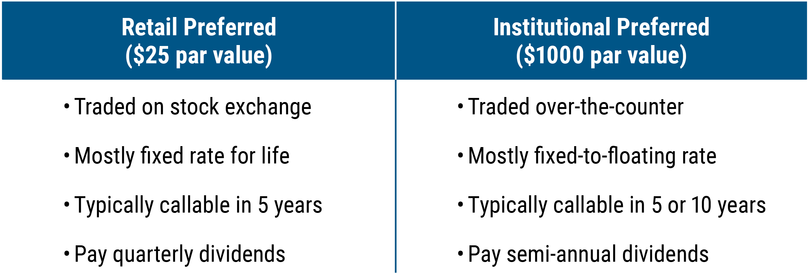

## Table of Contents

## What are Fixed-Rate Capital Securities?

Fixed-Rate Capital Securities are a type of investment where you get paid a fixed amount of interest regularly. They are often issued by banks or big companies to raise money. The interest rate stays the same throughout the life of the security, which can be a long time, like 10 or 20 years. This means you know exactly how much money you will get and when you will get it, which can be good if you want a steady income.

These securities are considered pretty safe because they come from well-established companies. But, they usually offer lower returns compared to riskier investments like stocks. If interest rates in the economy go up, the fixed rate you are getting might not look as good. But if rates go down, your fixed rate could be better than new securities being issued. So, they can be a good choice if you want stability and predictability in your investments.

## How do Fixed-Rate Capital Securities differ from other types of securities?

Fixed-Rate Capital Securities are different from other securities mainly because they pay a fixed amount of interest that stays the same over time. This is unlike Variable-Rate Securities, where the interest rate can change based on market conditions. For example, if you have a fixed-rate security, you might get 5% interest every year no matter what happens in the economy. But with a variable-rate security, your interest might go up or down. This makes fixed-rate securities good if you want to know exactly what you will earn.

Another difference is how safe and predictable they are compared to stocks or bonds. Stocks can go up and down a lot in value, and the dividends they pay can change or stop. Bonds might have fixed interest like fixed-rate securities, but they can be riskier because the company might not pay back the money if it has financial trouble. Fixed-rate securities are usually from big, stable companies, so they are seen as safer. But because they are safer, they often give lower returns than stocks or riskier bonds. This makes them a good choice for people who want a steady income without taking big risks.

## What are the key features of Fixed-Rate Capital Securities?

Fixed-Rate Capital Securities have a few main features that make them special. They pay a fixed amount of interest that stays the same for the whole time you own them. This means if you buy one that pays 5% interest every year, it will keep paying that 5% no matter what happens in the economy. This can be really good if you want to know exactly how much money you will get each year. These securities are often issued by big, stable companies or banks, which makes them pretty safe. But because they are safe, they usually don't give you as much money as riskier investments like stocks.

Another important feature is that they usually last a long time, like 10 or 20 years. This means you need to be ready to keep your money in them for a while. If interest rates in the economy go up after you buy a fixed-rate security, the fixed rate you are getting might not look as good compared to new securities. But if rates go down, your fixed rate could be better than what new securities are offering. So, fixed-rate securities are great if you want stability and predictability in your investments, and you are okay with keeping your money in them for a long time.

## Who typically issues Fixed-Rate Capital Securities?

Fixed-Rate Capital Securities are usually issued by big companies and banks. These companies are often well-known and financially stable, which makes the securities they issue seem safer. When these big companies need money to grow or do new projects, they might issue these securities to raise the funds they need. People who buy these securities are lending money to the company, and in return, they get a fixed amount of interest regularly.

The interest rate on these securities stays the same no matter what happens in the economy. This makes them different from other securities where the interest might change. Because the companies issuing these securities are usually big and stable, they are seen as less risky. But because they are safer, they usually offer lower returns compared to riskier investments like stocks. So, they are good for people who want a steady income without taking big risks.

## What are the benefits of investing in Fixed-Rate Capital Securities?

Investing in Fixed-Rate Capital Securities can be a good choice if you want a steady income. These securities pay you a fixed amount of interest every year, no matter what happens in the economy. This means you know exactly how much money you will get and when you will get it. This can be really helpful if you are planning your finances and need to know how much money you will have coming in regularly. It's like having a reliable paycheck from your investment.

Another benefit is that these securities are usually pretty safe. They are issued by big, stable companies or banks, so the risk of not getting your money back is low. This makes them a good option if you don't want to take big risks with your money. However, because they are safe, they usually don't offer as high returns as riskier investments like stocks. But if you are okay with lower returns for the sake of safety and predictability, Fixed-Rate Capital Securities can be a good fit for your investment strategy.

## What are the risks associated with Fixed-Rate Capital Securities?

One risk of Fixed-Rate Capital Securities is that the interest rate stays the same no matter what happens in the economy. If interest rates go up after you buy the security, you might be stuck with a lower rate than what new securities are offering. This means you could miss out on better returns if you had waited to invest. Another thing to think about is that these securities usually last a long time, like 10 or 20 years. If you need your money back before the security matures, you might have to sell it on the market, and you could end up getting less than what you paid for it.

Another risk is that even though these securities are from big, stable companies, there is still a chance the company could have financial trouble. If that happens, the company might not be able to pay the interest or give you your money back when the security matures. It's not very likely, but it's something to keep in mind. Also, because Fixed-Rate Capital Securities are seen as safe, they usually offer lower returns than riskier investments like stocks. If you are looking for higher returns, you might need to look at other types of investments, even though they come with more risk.

## How is the interest rate determined for Fixed-Rate Capital Securities?

The interest rate for Fixed-Rate Capital Securities is set when the security is first issued. The company or bank that issues the security decides on the rate based on several things. One big thing they look at is the current interest rates in the economy. If interest rates are high, they might offer a higher rate to make their security more attractive to investors. Another thing they consider is how much money they need to raise and how much they can afford to pay in interest. They also think about how safe their company is seen by investors. If investors think the company is very safe, the company might not need to offer a high interest rate to get people to buy the security.

Once the interest rate is set, it stays the same for the whole time you own the security. This means if you buy a security that pays 5% interest every year, it will keep paying that 5% no matter what happens with interest rates in the economy. This can be good because you know exactly how much money you will get each year. But it can also be a risk if interest rates go up after you buy the security. If that happens, the fixed rate you are getting might not look as good compared to new securities being issued with higher rates.

## What is the typical maturity period for Fixed-Rate Capital Securities?

Fixed-Rate Capital Securities usually have a long time before they mature. This means you have to wait a while before you get your money back. The typical maturity period for these securities can be anywhere from 10 to 30 years. This long time frame is something you need to think about because you won't be able to use that money for other things until the security matures.

Having such a long maturity period can be good if you want a steady income for a long time. The fixed interest you get every year can help you plan your finances. But it can also be a problem if you need your money back sooner. If you try to sell the security before it matures, you might not get back as much money as you paid for it. This is something to keep in mind when you are thinking about investing in Fixed-Rate Capital Securities.

## How do changes in interest rates affect Fixed-Rate Capital Securities?

Changes in interest rates can have a big impact on Fixed-Rate Capital Securities. If interest rates in the economy go up after you buy a fixed-rate security, the interest rate you are getting might not look as good compared to new securities being issued. For example, if you bought a security that pays 5% interest every year, and then interest rates go up to 6%, new securities might offer that higher rate. This means you could be stuck with a lower return than what you could get if you had waited to invest. This is called interest rate risk.

On the other hand, if interest rates go down after you buy a fixed-rate security, you could be in a good spot. The fixed rate you are getting might be better than what new securities are offering. For example, if you are still getting 5% interest and new securities are only offering 4%, your security looks pretty good. But remember, the interest rate on your security stays the same no matter what happens in the economy. So, you have to think about whether you are okay with that when you decide to invest.

## What are the tax implications of investing in Fixed-Rate Capital Securities?

When you invest in Fixed-Rate Capital Securities, you have to think about taxes. The interest you get from these securities is usually taxed as regular income. This means you have to pay taxes on the interest every year, just like you would on your salary. The tax rate you pay depends on how much money you make overall. If you are in a high tax bracket, you might have to pay more in taxes on the interest from your securities.

There can also be taxes when you sell your Fixed-Rate Capital Securities. If you sell them for more than you paid, you might have to pay capital gains tax on the profit. But if you sell them for less than you paid, you might be able to use that loss to lower your taxes. It's a good idea to talk to a tax advisor to understand exactly how taxes will affect your investment in Fixed-Rate Capital Securities. They can help you figure out the best way to manage your taxes and keep more of your money.

## How do Fixed-Rate Capital Securities fit into a diversified investment portfolio?

Fixed-Rate Capital Securities can be a good part of a diversified investment portfolio because they offer a steady income that stays the same no matter what happens in the economy. If you have other investments like stocks that can go up and down a lot, having some fixed-rate securities can help balance things out. They give you a reliable source of money every year, which can be really helpful if you need to plan your finances and know how much money you will have coming in.

These securities are also pretty safe because they are usually issued by big, stable companies or banks. This means they can help lower the overall risk in your portfolio. But because they are safe, they usually don't offer as high returns as riskier investments like stocks. So, you might want to have some fixed-rate securities to make your portfolio more stable, but also have other types of investments that might give you higher returns. This way, you can have a mix of safety and growth in your investments.

## What advanced strategies can be used to optimize returns from Fixed-Rate Capital Securities?

One advanced strategy to optimize returns from Fixed-Rate Capital Securities is called laddering. This means you buy securities that mature at different times. For example, you could buy some that mature in 5 years, some in 10 years, and some in 20 years. This way, you get your money back at different times. When a security matures, you can use the money to buy a new one at the current interest rate. If rates have gone up, you can get a better rate on the new security. This helps you take advantage of rising interest rates and keeps your money working for you.

Another strategy is to look for callable Fixed-Rate Capital Securities. These are securities that the issuer can decide to pay back early. They usually offer a higher interest rate to make up for this risk. If you think interest rates are going to stay the same or go down, these can be a good choice. You get a higher rate, and if the security is called, you can use the money to buy a new security at the same or better rate. But if you think rates are going to go up, you might want to avoid callable securities because you could be stuck with a lower rate if they are called back early.

## What are the unique risks and challenges of FRCS?

Fixed-rate capital securities (FRCS) present unique risks and challenges, which differ from traditional corporate bonds. A significant [factor](/wiki/factor-investing) contributing to these risks is their deferrable interest payment structure, which allows issuers the flexibility to defer payments without triggering default. While this feature provides issuers with financial relief during downturns, it adds a layer of uncertainty for investors, increasing the risk profile of these instruments compared to bonds with obligatory interest payments.

FRCS often transact in markets that are less liquid than those for standard fixed-income securities. Lower [liquidity](/wiki/liquidity-risk-premium) can exacerbate valuation challenges, particularly during periods of financial stress, when the ability to quickly buy or sell securities without affecting their price is critical. This illiquidity may lead to wider bid-ask spreads, increasing transaction costs for investors and potentially leading to a mismatch in pricing against the broader market conditions.

In addition to liquidity challenges, FRCS pricing behaviors are significantly influenced by market conditions, notably interest rate fluctuations. Given their fixed interest payouts, FRCS are highly sensitive to changes in prevailing interest rates. As rates rise, the fixed interest returns of FRCS become less attractive, leading to potential declines in their market value. Conversely, when interest rates fall, these securities become more desirable due to their relatively higher fixed yields. This inverse relationship between fixed-rate security prices and interest rates can be described by the price-yield formula:

$$

P = \frac{C}{r} \cdot (1 - \frac{1}{(1 + r)^n}) + \frac{F}{(1 + r)^n}
$$

where $P$ represents the price of the FRCS, $C$ is the coupon payment, $r$ is the yield to maturity, and $F$ is the face value of the security. Understanding the sensitivity of FRCS prices to interest rate changes is crucial for investors seeking to manage risk effectively in their portfolios.

Overall, navigating the complexities of FRCS requires investors to be cognizant of their higher risk profile, especially regarding deferrable payments, liquidity constraints, and interest rate sensibility.

## References & Further Reading

[1]: Bergstra, J., Bardenet, R., Bengio, Y., & Kégl, B. (2011). ["Algorithms for Hyper-Parameter Optimization."](https://dl.acm.org/doi/10.5555/2986459.2986743) Advances in Neural Information Processing Systems 24.

[2]: ["Advances in Financial Machine Learning"](https://www.amazon.com/Advances-Financial-Machine-Learning-Marcos/dp/1119482089) by Marcos Lopez de Prado

[3]: ["Evidence-Based Technical Analysis: Applying the Scientific Method and Statistical Inference to Trading Signals"](https://www.amazon.com/Evidence-Based-Technical-Analysis-Scientific-Statistical/dp/0470008741) by David Aronson

[4]: ["Machine Learning for Algorithmic Trading"](https://github.com/stefan-jansen/machine-learning-for-trading) by Stefan Jansen

[5]: ["Quantitative Trading: How to Build Your Own Algorithmic Trading Business"](https://www.amazon.com/Quantitative-Trading-Build-Algorithmic-Business/dp/1119800064) by Ernest P. Chan

[6]: Fridson, M. S., & Alvarez, F. (2011). ["Financial Statement Analysis: A Practitioner's Guide."](https://onlinelibrary.wiley.com/doi/book/10.1002/9781119457176) Wiley Finance.

[7]: ["Trading and Exchanges: Market Microstructure for Practitioners"](https://www.amazon.com/Trading-Exchanges-Market-Microstructure-Practitioners/dp/0195144708) by Larry Harris

[8]: Fabozzi, F. J. (2013). ["Bond Markets, Analysis, and Strategies"](https://books.google.com/books/about/Bond_Markets_Analysis_and_Strategies_ten.html?id=bQpNEAAAQBAJ) (8th Edition). Pearson.