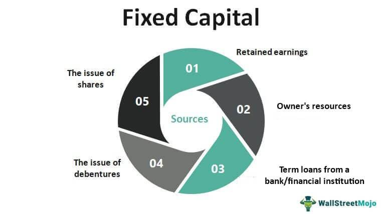

In an evolving financial landscape, fixed-rate capital securities (FRCS) stand out as an intriguing investment tool with significant implications for portfolio management and income strategy. These securities emerge as a hybrid financial instrument, combining attributes found in both corporate bonds and preferred stock. The synthesis of these features results in a unique asset class that offers investors fixed-income streams with the potential for robust yields. As financial markets grow more complex and interconnected, FRCS find their role expanding, challenging investors to comprehend their nuances and market behaviors to maximize their investment potential.

FRCS are not only notable for their distinctive structure but also for their place within modern financial strategies, where algorithmic trading has become increasingly prominent. Algorithmic trading enhances the efficiency of dealing with FRCS by automating complex trading strategies and managing the risks linked to their hybrid nature. The integration of advanced algorithms allows traders to navigate the less liquid markets in which FRCS often operate, thereby facilitating improved liquidity and more accurate price discovery. This interaction between innovative trading techniques and fixed-rate capital securities underscores the need to examine these instruments comprehensively.

The intersections of FRCS with other financial instruments like corporate bonds and preferred stock add layers of complexity that merit thorough analysis. Their hybrid nature leads them to attract investors seeking diversification and predictable income, while also presenting unique challenges, such as deferrable interest payments and sensitivity to interest rate changes. Consequently, a detailed examination of FRCS encompasses understanding these intertwined elements and the evolving methodologies used to trade them, ensuring investors are well-equipped to navigate an intricate financial environment.

## Table of Contents

## What Are Fixed-Rate Capital Securities?

Fixed-rate capital securities (FRCS) are a type of hybrid financial instrument that blend the characteristics of corporate bonds with those of preferred shares. Primarily designed to offer investors a consistent return, these securities typically carry a par value ranging from $25 to $1,000. One of the hallmark features of FRCS is their ability to provide attractive yields coupled with predictable income schedules, which are often structured on a quarterly, semiannual, or annual basis.

FRCS are distinguished from other types of securities by their fixed-rate nature, which implies that the interest or dividend payments to the investor are set at a fixed rate throughout the security's life. This feature renders them appealing to those seeking stable and predictable income. The relatively higher yields offered by FRCS, compared to traditional corporate bonds, make them an attractive option for income-focused investors.

These securities are generally labeled as investment-grade, a designation that indicates a relatively lower risk of default. However, despite the investment-grade status, FRCS carry unique risks and market behaviors that differentiate them from conventional bonds and stocks. Risk factors include interest rate sensitivity and credit risk, reflecting the issuer's capacity to meet payment obligations. Additionally, due to the hybrid nature of FRCS, they may behave differently during varying market conditions, which introduces complexities in valuing these instruments.

Market participants considering FRCS typically seek the diversification benefits provided by their hybrid structure. By occupying a middle ground between equity and debt, FRCS can help investors diversify risk and potentially enhance the overall return profile of their portfolios.

In sum, fixed-rate capital securities serve as a pivotal option for those seeking fixed income investments. While they offer a blend of features from both bonds and preferred stocks, investors should be aware of the inherent risks and specific market dynamics associated with these instruments when incorporating them into their investment strategy.

## Understanding the Benefits of FRCS

Fixed-rate capital securities (FRCS) offer several advantages which make them an attractive option for income-focused investors. These securities are structured to deliver a reliable stream of income on a monthly, quarterly, or semiannual basis. This regular income generation is particularly beneficial for investors looking to maintain a steady cash flow.

One of the primary benefits associated with FRCS is their investment-grade rating. This classification indicates that the securities are considered to have a relatively low risk of default, balancing risk with the potential for return. An investment-grade rating provides a level of confidence to investors, which can be especially appealing during periods of market [volatility](/wiki/volatility-trading-strategies). Despite their hybrid nature, which combines elements of corporate bonds and preferred shares, FRCS maintain this rating, making them suitable for conservative investment strategies.

In addition to income generation and credit quality, FRCS can contribute to portfolio diversification. The hybrid characteristics of FRCS mean they may behave differently from traditional equity or bond investments, providing a portfolio with exposure to varied asset movements. This diversification can potentially reduce the overall risk of an investment portfolio, as FRCS may respond differently to economic conditions and [interest rate](/wiki/interest-rate-trading-strategies) changes compared to other investment types.

Overall, FRCS present a structured and dependable investment option with the dual advantage of an investment-grade rating and diversification potential, specifically suited to investors seeking predictable income streams and balanced risk exposure.

## Unique Risks and Challenges of FRCS

Fixed-rate capital securities (FRCS) present unique risks and challenges, which differ from traditional corporate bonds. A significant [factor](/wiki/factor-investing) contributing to these risks is their deferrable interest payment structure, which allows issuers the flexibility to defer payments without triggering default. While this feature provides issuers with financial relief during downturns, it adds a layer of uncertainty for investors, increasing the risk profile of these instruments compared to bonds with obligatory interest payments.

FRCS often transact in markets that are less liquid than those for standard fixed-income securities. Lower [liquidity](/wiki/liquidity-risk-premium) can exacerbate valuation challenges, particularly during periods of financial stress, when the ability to quickly buy or sell securities without affecting their price is critical. This illiquidity may lead to wider bid-ask spreads, increasing transaction costs for investors and potentially leading to a mismatch in pricing against the broader market conditions.

In addition to liquidity challenges, FRCS pricing behaviors are significantly influenced by market conditions, notably interest rate fluctuations. Given their fixed interest payouts, FRCS are highly sensitive to changes in prevailing interest rates. As rates rise, the fixed interest returns of FRCS become less attractive, leading to potential declines in their market value. Conversely, when interest rates fall, these securities become more desirable due to their relatively higher fixed yields. This inverse relationship between fixed-rate security prices and interest rates can be described by the price-yield formula:

$$

P = \frac{C}{r} \cdot (1 - \frac{1}{(1 + r)^n}) + \frac{F}{(1 + r)^n}
$$

where $P$ represents the price of the FRCS, $C$ is the coupon payment, $r$ is the yield to maturity, and $F$ is the face value of the security. Understanding the sensitivity of FRCS prices to interest rate changes is crucial for investors seeking to manage risk effectively in their portfolios.

Overall, navigating the complexities of FRCS requires investors to be cognizant of their higher risk profile, especially regarding deferrable payments, liquidity constraints, and interest rate sensibility.

## Algorithmic Trading and its Role in FRCS Markets

Algorithmic trading plays a significant role in the trading of Fixed-Rate Capital Securities (FRCS), bringing efficiencies and opportunities that can transform the financial landscape for these hybrid instruments. By automating complex trading strategies, [algorithmic trading](/wiki/algorithmic-trading) helps manage the unique risks associated with the hybrid features and illiquidity of FRCS markets.

One of the core benefits of algorithmic trading in FRCS is its ability to handle the securities' hybrid nature. These securities exhibit characteristics of both corporate bonds and preferred stock, which can present trading challenges. Algorithmic systems can parse large datasets and execute trades based on preset criteria, which helps in adjusting strategies dynamically as market conditions change. This adaptability is crucial in navigating the less liquid markets where FRCS often operate.

Algorithmic trading enhances liquidity and improves price discovery. In traditional trading scenarios, the illiquidity of FRCS can lead to significant bid-ask spreads. Algorithms, by executing trades rapidly and on large scales, can help narrow these spreads, improving overall market liquidity. This is accomplished by algorithms using a variety of order types and execution strategies, such as immediate-or-cancel (IOC) or fill-or-kill (FOK) orders. Moreover, with algorithms consistently scanning the market, the opportunities for [arbitrage](/wiki/arbitrage) are increased, leading to more accurate pricing of FRCS.

The implementation of sophisticated algorithms allows for risk management practices that are more effective than typical human trading processes. For example, these algorithms can be designed to monitor and adjust to interest rate fluctuations in real-time, employing predictive models to forecast future rates and adjust holdings in FRCS accordingly. Such dynamic adjustments are critical in maintaining the balance of an investment portfolio that focuses on fixed-income securities.

Algorithmic trading also facilitates a broader range of trading strategies, including [statistical arbitrage](/wiki/statistical-arbitrage), mean reversion, and trend-following, tailored to exploit market inefficiencies that are often prominent in the trading of complex financial instruments like FRCS. The ability of algorithms to process and analyze vast amounts of data quickly ensures that trades are executed at optimal times, capitalizing on fleeting market opportunities which might be missed by human traders.

In summary, algorithmic trading significantly impacts the market dynamics of Fixed-Rate Capital Securities by providing enhanced liquidity, efficient price discovery, and robust risk management strategies. These advancements not only optimize trading outcomes but also pave the way for greater participation in the FRCS market by institutional and individual investors alike.

## Future Prospects and Trends

As digital trading platforms continue to advance, the trading landscape for fixed-rate capital securities (FRCS) is poised for significant transformation. Enhanced visibility and expanded trading options are anticipated as platforms utilize increasingly sophisticated technology to facilitate market participation. This evolution is driven by several key factors, including the growing role of algorithmic trading and potential regulatory changes.

Algorithmic trading, characterized by the use of complex mathematical models and high-speed computing, is expected to further shape the trading of FRCS. Algorithms designed to optimize trading strategies can efficiently manage the unique characteristics of FRCS, such as their hybrid nature and relative illiquidity. By automating trading processes and leveraging analytics, algorithmic trading can improve liquidity, enhance price discovery, and reduce transaction costs in the FRCS market. Given these advantages, it's likely that investors and trading firms will continue to integrate algorithmic solutions into their fixed-income strategies.

The future of FRCS trading is also contingent on regulatory developments and innovations in financial technology. Changes in regulations could either facilitate or hinder the expansion of FRCS trading options. For instance, more stringent regulatory requirements might introduce new compliance challenges, whereas regulatory easing could open up new market opportunities. Additionally, advancements in fintech—such as blockchain technology or AI-driven insights—could introduce new mechanisms for trading and settlement, further increasing the efficiency and security of transactions.

In summary, the dynamics of FRCS markets are expected to evolve alongside advancements in digital trading technologies and regulatory landscapes. Investors and market participants should stay informed about these changes to effectively navigate the complexities and opportunities presented by FRCS in the future.

## Conclusion

Fixed-rate capital securities (FRCS) have emerged as a notable component in modern investment portfolios due to their unique hybrid attributes. By combining elements of both corporate bonds and preferred shares, FRCS offer investors an innovative avenue to obtain potential high yields with a predictable income schedule. However, this investment opportunity is not devoid of challenges. The inherent deferrable interest payments and market liquidity concerns introduce an additional layer of risk compared to traditional fixed-income securities. 

Algorithmic trading is transforming the landscape in which FRCS are traded. By automating complex strategies, these technologies help mitigate some of the risks associated with FRCS, such as illiquidity and valuation volatility. Algorithms facilitate improved liquidity and real-time price discovery, making the trading processes more efficient and accessible. As these strategies evolve, they provide investors with sophisticated tools to better manage their portfolios and capitalize on opportunities in the FRCS markets. 

Investors need to remain vigilant regarding market trends and advancements in financial technology. As digital trading platforms evolve and regulatory environments shift, the FRCS market dynamics could change significantly. Keeping abreast of these developments is crucial for investors who aim to leverage both the benefits of FRCS and the efficiencies introduced by algorithmic trading in their investment strategies. In summary, the dual complexity and opportunity embedded in FRCS demand a well-informed approach to navigate and capitalize on their potential effectively.

## References & Further Reading

[1]: Bergstra, J., Bardenet, R., Bengio, Y., & Kégl, B. (2011). ["Algorithms for Hyper-Parameter Optimization."](https://dl.acm.org/doi/10.5555/2986459.2986743) Advances in Neural Information Processing Systems 24.

[2]: ["Advances in Financial Machine Learning"](https://www.amazon.com/Advances-Financial-Machine-Learning-Marcos/dp/1119482089) by Marcos Lopez de Prado

[3]: ["Evidence-Based Technical Analysis: Applying the Scientific Method and Statistical Inference to Trading Signals"](https://www.amazon.com/Evidence-Based-Technical-Analysis-Scientific-Statistical/dp/0470008741) by David Aronson

[4]: ["Machine Learning for Algorithmic Trading"](https://github.com/stefan-jansen/machine-learning-for-trading) by Stefan Jansen

[5]: ["Quantitative Trading: How to Build Your Own Algorithmic Trading Business"](https://www.amazon.com/Quantitative-Trading-Build-Algorithmic-Business/dp/1119800064) by Ernest P. Chan

[6]: Fridson, M. S., & Alvarez, F. (2011). ["Financial Statement Analysis: A Practitioner's Guide."](https://onlinelibrary.wiley.com/doi/book/10.1002/9781119457176) Wiley Finance.

[7]: ["Trading and Exchanges: Market Microstructure for Practitioners"](https://www.amazon.com/Trading-Exchanges-Market-Microstructure-Practitioners/dp/0195144708) by Larry Harris

[8]: Fabozzi, F. J. (2013). ["Bond Markets, Analysis, and Strategies"](https://books.google.com/books/about/Bond_Markets_Analysis_and_Strategies_ten.html?id=bQpNEAAAQBAJ) (8th Edition). Pearson.