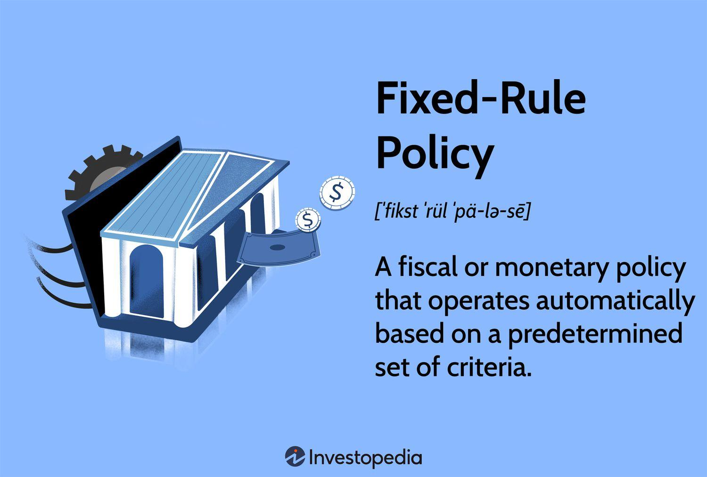

## Table of Contents

## What is a fixed-rule policy?

A fixed-rule policy is a type of decision-making strategy where the rules are set and do not change. It is used in different areas, like business or games, to make choices based on a set of rules that everyone knows and follows. For example, in a game, a fixed-rule policy might say that you must always move your game piece to the right if you roll a certain number on a die.

These policies are good because they are easy to understand and follow. Everyone knows what to do in certain situations, so there is less confusion. But, fixed-rule policies can also be a problem if the rules do not fit every situation. Sometimes, you might need to change the rules to make better decisions, but with a fixed-rule policy, you cannot do that.

## How does a fixed-rule policy differ from a discretionary policy?

A fixed-rule policy is like a strict set of instructions that you must follow every time. It's like a recipe that you can't change. For example, if you're playing a board game and the rules say you must move three spaces when you roll a six, you do that every time, no matter what. This kind of policy is good because everyone knows what to do, and it's easy to follow. But it can be bad if the rules don't work well in every situation because you can't change them.

On the other hand, a discretionary policy is more flexible. It's like cooking without a recipe, where you can add a little more salt or less pepper if you want. In a board game, if you have a discretionary policy, you might decide to move differently based on what's happening in the game. This can be good because you can make better choices depending on the situation. But it can also be confusing because different people might make different choices, and it might be hard to know what to do.

## What are the main types of fixed-rule policies?

There are a few main types of fixed-rule policies that people use in different situations. One type is a threshold policy. This is where you do something only if a certain number or condition is met. For example, if a store has a rule that they will give a discount if a customer buys more than 10 items, that's a threshold policy. Another type is a sequence policy. This is where you follow a set order of steps or actions. In a board game, if you must roll the dice, move your piece, and then draw a card in that exact order every time, that's a sequence policy.

Another type of fixed-rule policy is a conditional policy. This is where you do different things based on certain conditions, but the conditions and actions are always the same. For example, if a traffic light turns red, you must stop, and if it turns green, you must go. These conditions and actions never change. Lastly, there are time-based policies. These are rules that depend on specific times or time periods. For example, if a store has a rule that they close at 6 PM every day, that's a time-based policy. Each of these types of fixed-rule policies helps to make decisions easier and more predictable, but they can be limiting if situations change.

## Can you provide examples of fixed-rule policies in economics?

In economics, one example of a fixed-rule policy is the Taylor Rule. This rule is used by central banks to set interest rates. The Taylor Rule says that the central bank should adjust interest rates based on how much inflation is above or below a target rate, and how far the economy is from full employment. The rule uses a specific formula that always stays the same, so it's a fixed-rule policy. This helps make sure that the central bank's decisions are predictable and consistent.

Another example is automatic stabilizers in government budgets. These are things like unemployment benefits or progressive tax systems that automatically change based on economic conditions but follow fixed rules. For example, when more people are out of work, unemployment benefits automatically go up without the government having to pass new laws. This helps to stabilize the economy during tough times. Because these stabilizers follow fixed rules and don't change, they are a type of fixed-rule policy in economics.

## What are the advantages of implementing a fixed-rule policy?

Fixed-rule policies are good because they make things clear and easy to follow. When everyone knows the rules and they don't change, it's easier to make decisions and know what to do. For example, in a store, if there's a rule that says you get a discount when you buy more than 10 items, everyone knows what to expect. This can help people trust the system more because they know the rules will be the same for everyone.

Another advantage of fixed-rule policies is that they help keep things fair and consistent. Since the rules don't change, everyone is treated the same way. This can be important in situations like setting interest rates or giving out unemployment benefits. When the rules are fixed, people can plan better because they know what will happen. For example, if a central bank follows a fixed rule like the Taylor Rule, businesses and people can predict how interest rates might change and make their plans accordingly.

## What are the potential disadvantages of fixed-rule policies?

Fixed-rule policies can be a problem because they don't change, even when they need to. Sometimes, situations can be different and need different rules. For example, if a store always gives a discount when you buy more than 10 items, what if the store is losing money because of this rule? They can't change it because it's a fixed rule. This can make things harder and less fair if the rules don't fit the situation anymore.

Another issue with fixed-rule policies is that they might not be able to handle new or unexpected situations. Life can change, and new problems can come up that the old rules don't cover. For example, if a central bank uses a fixed rule like the Taylor Rule to set interest rates, what if there's a big economic crisis that the rule doesn't account for? The bank can't change the rule quickly to deal with the new problem, which can make things worse. So, while fixed-rule policies are good for being clear and fair, they can also be too stiff and not able to adapt when they need to.

## How do fixed-rule policies affect economic stability?

Fixed-rule policies can help make the economy more stable because they are clear and predictable. When people and businesses know what the rules are and that they won't change, they can plan better. For example, if a central bank uses a fixed rule like the Taylor Rule to set interest rates, people can predict how rates might change and make their financial plans accordingly. This can help keep the economy steady because everyone knows what to expect and can act in ways that support stability.

However, fixed-rule policies can also make the economy less stable if they don't fit new situations. Sometimes, the economy can change a lot, and a fixed rule might not work well anymore. For example, during a big economic crisis, a fixed rule might not be able to help the economy recover quickly because it can't change to fit the new problem. This can make the economy more unstable because the rules can't adapt to make things better when they need to.

## In what scenarios are fixed-rule policies most effective?

Fixed-rule policies work best when things are stable and don't change much. In these situations, having clear rules that everyone knows and follows can make things easier and more predictable. For example, in a store, if there's a fixed rule that gives a discount when you buy more than 10 items, customers know what to expect every time they shop. This helps the store run smoothly because everyone follows the same rules.

Fixed-rule policies are also good when fairness and consistency are important. When the rules are the same for everyone and don't change, people feel they are treated fairly. For example, if a central bank uses a fixed rule like the Taylor Rule to set interest rates, it helps keep the economy steady because businesses and people can plan their finances knowing the rules won't change suddenly. But, these policies work best when the situation stays the same and doesn't need new rules to handle changes.

## How can fixed-rule policies be adjusted or modified?

Fixed-rule policies can be hard to change because they are set and don't usually change. But sometimes, people can adjust them by making new rules or changing the old ones. For example, if a store has a fixed rule about giving discounts, they might decide to change the number of items needed for the discount. They would need to tell everyone about the change so that the new rule becomes the fixed rule.

Another way to adjust fixed-rule policies is by adding exceptions or special conditions. This means that while the main rule stays the same, there are some situations where it can be different. For example, a central bank might use the Taylor Rule to set interest rates, but during a big economic crisis, they might decide to make an exception and change the rates in a different way. This helps the policy stay useful even when things change a lot.

## What are the challenges in implementing fixed-rule policies?

One big challenge in using fixed-rule policies is making sure everyone understands and follows the rules. If the rules are too hard to understand, people might get confused or not follow them the right way. Also, if people don't like the rules, they might try to find ways around them, which can make things messy. For example, if a store has a fixed rule about discounts, but it's too complicated, customers might get frustrated and shop somewhere else.

Another challenge is that fixed-rule policies can't change easily. If something new happens or the situation changes, the rules might not fit anymore. This can be a problem because you can't quickly fix the rules to make them work better. For example, if a central bank uses a fixed rule to set interest rates, but there's a big economic crisis, the rule might not help. The bank would need to think about making an exception or changing the rule, but that can be hard and take a lot of time.

## How do fixed-rule policies impact monetary policy?

Fixed-rule policies can help make monetary policy more predictable and stable. When a central bank uses a fixed rule, like the Taylor Rule, to set interest rates, people and businesses know what to expect. They can plan their finances better because the rules won't change suddenly. This can make the economy run more smoothly because everyone follows the same clear rules.

However, fixed-rule policies can also be a problem for monetary policy if they can't handle new or big changes in the economy. If there's a big economic crisis, a fixed rule might not be able to help the economy recover quickly. The central bank might need to make exceptions or change the rule, but that can be hard and take time. So, while fixed rules can help keep things steady, they can also make it harder to deal with unexpected problems.

## What role do fixed-rule policies play in long-term economic planning?

Fixed-rule policies help a lot with long-term economic planning because they are clear and don't change. When people and businesses know what the rules are and that they will stay the same, they can make plans for the future. For example, if a central bank uses a fixed rule like the Taylor Rule to set interest rates, businesses can guess how rates might change and plan their investments and loans accordingly. This makes it easier for everyone to think about the future and make decisions that help the economy grow steadily over time.

But fixed-rule policies can also make long-term planning harder if they can't handle big changes. Sometimes, the economy can change a lot, and a fixed rule might not work well anymore. If there's a big economic crisis, the rule might not be able to help the economy recover quickly because it can't be changed to fit the new situation. So, while fixed rules are good for planning when things are stable, they can be a problem when the economy faces big, unexpected changes.

## What are the types of fixed-rule policies in algorithm trading?

Fixed-rule policies in algorithm trading are structured approaches that rely on predefined criteria to guide trading decisions. These policies are crucial in reducing human biases and ensuring consistent outcomes in trading operations. They can be categorized into various types based on their application in fiscal and monetary strategies.

One prominent example of a fixed-rule policy in monetary strategies is Taylor's Rule. This guideline is used for setting interest rates and is based on economic conditions such as inflation and output gaps. The Taylor Rule is mathematically represented as:

$$
i_t = r^* + \pi_t + \alpha(\pi_t - \pi^*) + \beta(y_t - y^*)
$$

Where:
- $i_t$ is the nominal interest rate.
- $r^*$ is the real rate of interest.
- $\pi_t$ is the rate of inflation.
- $\pi^*$ is the target inflation rate.
- $y_t$ is the logarithm of real GDP.
- $y^*$ is the logarithm of potential output (i.e., output at full employment).
- $\alpha$ and $\beta$ are parameters that represent the responsiveness of the interest rate to deviations in inflation and output, respectively.

In fiscal policy, fixed-rule policies such as budget constraints are employed to ensure that governments maintain financial discipline. These rules mandate specific limits on budget deficits and public debt levels. For example, a government's rule may specify that budget deficits should not exceed a certain percentage of GDP, ensuring sustainable fiscal management over time.

Fixed-rule policies, by their nature, provide a stable framework for decision-making. They encompass a predetermined set of rules that traders or policymakers can follow to achieve objective-driven results. However, these rules must be periodically evaluated and adjusted in response to evolving economic conditions to maintain their relevance and effectiveness.

## References & Further Reading

[1]: Taylor, J. B. (1993). ["Discretion versus policy rules in practice."](https://web.stanford.edu/~johntayl/Onlinepaperscombinedbyyear/1993/Discretion_versus_Policy_Rules_in_Practice.pdf) In Carnegie-Rochester conference series on public policy (Vol. 39, pp. 195-214). North-Holland.

[2]: Robert Kissell, "The Science of Algorithmic Trading and Portfolio Management," Academic Press, 2013. ISBN: 978-0124016897

[3]: Lopez de Prado, M. (2018). ["Advances in Financial Machine Learning"](https://www.amazon.com/Advances-Financial-Machine-Learning-Marcos/dp/1119482089). Wiley.

[4]: Jansen, S. (2018). ["Hands-On Machine Learning for Algorithmic Trading"](https://www.amazon.com/Hands-Machine-Learning-Algorithmic-Trading/dp/178934641X). Packt Publishing.

[5]: Chan, E. (2009). ["Quantitative Trading: How to Build Your Own Algorithmic Trading Business"](https://github.com/ftvision/quant_trading_echan_book). Wiley.