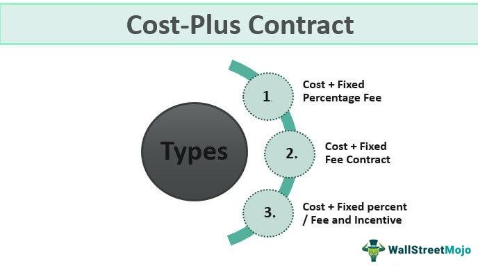

Fixed-term contract employment, characterized by a predefined start and end date, has become an increasingly significant form of employment in various industries. This type of contract offers businesses the flexibility to address specific project needs without committing to long-term employment obligations. As the global market landscape continues to evolve, many industries such as information technology, healthcare, and finance are capitalizing on the advantages offered by fixed-term contracts to better manage fluctuations in workforce demand, especially for projects of a temporary nature or to fill seasonal gaps.

A specific area where fixed-term contracts are particularly suitable is algorithmic trading, commonly referred to as algo trading. Algo trading involves the use of complex algorithms and mathematical models to execute trades at high speeds and volumes, relying heavily on technological advancements and data analytics. The rapid pace and the project-based nature of algo trading make it ideal for employing specialists on a fixed-term basis. These experts often bring highly specialized skills and technical expertise that are essential for developing, testing, and implementing sophisticated trading strategies. The short-term, goal-oriented nature of algo trading initiatives aligns well with the temporary but precise nature of fixed-term contracts.

Utilizing fixed-term contracts in the context of algo trading provides several notable benefits. Firstly, it allows financial firms to engage professionals with niche skills tailored to specific trading strategies or technologies, without the long-term financial commitment associated with permanent hires. This can be particularly advantageous when launching new projects that require specialized knowledge or when quick pivots in strategy are necessary. Secondly, it offers cost-efficiency by optimizing labor costs and minimizing overheads related to full-time employment. Companies can allocate resources more effectively, ensuring that they are paying for expertise as needed, thereby enhancing their operational agility in a competitive market environment.

In summary, fixed-term contract employment is gaining traction across industries for its adaptability and strategic alignment with business needs. In algo trading, it represents a pragmatic solution, offering access to specialized talent and providing cost-effective workforce management for project-oriented tasks. This approach enables firms to navigate the high-speed and high-stakes world of algo trading with agility and precision.

## Table of Contents

## Understanding Fixed-Term Contracts

Fixed-term contracts are employment agreements where the duration of employment is specified at the outset. These contracts have characteristics that distinguish them from other types of employment contracts. The primary feature of a fixed-term contract is its defined start and end date. This setup contrasts with indefinite contracts, where employment continues until either the employer or employee terminates the arrangement, and employment duration is not predetermined.

Fixed-term contracts are widely used in various situations. They are particularly useful for project-based work, where a team is assembled for the duration of a particular project. This allows companies to hire experts with specific skills needed for the project's success without long-term commitments. Additionally, fixed-term contracts are common in peak season staffing, helping businesses manage increased workloads without permanently expanding their workforce. They are also employed for temporary replacements, such as covering an employee's leave.

Unlike casual contracts, fixed-term contracts offer a more structured work schedule and employment terms. Casual employment is typically characterized by irregular work hours and a lack of guaranteed ongoing employment, offering both the employer and employee flexibility. In contrast, a fixed-term contract provides more stability and predictability, as the terms, conditions, and duration are clearly outlined and agreed upon by both parties from the beginning.

The choice between fixed-term, indefinite, and casual contracts depends largely on the needs of the employer and the nature of the work involved. Fixed-term contracts offer a balanced approach by providing the employer with the flexibility to adapt to changing business needs while offering employees the security of a known employment term.

## Algo Trading: An Overview

Algorithmic trading, commonly known as algo trading, is a method of executing financial transactions using automated and pre-programmed trading instructions. These instructions, or algorithms, are based on various parameters such as timing, price, and [volume](/wiki/volume-trading-strategy). Algo trading has gained significant importance in financial markets due to its ability to process large volumes of trades at speeds unattainable by human traders, thereby increasing market efficiency and [liquidity](/wiki/liquidity-risk-premium).

In the context of financial markets, [algorithmic trading](/wiki/algorithmic-trading) represents a substantial portion of trading activity, particularly in major stock exchanges like the New York Stock Exchange and NASDAQ. The primary advantage of algo trading is its ability to minimize the impact of human emotions and reduce transaction costs through precise and swift execution of trades. Additionally, it allows investors to implement complex trading strategies in a consistent and objective manner.

The successful implementation of algo trading requires a blend of technological and analytical skills. Technologically, proficiency in programming languages such as Python, C++, or Java is essential, as it enables traders to create and optimize algorithms. Knowledge of data structures, software development, and system architecture is crucial to ensure efficient algorithm execution. Analytically, traders need a strong foundation in quantitative analysis, including statistical and mathematical modeling, to develop robust algorithms capable of analyzing market data and predicting price movements. A solid understanding of financial markets, trading principles, and risk management is also vital.

The dynamic and project-based nature of algo trading makes it a suitable area for fixed-term contracts. Algo trading projects are often temporary and require specialized skills that might not be available within a company's permanent workforce. The need for rapid adaptation to market changes demands expertise in developing and deploying new algorithms swiftly. Fixed-term contracts offer the flexibility to hire specialized professionals for particular projects, such as developing a trading strategy for a specific financial instrument or integrating new technologies like [machine learning](/wiki/machine-learning) into trading systems. This approach allows companies to access cutting-edge expertise and address short-term objectives without the long-term commitment of permanent hires. Consequently, fixed-term contracts can be an efficient solution for managing the fluctuating demands of algo trading projects.

## Benefits of Fixed-Term Contracts in Algo Trading

Fixed-term contracts offer several advantages in the field of algorithmic trading, a domain characterized by rapid technological advancements and ever-changing market conditions. One of the primary benefits is access to specialized expertise, which is crucial for developing and implementing sophisticated trading strategies or technologies. Algorithmic trading requires unique skills in areas such as quantitative analysis, programming, and data science. By hiring experts on a fixed-term basis, firms can tap into a pool of specialized talent that can address specific needs of different projects.

In addition to accessing specialized expertise, the flexibility associated with fixed-term contracts is highly advantageous for algo trading projects. Financial markets are dynamic, and trading strategies may require periodic updates or overhauls due to changes in market conditions or technological advancements. Fixed-term contracts allow firms to bring in specialists on a project-by-project basis, ensuring they have the right expertise available precisely when needed. This approach can enhance a firm's agility in responding to market shifts and emerging opportunities without the long-term commitment associated with permanent hires.

From a cost-efficiency perspective, fixed-term contracts can also be more economical compared to maintaining a large in-house team of full-time employees. Engaging specialists for specific project durations allows firms to manage their human resources budget more effectively by concentrating investment in talent that directly contributes to the task at hand. This practice can lead to significant savings, as the company can avoid expenses related to employee benefits and long-term commitments inherent in full-time employment.

By leveraging fixed-term contracts, algorithmic trading firms can strategically assemble teams with the precise skill sets necessary for particular projects, leading to more efficient operations and the ability to maintain competitiveness in the fast-paced world of financial trading.

## Challenges and Risks

The utilization of fixed-term contracts in the algorithmic trading sector presents various challenges that require careful consideration. One of the primary issues is the frequent recruitment and integration of short-term team members. Given the project-based nature of algorithmic trading, firms often need to onboard specialists for short periods. This frequent turnover can lead to operational disruptions, as each new member must quickly adapt to the technical environment, understand existing strategies, and contribute effectively. The limited time frame for onboarding and integration can affect team cohesion and slow down project [momentum](/wiki/momentum).

Moreover, integrating fixed-term employees with full-time staff poses its own set of challenges. Permanent employees might be hesitant to collaborate fully with temporary colleagues, perceiving them as transient. This can create barriers to knowledge transfer, critical for the seamless execution of algo trading strategies. Developing a structured onboarding process and fostering an inclusive work environment becomes crucial to mitigate these integration issues.

Another significant challenge is the compliance with diverse employment laws governing fixed-term contracts, which can vary significantly across jurisdictions. Organizations must navigate regulations that pertain to contract length, termination terms, employee benefits, and renewal conditions. For example, many countries impose restrictions on the consecutive renewal of fixed-term contracts to prevent the erosion of job security. In some regions, fixed-term employees may also be entitled to the same benefits as their permanent counterparts, which can increase administrative burdens and costs.

Firms operating internationally face added complexities, as they must tailor their employment practices to meet the specific regulatory requirements of each country they operate in. This necessitates a robust legal framework and often requires the expertise of employment law specialists to ensure compliance and reduce the risk of litigation.

In essence, while fixed-term contracts offer flexibility and access to specialized skills, they also demand meticulous planning and management to overcome the inherent challenges and risks.

## Best Practices for Managing Fixed-Term Employees in Algo Trading

Effective management of fixed-term employees in the algo trading industry demands particular attention to integration processes, compliance with legal frameworks, and fostering an inclusive work environment. Here are some best practices to ensure successful management of these employees:

### Onboarding, Training, and Integration

1. **Structured Onboarding Process**: A well-defined onboarding process is crucial. It facilitates a seamless transition into the company by introducing new employees to crucial tools, platforms, and workflows used in algorithmic trading. This can include hands-on sessions with trading software, tutorials, and peer-mentoring programs. 

2. **Comprehensive Training**: Given the technical nature of algo trading, offering targeted training programs is essential. These programs should focus on the specific technologies and analytical skills required by the current project, as well as any proprietary systems or methodologies the firm employs. A combination of online courses, workshops, and real-world exercises can be employed to solidify knowledge and skills.

3. **Integration with Full-Time Staff**: Encouraging collaboration between fixed-term and permanent employees is vital. This can be achieved through regular team meetings, joint task assignments, and social events. Utilizing collaboration tools and platforms can also enhance communication and integration, thereby building a cohesive team environment.

### Legal and Administrative Compliance

1. **Clear Contractual Agreements**: Ensuring that employment contracts are explicitly defined and adhere to relevant legal standards is necessary to avoid misunderstandings and litigation. Contracts should outline the scope of work, duration of employment, compensation packages, and any non-compete or confidentiality agreements.

2. **Understanding Employment Laws**: Companies must remain informed about the local and international employment laws that govern fixed-term contracts. This includes regulations on termination, renewal rights, and employee benefits. Maintaining compliance with these laws helps mitigate legal risks and enhances corporate reputation.

3. **Employee Satisfaction Programs**: While fixed-term employees may not have the same benefits as full-time staff, offering incentives such as performance bonuses, flexible working hours, and professional development opportunities can increase job satisfaction. Regular feedback sessions should be held to address their concerns and suggestions.

These practices, when effectively implemented, can optimize the contribution of fixed-term employees, making them invaluable assets to algo trading firms. Businesses that proactively integrate and manage these workers can better harness specialized talents and adapt to the dynamic demands of the financial markets.

## Conclusion

In conclusion, fixed-term contracts play a pivotal role in the algo trading industry, offering numerous benefits that align with the dynamic and technical nature of this field. These contracts provide unparalleled flexibility, allowing firms to scale their workforce according to project demands, thereby optimizing resource allocation. Moreover, fixed-term contracts enable access to specialized skills tailored to specific trading strategies or technological requirements, ensuring that the team is equipped with the most relevant expertise.

The temporary nature of these contracts also translates to cost efficiency, as businesses can manage financial resources effectively by hiring experts only as needed. This strategic approach reduces the long-term financial commitments associated with indefinite hiring, facilitating a more agile response to the rapidly changing landscape of financial markets.

By considering fixed-term contracts as a fundamental component of talent acquisition, businesses in algo trading can enhance their operational efficiency and maintain a competitive edge. The ability to rapidly recruit and integrate specialized talent ensures that firms can continually innovate and adapt their trading algorithms and strategies. Consequently, leveraging fixed-term contracts not only supports immediate project objectives but also contributes to the long-term success and resilience of the organization in the competitive algo trading sector.

## References & Further Reading

[1]: Bergstra, J., Bardenet, R., Bengio, Y., & Kégl, B. (2011). ["Algorithms for Hyper-Parameter Optimization."](https://dl.acm.org/doi/10.5555/2986459.2986743) Advances in Neural Information Processing Systems 24.

[2]: ["Advances in Financial Machine Learning"](https://www.amazon.com/Advances-Financial-Machine-Learning-Marcos/dp/1119482089) by Marcos Lopez de Prado

[3]: ["Evidence-Based Technical Analysis: Applying the Scientific Method and Statistical Inference to Trading Signals"](https://www.amazon.com/Evidence-Based-Technical-Analysis-Scientific-Statistical/dp/0470008741) by David Aronson

[4]: ["Machine Learning for Algorithmic Trading"](https://github.com/stefan-jansen/machine-learning-for-trading) by Stefan Jansen

[5]: ["Quantitative Trading: How to Build Your Own Algorithmic Trading Business"](https://www.amazon.com/Quantitative-Trading-Build-Algorithmic-Business/dp/1119800064) by Ernest P. Chan