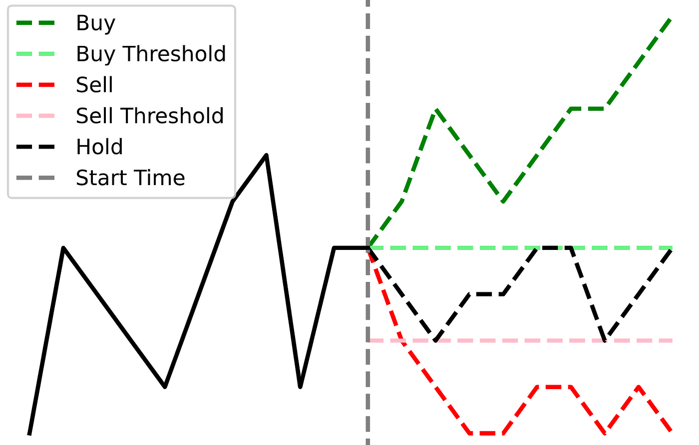

## Table of Contents

## What is the fixed-time horizon labeling method?

The fixed-time horizon labeling method is a way to predict how long something will last or how long it will take for something to happen. Imagine you want to know if it will rain in the next hour. You look at the weather data from the past hour and use it to guess if it will rain soon. This method uses a set amount of time, like one hour, to make these predictions.

In this method, you pick a specific time period, say 30 minutes or one day, and use the information from that time to label or predict future events. For example, if you are trying to predict stock prices, you might look at the stock's performance over the last day to guess what will happen tomorrow. It's like using a fixed window of time to help make better guesses about what will happen next.

## Why is the fixed-time horizon labeling method used?

The fixed-time horizon labeling method is used because it helps make predictions easier and more accurate. By choosing a set amount of time, like an hour or a day, people can look at what happened during that time to guess what will happen next. This makes it simpler to see patterns and trends because you are always looking at the same amount of time. For example, if you want to know if it will rain in the next hour, you can check the weather data from the past hour to make a good guess.

This method is also helpful because it can be used in many different situations, like predicting stock prices or figuring out if a machine will break down soon. By using a fixed time period, it's easier to compare different sets of data and make decisions based on that. It's like having a consistent ruler to measure things with, which helps keep the predictions reliable and trustworthy.

## How does the fixed-time horizon labeling method differ from other labeling methods?

The fixed-time horizon labeling method is different from other labeling methods because it uses a set amount of time to make predictions. For example, if you want to know if it will rain in the next hour, you look at the weather data from the past hour. Other methods might not use a fixed time period. They might look at different amounts of time or use other ways to predict the future, like looking at the weather over the last three days or using different kinds of data.

Another way the fixed-time horizon labeling method is different is that it makes it easier to compare data. When you always use the same amount of time, like one day, it's simpler to see patterns and trends. Other methods might use different time periods, which can make it harder to compare data and see clear patterns. For example, if one method looks at stock prices over the last week and another looks at them over the last month, it's harder to compare the results and make good predictions.

## What are the basic steps involved in implementing the fixed-time horizon labeling method?

To use the fixed-time horizon labeling method, first you need to pick a specific amount of time that you will use for your predictions. This could be an hour, a day, or any other length of time that makes sense for what you are trying to predict. For example, if you want to know if it will rain in the next hour, you would choose one hour as your time horizon. Once you have your time horizon, gather all the data from that time period. If you are looking at stock prices, you would get the stock prices from the last day if your time horizon is one day.

Next, use the data from your chosen time horizon to make your prediction. Look at what happened during that time and use it to guess what will happen next. For example, if the stock prices went up over the last day, you might predict that they will go up again tomorrow. Keep in mind that you will always use the same amount of time for your predictions, which helps make them more consistent and easier to compare. By sticking to the same time horizon, you can see patterns and trends more clearly and make better guesses about the future.

## What are the key components of the fixed-time horizon labeling method?

The fixed-time horizon labeling method has a few important parts that help it work well. First, you need to choose a set amount of time that you will use to make your predictions. This could be an hour, a day, or any other length of time that fits what you are trying to predict. For example, if you want to know if it will rain in the next hour, you would use one hour as your time horizon. This fixed time period is the key part of the method because it helps you look at the same amount of time every time you make a prediction.

The other important part is the data from that time period. Once you have your time horizon, you gather all the data from that time. If you are looking at stock prices and your time horizon is one day, you would get the stock prices from the last day. You then use this data to make your prediction. By looking at what happened during that time, you can guess what will happen next. Using the same amount of time every time helps you see patterns and trends more clearly and makes your predictions more reliable.

## Can you explain the mathematical foundation behind the fixed-time horizon labeling method?

The mathematical foundation of the fixed-time horizon labeling method is based on using a set amount of time to make predictions. When you choose a specific time period, like one hour or one day, you are creating a fixed window to look at your data. This time period is your time horizon. By using this fixed window, you can gather all the data from that time and use it to predict what will happen next. The idea is that by always looking at the same amount of time, you can see patterns and trends more easily, which helps make your predictions more accurate.

For example, if you are trying to predict if it will rain in the next hour, you would look at the weather data from the past hour. You might use mathematical models, like statistical analysis or [machine learning](/wiki/machine-learning) algorithms, to analyze this data. These models help you find patterns in the data, like if the temperature dropped and the humidity increased in the last hour, it might be more likely to rain in the next hour. By using a fixed time horizon, you can apply these models consistently and make better predictions about the future.

## What are some common challenges faced when using the fixed-time horizon labeling method?

One common challenge when using the fixed-time horizon labeling method is choosing the right time period. If the time horizon is too short, you might miss important patterns that happen over longer periods. For example, if you only look at stock prices over one day, you might not see trends that happen over a week or a month. On the other hand, if the time horizon is too long, the data might be too spread out to make good predictions. It can be hard to find the perfect time period that works for every situation.

Another challenge is that the fixed-time horizon method assumes that the past will predict the future. But sometimes, things change quickly and what happened in the past might not be a good guide for what will happen next. For example, if there is a sudden change in the weather or the stock market, looking at the last hour or day might not help you predict what will happen in the next hour or day. This can make the predictions less accurate and harder to rely on.

## How can the accuracy of the fixed-time horizon labeling method be improved?

One way to make the fixed-time horizon labeling method more accurate is by trying different time periods. You can test different lengths of time, like an hour, a day, or a week, to see which one works best for your predictions. By finding the right time period, you can see the patterns and trends more clearly. For example, if you are trying to predict stock prices, you might find that looking at the last three days gives you better predictions than just looking at the last day.

Another way to improve accuracy is by using more data. The more information you have, the better your predictions can be. You can use data from different sources or look at more factors that might affect what you are trying to predict. For example, if you are predicting the weather, you might look at temperature, humidity, and wind speed from the last hour to make a better guess about if it will rain in the next hour. By using more data, you can make your predictions more reliable and accurate.

## What types of data are best suited for the fixed-time horizon labeling method?

The fixed-time horizon labeling method works well with data that changes over time and has clear patterns. This includes things like stock prices, weather data, and machine performance data. For example, if you want to predict stock prices, you can look at how they changed over the last day to guess what will happen tomorrow. The same goes for weather data; by looking at the temperature and humidity from the last hour, you can predict if it will rain in the next hour. These types of data are good for this method because they have regular patterns that you can see when you look at them over a fixed amount of time.

Another type of data that works well with the fixed-time horizon labeling method is time series data. This is data that is collected at regular time intervals, like daily sales numbers or monthly website traffic. Because this data is collected in a consistent way, it's easier to use a fixed time period to make predictions. For example, if you want to predict next month's sales, you can look at the sales data from the last month. By using a fixed time horizon, you can see the patterns in the data more clearly and make better guesses about what will happen next.

## How does the choice of time horizon affect the results in the fixed-time horizon labeling method?

The choice of time horizon is really important in the fixed-time horizon labeling method because it changes how you look at your data. If you pick a short time period, like an hour, you might see quick changes but miss bigger patterns that happen over days or weeks. For example, if you are trying to guess if it will rain soon, looking at the weather from the last hour might help you see if a storm is coming right away. But if you want to predict stock prices, a short time period might not show you the ups and downs that happen over longer times.

On the other hand, if you choose a longer time period, like a week, you might see bigger trends but miss out on the quick changes that happen in shorter times. For instance, if you look at stock prices over the last week, you might see a general trend of the prices going up or down, but you could miss sudden drops or rises that happen in a day. So, [picking](/wiki/asset-class-picking) the right time horizon is all about finding a balance that helps you see the patterns you need to make good predictions.

## What advanced techniques can be applied to enhance the fixed-time horizon labeling method?

One advanced technique to make the fixed-time horizon labeling method better is using machine learning. Machine learning can look at a lot of data and find patterns that are hard for people to see. For example, if you are trying to predict if it will rain, a machine learning model can use data from the last hour to find out if certain changes in temperature and humidity mean rain is coming. By using machine learning, you can make your predictions more accurate and reliable because the computer can learn from the data and get better over time.

Another technique is called ensemble methods. This means using more than one way to make predictions and then combining them to get a better result. For example, you might use different time periods, like one hour and one day, to predict stock prices. Then, you can combine these predictions to see if they agree or if one is more accurate than the other. By using ensemble methods, you can make your predictions stronger because you are not relying on just one way of looking at the data.

## Can you discuss any case studies or real-world applications where the fixed-time horizon labeling method has been successfully implemented?

One real-world application of the fixed-time horizon labeling method is in the stock market. A company called Alpha Trading used this method to predict stock prices. They chose a one-day time horizon and looked at the stock prices from the past day to guess what would happen the next day. By using this method, Alpha Trading was able to see patterns in the stock prices and make better predictions. This helped them make smarter trading decisions and earn more money. They found that using a fixed time period made it easier to compare the data and see trends, which made their predictions more accurate.

Another successful use of the fixed-time horizon labeling method is in weather forecasting. The National Weather Service used this method to predict if it would rain in the next hour. They looked at the weather data from the past hour, like temperature and humidity, to make their predictions. By using a fixed one-hour time horizon, they were able to see quick changes in the weather and make better guesses about if it would rain soon. This helped them give more accurate weather forecasts to people, which is really important for planning outdoor activities or preparing for storms. The fixed time period made it easier to see patterns in the weather data and make reliable predictions.

## What is the Understanding of the Fixed-Time Horizon Labeling Method?

The fixed-time horizon labeling method is a straightforward approach in [algorithmic trading](/wiki/algorithmic-trading) used to classify financial data based on the rate of return over a predetermined period. This labeling technique hinges on comparing asset price changes over a specified time interval against a set threshold, thereby aiding predictive modeling in trading algorithms.

The fundamental formula for calculating returns in this context is:

$$
r(t_0, t_1) = \frac{p(t_1)}{p(t_0)} - 1
$$

where $p(t_0)$ and $p(t_1)$ are the asset prices at the beginning and the end of the time horizon, respectively. This computation yields the percentage change in price, which forms the basis for labeling.

Following the calculation of returns, each data point is assigned a label: 
- **1**: if the return exceeds the positive threshold,
- **0**: if the return remains within the threshold range, and 
- **-1**: if the return is below the negative threshold.

The adoption of the fixed-time horizon labeling method is largely due to its simplicity, making it an attractive option for traders who favor straightforward and easily interpretable models. This method effectively structures financial data, providing a clear categorical distinction based on user-defined thresholds. Such a structured approach enables streamlined data processing and model training, which is particularly advantageous in high-frequency trading environments where computational efficiency is paramount. 

Despite these advantages, one must be cautious to set appropriate thresholds that align with specific trading objectives and market conditions, ensuring that the labeling remains relevant and useful in the predictive context.

## What are the implementations and examples?

Implementation of the fixed-time horizon labeling method can be efficiently carried out using programming libraries such as pandas and MlFinLab, which are widely utilized in financial data analysis. This method involves labeling financial data points, typically prices, over a predetermined time frame. Here we will discuss the implementation steps, data considerations, and provide a practical example using SPY (S&P 500 [ETF](/wiki/etf-trading-strategies)) closing prices.

### Data Handling and Preprocessing
To implement fixed-time horizon labeling, one must first decide on the data representation. Practitioners commonly use time bars, which represent fixed time intervals, for ease of synchronization with time-based labels. However, tick bars or [volume](/wiki/volume-trading-strategy) bars—where bars are created based on a set number of transactions or traded volume, respectively—can also be utilized. These alternative representations can better capture market microstructure information and adjust to varying levels of trading activity.

An important step in the implementation is data resampling and standardization. Resampling adjusts the dataset to align with the fixed time horizon specified for labeling. For instance, in Python, the pandas library provides functionality for resampling time series data using the `resample()` method, which can transform minute-level data to daily data by choosing an appropriate frequency, such as 'D' for days.

```python
import pandas as pd

# Example dataset with minute-level SPY data
data = pd.read_csv('spy_minute_prices.csv', parse_dates=['timestamp'], index_col='timestamp')

# Resample to daily frequency
daily_data = data['close'].resample('D').last().dropna()
```

Standardization is crucial to ensure that returns are calculated consistently across different periods. This involves calculating returns over the desired horizon and adjusting for [volatility](/wiki/volatility-trading-strategies) to facilitate meaningful comparisons. 

### Computing Labels
The labeling logic can be implemented by computing the rate of return over the fixed period and comparing it to predefined thresholds. The return $r(t_0, t_1)$ over the period from $t_0$ to $t_1$ is calculated using the formula:

$$
r(t_0, t_1) = \left(\frac{p(t_1)}{p(t_0)}\right) - 1
$$

where $p(t_0)$ and $p(t_1)$ are the prices at the beginning and end of the time horizon, respectively. Labels are assigned as follows:
- 1 if $r(t_0, t_1)$ is above the positive threshold
- -1 if it is below the negative threshold
- 0 if it falls within the thresholds

Below is a simple implementation using pandas to compute these labels:

```python
# Calculate daily returns
daily_returns = daily_data.pct_change().dropna()

# Define thresholds
upper_threshold = 0.01  # Example positive threshold of 1%
lower_threshold = -0.01  # Example negative threshold of -1%

# Apply labeling
labels = daily_returns.apply(lambda x: 1 if x > upper_threshold else (-1 if x < lower_threshold else 0))
```

### Practical Example with SPY
Consider SPY, a popular ETF, where the objective is to apply fixed-time horizon labeling to daily closing prices to identify periods of significant market movement. Using historical data of SPY, the returns can be calculated across a chosen time horizon, and labels are derived based on standardized thresholds reflecting trading strategies or risk appetites.

Handling SPY's daily closing prices, traders can better assess market trends and adjust strategy parameters, contributing to data-driven decision-making in algorithmic trading contexts. In summary, the implementation of the fixed-time horizon labeling method, though straightforward, requires careful attention to data preprocessing and threshold selection to align with institutional trading goals. By leveraging libraries like pandas and MlFinLab, practitioners can effectively integrate this labeling technique into broader financial modeling frameworks.

## References & Further Reading

[1]: ["Advances in Financial Machine Learning"](https://www.amazon.com/Advances-Financial-Machine-Learning-Marcos/dp/1119482089) by Marcos Lopez de Prado

[2]: Dixon, M., Klabjan, D., & Bang, J. (2016). Classification-Based Financial Markets Prediction using Deep Neural Networks.

[3]: ["Quantitative Trading: How to Build Your Own Algorithmic Trading Business"](https://books.google.com/books/about/Quantitative_Trading.html?id=j70yEAAAQBAJ) by Ernest P. Chan

[4]: MlFinLab documentation and resources by Hudson & Thames. Available at: [https://hudsonthames.org](https://hudsonthames.org/mlfinlab/).

[5]: ["Machine Learning for Algorithmic Trading"](https://github.com/PacktPublishing/Machine-Learning-for-Algorithmic-Trading-Second-Edition) by Stefan Jansen