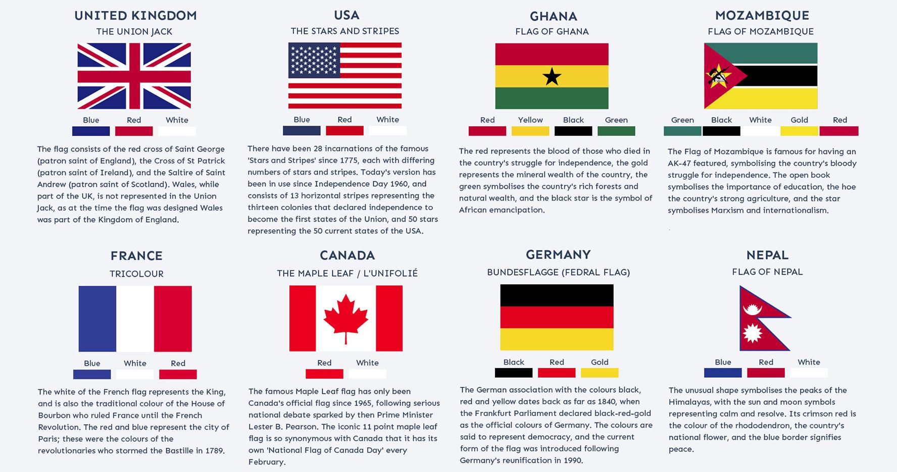

In today's interconnected digital landscape, seemingly disparate topics such as symbolism, flag design, and algorithmic trading intersect in fascinating ways. Symbols, in various forms, permeate both visual and quantitative fields, encapsulating complex ideas into comprehensible representations. This article explores the symbolic nature of flag design and its unexpected parallels in algorithmic trading, examining how symbolic elements act as bridges linking creativity with mathematical precision.

Flags serve as potent visual symbols representing not only territories and organizations but also ideologies and cultural identities. Each color, shape, and emblem on a flag carries a specific meaning, collectively forming a narrative that communicates a broader historical, cultural, or political context. Similarly, in algorithmic trading, data points and trends symbolize economic realities and are used by traders to communicate and execute financial strategies. Here, the precision of mathematical models and algorithms translates vast datasets into actionable insights.



The role of symbolism in data representation and interpretation is crucial in both fields. In flag design, symbolism provides a narrative that encodes deep-rooted meanings and values, shaping national identity and influencing societal perceptions. In algorithmic trading, symbolism manifests through the interpretation of market data, with patterns and trends acting as indicators that guide decision-making processes.

Understanding the connections between these two realms offers deeper insights into both creative and analytical domains, revealing how symbolic understanding enhances interpretive skills and decision-making processes. Through this exploration, we uncover the unique interplay between symbolism, visual representation, and quantitative strategies, demonstrating how both designers and traders rely on a symbolic language to navigate and make sense of their respective worlds. By examining these intersections, we gain appreciation for the universal nature of symbolism and its ability to bridge diverse fields, fostering innovation and new perspectives.

## Table of Contents

## Understanding Symbolism in Flag Design

Flags serve as powerful emblems for nations, organizations, and ideologies, with each element of their design often laden with symbolism. Such symbolism is conveyed through the choice of colors, shapes, and symbols, each of which carries significant meaning and messages that resonate on historical, cultural, and political levels.

Colors on flags are seldom arbitrary; they are rich with meaning and have the power to evoke emotions and thoughts aligned with a nation or group's identity. For instance, the use of red can often signify valor and bravery, a message conveyed through the flags of countries like the United States and China. White may represent peace and purity, as seen in the flags of Japan and Nigeria, while blue often stands for freedom and justice, as is the case with the flag of the United Nations.

Shapes and symbols further add layers of meaning. The crescent and star on the flag of Turkey, for example, hold religious connotations representing Islam. Meanwhile, the maple leaf on the Canadian flag highlights the country's emphasis on nature and the environment. The incorporation of geometric shapes such as stripes, crosses, or layers can denote unity, strength, or historical ties. The cross on the flag of Switzerland is a nod to Christian heritage and symbolically represents protection and neutrality.

Symbolism in flag design is deeply intertwined with the historical narrative and cultural backdrop from which a flag emerges. Many national flags are born from pivotal historical movements and events. The French Tricolor, which consists of vertical bands of blue, white, and red, emerged from the French Revolution and symbolizes liberty, equality, and fraternity—ideas that have resonated through French history and culture.

To analyze these symbolic compositions, consider the South African flag, which incorporates six colors representing unity and convergence following apartheid. The design elements are chosen to reflect not just the present identity, but also the historical journey undertaken. Another example is the Union Jack of the United Kingdom, a composite flag symbolizing the union of different nations within the UK—a historic interpretation crafted through the amalgamation of previous national symbols.

In the context of flag design, symbolism is critical in the way it communicates complex ideas and emotions universally. By examining these elements, we gain insight not only into the identity and values of a nation or organization but also into the historical and cultural influences that shape them. The study of flags illustrates how design elements are carefully selected to convey layered meanings significant to the entities they represent.

## Algorithmic Trading: A New Form of Symbolism

Algorithmic trading utilizes mathematical models and algorithms to make automated trading decisions. At its core, this trading method interprets symbols derived from data points, charts, and trends, facilitating quick decision-making processes. In this context, symbols represent quantitative forms of information, serving as the basis for execution strategies. Traders analyze these patterns to predict potential market movements, creating a new form of modern symbolism through the conversion and interpretation of data.

The patterns identified and interpreted in [algorithmic trading](/wiki/algorithmic-trading) echo the same fundamental processes found in symbolic systems such as flag design. In both cases, complex ideas are communicated through simplified representations, serving as abstract guidance for strategic decisions. For instance, a moving average crossover in algorithmic trading can symbolize a potential change in market trend, similar to how colors and shapes in a flag may represent historical shifts or cultural values. 

Machine learning and [artificial intelligence](/wiki/ai-artificial-intelligence) (AI) are increasingly integral to developing sophisticated algorithmic trading systems. These technologies offer advanced capabilities in recognizing patterns, enhancing the systems' abilities to infer symbolic meanings from data. Machine learning models can analyze historical data to predict future price movements, much like an interpreter translating complex messages from symbols. Consider the use of a [neural network](/wiki/neural-network) that predicts stock trends: 

```python
import numpy as np
from keras.models import Sequential
from keras.layers import Dense

# Example data
X_train = np.array([[0.1, 0.2, 0.3], [0.2, 0.3, 0.4], [0.3, 0.4, 0.5]])
y_train = np.array([0.4, 0.5, 0.6])

# Model setup
model = Sequential()
model.add(Dense(32, input_dim=3, activation='relu'))
model.add(Dense(1, activation='linear'))

# Compilation and training
model.compile(optimizer='adam', loss='mean_squared_error')
model.fit(X_train, y_train, epochs=100, batch_size=1)
```

This code snippet demonstrates a simple neural network model, which could be refined to predict stock trends by analyzing time-series data, thus symbolizing future market movements.

Similar to flag design, these systems are grounded in interpretation and convention. Using specific heuristic or machine-learned rules, algorithmic trading reveals patterns that function as symbols representing market conditions. Understanding these symbolic parallels provides deeper insight into how technology uses abstraction and interpretation, affirming the role of symbolism in both artistic and technical fields. Through technological advances, the capacity to parallel such symbolic interpretations between flag design and algorithmic systems is amplified, enriching the art of data-driven decision-making.

## Comparative Analysis: Symbolism Across Fields

While flag design and algorithmic trading appear to occupy unrelated domains, they both exhibit intricate systems of symbolism that are essential for conveying complex ideas and facilitating decision-making. In flag design, the use of visual elements such as colors, shapes, and motifs serves as symbolic representations that encapsulate historical narratives, cultural identities, and political ideologies. These symbols are carefully chosen to resonate with the intended audience and convey messages that promote unity and identity.

Conversely, algorithmic trading operates in the digital sphere, where symbolic interpretation is rooted in data analysis and pattern recognition. Here, data points, trends, and charts act as symbols that traders interpret to make strategic trading decisions. These symbols allow algorithms to identify patterns that might indicate profitable trading opportunities. For instance, a moving average crossover, a common trading signal, can be seen as a symbol in an algorithmic framework, indicating a potential shift in market trends that traders recognize and act upon.

Both fields rely heavily on established conventions and interpretations. In flag design, conventions might dictate the use of specific colors or symbols to convey particular meanings. Similarly, in algorithmic trading, conventions such as chart patterns or technical indicators are fundamental to interpreting market data effectively. Understanding these conventions is crucial in each field for meaningful interpretation and decision-making.

The symbolic understanding in these fields significantly enhances their respective objectives. Flags, infused with symbolic meaning, can inspire national pride and unity, effectively communicating complex socio-political narratives. Algorithmic trading, through its symbolic language of data, enables traders to execute strategies that can yield substantial financial gains. This comparative analysis highlights that, despite their differences, both fields demonstrate the universal nature of symbolism in communicating and interpreting intricate concepts.

By comparing the symbolic systems in flag design and algorithmic trading, we gain valuable insights into how diverse fields utilize symbolism to address their challenges and objectives. This understanding underscores the importance of symbolic analysis in both visual art and quantitative fields, suggesting that cross-disciplinary exploration could lead to innovative approaches and solutions that harness the power of symbolism across various domains.

## Practical Applications and Implications

Understanding symbolism in fields such as flag design and algorithmic trading opens up a diverse array of practical applications and implications. By considering algorithmic approaches to pattern recognition and meaning, flag designers can gain new perspectives. Algorithms can deconstruct complex symbols into their basic components, identifying patterns that might not be immediately evident. This analytical approach can lead to innovative designs that resonate on a deeper level with their intended audience, ultimately creating flags with more meaningful and impactful symbolism.

Conversely, traders in financial markets can significantly benefit from a nuanced understanding of symbolic representation. Trading algorithms depend heavily on data interpretation, where patterns and trends serve as the symbolic language that signals trading opportunities. A heightened awareness of symbolic representation can enhance a trader's ability to interpret these signals accurately. By improving interpretative skills, traders can make more informed decisions, potentially leading to more profitable trading strategies.

The implications of symbolic analysis are not limited to these domains but extend to education, marketing, and other fields. In education, for instance, teaching symbolic thinking can enhance critical thinking and creativity, equipping students with skills applicable across various disciplines. Marketing can leverage symbolic insights to craft compelling brand narratives and visuals that resonate with target audiences, creating connections that are not only cognitive but also emotional.

Moreover, there are significant opportunities for cross-field collaborations driven by symbolic insights. For example, a symbolic analysis framework developed in algorithmic trading could be adapted to study consumer behavior patterns in marketing, providing deeper insights into market dynamics. Likewise, principles from flag design could inform graphic design strategies in developing intuitive and impactful data visualizations in trading platforms.

Overall, embracing the symbolic parallels between flag design and algorithmic trading encourages an interdisciplinary approach to both artistic and analytical challenges, fostering innovation and creative problem-solving. As technology continues to advance, these intersections between symbolism and data science promise to offer novel methodologies and applications that span far beyond their traditional boundaries.

## Conclusion

Symbolism, whether in flag design or algorithmic trading, plays a crucial role in how we understand and engage with the world. This exploration reveals the underlying structures and conventions by which each of these domains translate abstract concepts into understandable forms. While flags encapsulate identity and ideology through visual elements, algorithmic trading encodes market dynamics using mathematical models and data representations. By comparing these seemingly disparate fields, we uncover fundamental similarities in symbolic interpretation that highlight the human penchant for finding meaning in diverse contexts.

Appreciating these connections can foster deeper insights and inspire innovation across various disciplines. For instance, flag designers challenged by the task of encapsulating extensive narratives into simple visuals can find inspiration in algorithmic pattern recognition. Conversely, traders employing algorithmic strategies can enhance their interpretive skills by understanding how symbolic representation can convey complex messages effectively.

As technology advances, the intersection of symbolic art and data science will continue to evolve, offering new opportunities and challenges. Machine learning and artificial intelligence are already beginning to unlock more intricate patterns within data, parallel to the nuanced graphic design methods employed in flag creation. This convergence could potentially lead to innovative approaches that blend traditional symbolism with modern data analysis.

Ultimately, the study of symbolism remains a timeless endeavor bridging humanity's creative and analytical pursuits. It enriches our capacity to communicate complex ideas succinctly and to innovate by drawing connections between varied fields. Whether through the colors and shapes of a flag or the data points on a graph, symbolism continues to be an essential part of our understanding, aiding in both the expression and interpretation of the complexities of our world.

## References & Further Reading

[1]: Bergstra, J., Bardenet, R., Bengio, Y., & Kégl, B. (2011). ["Algorithms for Hyper-Parameter Optimization."](https://proceedings.neurips.cc/paper/2011/file/86e8f7ab32cfd12577bc2619bc635690-Paper.pdf) Advances in Neural Information Processing Systems 24.

[2]: ["Advances in Financial Machine Learning"](https://www.amazon.com/Advances-Financial-Machine-Learning-Marcos/dp/1119482089) by Marcos Lopez de Prado

[3]: ["Evidence-Based Technical Analysis: Applying the Scientific Method and Statistical Inference to Trading Signals"](https://www.amazon.com/Evidence-Based-Technical-Analysis-Scientific-Statistical/dp/0470008741) by David Aronson

[4]: ["Machine Learning for Algorithmic Trading"](https://github.com/stefan-jansen/machine-learning-for-trading) by Stefan Jansen

[5]: ["Quantitative Trading: How to Build Your Own Algorithmic Trading Business"](https://www.amazon.com/Quantitative-Trading-Build-Algorithmic-Business/dp/1119800064) by Ernest P. Chan