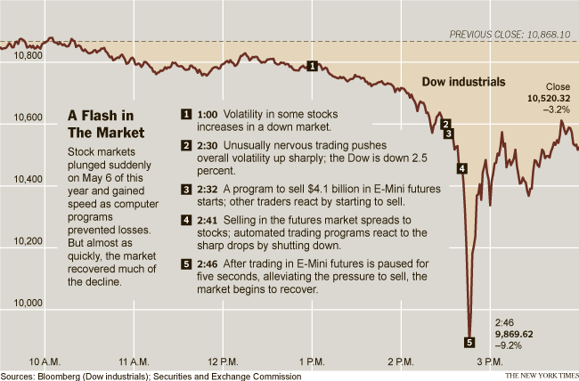

## Table of Contents

## What is a flash crash?

A flash crash is when the prices of stocks or other financial things drop very quickly and then go back up almost as fast. This usually happens in just a few minutes. It can be scary for people who are buying and selling because their money can seem to disappear and then come back.

Flash crashes can happen because of computers that trade very fast. These computers can make mistakes or react too quickly to news or other events. Sometimes, it's also because there aren't enough people buying or selling at that moment, so the prices can change a lot. Even though they don't last long, flash crashes can make people worry about how safe it is to trade with computers.

## What are the common causes of a flash crash?

A common cause of a flash crash is high-frequency trading. This is when computers trade stocks very quickly, sometimes in just a few seconds. These computers use special programs to decide when to buy or sell. If something goes wrong with these programs, or if they all start selling at the same time, it can make the price of a stock drop very fast. Another reason is when there are not enough people or computers buying and selling at the same time. This is called low liquidity. When this happens, even small trades can cause big changes in price.

Another cause can be big news or events that make everyone want to sell at the same time. For example, if there's a sudden announcement that affects the stock market, many people might try to sell their stocks quickly. This can start a chain reaction where more and more people sell, making the prices fall even faster. Sometimes, mistakes or errors in trading can also lead to a flash crash. For example, if someone accidentally puts in an order to sell a huge amount of stock, it can cause the price to drop quickly until the mistake is fixed.

## Can you explain the role of high-frequency trading in flash crashes?

High-frequency trading is when computers trade stocks very fast, often in just a few seconds. These computers use special programs to decide when to buy or sell. If something goes wrong with these programs, it can cause a flash crash. For example, if the program makes a mistake and starts selling a lot of stocks at once, it can make the price of the stock drop very quickly. This is because there are so many trades happening in such a short time that the price can change a lot before anyone can stop it.

Another way high-frequency trading can cause a flash crash is if all the computers start selling at the same time. This can happen if they all react to the same news or event. When many computers are selling at once, it can make the price of the stock go down very fast. Because these trades happen so quickly, the price can drop a lot before anyone can do anything about it. This is why high-frequency trading can be a big reason for flash crashes.

## What was the first recorded flash crash and when did it occur?

The first recorded flash crash happened on May 6, 2010. It is known as the "2010 Flash Crash." On that day, the stock market in the United States suddenly dropped a lot in just a few minutes. The Dow Jones Industrial Average, which is a big measure of the stock market, lost about 1,000 points in less than half an hour. This was very scary for people who were trading stocks because it seemed like a lot of money was disappearing very fast.

After the crash, the prices went back up almost as quickly as they had gone down. People later found out that high-frequency trading was a big reason for this crash. High-frequency trading is when computers trade stocks very quickly. On that day, many computers started selling stocks at the same time, which made the prices drop a lot. This event made people think more about how safe it is to use computers for trading and led to new rules to try to stop it from happening again.

## How did the 2010 Flash Crash affect the stock market?

The 2010 Flash Crash had a big impact on the stock market. On May 6, 2010, the stock market in the United States dropped a lot in just a few minutes. The Dow Jones Industrial Average, which is a big measure of the stock market, lost about 1,000 points in less than half an hour. This was very scary for people who were trading stocks because it seemed like a lot of money was disappearing very fast. Many people were worried and confused about what was happening.

After the crash, the prices went back up almost as quickly as they had gone down. People later found out that high-frequency trading was a big reason for this crash. High-frequency trading is when computers trade stocks very quickly. On that day, many computers started selling stocks at the same time, which made the prices drop a lot. This event made people think more about how safe it is to use computers for trading. It also led to new rules to try to stop it from happening again.

## What measures have been implemented to prevent flash crashes since 2010?

Since the 2010 Flash Crash, people have worked hard to make the stock market safer. One big change was adding something called "circuit breakers." These are like emergency stops that pause trading if the price of a stock changes too much too quickly. This gives everyone time to figure out what's going on and stop a flash crash from happening. Another change was making rules about how computers trade stocks. Now, there are limits on how fast computers can trade and rules to make sure they don't all start selling at the same time.

Also, people started keeping a closer eye on the stock market to catch problems early. They use special tools to watch for signs that a flash crash might be starting. This way, they can act quickly to stop it. These changes have made the stock market more stable and helped to prevent big crashes like the one in 2010 from happening again.

## How do regulatory bodies monitor and respond to flash crashes?

Regulatory bodies keep a close watch on the stock market to catch any signs of a flash crash early. They use special tools and computer programs to look for big changes in stock prices that happen very quickly. If they see something that looks like a flash crash starting, they can act fast to stop it. They also check the trades that happen during a flash crash to find out what went wrong and who might have made mistakes.

When a flash crash happens, regulatory bodies can use circuit breakers to pause trading. This gives everyone time to figure out what's going on and stop the crash from getting worse. After the crash, they look at all the data to understand why it happened. They might make new rules or change old ones to make sure it doesn't happen again. This helps keep the stock market safe and stable for everyone.

## What is the impact of algorithmic trading on the frequency of flash crashes?

Algorithmic trading, where computers use special programs to buy and sell stocks very quickly, has made flash crashes happen more often. These computers can trade in just a few seconds, and if something goes wrong with their programs, they can start selling a lot of stocks at once. This can make the price of a stock drop very fast, causing a flash crash. Because these trades happen so quickly, it's hard for people to stop the crash before it happens.

Even though [algorithmic trading](/wiki/algorithmic-trading) can cause flash crashes, it's not always bad. It can also make the stock market work better by making it easier to buy and sell stocks. But because of the risks, people who watch over the stock market have made new rules to try to stop flash crashes. They use things like circuit breakers to pause trading if prices change too much too quickly. This helps to keep the market safe and stop flash crashes from happening as often.

## Can you describe a notable flash crash that occurred outside of the U.S. stock market?

One notable flash crash happened in the UK stock market on October 7, 2016. It's called the "Flash Crash of the Pound." On that day, the value of the British pound dropped a lot very quickly against the US dollar. In just a few minutes, it went from about $1.26 to as low as $1.18. This was a big surprise for people trading currencies because it happened so fast. Later, people found out that a big reason for this crash was a mistake made by a big bank's trading computer. The computer sold a lot of pounds at once, which made the price drop quickly.

This flash crash made people worry about how safe it is to use computers for trading. It showed that even in markets outside of the US, computers can cause big problems if they make mistakes. After this crash, people who watch over the currency markets started thinking about new rules to stop it from happening again. They wanted to make sure that computers trading currencies wouldn't cause such big and sudden changes in the future.

## What are the psychological impacts of flash crashes on investors?

Flash crashes can make investors feel very scared and worried. When the prices of stocks or other things they own drop a lot very quickly, it can seem like they are losing a lot of money in just a few minutes. This can make them feel nervous and unsure about what to do. Some investors might start selling their stocks quickly to try to stop losing more money, even if it means selling at a lower price. This fear can lead to more selling and make the flash crash worse.

After a flash crash, investors might still feel uneasy. They might start to doubt if the stock market is safe to invest in. This can make them less likely to buy new stocks or even want to take their money out of the market completely. Over time, this fear can make them miss out on good chances to make money because they are too scared to invest. Even though flash crashes usually don't last long and the prices go back up, the fear and worry they cause can stay with investors for a long time.

## How do flash crashes influence market liquidity and volatility?

Flash crashes can make the market less liquid. Liquidity means how easy it is to buy or sell something without changing its price a lot. When a flash crash happens, many people might start selling their stocks at the same time. This can make it hard for others to buy stocks because there are not enough people willing to sell at the normal price. So, the market becomes less liquid, and it can be harder for people to trade.

Flash crashes also make the market more volatile. Volatility means how much the prices of stocks go up and down. When a flash crash happens, the prices can change a lot in a very short time. This can make people feel scared and unsure, so they might start buying and selling more quickly. This quick buying and selling can make the prices go up and down even more, making the market more volatile. Even after the flash crash is over, the market might stay more volatile for a while because people are still worried.

## What advanced technologies are being developed to predict and mitigate future flash crashes?

Scientists and experts are working on new technologies to help predict and stop flash crashes before they happen. One of these technologies uses special computer programs called [machine learning](/wiki/machine-learning). These programs can look at a lot of data from the stock market very quickly. They try to find patterns that might show a flash crash is about to happen. If they see these patterns, they can warn people who watch over the market. This way, they can take steps to stop the crash before it gets too bad.

Another technology being developed is called real-time monitoring systems. These systems keep an eye on the stock market all the time. They can spot big changes in prices that happen very fast. If they see something that looks like a flash crash starting, they can send out alerts. People can then use circuit breakers to pause trading and stop the crash from getting worse. These new technologies are helping to make the stock market safer and more stable for everyone.

## References & Further Reading

[1]: Patterson, Scott. ["Dark Pools: High-Speed Traders, A.I. Bandits, and the Threat to the Global Financial System"](https://books.google.com/books/about/Dark_Pools.html?id=LIoNSKUEn24C) (2012).

[2]: Lewis, Michael. ["Flash Boys: A Wall Street Revolt"](https://en.wikipedia.org/wiki/Flash_Boys) (2015).

[3]: Kirilenko, A., Kyle, A. S., Samadi, M., & Tuzun, T. (2017). ["The Flash Crash: The Impact of High Frequency Trading on an Electronic Market"](https://onlinelibrary.wiley.com/doi/abs/10.1111/jofi.12498). Journal of Finance.

[4]: CFTC & SEC. ["Findings Regarding the Market Events of May 6, 2010"](https://www.sec.gov/news/studies/2010/marketevents-report.pdf). Report of the Joint Advisory Committee on Emerging Regulatory Issues.

[5]: Investopedia. ["Flash Crash"](https://www.investopedia.com/terms/f/flash-crash.asp).

[6]: The Economist. ["Algorithmic trading: The maths that ate Wall Street"](https://www.interactivebrokers.com/campus/ibkr-quant-news/essential-mathematical-concepts-algo-trading/) (2012).