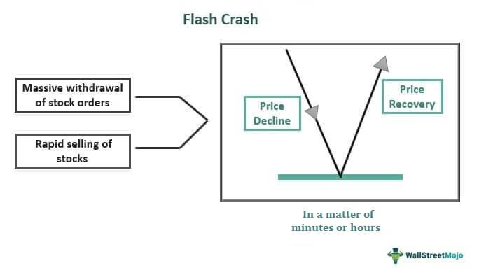

The stock market is a crucial pillar of the global economy, acting as a platform where equities, bonds, and other securities are traded, facilitating capital formation and driving economic growth. It reflects economic conditions, guides investment decisions, and is pivotal in shaping financial policies worldwide. The stock market's significance extends beyond national borders, influencing international trade, investment flows, and policy formulations.

A 'flash crash' is a dramatic and rapid decline in security prices, typically within a very short time frame, followed by a swift recovery. These events highlight the vulnerabilities within the financial systems, exposing the speed and interconnectedness of modern markets. Flash crashes can erode investor confidence and highlight the limits of existing market safeguards.



Understanding flash crashes is vital for comprehending financial history's complexities. These events serve as case studies to analyze market behavior, systemic risks, and the interplay of various economic factors. They have historical significance as they often lead to critical evaluations of market structures and prompt regulatory changes to enhance stability and transparency.

Algorithmic trading, especially high-frequency trading (HFT), plays a prominent role in contemporary financial markets. Using complex algorithms and high-speed data networks, traders execute orders with unprecedented speed and precision. While algorithmic trading enhances liquidity and market efficiency, it is also linked to increased volatility and systemic risks, particularly in events like flash crashes.

This article aims to explore the intricate relationship between flash crashes, financial history, and algorithmic trading. Understanding this intersection is crucial for improving market resilience and developing strategies to mitigate potential disruptions in the future. Through this analysis, the article seeks to offer insights into the dynamics of modern financial markets and the evolving challenges they face.

## Table of Contents

## What Is a Flash Crash?

A flash crash refers to a very rapid, deep, and often volatile drop in security prices occurring within an extremely short time frame, often lasting just minutes or seconds, followed by an equally sudden recovery. Typically, flash crashes affect financial markets including stocks, contracts, and other forms of tradeable securities, and they can result in significant price deviations from perceived intrinsic values. 

A characteristic hallmark of a flash crash is its sudden onset, with prices plummeting at an unforeseen speed—sometimes amplified by algorithmic and high-frequency trading strategies that exacerbate the decline. As opposed to extended market downturns, flash crashes are noted for their short-lived nature: while traditional market declines unfold over hours or days, a flash crash can lead to dramatic price swings and a fast market rebound, sometimes with prices recovering much of their initial loss within minutes.

One of the most notable examples of a flash crash occurred on May 6, 2010, wherein the U.S. stock market witnessed a swift and sharp decline. On this day, major stock indices such as the Dow Jones Industrial Average (DJIA) fell sharply, at one point losing nearly 1,000 points, approximately 9%, only to rebound within minutes. This event temporarily evaporated close to $1 trillion in market value and caused widespread confusion and concern among investors and market stakeholders. The flash crash's impact highlighted vulnerabilities in the market structure, raising questions about the stability and resilience of financial systems amidst algorithmically driven trading environments.

Beyond the May 2010 event, several other flash crashes have been documented. For instance, the currency markets experienced a notable flash crash on October 7, 2016, when the British pound sharply fell in early Asian trading, impacting market [liquidity](/wiki/liquidity-risk-premium). Similarly, on August 24, 2015, U.S. stocks experienced severe momentary declines. These incidents further emphasize the recurrent nature of flash crashes across different markets.

Flash crashes disrupt normal market functioning, creating ripples of uncertainty and highlighting the challenges of maintaining stable and efficient markets in an era dominated by technological and algorithm-driven trading practices. The rapidity with which these crashes occur makes them a significant concern for investors, regulators, and market infrastructures, prompting continuous examination of their causes, effects, and measures to mitigate their impact.

## A Brief History of Flash Crashes

A flash crash is a term used to describe a very rapid, deep, and volatile drop in security prices occurring within an extremely short time period followed by a quick recovery. Throughout financial history, there have been notable incidents that have affected both the psyche of the market and the evolution of trading technologies.

The 2010 Flash Crash, one of the most consequential events, occurred on May 6, 2010. On that day, the Dow Jones Industrial Average (DJIA) plummeted nearly 1,000 points, equivalent to about 9%, in a matter of minutes, before rebounding almost as quickly. This crash was significant not only due to its severity but also because it highlighted vulnerabilities within the market structure exacerbated by modern technological trading systems.

**Causes of the 2010 Flash Crash**

Multiple factors contributed to the 2010 Flash Crash. Key among them was the interaction between [algorithmic trading](/wiki/algorithmic-trading) systems and panic-driven selling. A mutual fund company initiated a large sell order for e-mini S&P 500 futures contracts. This order was executed via an automated execution algorithm designed to target [volume](/wiki/volume-trading-strategy), selling the order at a rate consistent with market volume. However, in a volatile and illiquid market, this led to a feedback loop of aggressive selling.

High-Frequency Trading ([HFT](/wiki/high-frequency-trading-strategies)) firms also played a crucial role. These HFT firms, which typically provide liquidity to markets, began to withdraw under the stress of the rapid sell-off, causing liquidity to evaporate further and exacerbating the decline. This chain reaction of the automated systems coined the phrase "hot-potato" effect, wherein HFT firms rapidly bought and sold securities to avoid holding risk, thereby amplifying [volatility](/wiki/volatility-trading-strategies).

**Effects and Aftermath**

The aftermath of the 2010 Flash Crash was profound. This event was a catalyst for regulatory scrutiny and reform. The U.S. Securities and Exchange Commission (SEC) introduced several measures to prevent a recurrence, most notably the implementation of "circuit breakers" or trading pauses, which were designed to temporarily halt trading if prices moved too quickly, thus allowing time for human intervention and a recalibration of trading algorithms.

**Evolution of Flash Crashes**

Flash crashes have evolved alongside advancements in technology and changes in market structure. Prior to the 21st century, dramatic single-day market drops, like those seen in 1929 or 1987, were marked by correlation to broader economic or geopolitical events. However, modern flash crashes, typified by the 2010 incident, are often more attributed to the complexities of automated trading systems and the rapid communication speeds of electronic markets.

Improvements in market surveillance and algorithm testing protocols have been ongoing in response to these challenges. Stock exchanges worldwide have adopted enhancements in circuit breakers and limits on asset movements. There is also increased emphasis on monitoring and reporting the activities of trading algorithms to reduce the probability of flash crashes.

Overall, while the fundamental causes of market volatility have roots in economic factors, the mechanisms by which flash crashes occur have been significantly influenced by technological integration. The future of market resilience depends heavily on further advancement in technologies to monitor and control trading activities, balanced with human oversight and strategic regulatory policies designed to safeguard against unexpected market turbulence.

## Algo Trading: A Catalyst for Volatility?

Algorithmic trading, often referred to as algo trading, is a method of executing orders using automated and pre-programmed trading instructions. These algorithms take into account variables such as time, price, and volume to [carry](/wiki/carry-trading) out a trade. By leveraging complex mathematical models and formulas, traders utilize algo trading to perform high-speed transactions that are otherwise impossible for humans. 

**Benefits of Algorithmic Trading**

One of the primary advantages of algorithmic trading is market efficiency. By automating processes, algo trading can expedite transaction speeds and contribute to enhanced market liquidity. This speed allows for instant execution and settlement of large orders which might otherwise move the market. Additionally, algo trading minimizes human error, reducing the impact of emotional and psychological factors that can lead to inefficient trading.

Furthermore, algorithmic trading facilitates price discovery in financial markets. By processing vast amounts of data and executing trades based on minute price discrepancies, these systems help in narrowing price spreads and stabilizing the market.

**Criticisms and Concerns**

Despite its benefits, algorithmic trading is often criticized for its role in enhancing market volatility, especially during flash crashes. Flash crashes are characterized by their rapid and severe impact, with prices plummeting and rebounding in a very short timeframe. During these events, the very speed and automation that makes algo trading advantageous can exacerbate market fluctuations. 

High-frequency trading (HFT), a subset of algo trading, frequently comes under scrutiny. HFT allows for the execution of vast numbers of orders at extremely high speeds, often compounding market swings as algorithms react to initial dips or spikes, leading to further sell-offs or buying. Critics argue that the complexity and interconnectedness of these systems can create feedback loops, amplifying volatility.

Regulators and market participants express concerns that algo trading may lead to a lack of transparency and market manipulation. The use of "spoofing" or "layering" techniques—where traders place large orders they do not intend to execute, hoping to influence stock prices—has been a subject of regulatory action.

To mitigate these concerns, regulators have introduced measures such as circuit breakers, which temporarily halt trading after significant market moves. These mechanisms aim to provide a breathing space during periods of extreme volatility, allowing for human intervention and preventing algorithms from inadvertently exacerbating market directionality.

In summary, while algorithmic trading brings considerable benefits to market efficiency and liquidity, it also poses challenges. The inherent speed and complexity of these trades necessitate stringent monitoring and regulations to curb excessive volatility and maintain market integrity.

## Mechanisms Behind Flash Crashes

Flash crashes, characterized by abrupt and significant stock market declines followed by a quick recovery, are complex phenomena influenced by various technical mechanisms. One of the main contributors to these events is High-Frequency Trading (HFT). HFT strategies involve the use of sophisticated algorithms and powerful computers to execute a large number of orders at extremely high speeds. This rapid execution capability, while beneficial in terms of market liquidity and efficiency, can also heighten market volatility and contribute to flash crashes by causing prices to spiral downwards very quickly.

High-Frequency Trading can accelerate market declines due to its reliance on algorithms that react to specific triggers in the market. These algorithms often respond to price movements and market conditions almost instantaneously, leading to a cascade effect when multiple HFT systems react simultaneously. For instance, if an HFT strategy detects a sudden drop in stock prices and sells off shares to limit losses, this can prompt other algorithms to do the same, amplifying the initial decline. This can be modeled as a feedback loop, where the algorithmic reaction to market data precipitates further market movement, which in turn triggers additional algorithmic responses.

Despite its potential to exacerbate volatility, regulatory frameworks have been established to help counteract the consequences of flash crashes. One significant measure is the implementation of 'circuit breakers.' Circuit breakers are automatic mechanisms that temporarily pause or halt trading on an exchange to prevent panic-selling and give traders time to assess market conditions. They function by setting predetermined thresholds for price movement; when these thresholds are breached, trading is stopped for a specified period. 

For example, consider the application of circuit breakers expressed through a simple Python function:

```python
def circuit_breaker(price_movement, threshold):
    if abs(price_movement) > threshold:
        return "Trading Halted"
    return "Continue Trading"

# Example usage
price_change = -10  # represent a percentage drop
threshold = 7  # a 7% move triggers a trading stop
print(circuit_breaker(price_change, threshold))
```

Here, if the given price movement exceeds the threshold of 7%, the function returns a halt signal, indicating that trading should be temporarily stopped to prevent further irrational market behavior.

Circuit breakers are essential in mitigating the immediate effects of a flash crash, affording market participants a respite from automated trading and the rapid spread of market panic. In addition, regulators have progressively tightened surveillance and enforcement measures around HFT practices to ensure fair and orderly trading. These include monitoring algorithms for unusual activity and obligating high-frequency traders to register with exchanges, providing transparency in their trading activities.

Overall, while high-frequency trading can exacerbate the conditions leading to a flash crash, mechanisms like circuit breakers serve as critical safeguards. They enhance market stability and provide essential time buffers in the fast-paced arena of modern trading. Understanding and refining these mechanisms is crucial for anticipating and mitigating potential flash crashes in the future.

## Case Studies: Major Flash Crashes

The 2010 Flash Crash remains one of the most profound examples of market volatility in modern financial history. On May 6, 2010, the U.S. stock market experienced an unprecedented plunge and recovery in just about 36 minutes. During this period, the Dow Jones Industrial Average plummeted nearly 1,000 points, equivalent to about 9%, before quickly recovering. The event highlighted the vulnerability of the financial markets to rapid and substantial price swings and drew attention to the role of high-frequency trading (HFT) and algorithmic systems.

### The 2010 Flash Crash: Causes and Effects

The initial trigger for the 2010 Flash Crash was a large sell order placed by a mutual fund company. This order was executed via an automated trading program designed to sell 75,000 E-mini S&P 500 futures contracts (valued at about $4.1 billion). This strategy unintentionally intensified market stress by selling without regard to price or time, focusing solely on volume. As these orders flooded the market, high-frequency traders and other market participants who rely on algorithmic trading began liquidating their positions to minimize risk, exacerbating the downward spiral in prices.

The rapid sell-off caused liquidity to evaporate, as buyers retreated, further deepening the crash. Within minutes, certain stocks were traded at absurdly low values, with some even priced at a penny, due to the dislocation in the market. The market's structural weaknesses, exacerbated by a lack of human intervention at critical moments, showcased the potential dangers of unregulated algorithmic trading systems.

### Lessons Learned and Changes Implemented

The aftermath of the Flash Crash prompted regulators and market participants to rethink existing systems and introduce safeguards to prevent a recurrence. One significant lesson learned was the importance of market liquidity and the potential for automated systems to drive extreme volatility. The U.S. Securities and Exchange Commission (SEC), along with other regulatory bodies, introduced measures such as circuit breakers, which temporarily halt trading during extreme price movements, allowing time for human intervention and assessment.

Additionally, there was greater scrutiny and regulation of high-frequency trading and the development of protocols to manage the impact of large, automated sell orders. The incident led to a call for improvements in market transparency and the establishment of more robust monitoring systems.

### Stakeholder Responses

Stakeholders across the financial spectrum responded by implementing changes aimed at aligning algorithmic systems with broader market stability goals. Exchanges upgraded their technology to better handle surges in volume and introduced new regulations to prevent abusive trading practices. Investment firms reviewed and revised their trading algorithms, incorporating risk management features to prevent future disruptions.

Moreover, regulatory bodies developed more comprehensive oversight systems, enhancing their ability to detect and analyze market anomalies in real-time. These changes were crucial in bolstering investor confidence and promoting a more resilient trading ecosystem.

In conclusion, the 2010 Flash Crash served as a critical wake-up call for the financial markets, illustrating the need for improved regulatory frameworks and better integration of human oversight into the increasingly digital trading landscape. The lessons learned have led to significant advancements in how markets operate and respond to potential flash events, ultimately contributing to the pursuit of stability and fairness in financial markets worldwide.

## Implications for Investors and Traders

Flash crashes, characterized by their sudden and severe impact on stock prices, present unique challenges to both individual investors and institutional traders. Understanding these impacts and developing strategies to mitigate risks is crucial for maintaining portfolio stability and ensuring long-term financial goals are not derailed by such volatile events.

### Impact on Individual Investors

For individual investors, flash crashes can result in significant losses, especially for those utilizing stop-loss orders or margin accounts. A swift drop in prices may trigger stop-loss orders, leading to automatic selling of assets at a loss, only for prices to rebound shortly after. This scenario underscores the importance of being cautious with automated trading mechanisms that do not account for extreme market volatility.

### Impact on Institutional Traders

Institutional traders face their own set of challenges. Their large-volume trades can exacerbate volatility during a flash crash, contributing to a downward spiral. These entities often rely on algorithmic trading strategies, which, if not properly calibrated, can magnify losses or fail to capitalize on brief price discrepancies. Additionally, institutional traders must contend with liquidity constraints, as they might find it difficult to execute trades swiftly during periods of market stress.

### Strategies to Protect Portfolios

1. **Diversification**: A well-diversified portfolio across asset classes can reduce exposure to the sudden impact of a flash crash in any single market. By spreading investments, the adverse effects of a flash crash on a particular segment are cushioned by stability or gains in others.

2. **Cash Reserves**: Maintaining a portion of the portfolio in cash offers the flexibility to capitalize on buying opportunities that arise post-flash crash, allowing investors to purchase assets at temporarily deflated prices.

3. **Risk Management Tools**: Options strategies, such as protective puts, can act as insurance against significant declines. A protective put involves buying a put option for a stock that is owned, providing the right to sell at a predetermined price that limits losses during a crash.

### Advice for Algorithmic Traders

For algorithmic traders, especially those employing high-frequency trading (HFT) strategies, several precautionary measures are advisable:

1. **Robust Risk Management Frameworks**: Implementing advanced risk controls, such as dynamic stop-loss protocols and volatility-adjusted position sizing, can limit exposure to abrupt market swings.

2. **Algorithm Audits**: Regularly reviewing and stress-testing algorithms under various market scenarios can help identify potential vulnerabilities that may be exploited during flash crashes.

3. **Adaptive Algorithms**: Developing algorithms capable of detecting abnormal market patterns and adjusting trading behavior accordingly can offer protection. This might involve pausing trading when market conditions become unusually erratic.

4. **Incorporating Circuit Breakers**: Just as exchanges use circuit breakers to halt trading, similar mechanisms within trading strategies can prevent exacerbating losses during unexpected crashes.

### Conclusion

Flash crashes remain a significant concern for investors and traders alike. By employing sound risk management practices and adapting trading strategies to account for the unique challenges posed by these events, both individual and institutional participants can better navigate the complexities of modern financial markets.

## Regulation and the Future of Algo Trading

Algorithmic trading, often coupled with high-frequency trading (HFT), has significantly transformed global financial markets. These technologically advanced trading methods are under increased scrutiny by regulators, ensuring their activities do not compromise market integrity and stability. This section explores current regulatory frameworks, proposed measures for enhancing market stability, and anticipates the future landscape of trading influenced by algorithmic trading.

### Current Regulatory Approaches

Regulators worldwide have recognized the dual-edged nature of algorithmic and high-frequency trading. While these trades improve market liquidity and efficiency, they also pose risks of heightened volatility and systemic disruptions, evidenced by past flash crashes. In response, several measures have been adopted to mitigate these risks:

1. **Registration and Reporting Requirements**: Many regulatory bodies, such as the U.S. Securities and Exchange Commission (SEC) and the European Securities and Markets Authority (ESMA), require firms engaging in algorithmic trading to register and provide detailed reporting of their activities. This enables regulators to monitor the market impact of trading algorithms.

2. **Circuit Breakers and Volatility Controls**: Exchanges have implemented circuit breakers—mechanisms that temporarily halt trading if a stock's price moves beyond certain thresholds—to prevent excessive volatility. These serve as a first line of defense against destabilizing price movements.

3. **Risk Management Obligations**: Firms must implement comprehensive risk management strategies, ensuring algorithms do not lead to uncontrolled trading activities. This includes mandatory pre-trade risk checks and continuous monitoring of trading activities.

4. **Market Abuse Regulations**: Strict rules are in place to prevent manipulative practices attributed to algorithmic trading, such as spoofing (placing orders with no intention of executing them to manipulate prices) and layering.

### Proposals for Improving Market Stability

Despite existing measures, the rapid evolution of trading technology necessitates continuous updates to regulatory frameworks. Some proposals aimed at enhancing market stability in light of algorithmic trading include:

1. **Enhanced Transparency**: Increasing the transparency of algorithmic trading strategies would help regulators understand how these algorithms interact within the market ecosystem. This could be facilitated by mandating public disclosures of algorithmic trading strategies and activities.

2. **Real-time Monitoring Systems**: Developing advanced real-time monitoring systems would allow for the swift detection of anomalous trading patterns, potentially preempting flash crash scenarios. This could include machine learning algorithms capable of identifying early signs of market manipulation or excessive volatility.

3. **Algorithm Testing and Certification**: Implementing a mandatory certification process for trading algorithms can ensure they meet predefined standards of safety and stability before being deployed in live markets.

4. **Cross-Market Coordination**: Regulators should foster greater coordination across markets and jurisdictions to address the global nature of algorithmic trading. This includes sharing information and best practices to harmonize regulatory standards.

### Future Landscape of Trading and Financial Markets

The future of trading and financial markets, shaped by algorithmic trading, points toward an increasingly automated and data-driven environment. However, this evolution presents both opportunities and challenges:

1. **Advanced Artificial Intelligence and Machine Learning**: These technologies will likely become integral to algorithmic trading, allowing for highly sophisticated, adaptive trading strategies. As these technologies advance, so too must regulatory approaches, ensuring they adequately address potential risks.

2. **Decentralized Finance (DeFi) Integration**: With the rise of blockchain technology and decentralized finance, algorithmic trading might extend into these domains. This evolution would require novel regulatory considerations distinct from traditional financial markets.

3. **Sustainability and Ethical Considerations**: Future regulations may incorporate sustainability criteria, encouraging algorithmic trading firms to adopt environmentally friendly practices. Ethical considerations will also play a role, particularly concerning the transparency and fairness of trading algorithms.

In summary, while algorithmic trading continues to revolutionize financial markets, it warrants ongoing regulatory vigilance to safeguard market stability. The potential for improved transparency, real-time oversight, and international cooperation will be crucial in navigating the complexities of this trading paradigm.

## Conclusion

Flash crashes have emerged as significant events in financial history, often serving as stark reminders of the fragility and interconnectedness of modern markets. These rapid and severe market declines underscore the volatility that can arise from a confluence of factors, prominently featuring algorithmic trading. By swiftly altering market conditions, flash crashes challenge the assumptions of market efficiency and the role of technology in finance.

The complex interplay between flash crashes and algorithmic trading presents a multifaceted relationship. Algorithmic trading, with its capacity for executing high-speed, high-volume transactions, can both stabilize and destabilize markets. While it enhances liquidity and narrows spreads under normal conditions, its influence during flash crashes can exacerbate volatility. The 2010 Flash Crash, for instance, illustrated how algorithmic strategies might amplify sell-offs in stressed environments, quickly intensifying declines.

Strategies for mitigating flash crashes are imperative for ensuring market resilience. Regulatory measures such as circuit breakers, which temporarily halt trading during significant market movements, are among the primary tools for controlling panic-induced sell-offs. Enhancing transparency in algorithmic trading and fostering international cooperation among regulatory bodies can further bolster market stability. The development of sophisticated monitoring tools to detect unusual trading patterns in real time is also crucial.

Looking to the future, advancing market resilience will likely entail a delicate balance between embracing technological innovations and imposing necessary regulatory safeguards. Market participants must remain vigilant, continuously adapting strategies to mitigate the risks posed by flash crashes. By learning from past events, stakeholders can cultivate a more robust financial system capable of withstanding the challenges posed by high-frequency trading and sudden market shifts.

In summary, while flash crashes will continue to shape financial history and test the resilience of global markets, proactive strategies and regulations can mitigate their impact, fostering a more secure and predictable trading environment.

## References and Further Reading

1. **Books:**
   - *Flash Boys: A Wall Street Revolt* by Michael Lewis: This book provides an inside look at high-frequency trading and how it contributed to significant market fluctuations, making it a crucial read for understanding the context of flash crashes and algorithmic trading.
   - *Dark Pools: High-Speed Traders, A.I. Bandits, and the Threat to the Global Financial System* by Scott Patterson: This book explores the rise of algorithmic trading platforms and their impact on global markets, offering insights into the mechanics of flash crashes.

2. **Journal Articles:**
   - Kirilenko, A., Kyle, A. S., Samadi, M., & Tuzun, T. (2017). *The Flash Crash: The Impact of High Frequency Trading on an Electronic Market*. Journal of Finance. This paper provides an empirical analysis of the role high-frequency trading played in the 2010 Flash Crash.
   - Easley, D., López de Prado, M. M., & O'Hara, M. (2011). *The Microstructure of the 'Flash Crash': Flow Toxicity, Liquidity Crashes, and the Probability of Informed Trading*. Journal of Portfolio Management. This article investigates how market microstructure and high-frequency trading contributed to flash crashes.

3. **Research Papers:**
   - CFTC & SEC, *Findings Regarding the Market Events of May 6, 2010*. This official report by the Commodity Futures Trading Commission and the Securities and Exchange Commission provides an in-depth examination of the 2010 Flash Crash.
   - Paddrik, M., Hayes, R., Todd, A., Yang, S., & Beling, P. (2019). *An Agent-Based Model of the E-mini S&P 500* to understand the impact of algorithmic trading on market dynamics, highlighting the potential for flash crashes.

4. **Online Articles and Reports:**
   - The Economist (2012). *Algorithmic trading: The maths that ate Wall Street*. An accessible online article that describes how complex algorithms have transformed trading.
   - Bank for International Settlements (BIS) (2018). *High-frequency trading in the foreign exchange market*: This report explores the effects of high-frequency trading in different market environments, relevant to understanding its role during flash crashes.

5. **Websites and Online Resources:**
   - Investopedia [Investopedia - Flash Crash](https://www.investopedia.com/terms/f/flash-crash.asp): Offers comprehensive explanations and current analyses of high-frequency trading and market volatility events.
   - Securities and Exchange Commission (SEC): Provides updates on regulatory measures and their impacts on market stability, essential for understanding ongoing efforts to mitigate flash crashes.

These resources offer foundational knowledge and current perspectives on algorithmic trading and flash crashes, aiding in comprehending their complexities and future developments in financial markets.

## References & Further Reading

[1]: Patterson, Scott. ["Dark Pools: High-Speed Traders, A.I. Bandits, and the Threat to the Global Financial System"](https://books.google.com/books/about/Dark_Pools.html?id=LIoNSKUEn24C) (2012).

[2]: Lewis, Michael. ["Flash Boys: A Wall Street Revolt"](https://en.wikipedia.org/wiki/Flash_Boys) (2015).

[3]: Kirilenko, A., Kyle, A. S., Samadi, M., & Tuzun, T. (2017). ["The Flash Crash: The Impact of High Frequency Trading on an Electronic Market"](https://onlinelibrary.wiley.com/doi/abs/10.1111/jofi.12498). Journal of Finance.

[4]: CFTC & SEC. ["Findings Regarding the Market Events of May 6, 2010"](https://www.sec.gov/news/studies/2010/marketevents-report.pdf). Report of the Joint Advisory Committee on Emerging Regulatory Issues.

[5]: Investopedia. ["Flash Crash"](https://www.investopedia.com/terms/f/flash-crash.asp).

[6]: The Economist. ["Algorithmic trading: The maths that ate Wall Street"](https://www.interactivebrokers.com/campus/ibkr-quant-news/essential-mathematical-concepts-algo-trading/) (2012).