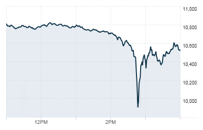

## Table of Contents

## What is a flash crash?

A flash crash is when the price of a stock or a whole market drops very quickly and then goes back up almost as fast. It usually happens because of fast trading by computers and can be caused by a big sell order or a mistake in the trading system. These sudden drops can be scary for people who own stocks because they see the value of their investments go down a lot in a short time.

Flash crashes can happen in just a few minutes or even seconds. They are hard to predict and can be caused by many things, like problems with the trading technology or when lots of people try to sell at the same time. Even though the prices usually come back up quickly, flash crashes can still cause a lot of worry and confusion in the market. It's important for people who trade stocks to know about flash crashes so they can be ready if one happens.

## What causes a flash crash?

A flash crash can happen because of fast trading done by computers. These computers can buy and sell stocks very quickly, sometimes in just a few seconds. If something goes wrong, like a big sell order coming in all at once, it can make the price of a stock drop really fast. This can start a chain reaction where other computers see the price going down and start selling too, making the price drop even more.

Another reason for a flash crash can be a mistake in the trading system. Sometimes, there can be a glitch or error that makes the system do things it's not supposed to do. For example, if the system thinks there are more sellers than there really are, it might lower the price a lot. Also, if lots of people try to sell their stocks at the same time because they're worried about the market, it can cause the prices to fall quickly.

Even though flash crashes can be scary, they usually don't last long. The prices often go back up quickly once the computers stop trading or the mistake is fixed. But it's still important for people who trade stocks to be careful and know what to do if a flash crash happens.

## Can you provide an example of a notable flash crash?

One famous flash crash happened on May 6, 2010. It's called the "2010 Flash Crash." On that day, the stock market in the United States suddenly dropped a lot. In just a few minutes, the Dow Jones Industrial Average, which is a big measure of the stock market, lost about 1,000 points. This was a huge drop and it scared a lot of people who owned stocks. The prices went back up pretty quickly, but it was still a big deal and made people worry about how safe the market was.

Later, people found out that the flash crash was caused by a big sell order from a trader. This trader used a computer program to sell a lot of a certain kind of stock called E-Mini S&P 500 futures. The computer sold the stocks too quickly, and this made other computers start selling too. It was like a chain reaction that made the prices drop really fast. After the crash, rules were changed to try to stop this kind of thing from happening again.

## How long does a typical flash crash last?

A typical flash crash usually lasts just a few minutes, sometimes even just a few seconds. It happens really fast because computers are doing the trading. When a big sell order comes in or there's a mistake in the trading system, the price of stocks can drop quickly. But then, the prices usually go back up just as fast once the computers stop trading or the mistake is fixed.

Even though flash crashes don't last long, they can be scary for people who own stocks. Seeing the value of your investments drop a lot in such a short time can be really worrying. It's important for people who trade stocks to know about flash crashes so they can be ready if one happens and not panic when they see the prices go down suddenly.

## What are the impacts of a flash crash on the market?

A flash crash can cause a lot of worry and confusion in the market. When people see the prices of stocks drop suddenly, they might get scared and start selling their own stocks. This can make the prices drop even more. Even though the prices usually go back up quickly, the sudden drop can make people lose trust in the market. They might think the market is not safe and decide to take their money out, which can cause more problems.

Flash crashes can also hurt people who own stocks. If someone needs to sell their stocks during a flash crash, they might have to sell them at a much lower price than they wanted. This means they lose money. Also, flash crashes can make the market less stable. If they happen a lot, people might not want to invest in stocks anymore because they're afraid of losing money. This can slow down the whole economy because companies need people to invest in them to grow.

## What measures are in place to prevent flash crashes?

After the big flash crash in 2010, people who watch over the stock market made new rules to try to stop flash crashes from happening again. One of these rules is called a "circuit breaker." A circuit breaker is like a pause button for the market. If the price of a stock drops too fast, trading stops for a little while. This gives everyone a chance to calm down and figure out what's going on before trading starts again. It helps stop the chain reaction of selling that can make prices drop even more.

Another thing they did was to make the computers that trade stocks slower. They added something called a "speed bump" to the trading system. This means that the computers can't buy and sell stocks as fast as they used to. By slowing things down a bit, it's harder for a big sell order to cause a flash crash. Also, they made rules about how much a computer can trade at one time. This helps stop one big sell order from causing a big problem in the market.

## How do high-frequency trading and algorithms contribute to flash crashes?

High-frequency trading and algorithms can make flash crashes happen because they trade stocks really fast. These computers can buy and sell stocks in just a few seconds. If a big sell order comes in, the computers might see it and start selling their own stocks too. This can make the price of the stock drop really fast. It's like a chain reaction where one computer starts selling and then others follow, making the price go down even more.

To try to stop flash crashes, people who watch over the market made new rules. One rule is called a "circuit breaker," which is like a pause button. If the price of a stock drops too fast, trading stops for a little while. This gives everyone time to calm down and figure out what's going on. Another thing they did was to slow down the computers a bit with something called a "speed bump." By making the computers trade more slowly, it's harder for a big sell order to cause a flash crash.

## What is the role of market liquidity during a flash crash?

Market liquidity is about how easy it is to buy or sell stocks without making the price change a lot. During a flash crash, liquidity can make things better or worse. If there are lots of buyers and sellers in the market, it's easier to trade stocks without big price changes. But if there aren't many people trading, a big sell order can make the price drop a lot because there aren't enough buyers to keep the price steady.

When a flash crash happens, the sudden drop in prices can scare people away from trading. This means there are fewer buyers and sellers, which makes the market less liquid. With less liquidity, it's harder for the market to recover quickly because there aren't enough people to buy the stocks and bring the prices back up. So, good liquidity can help stop flash crashes from getting worse, but when liquidity goes down during a flash crash, it can make the problem bigger.

## How do regulatory bodies respond to flash crashes?

When a flash crash happens, regulatory bodies like the Securities and Exchange Commission (SEC) in the United States work quickly to figure out what went wrong. They look at trading data to see if a big sell order or a computer glitch caused the crash. They also check if anyone broke the rules or did something wrong. By understanding what happened, they can make new rules to stop it from happening again.

After a flash crash, regulatory bodies often make changes to the market rules to make it safer. For example, after the 2010 flash crash, they introduced circuit breakers, which are like pause buttons that stop trading if prices drop too fast. They also added speed bumps to slow down high-frequency trading and set limits on how much can be traded at once. These changes help keep the market more stable and prevent big, sudden price drops.

## What are the differences between a flash crash and a market correction?

A flash crash and a market correction are both times when stock prices go down, but they are different in how fast they happen and how long they last. A flash crash is very quick, happening in just a few minutes or even seconds. It's usually caused by computers trading very fast and can be set off by a big sell order or a mistake in the trading system. The prices go back up quickly once the problem is fixed. On the other hand, a market correction takes longer, often lasting weeks or months. It happens when the market thinks stocks are too expensive and need to be cheaper. It's a more normal part of how the market works and not caused by computers.

While a flash crash is sudden and scary, a market correction is more expected and part of the ups and downs of the market. People who own stocks might feel worried during both, but a market correction is seen as a healthy way for the market to adjust prices. Flash crashes can make people lose trust in the market because they happen so fast and seem out of control. Market corrections, though, are seen as a normal part of investing and don't usually cause the same kind of panic.

## How can investors protect themselves during a flash crash?

Investors can protect themselves during a flash crash by staying calm and not making quick decisions. When prices drop suddenly, it's easy to get scared and sell stocks at a low price. But flash crashes usually don't last long, and the prices go back up quickly. So, it's better to wait and see what happens instead of selling right away. If you need to sell stocks during a flash crash, try to use a limit order. This means you set a price you want to sell at, and the stock won't sell unless it reaches that price. This can help you get a better price for your stocks.

Another way to protect yourself is by having a good mix of different kinds of investments. If you have all your money in one stock or one type of investment, a flash crash can hurt you a lot. But if you spread your money out over different stocks, bonds, and other investments, it's less risky. This way, if one stock goes down a lot during a flash crash, the others might not be affected as much. Also, learning about the market and understanding what can cause a flash crash can help you be ready if one happens. Knowing what to expect can make it easier to stay calm and make smart choices.

## What research has been conducted on predicting and mitigating flash crashes?

Researchers have been working hard to figure out how to predict and stop flash crashes. They use a lot of math and computer science to look at trading data and see if they can spot signs that a flash crash might happen. Some studies have found that looking at how much people are trading and how fast prices are changing can help predict flash crashes. By using these signs, they hope to make systems that can warn people before a flash crash happens. This way, people can be ready and maybe even stop the crash from getting worse.

To stop flash crashes, researchers have also come up with new ways to make the market safer. They suggest things like making trading slower or setting rules about how much can be traded at once. These ideas have been used to make new rules, like circuit breakers that pause trading if prices drop too fast. By testing these ideas in computer models, researchers can see if they really work to stop flash crashes. The goal is to make the market more stable so that flash crashes happen less often and are less scary for people who own stocks.

## References & Further Reading

Johnson, B., & Zhao, A. (2013). "The Flash Crash: The Impact of High-Frequency Trading on an Electronic Market." The Journal of Finance. This paper examines the role high-frequency trading (HFT) played during the 2010 flash crash. It provides empirical evidence on how these traders reacted under stress, affecting overall market liquidity.

Easley, D., Lopez de Prado, M. M., & O'Hara, M. (2011). "The Exchange of High-Frequency Market Makers." The Journal of Trading. This article offers insights into how high-frequency market makers operate and the implications for market stability. The authors discuss the balance between providing liquidity and contributing to price fluctuations.

Kirilenko, A., Kyle, A. S., Samadi, M., & Tuzun, T. (2017). "The Flash Crash: High-Frequency Trading in an Electronic Market." The Journal of Economic Perspectives. This work analyzes transaction data from the flash crash to identify patterns in trading behavior, particularly the actions of high-frequency traders, underscoring the systemic risks posed by algorithmic trading.

Gsell, M. (2009). "Assessing the Impact of Algorithmic Trading on Markets: A Simulation Approach." Doctoral Thesis, University of Hohenheim. Gsell's dissertation employs simulation techniques to study the effects of algorithmic trading on market dynamics, highlighting potential benefits and pitfalls of these strategies under different market conditions.

Aldridge, I. (2013). "High-Frequency Trading: A Practical Guide to Algorithmic Strategies and Trading Systems." Wiley. Aldridge's book serves as a comprehensive resource on high-frequency trading, detailing various algorithmic strategies and the technological infrastructure behind these systems. It also covers risk management considerations essential for minimizing adverse market impacts.

