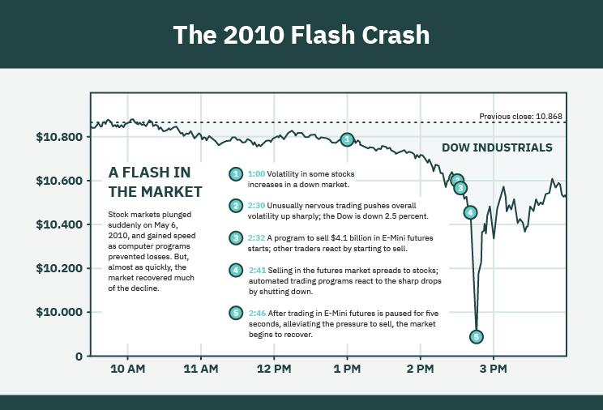

Algorithmic trading has significantly transformed the landscape of global finance by enhancing the speed and efficiency of market transactions. This sophisticated approach leverages advanced algorithms to execute trades at velocities unattainable by human traders. While the advantages of this method are clear, it has also brought about new challenges, notably the phenomenon known as flash crashes. These are sudden, severe market declines that occur within extremely short time frames, often shaking investor confidence and disrupting financial markets.

Flash crashes often stem from the complex interdependencies inherent in algorithmic trading systems. These systems can interact in unpredictable ways, leading to rapid price movements that are exacerbated by automated trading. The dense network of interconnected algorithms can produce a cascade effect, where initial price movements trigger further automated responses, amplifying the effect and contributing to significant market volatility.



A pivotal example of a flash crash occurred on May 6, 2010, when the Dow Jones Industrial Average dramatically fell nearly 1000 points in mere minutes before recovering just as quickly. This incident highlighted the potential vulnerabilities in algorithmic systems, particularly concerning high-frequency trading and large-volume transactions. The intricate mechanics of these systems can introduce unexpected outcomes, emphasizing the need for rigorous testing and monitoring.

For the stability of financial markets, understanding flash crashes and their origins is crucial. This entails examining how algorithmic trading can lead to such drastic market behavior and recognizing the triggers that set off these events. Furthermore, it's essential to consider the role of liquidity providers and how their interactions with automated systems can exacerbate market disturbances.

Efforts to mitigate the risks associated with flash crashes have concentrated on regulatory and technological interventions. Regulators have introduced measures, such as circuit breakers, which temporarily halt trading to curb panic-induced sales. Moreover, the development of more robust algorithms and improved monitoring systems aim to prevent the triggers that lead to these disruptive events.

In summary, while algorithmic trading offers remarkable benefits to the financial world, it also presents significant challenges that must be carefully managed. By understanding the underlying causes and mechanisms of flash crashes, and implementing effective safeguards, the financial industry can strive towards creating more resilient markets and ensuring continued investor confidence.

## Table of Contents

## Deciphering Flash Crashes

Flash crashes represent abrupt and significant drops in asset prices, typically succeeded by rapid recoveries. These events are predominantly fueled by automated trading systems that execute numerous transactions at extraordinary speeds. A prominent example of such an incident is the flash crash of May 6, 2010. On that day, the Dow Jones Industrial Average (DJIA) experienced a staggering fall of nearly 1000 points within minutes, marking one of the most severe single-day declines in its history.

The 2010 flash crash illuminated several critical vulnerabilities inherent in trading algorithms, particularly those designed for high-frequency and large-[volume](/wiki/volume-trading-strategy) orders. High-frequency trading ([HFT](/wiki/high-frequency-trading-strategies)) strategies, which rely on speed and volume to capitalize on market inefficiencies, were implicated in the market's rapid decline and recovery during the event. As automated systems began to offload large positions rapidly, this mass exodus amplified selling pressure, exacerbating the initial downturn.

Identifying the triggers of flash crashes involves analyzing a complex interplay of factors. Liquidity providers, who play an essential role in stabilizing markets by buying or selling assets to facilitate smooth transactions, may suddenly withdraw during times of heightened [volatility](/wiki/volatility-trading-strategies). This withdrawal reduces available [liquidity](/wiki/liquidity-risk-premium), leading to pronounced price swings. Automated trading systems, relying on programmed algorithms, may further fuel volatility when executing sell orders based on specific conditions, such as price thresholds or market trends.

A thorough examination of these phenomena requires a focus on both the microstructure of financial markets and the systemic factors that contribute to such events. For example, a slight market imbalance can be magnified by [algorithmic trading](/wiki/algorithmic-trading), which operates without the nuance of human traders who might otherwise act as stabilizing forces. Consequently, these systems can, inadvertently, initiate a cascade of automated responses that intensify market volatility rather than alleviate it.

In understanding flash crashes, attention must be paid to the mechanics of automated trading, the constraints of liquidity provision, and the potential domino effects that can arise from algorithmic decision-making during periods of high stress. By recognizing these triggers and their interplay, stakeholders can better anticipate and mitigate the adverse impacts of these sudden, severe market disruptions.

## The Mechanism Behind Flash Crashes

Flash crashes are abrupt market events where the prices of assets drop sharply within minutes, often rebounding just as quickly. These phenomena principally arise from the complex interplay of automated trading, shifts in market sentiment, and liquidity issues.

Automated trading relies on algorithms that execute transactions at incredible speeds. These algorithms, particularly in high-frequency trading, can initiate massive sell-offs when pre-defined price thresholds are breached. A typical example involves algorithms programmed to sell when the price of an asset drops by a certain percentage. If multiple systems trigger simultaneously due to a price drop, it can cause a rapid and severe cascade effect, exacerbating the overall market decline.

Errors in algorithmic trading systems can also contribute significantly to flash crashes. Programming flaws or insufficiently tested algorithms can lead to unexpected behavior. For instance, an algorithm might interpret incoming data incorrectly, resulting in erroneous buy or sell orders. Such issues can destabilize the market if not identified and corrected promptly.

Additionally, sudden news or unexpected events can lead to abrupt shifts in market sentiment, which are further amplified by automated trading systems. The presence of AI-driven algorithms compounds this effect. For instance, a major economic announcement or geopolitical event may lead to an immediate market reaction, with algorithms rapidly pulling liquidity or executing trades based on sentiment analysis. Here is a simple Python example showing how sudden news might affect an algorithmic trading strategy:

```python
import random

def trading_algorithm(market_price, news_sentiment):
    decision_threshold = 0.7
    sell_trigger = market_price * 0.95
    buy_trigger = market_price * 1.05

    sentiment_impact = news_sentiment * random.uniform(-0.1, 0.1)
    adjusted_price = market_price * (1 + sentiment_impact)

    if adjusted_price <= sell_trigger:
        return "Sell", adjusted_price
    elif adjusted_price >= buy_trigger:
        return "Buy", adjusted_price
    else:
        return "Hold", adjusted_price

# Example usage
current_price = 100
news_sentiment_score = -0.8  # Negative sentiment from news
decision, price = trading_algorithm(current_price, news_sentiment_score)
```

In this example, the algorithm bases its decisions on market price and sentiment scores. A negative sentiment score sharply influences the market price, potentially triggering a sell if adjusted prices drop significantly.

Normally, efficiency and speed are hallmarks of algorithmic trading, but the same attributes can lead to vulnerabilities during flash crashes. The intricate web of trading algorithms, market sentiment, and liquidity challenges requires constant monitoring and adaptation to prevent these unexpected market disruptions.

## Preventing the Domino Effect

To mitigate flash crashes and enhance market stability, several strategies have been implemented, with circuit breakers being among the most effective. Circuit breakers are designed to temporarily halt trading when significant price fluctuations occur, providing a cooling-off period for the market. This mechanism allows traders to assess their strategies and market conditions, thus preventing panic selling and further volatility. 

Enhancing the design of trading algorithms plays a crucial role in avoiding triggers that might lead to flash crashes. Algorithm developers focus on refining the logic and thresholds within which these algorithms operate to avoid the unintended consequences of rapid price movements. For instance, algorithms are now programmed to include dynamic parameters that adjust to real-time market conditions, reducing the likelihood of a cascading effect caused by a sudden shift in market sentiment.

Regulatory measures are also indispensable in the prevention of unintended market disruptions. Authorities have mandated rigorous testing and validation of algorithmic models before deployment. This includes stress testing with historical data and simulated scenarios to analyze how algorithms react under extreme conditions. Real-time monitoring is also crucial, as it allows for the detection of anomalies or aberrant trading patterns, enabling swift intervention to avert potential crashes.

Financial institutions have strengthened their risk management frameworks by employing diversified algorithmic strategies and emphasizing human oversight. Rather than relying solely on algorithmic trading, firms implement a combination of algorithms that act across different market segments and time frames, thus distributing risk. Additionally, incorporating human oversight ensures that there is immediate intervention capability when automated systems exhibit abnormal behavior. 

By integrating these preventative measures, the financial industry aims to shield markets from the potentially destabilizing effects of flash crashes while continuing to leverage the efficiencies brought about by algorithmic trading. This balanced approach is key to fostering a stable and resilient trading environment.

## Conclusion

Flash crashes reveal intrinsic weaknesses in algorithmic trading, highlighting the necessity for improved monitoring and strategic risk management approaches. These rapid market declines emphasize the importance of integrating advanced monitoring tools and predictive algorithms. Such innovations allow for real-time analysis and detection of anomalies, thereby improving market stability.

Regulatory oversight plays a crucial role in addressing the vulnerabilities exposed by flash crashes. By establishing comprehensive frameworks that mandate regular testing and validation of trading algorithms, market regulators can preemptively identify potential flaws. These measures should include real-time surveillance systems that enable immediate intervention when anomalies are detected, thereby reducing the likelihood of a flash crash event.

The financial industry must remain vigilant and adaptive, continuously evolving to balance the advantages of [artificial intelligence](/wiki/ai-artificial-intelligence) with its inherent risks. Continuous improvement and innovation are essential to ensuring that the benefits of algorithmic trading outweigh potential threats. Institutions must invest in robust risk management frameworks that are dynamic and capable of accommodating rapid technological advancements.

A proactive approach is fundamental for market participants seeking to navigate the complexities of evolving trading environments. By emphasizing strategic foresight and preparedness, investors can protect their assets and contribute to a secure financial landscape. Harnessing the power of technology while maintaining rigorous oversight allows for the mitigation of risks associated with algorithmic trading, ensuring the long-term stability and security of financial markets.

## References & Further Reading

Johnson, B., & Zhao, A. (2013). "The Flash Crash: The Impact of High-Frequency Trading on an Electronic Market." The Journal of Finance. This paper examines the role high-frequency trading (HFT) played during the 2010 flash crash. It provides empirical evidence on how these traders reacted under stress, affecting overall market liquidity.

Easley, D., Lopez de Prado, M. M., & O'Hara, M. (2011). "The Exchange of High-Frequency Market Makers." The Journal of Trading. This article offers insights into how high-frequency market makers operate and the implications for market stability. The authors discuss the balance between providing liquidity and contributing to price fluctuations.

Kirilenko, A., Kyle, A. S., Samadi, M., & Tuzun, T. (2017). "The Flash Crash: High-Frequency Trading in an Electronic Market." The Journal of Economic Perspectives. This work analyzes transaction data from the flash crash to identify patterns in trading behavior, particularly the actions of high-frequency traders, underscoring the systemic risks posed by algorithmic trading.

Gsell, M. (2009). "Assessing the Impact of Algorithmic Trading on Markets: A Simulation Approach." Doctoral Thesis, University of Hohenheim. Gsell's dissertation employs simulation techniques to study the effects of algorithmic trading on market dynamics, highlighting potential benefits and pitfalls of these strategies under different market conditions.

Aldridge, I. (2013). "High-Frequency Trading: A Practical Guide to Algorithmic Strategies and Trading Systems." Wiley. Aldridge's book serves as a comprehensive resource on high-frequency trading, detailing various algorithmic strategies and the technological infrastructure behind these systems. It also covers risk management considerations essential for minimizing adverse market impacts.