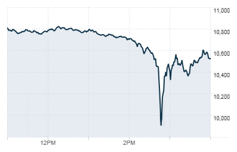

## Table of Contents

## What is a flash crash?

A flash crash is when the price of a stock or a whole market drops very quickly and then goes back up just as fast. It usually happens in just a few minutes. This can be scary for people who own stocks because they see the value of their investments go down a lot in a short time.

Flash crashes can happen because of computer trading programs that automatically buy and sell stocks. Sometimes these programs start selling a lot of stocks at once, which makes the price drop quickly. Other times, it can be because of a big mistake or news that makes everyone want to sell their stocks at the same time. But usually, the market goes back to normal soon after.

## What causes flash crashes?

Flash crashes are often caused by high-frequency trading, which is when computers trade stocks very quickly. These computers use special programs that can buy and sell stocks in milliseconds. Sometimes, these programs can start selling a lot of stocks at the same time because of a small change in the market or because of a mistake in the program. This can make the price of a stock drop very fast.

Another reason for flash crashes can be big news or events that make a lot of people want to sell their stocks at the same time. For example, if there is bad news about a company, many people might decide to sell their stocks in that company all at once. This sudden selling can cause the price to drop quickly. But usually, once the initial panic is over, the market calms down and the prices go back to normal.

Sometimes, flash crashes can also happen because of mistakes, like when someone enters a wrong number into a trading system. For instance, if someone meant to sell 100 shares but accidentally entered 100,000 shares, it could cause a big drop in the stock price. These kinds of errors can be fixed quickly, but they can still cause a flash crash while they happen.

## Can you give an example of a well-known flash crash?

One of the most famous flash crashes happened on May 6, 2010. It's called the "2010 Flash Crash." On that day, the stock market in the United States dropped a lot in just a few minutes. The Dow Jones Industrial Average, which is a big measure of the stock market, went down by almost 1,000 points in about 36 minutes. This scared a lot of people because it seemed like their money was disappearing quickly.

After the crash, the market went back up pretty fast. People later found out that the flash crash was mostly caused by high-frequency trading. Some computers started selling a lot of stocks at the same time because of a mistake. This made other computers think something was wrong and they started selling too. It was a big lesson for everyone about how fast computers can change the market.

## How long do flash crashes typically last?

Flash crashes usually don't last very long. They can happen in just a few minutes, sometimes even less than that. When the price of a stock or the whole market drops quickly, it often goes back up just as fast. This is because the market usually finds its balance again after the initial panic.

The 2010 Flash Crash, for example, lasted about 36 minutes. The market dropped a lot in that time but then went back up. Most flash crashes are over in a short time, but they can be scary while they're happening because people see their money going down quickly.

## What impact can flash crashes have on the market?

Flash crashes can scare people who own stocks. When the price of a stock or the whole market drops a lot in a short time, it can make people think something is very wrong. This can lead to more selling and make the market go down even more. But usually, the market goes back up quickly after a flash crash. Still, it can make people lose trust in the market because they see how fast things can change.

Even though flash crashes don't last long, they can have a bigger effect on the market. They can make people think more about the risks of trading with computers. After a flash crash, people might want new rules to make sure it doesn't happen again. This can lead to changes in how the market works to make it safer for everyone.

## How do regulators respond to flash crashes?

When a flash crash happens, people who make the rules, called regulators, look at what went wrong. They want to find out if it was because of a mistake, computer trading, or something else. After they figure out why it happened, they can make new rules to stop it from happening again. They might change how computers can trade stocks or make sure that big trades have to be checked before they happen.

After the big flash crash in 2010, regulators made some changes. They put in new rules to slow down some computer trading and make sure big orders are checked before they go through. These changes helped make the market safer. But regulators keep watching the market all the time to see if they need to make more changes to keep it safe for everyone.

## What measures are in place to prevent flash crashes?

To stop flash crashes from happening, people who make the rules have put in new ways to keep the market safe. They made rules to slow down some computer trading. This means that computers can't buy and sell stocks as fast as they used to. They also made sure that big orders have to be checked before they go through. This helps stop mistakes that can cause a flash crash.

Another thing they did was to make sure there are more checks on the market all the time. They watch the market to see if anything strange is happening. If they see something that could cause a flash crash, they can step in and stop it before it gets too bad. These steps help make the market safer for everyone who owns stocks.

## How do high-frequency trading algorithms contribute to flash crashes?

High-frequency trading algorithms can cause flash crashes because they trade stocks very fast. These computers are always watching the market and can buy or sell stocks in just milliseconds. If something small changes in the market, like a little drop in price, these computers might start selling a lot of stocks at once. This quick selling can make the price of a stock go down a lot in a short time. Other computers see this and might start selling too, making the price drop even faster.

After a flash crash happens, the market usually goes back to normal pretty quickly. But the fast trading by these computers can scare people and make them lose trust in the market. That's why people who make the rules have put in new ways to slow down these computers and make sure big orders are checked before they go through. These steps help stop flash crashes from happening as often and keep the market safer for everyone.

## What is the role of liquidity in flash crashes?

Liquidity is important in flash crashes. It means how easy it is to buy or sell something in the market without changing its price a lot. When there's a lot of [liquidity](/wiki/liquidity-risk-premium), it's easier to trade without causing big changes. But in a flash crash, liquidity can suddenly go down. This happens when a lot of people or computers want to sell at the same time, but there aren't enough buyers. This can make the price drop really fast because there's not enough money coming in to keep the price steady.

After a flash crash, the market usually gets its liquidity back quickly. Once the panic is over, more buyers come back, and the price goes back up. But the sudden drop in liquidity during a flash crash is what makes the price change so much in such a short time. People who make the rules try to keep the market liquid by watching it closely and making sure there are always enough buyers and sellers.

## How can investors protect themselves during a flash crash?

During a flash crash, investors can protect themselves by staying calm and not making quick decisions. It's important to remember that flash crashes usually don't last long, and the market often goes back to normal quickly. If you see the price of your stocks dropping a lot, try not to panic and sell right away. Selling during a flash crash can make you lose money because the price might go back up soon.

Another way to protect yourself is by having a plan before a flash crash happens. This means knowing what you will do if the market drops suddenly. Some investors use "stop-loss orders," which automatically sell their stocks if the price goes down to a certain level. But be careful with these because they can make you sell at a low price during a flash crash. It's also a good idea to spread your money across different kinds of investments. This way, if one stock goes down a lot, you won't lose all your money.

## What are the psychological effects of flash crashes on traders?

Flash crashes can make traders feel really scared and worried. When they see the price of their stocks going down a lot in just a few minutes, it's easy to panic. They might think they are losing a lot of money and start to feel stressed out. This fear can make them want to sell their stocks quickly, even though the market usually goes back to normal soon after.

The stress from a flash crash can also make traders lose trust in the market. They might start to think that the market is too risky and not want to invest anymore. This can change how they make decisions in the future, making them more careful or even stopping them from trading altogether. Over time, these feelings can affect their mental health and how they handle money.

## What advanced trading strategies can be employed to take advantage of flash crashes?

Some traders use a strategy called "mean reversion" to take advantage of flash crashes. This means they believe that if the price of a stock goes down a lot very quickly, it will likely go back up to where it was before. So, when they see a flash crash happening, they buy the stocks that have dropped a lot. They hope to sell these stocks again when the price goes back up, making a profit from the difference. This strategy needs traders to be fast and to know a lot about the market, because they have to buy and sell at just the right times.

Another strategy is called "[arbitrage](/wiki/arbitrage)." This is when traders buy a stock in one place where it's cheaper and sell it in another place where it's more expensive. During a flash crash, the price of a stock might be different in different markets. Traders can use this difference to make money. They buy the stock where it's cheap because of the flash crash and sell it where it's still at the normal price. This strategy also needs quick thinking and good timing, because the price difference might not last long.

## References & Further Reading

[1]: Johnson, B., & Zhao, A. (2013). ["The Flash Crash: The Impact of High-Frequency Trading on an Electronic Market."](https://www.cftc.gov/sites/default/files/idc/groups/public/@economicanalysis/documents/file/oce_flashcrash0314.pdf) The Journal of Finance.

[2]: Easley, D., Lopez de Prado, M. M., & O'Hara, M. (2011). ["The Exchange of High-Frequency Market Makers."](https://academic.oup.com/rfs/article-abstract/25/5/1457/1569929) The Journal of Trading.

[3]: Kirilenko, A., Kyle, A. S., Samadi, M., & Tuzun, T. (2017). ["The Flash Crash: High-Frequency Trading in an Electronic Market."](https://onlinelibrary.wiley.com/doi/abs/10.1111/jofi.12498) The Journal of Economic Perspectives, 27(2), 45-66.

[4]: Gsell, M. (2009). ["Assessing the Impact of Algorithmic Trading on Markets: A Simulation Approach."](https://www.semanticscholar.org/paper/Assessing-the-Impact-of-Algorithmic-Trading-on-A-Gsell/820fa261b451f5b57decf4f8ccf526247fcbc2ff) Doctoral Thesis, University of Hohenheim.

[5]: Aldridge, I. (2013). ["High-Frequency Trading: A Practical Guide to Algorithmic Strategies and Trading Systems."](https://www.wiley.com/en-us/High+Frequency+Trading%3A+A+Practical+Guide+to+Algorithmic+Strategies+and+Trading+Systems-p-9780470579770) Wiley.