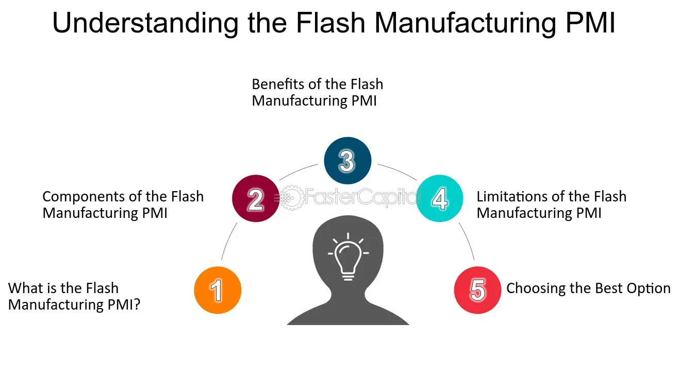

## Table of Contents

## What is the Flash Manufacturing PMI?

The Flash Manufacturing PMI, or Purchasing Managers' Index, is a preliminary estimate of the health of the manufacturing sector in a country. It is released before the final PMI data and gives an early indication of how manufacturing is doing. The index is based on a survey of purchasing managers at manufacturing companies, who report on things like new orders, production levels, employment, and delivery times. A PMI above 50 indicates that the manufacturing sector is expanding, while a PMI below 50 suggests it is contracting.

This early data is useful for businesses, investors, and policymakers because it helps them make quick decisions based on the latest trends. For example, if the Flash Manufacturing PMI shows a sudden drop, it might signal economic trouble ahead, prompting businesses to adjust their plans. The Flash PMI is released by companies like Markit Economics and IHS Markit, and it covers major economies like the United States, the Eurozone, and China. By providing a timely snapshot of manufacturing activity, the Flash PMI helps everyone stay informed about the economy's direction.

## How is the Flash Manufacturing PMI calculated?

The Flash Manufacturing PMI is calculated by surveying purchasing managers from different manufacturing companies. These managers answer questions about things like new orders, production levels, employment, and delivery times. Each response is given a score: if the manager says something has increased, it gets a score above 50; if it stayed the same, it gets a score of 50; and if it decreased, it gets a score below 50. These scores are then combined and weighted to create the overall PMI number.

The Flash PMI is a quick estimate, so it uses a smaller sample of companies than the final PMI. This smaller sample helps release the data faster, usually about one week before the final PMI. Even though it's based on fewer responses, the Flash PMI is still a good early sign of what's happening in manufacturing. It helps businesses, investors, and policymakers make decisions quickly based on the latest trends.

## What is the purpose of the Flash Manufacturing PMI?

The Flash Manufacturing PMI gives an early look at how the manufacturing part of the economy is doing. It comes out before the final PMI, so people can see what's happening sooner. This helps businesses, investors, and people who make rules for the economy to make quick decisions based on new information.

The Flash PMI is based on a survey of purchasing managers at manufacturing companies. They answer questions about things like new orders, how much they're making, how many people they're hiring, and how long it takes to get things. If the PMI number is over 50, it means manufacturing is growing. If it's under 50, it means it's shrinking. This early warning helps everyone stay on top of what's going on in the economy.

## How often is the Flash Manufacturing PMI released?

The Flash Manufacturing PMI comes out once a month. It is released about one week before the final PMI, so people can get a quick look at what's happening in manufacturing.

This early release helps businesses, investors, and people who make economic decisions to act fast based on the latest information. It's like a sneak peek that keeps everyone up to date on the economy.

## What sectors does the Flash Manufacturing PMI cover?

The Flash Manufacturing PMI looks at the manufacturing part of the economy. It covers things like making cars, building machines, and producing electronics. It helps us see how well these industries are doing by asking people who buy things for these companies.

The PMI doesn't cover other parts of the economy like services or farming. It focuses only on manufacturing because this sector is important for making things and can tell us a lot about how the economy is doing. By checking the PMI, we can get a quick idea of whether manufacturing is growing or shrinking.

## What are the main advantages of using the Flash Manufacturing PMI?

The Flash Manufacturing PMI gives us a quick look at how the manufacturing part of the economy is doing. It comes out before the final PMI, so we get the information faster. This early warning helps businesses, investors, and people who make rules for the economy to make decisions quickly based on the latest trends. For example, if the Flash PMI shows a sudden drop, it might mean there's trouble ahead, and companies can adjust their plans in time.

Another big advantage is that the Flash PMI is easy to understand. It's just one number, and if it's over 50, it means manufacturing is growing. If it's under 50, it means it's shrinking. This simple way of showing the data helps everyone from business owners to regular people see what's happening in the economy without needing to read a lot of complicated reports. By using the Flash PMI, people can stay on top of economic changes and plan better for the future.

## How does the Flash Manufacturing PMI differ from the final Manufacturing PMI?

The Flash Manufacturing PMI and the final Manufacturing PMI both look at how the manufacturing part of the economy is doing, but they come out at different times. The Flash PMI is like a quick preview that comes out about a week before the final PMI. It's based on a smaller group of companies, so it can be released faster. This early information helps businesses, investors, and people who make economic rules to see what's happening sooner and make quick decisions.

The final Manufacturing PMI, on the other hand, comes out a bit later and uses a bigger group of companies. This makes it a more complete picture of what's going on in manufacturing. While the Flash PMI gives us a fast look, the final PMI is more accurate because it has more information. Both PMIs use the same way of calculating, where a number over 50 means manufacturing is growing, and under 50 means it's shrinking. So, the main difference is the timing and the size of the sample they use.

## What are the limitations of the Flash Manufacturing PMI?

The Flash Manufacturing PMI has some limits because it uses a smaller group of companies to get its numbers. This means it might not show the full picture of what's happening in manufacturing. Sometimes, the Flash PMI can be a bit off because it's based on less information than the final PMI. This can make it hard for people to be completely sure about the economy based just on the Flash PMI.

Another thing is that the Flash PMI only looks at manufacturing and doesn't tell us about other parts of the economy like services or farming. If something big happens in those other areas, the Flash PMI won't show it. Also, because it comes out quickly, there's not a lot of time to check all the data, so there might be mistakes. People need to remember these limits when they use the Flash PMI to make decisions.

## How can the Flash Manufacturing PMI be used for economic forecasting?

The Flash Manufacturing PMI can help people guess what might happen in the economy by giving them a quick look at how manufacturing is doing. It comes out before the final PMI, so it's like getting a sneak peek. If the Flash PMI number is over 50, it means manufacturing is growing, which can be a good sign for the whole economy. If it's under 50, it might mean there are problems ahead. Businesses and investors use this early information to make plans and decisions, like whether to hire more people or invest more money.

But, the Flash PMI has some limits because it's based on a smaller group of companies. This means it might not always be totally right. It also only looks at manufacturing and doesn't tell us about other parts of the economy like services or farming. So, while the Flash PMI can give us a good early guess about the economy, people need to use it carefully and look at other information too to make the best predictions.

## What impact does the Flash Manufacturing PMI have on financial markets?

The Flash Manufacturing PMI can move financial markets because it gives investors an early look at how the manufacturing part of the economy is doing. If the Flash PMI number is higher than expected, it can make people feel good about the economy. They might think that businesses will do well, so they buy more stocks and the stock market goes up. But if the Flash PMI is lower than expected, it can make investors worried. They might sell their stocks, thinking that the economy might be in trouble, and this can make the stock market go down.

The Flash PMI also affects the bond market and currency values. When the PMI is high, it can make interest rates go up because people think the economy is strong and might need higher rates to keep things in check. This can make bond prices fall. On the other hand, a low PMI might push interest rates down, making bond prices go up. The currency of a country can also change with the Flash PMI. A high PMI can make a country's currency stronger because investors think the economy is doing well. A low PMI can make the currency weaker because people might not want to invest in a struggling economy.

## How reliable is the Flash Manufacturing PMI as an economic indicator?

The Flash Manufacturing PMI is pretty good at giving people a quick look at how the manufacturing part of the economy is doing. It comes out before the final PMI, so it's like getting a sneak peek. This early information can be really helpful for businesses and investors who need to make fast decisions. If the Flash PMI number is over 50, it means manufacturing is growing, which can be a good sign for the whole economy. But if it's under 50, it might mean there are problems ahead. So, it's a useful tool for guessing what might happen next in the economy.

But the Flash PMI has some limits because it's based on a smaller group of companies than the final PMI. This means it might not always be totally right. It also only looks at manufacturing and doesn't tell us about other parts of the economy like services or farming. So, while the Flash PMI can give us a good early guess about the economy, people need to use it carefully and look at other information too to make the best predictions. Overall, the Flash PMI is a helpful but not perfect tool for understanding what's going on in the economy.

## What are some case studies or examples where the Flash Manufacturing PMI significantly influenced economic policy?

In early 2020, the Flash Manufacturing PMI for the Eurozone dropped sharply, signaling a big slowdown in manufacturing. This early warning helped policymakers see that the economy was in trouble because of the start of the COVID-19 pandemic. They quickly made plans to help businesses and workers. For example, the European Central Bank (ECB) decided to start a big program to buy bonds, which helped keep interest rates low and made it easier for businesses to borrow money. This quick action was important in keeping the economy from getting worse.

Another example is from the United States in 2008 during the financial crisis. The Flash Manufacturing PMI showed a big drop, telling policymakers that manufacturing was shrinking fast. This helped them understand that the economy was in serious trouble. The U.S. government and the Federal Reserve then took big steps, like starting programs to help banks and cutting interest rates to almost zero. These moves were key in trying to stop the economy from falling into a deeper crisis. The Flash PMI's early warning helped them act fast and make the right decisions.

## References & Further Reading

[1]: Bergstra, J., Bardenet, R., Bengio, Y., & Kégl, B. (2011). ["Algorithms for Hyper-Parameter Optimization."](https://dl.acm.org/doi/10.5555/2986459.2986743) Advances in Neural Information Processing Systems 24.

[2]: ["Advances in Financial Machine Learning"](https://www.amazon.com/Advances-Financial-Machine-Learning-Marcos/dp/1119482089) by Marcos Lopez de Prado

[3]: ["Evidence-Based Technical Analysis: Applying the Scientific Method and Statistical Inference to Trading Signals"](https://www.amazon.com/Evidence-Based-Technical-Analysis-Scientific-Statistical/dp/0470008741) by David Aronson

[4]: ["Machine Learning for Algorithmic Trading"](https://github.com/stefan-jansen/machine-learning-for-trading) by Stefan Jansen

[5]: ["Quantitative Trading: How to Build Your Own Algorithmic Trading Business"](https://www.amazon.com/Quantitative-Trading-Build-Algorithmic-Business/dp/1119800064) by Ernest P. Chan