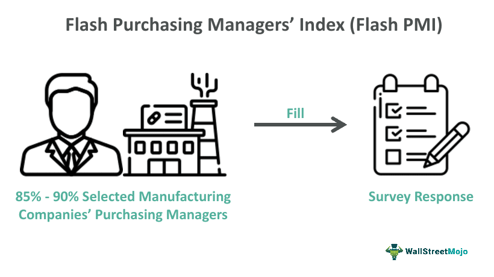

Economic indicators serve as vital tools in navigating the complex landscapes of trading and investment. They provide quantitative data that reflects the health and trajectory of an economy, enabling investors to make informed decisions. Among these indicators, the Flash Manufacturing Purchasing Managers' Index (PMI) stands out due to its timeliness and forward-looking nature. The Flash Manufacturing PMI offers insights into the manufacturing sector, providing a snapshot of economic activity by surveying purchasing managers and gauging factors such as output, new orders, and employment levels before the full PMI data is released. This early signal can influence market sentiment and set expectations for future economic conditions.

The role of economic indicators extends beyond traditional trading to the increasingly sophisticated domain of algorithmic trading. Algorithmic trading involves the use of computer programs to execute trades at high speeds and volumes, relying heavily on precise and timely data. Economic indicators like the Flash Manufacturing PMI are integral to these algorithms, as they can trigger buy or sell decisions based on predefined rules. By embedding such indicators into trading algorithms, investors can enhance their strategies, capitalizing on economic trends with greater accuracy and reduced emotional bias.



Thus, the convergence of economic indicators and algorithmic trading represents a key evolution in financial markets, where data-driven insights drive more efficient and effective investment strategies.

## Table of Contents

## Understanding Flash Manufacturing PMI

Flash Manufacturing PMI, often simply referred to as Flash PMI, is a preliminary estimate of the Manufacturing Purchasing Managers' Index (PMI). This economic indicator is pivotal in evaluating the health of the manufacturing sector, which is a cornerstone of economic activity in many countries. By providing a snapshot of prevailing business conditions, the Flash Manufacturing PMI offers valuable insights into the overall economic landscape.

The Flash Manufacturing PMI is derived from surveys sent to purchasing managers in the manufacturing industry. It is typically released a week before the final PMI, offering an early indication of manufacturing performance. The primary components of this index include:

1. **New Orders:** This measures the level of new order inflows received by manufacturers and serves as a leading indicator of production trends.
2. **Output:** This component tracks the actual production levels, reflecting the current manufacturing activity.
3. **Employment:** This measures changes in employment levels within the manufacturing sector.
4. **Supplier Delivery Times:** This captures the speed at which suppliers deliver goods. A longer delivery time can indicate high demand, while shorter times may suggest sluggish demand.
5. **Stocks of Purchases:** It reflects the level of raw materials purchases held by manufacturers, which can indicate future production levels.

The methodology for calculating the PMI involves scoring each component on a scale from 0 to 100, where 50 represents no change. A reading above 50 indicates an improvement from the previous month, while a reading below 50 suggests a contraction. The Flash PMI weights these components to produce a composite index that provides an overall view of manufacturing health.

As a forward-looking indicator, the Flash Manufacturing PMI is invaluable for predicting economic trends. Manufacturers are at the beginning of the production chain, and changes in their activity levels can signal shifts in broader economic conditions. For instance, an uptick in new orders often precedes increases in production and employment, leading to higher economic growth. Conversely, a slowdown in manufacturing can foreshadow economic contraction.

Investors, policymakers, and traders closely monitor Flash PMI releases to make informed decisions. The index's ability to forecast trends several months in advance means it can guide monetary policy, investment strategy, and market predictions. By analyzing fluctuations in the Flash PMI, stakeholders can better understand the supply-side pressures and demand dynamics that impact the economy.

## The Importance of Economic Indicators in Trading

Economic indicators are pivotal tools for traders, providing essential information that influences market predictions. These indicators are [statistics](/wiki/bayesian-statistics) that convey information about economic activities, helping traders and investors gauge the current and future direction of an economy. Recognizing patterns and trends in economic indicators enables market participants to make informed decisions, thus enhancing their ability to predict market movements and respond to them effectively.

Economic data significantly impact market movements and investor sentiment. For instance, if a nation's GDP growth rate exceeds expectations, it often signals robust economic health, potentially leading to bullish market conditions as investors gain confidence. Conversely, disappointing employment figures might trigger bearish trends as they can indicate economic slowdowns. This dynamic illustrates why economic indicators are crucial; they act as catalysts for market movements by shaping investor perceptions and reactions.

Formulating trading strategies heavily depends on these indicators. Traders analyze a wide array of data points such as employment numbers, inflation rates, and manufacturing indices to optimize their strategies. By incorporating this data, traders can anticipate economic shifts and adjust their positions accordingly, whether it's capitalizing on anticipated currency appreciation or mitigating exposure to volatile stocks. For example, if inflationary pressures are detected early through indicators like the Consumer Price Index (CPI), traders might pivot their strategies to invest in commodities or Treasury Inflation-Protected Securities (TIPS), which can offer a hedge against inflation.

The value of economic indicators lies in their ability to synthesize complex economic conditions into digestible insights for traders. This synthesis is particularly vital in forming effective trading strategies, enabling traders to not only react to but also preempt market changes. Consequently, integrating economic indicators into trading decisions is not merely beneficial but essential for comprehensive market analysis and strategy development.

## Algorithmic Trading and Economic Indicators

Algorithmic trading refers to the use of computer algorithms to automate trading decisions based on predefined criteria. This method leverages high-speed data processing and is characterized by its reliance on mathematical models and statistical analysis to execute trades efficiently. A key feature of [algorithmic trading](/wiki/algorithmic-trading) is the ability to process vast amounts of market data instantaneously, allowing traders to capitalize on ephemeral market opportunities.

Economic indicators like the Flash Manufacturing PMI (Purchasing Managers' Index) are integral to algorithmic trading systems. The Flash Manufacturing PMI is a preliminary estimate of manufacturing sector performance, providing early insights into economic trends. It is derived from monthly surveys of purchasing managers in the manufacturing sector, assessing variables such as output, new orders, inventory levels, and employment conditions. In algorithmic trading, this indicator serves as a forward-looking tool, enabling traders to anticipate potential market movements.

Integration of economic indicators into trading algorithms begins with the collection and analysis of relevant data. Algorithms use this data to identify patterns and anticipate economic conditions, which influence trading decisions. For instance, a higher-than-expected PMI might indicate economic expansion, prompting algorithms to increase exposure to equity markets. Conversely, a lower PMI could be a precursor to economic slowdown, leading to reduced risk exposure.

One advantage of using economic data in automated trading systems is the ability to react swiftly to new information. The continuous flow of economic data allows algorithms to adjust positions in real-time in response to economic releases, reducing the latency between information dissemination and trading execution. This speed is crucial in markets where prices can change rapidly based on new information.

Moreover, economic indicators enhance decision-making by providing quantitative benchmarks that can be systematically incorporated into trading strategies. Algorithms can be programmed to react to specific economic signals, such as comparing actual PMI figures with consensus forecasts or historical trends. This systematic approach reduces human bias and errors in trading decisions.

In summary, algorithmic trading capitalizes on economic indicators like the Flash Manufacturing PMI by systematically integrating them into trading algorithms. This integration enhances the ability to make informed, data-driven decisions, providing significant advantages in market efficiency and reaction speed. Accurate interpretation of these indicators is integral to the development of robust, profitable trading strategies.

## Analyzing Flash Manufacturing PMI for Trading Opportunities

Traders utilize Flash Manufacturing PMI data to identify economic trends and make informed trading decisions. The Flash Manufacturing PMI, which measures the economic health of the manufacturing sector, is a key indicator for predicting market movements. When interpreting PMI data, traders focus on the index value and its trajectory. A PMI reading above 50 indicates expansion in the manufacturing sector, while a reading below 50 suggests contraction. Traders monitor changes in these readings to deduce economic strength or weakness, which in turn affects asset prices.

Comparing PMI data across different countries offers valuable insights into global economic trends. By assessing the PMI readings of major economies, traders can gauge international growth prospects and adjust their strategies accordingly. For instance, if the PMI of a prominent economy like the United States indicates expansion, while the PMI of another major economy, such as Germany, indicates contraction, traders might predict a strengthening of the U.S. dollar compared to the euro. This comparative analysis facilitates global market insights that inform currency trading, global asset allocation, and risk management strategies.

For example, a significant increase in the Eurozone's Flash Manufacturing PMI might signal an improvement in economic conditions, leading to a bullish sentiment in European equity markets. Traders may interpret this as a buy signal for European stocks or the euro itself. Conversely, a drop in the PMI might signal economic deterioration, prompting traders to sell off assets associated with the region.

Changes in PMI data not only influence decisions within equity markets but also extend to bond markets. A rise in manufacturing PMI might lead investors to anticipate higher future interest rates due to a stronger economy, thereby impacting bond yields. Traders might adjust their bond portfolios accordingly, selling bonds in anticipation of rising yields.

Overall, analyzing Flash Manufacturing PMI enables traders to anticipate economic conditions and adapt trading strategies. By comparing PMI data across countries and responding to changes, traders aim to capitalize on predicted market shifts.

## Challenges and Considerations

Relying solely on Flash Manufacturing PMI data for trading presents several challenges and considerations. While PMI provides valuable snapshots of economic manufacturing health, it should not be the sole determinant in trading decisions due to inherent limitations.

Firstly, PMI data is inherently a survey-based indicator, reflecting the subjective views of purchasing managers regarding business conditions. This can result in potential biases or inaccuracies. For instance, a company's internal factors could influence a manager's sentiment, leading to skewed data that may not perfectly represent broader economic trends.

Second, PMI data provides a leading indicator of economic activity, but it lacks comprehensive depth. It doesn't account for other critical aspects of the economy such as consumer spending, fiscal policy changes, or geopolitical events, all of which significantly impact market dynamics. For a well-rounded analysis, PMI should be considered in conjunction with other economic indicators like GDP growth rates, employment figures, and inflation data. This comprehensive approach can help mitigate risks associated with PMI's inherent limitations.

Furthermore, market [volatility](/wiki/volatility-trading-strategies) and unexpected reactions to PMI releases should be anticipated. Financial markets are complex ecosystems where various participants may interpret and react to data differently. A PMI reading can trigger a broad range of reactions, from aggressive trading spikes to subdued responses, depending on concurrent economic contexts and existing market sentiments.

Therefore, traders need to be cautious, considering PMI data as part of a broader analytical framework. Incorporating multiple data sources such as earnings reports, industrial production statistics, and external geopolitical risk assessments can provide a more robust foundation for making informed trading decisions. Advanced data analytics and [machine learning](/wiki/machine-learning) tools can be instrumental in synthesizing diverse datasets, uncovering patterns that single indicators may overlook.

In conclusion, while Flash Manufacturing PMI is a crucial economic indicator, its role in trading should be viewed as part of a larger mosaic. Relying exclusively on PMI can lead to incomplete analysis, potential misinterpretations, and unforeseen risks. As such, a holistic approach integrating varied data sources is essential for effective trading strategies that adapt to ever-evolving market conditions.

## The Future of Economic Indicators in Trading Algorithms

Advancements in technology and data analysis have significantly impacted the way economic indicators are utilized in trading algorithms. With the proliferation of big data and enhanced computational capabilities, the ability to process and analyze vast quantities of economic data has become more efficient and sophisticated. This transformation has enabled traders to harness economic indicators like the Flash Manufacturing Purchasing Managers' Index (PMI) with greater precision and agility.

The integration of Artificial Intelligence (AI) and machine learning in trading systems has opened new avenues for enhancing the use of PMI data. Machine learning algorithms can sift through historical PMI data and other relevant economic indicators to detect patterns, correlations, and anomalies that may not be immediately evident through traditional analysis methods. These insights can improve the predictive accuracy of trading strategies, enabling more informed decision-making.

For instance, machine learning models such as neural networks or decision trees can be trained on historical PMI data alongside other economic variables to forecast future trends. The models can learn from complex datasets and continuously improve their predictions as new data is introduced. This capability allows traders to anticipate market shifts and adjust their strategies accordingly. For example, a supervised learning model could be implemented in Python to predict future PMI values or their impact on asset prices:

```python
from sklearn.model_selection import train_test_split
from sklearn.ensemble import RandomForestRegressor
from sklearn.metrics import mean_squared_error

# Load historical data of PMI and other economic indicators
data = load_economic_data('historical_pmi_data.csv')

# Features include PMI and other economic indicators
X = data[['PMI', 'GDP_growth', 'industrial_production']]
y = data['future_asset_prices']

# Split data into training and testing sets
X_train, X_test, y_train, y_test = train_test_split(X, y, test_size=0.2, random_state=42)

# Train a Random Forest Regressor
model = RandomForestRegressor(n_estimators=100, random_state=42)
model.fit(X_train, y_train)

# Predict future asset prices and evaluate the model
predictions = model.predict(X_test)
error = mean_squared_error(y_test, predictions)
print(f'Mean Squared Error: {error}')
```

As technology continues to advance, the future likely holds increased integration of economic indicators with AI-driven trading algorithms. The development of more sophisticated data analysis tools will likely facilitate even deeper insights into the complex relationships between various economic factors, potentially leading to more robust and adaptive trading models. 

Furthermore, continued improvements in real-time data processing and cloud computing will enable instantaneous analysis and execution of trades based on the latest PMI releases and other economic reports. This immediacy could become a crucial [factor](/wiki/factor-investing) in maintaining competitive edges in an increasingly automated financial market.

The synergy between advancing technologies and economic indicators presents opportunities for creating more dynamic and nimble trading strategies. In the future, we may see collaborative networks of machine learning models that cross-reference and validate each other's predictions, ushering in a new era of precision and reliability in economic forecasting and trading strategies.

## Conclusion

The Flash Manufacturing Purchasing Managers' Index (PMI) plays a vital role in shaping trading strategies by providing early insights into economic conditions and manufacturing sector health. As a leading indicator, it offers valuable information that enables traders and investors to anticipate market movements and adjust their strategies accordingly. However, the utility of PMI data in trading is contingent upon accurate analysis and cautious interpretation. Given the complex nature of global markets and the multitude of factors influencing economic activity, relying solely on PMI data without a comprehensive approach may lead to inaccurate conclusions and misguided trading decisions.

To effectively leverage Flash Manufacturing PMI data, it is essential to integrate it with other relevant economic indicators and analytical tools. This approach allows traders to account for broader economic trends and nuances, thereby enhancing the robustness of their market forecasts. Furthermore, learning from past trading decisions and continuously monitoring evolving market conditions are crucial elements in adapting strategies to remain effective over time. 

The dynamic nature of global markets necessitates ongoing learning and adaptation. As economic indicators and trading algorithms evolve, so must the strategies and methodologies used by traders. By staying informed about technological advancements and incorporating sophisticated data analysis techniques, market participants can better navigate the complexities of trading environments. Embracing this proactive approach not only helps to mitigate inherent risks but also capitalizes on emerging opportunities, ensuring sustained success in trading activities.

## References & Further Reading

[1]: Bergstra, J., Bardenet, R., Bengio, Y., & Kégl, B. (2011). ["Algorithms for Hyper-Parameter Optimization."](https://dl.acm.org/doi/10.5555/2986459.2986743) Advances in Neural Information Processing Systems 24.

[2]: ["Advances in Financial Machine Learning"](https://www.amazon.com/Advances-Financial-Machine-Learning-Marcos/dp/1119482089) by Marcos Lopez de Prado

[3]: ["Evidence-Based Technical Analysis: Applying the Scientific Method and Statistical Inference to Trading Signals"](https://www.amazon.com/Evidence-Based-Technical-Analysis-Scientific-Statistical/dp/0470008741) by David Aronson

[4]: ["Machine Learning for Algorithmic Trading"](https://github.com/stefan-jansen/machine-learning-for-trading) by Stefan Jansen

[5]: ["Quantitative Trading: How to Build Your Own Algorithmic Trading Business"](https://www.amazon.com/Quantitative-Trading-Build-Algorithmic-Business/dp/1119800064) by Ernest P. Chan