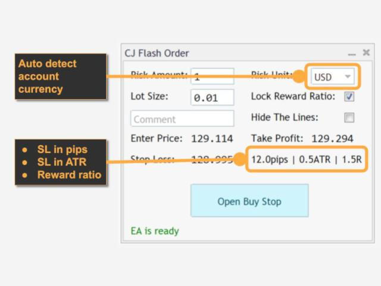

## Table of Contents

## What is flash order detection?

Flash order detection is a way to spot special orders in the stock market. These special orders, called flash orders, let some traders see them before others. This can give them an advantage because they can buy or sell stocks faster than everyone else.

This practice has been controversial because it can be unfair. Some people think it should be stopped because it goes against the idea of a fair market where everyone has the same information. Regulators have looked into flash orders and made rules to limit them to make trading more equal for everyone.

## Why is flash order detection important in trading?

Flash order detection is important in trading because it helps keep the market fair. When some traders can see flash orders before others, they can make quick trades and possibly make more money. This can be unfair to other traders who don't see these orders. By detecting flash orders, we can make sure everyone has the same chance to trade.

Regulators and trading platforms use flash order detection to stop this unfair advantage. They want to make sure the market works the same for everyone. If flash orders are detected, rules can be made to stop them, which helps keep the market honest and fair for all traders.

## How does flash order detection work?

Flash order detection works by looking at the trading data to find orders that some traders can see before others. It uses special computer programs that watch the market all the time. These programs check if any orders are shown to just a few traders for a short time before everyone else sees them. If the programs find these flash orders, they can tell the people in charge of the market.

When flash orders are found, the people who run the market can take action to stop them. They might change the rules or use technology to make sure all traders see the same orders at the same time. This helps keep the market fair for everyone. By using flash order detection, the market can be more honest and equal, which is good for all traders.

## What are the common tools used for flash order detection?

Flash order detection uses special computer programs that watch the market all the time. These programs are made to find orders that some traders can see before others. They check the trading data very quickly and look for signs of flash orders. If they find these special orders, they can tell the people who run the market.

Some common tools for flash order detection include software that tracks order flow and analyzes it in real time. These tools use algorithms to spot any unusual patterns that might show flash orders. They can also send alerts to regulators or trading platforms when they find something that looks like a flash order. By using these tools, the market can be kept fair for all traders.

## Can flash order detection be used in all types of markets?

Flash order detection can be used in many types of markets, but it works best in markets where trading happens very fast, like stock markets and some other financial markets. These markets use computers a lot, so it's easier to watch the orders and find flash orders. In slower markets, like some commodity markets, flash order detection might not be as useful because the trading is not as quick.

In markets where flash order detection can be used, it helps keep things fair. By watching the orders and finding any that some traders see first, the market can make sure everyone has the same chance to trade. This is important because it stops some people from getting an unfair advantage and helps keep the market honest for everyone.

## What are the legal and ethical considerations of using flash order detection?

Using flash order detection can help make trading more fair, but it also brings up some legal and ethical questions. On the legal side, many countries have rules about what kind of trading is allowed. If flash orders are against the law, then using flash order detection to find and stop them is a good thing. But if the rules are not clear, people might not know if they can use flash order detection or not. This can make it hard for companies and regulators to decide what to do.

On the ethical side, flash order detection is about making sure everyone has the same chance to trade. It's not fair if some traders can see orders before others and make more money because of it. Using flash order detection can help stop this unfair advantage and make the market more equal. But some people might think it's wrong to watch what traders are doing so closely. They might feel like it's too much control and that it goes against the idea of a free market. So, while flash order detection can help make trading fairer, it's important to think about these ethical questions too.

## How can one set up a basic flash order detection system?

To set up a basic flash order detection system, you need to start by getting real-time trading data from the market you want to watch. This can be done by connecting to a stock exchange's data feed or using a service that gives you live trading information. Once you have this data, you need to write a computer program that can look at it very quickly. This program should be able to find orders that appear for a short time to some traders before everyone else sees them. You can use a programming language like Python to do this, and there are libraries available that can help you analyze the data in real time.

After you have your program set up, you need to make sure it can send alerts when it finds something that looks like a flash order. This can be done by setting up rules in your program that tell it what to look for. For example, if an order appears for a very short time before it's shown to everyone, your program can send a message or an email to let you know. It's important to keep testing and updating your program to make sure it's working well and catching any flash orders that might happen. By doing this, you can help make sure the market stays fair for everyone.

## What are the key indicators to look for in flash order detection?

When looking for flash orders, you need to watch for orders that appear for a very short time before they are shown to everyone else. This means you should look for any orders that are visible to just a few traders for a brief moment before the whole market sees them. If you see an order that pops up and then disappears quickly, it might be a flash order.

Another key indicator is the timing of the orders. If you notice that some traders are making trades right after these quick orders appear, it could mean they are using the information from the flash orders to trade faster than others. By watching these patterns and timing, you can spot possible flash orders and help keep the market fair for everyone.

## How does flash order detection impact market fairness?

Flash order detection helps make the market fair by finding orders that some traders see before others. When some traders can see these flash orders first, they can buy or sell stocks faster than everyone else. This is not fair because it gives them an advantage over other traders. By using flash order detection, the market can stop this from happening and make sure everyone has the same chance to trade.

When flash orders are found, the people in charge of the market can make rules to stop them. This helps keep the market honest and equal for all traders. Without flash order detection, some traders could keep making more money than others just because they see orders first. By watching for flash orders, the market can be more fair, which is good for everyone who trades.

## What advanced techniques can enhance flash order detection accuracy?

To make flash order detection better, you can use [machine learning](/wiki/machine-learning). This is a way for computers to learn from data and get better at finding flash orders over time. By looking at lots of past trading data, a machine learning program can learn what flash orders look like. It can then watch the market and spot flash orders more accurately than a simple program. This helps make sure the market stays fair because the computer can find flash orders faster and more often.

Another way to improve flash order detection is by using more detailed data. Instead of just looking at the orders, you can also watch how traders act after seeing flash orders. If you see that some traders are making trades right after these quick orders appear, it can help confirm that a flash order happened. By looking at more information, like the timing and patterns of trades, the detection system can be more sure about what it finds. This makes the market more fair because it's harder for flash orders to go unnoticed.

## How do regulatory bodies view the use of flash order detection?

Regulatory bodies usually support the use of flash order detection because it helps make the market fair for everyone. They want to stop traders from seeing orders before others and using that information to make more money. By using flash order detection, regulators can find and stop these unfair practices, which helps keep the market honest and equal for all traders.

However, some regulators might be worried about how flash order detection works. They might think it's too hard to watch everything traders do, and it could go against the idea of a free market. But most regulators agree that keeping the market fair is very important, so they support using tools like flash order detection to make sure everyone has the same chance to trade.

## What future developments can we expect in flash order detection technology?

In the future, flash order detection technology will get better with new tools and methods. One big change will be using more machine learning. This means computers will learn from past data to find flash orders even faster and more accurately. They will be able to spot patterns and signs of flash orders that are hard for people to see. This will make it harder for traders to use flash orders to get an advantage, and it will help keep the market fair for everyone.

Another thing that might happen is that flash order detection will work with other technologies, like blockchain. Blockchain can make trading more open and easy to check, which can help find flash orders. By working together, these technologies can make the market even more fair and safe. As these tools get better, they will help make sure that everyone has the same chance to trade, which is good for the whole market.

## References & Further Reading

[1]: Aldridge, I. (2013). ["High-Frequency Trading: A Practical Guide to Algorithmic Strategies and Trading Systems"](https://www.wiley.com/en-us/High+Frequency+Trading%3A+A+Practical+Guide+to+Algorithmic+Strategies+and+Trading+Systems%2C+2nd+Edition-p-9781118343500). Wiley.

[2]: Das, S. R. (2011). ["High Frequency Trading: Near Zero Latency Trading"](https://link.springer.com/article/10.1007/s11408-019-00331-6), SSRN Electronic Journal.

[3]: Lopez de Prado, M. (2018). ["Advances in Financial Machine Learning"](https://www.amazon.com/Advances-Financial-Machine-Learning-Marcos/dp/1119482089). Wiley.

[4]: Jansen, S. (2020). ["Machine Learning for Algorithmic Trading: Predictive Models to Extract Signals from Market and Alternative Data for Systematic Trading Strategies"](https://github.com/stefan-jansen/machine-learning-for-trading). Packt Publishing.

[5]: Lewis, M. (2014). ["Flash Boys: A Wall Street Revolt"](https://en.wikipedia.org/wiki/Flash_Boys). W. W. Norton & Company.

[6]: Kissell, R. (2014). ["The Science of Algorithmic Trading and Portfolio Management"](https://www.sciencedirect.com/book/9780124016897/the-science-of-algorithmic-trading-and-portfolio-management). Academic Press.

[7]: Hendershott, T., & Riordan, R. (2013). ["Algorithmic Trading and the Market for Liquidity"](https://www.cambridge.org/core/journals/journal-of-financial-and-quantitative-analysis/article/abs/algorithmic-trading-and-the-market-for-liquidity/C1A34D3767436529EA4F23DB1780273C). Journal of Finance.