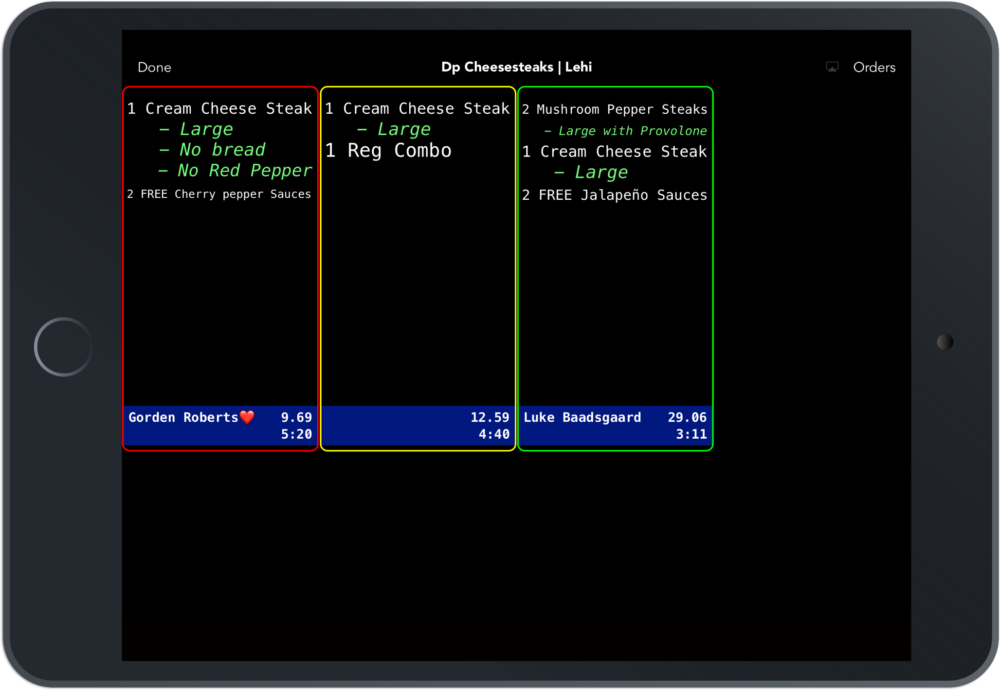

In the fast-evolving landscape of algorithmic trading, flash order detection represents a critical component that can significantly influence trading outcomes. Flash orders, characterized by their brief exposure and rapid execution, provide a fleeting opportunity for traders to gain insights into market intents, influencing the direction, size, and timing of trades. As algorithmic trading systems become increasingly sophisticated, understanding the intricacies of flash order detection becomes essential for traders and institutions aiming to protect their investments and refine their trading strategies.

Flash order detection plays a pivotal role in modern trading environments. It offers a glimpse into the market dynamics that underpin trading activities, allowing market participants to make informed decisions. By analyzing the patterns that flash orders reveal, traders can anticipate market movements and adjust their strategies accordingly. With the ability to detect and respond to flash orders, traders gain a competitive edge, potentially capitalizing on emerging trends before they become apparent to the wider market.



This article explores the role of flash order detection within modern trading environments and assesses its impact on market dynamics. We will detail the mechanisms behind flash orders, discussing how they can be identified in real-time amid large volumes of trading data. Furthermore, the article will explore strategies to mitigate the risks associated with flash orders, such as implementing proprietary detection algorithms or machine learning models to predict and react to these orders efficiently.

By the end of this article, readers will gain a comprehensive understanding of flash order detection and its crucial importance in the algorithmic trading ecosystem. This understanding is vital not only for traders seeking to enhance their performance but also for regulators and market designers who strive to maintain fair and transparent markets. Embracing advanced detection technologies and robust risk management strategies, traders can leverage flash order detection to optimize their trading outcomes in the fast-paced world of algorithmic trading.

## Table of Contents

## Understanding Flash Orders in Algorithmic Trading

Flash orders are a unique trading instrument within algorithmic trading, characterized by their transient nature that allows market intentions to be momentarily visible. This brief revelation can include insights into order sizes, market directions, and pricing levels, thus offering strategic information to market participants who can promptly recognize and act on them. Typically, flash orders are integrated with high-frequency trading (HFT) strategies, which leverage advanced algorithms to automatically engage in rapid trading activities.

The operation of flash orders primarily hinges on speed and timing, recognizing the minutiae of market fluctuations within milliseconds. The algorithms programmed for high-frequency trading are adept at launching fast executions, ensuring that these orders are placed and canceled almost instantaneously. Consequently, they can create opportunities for profit by exploiting minimal price discrepancies or by having preferred access to [liquidity](/wiki/liquidity-risk-premium).

One fundamental issue surrounding flash orders involves their debated impact on market fairness and transparency. Due to their ephemeral nature, flash orders can potentially offer a disproportionate advantage to traders equipped with the necessary technology to detect and interpret these orders almost immediately. Such advantages may lead to a disparity, where only certain market participants can consistently generate profit based on superior technological infrastructure and access to real-time data.

Furthermore, flash orders are distinguished from regular trading activities by their speed and execution mechanisms. In typical trading scenarios, orders are visible in the [order book](/wiki/order-book-trading-strategies) until executed or canceled, providing a more transparent trading environment. Flash orders, on the other hand, do not appear in public order [books](/wiki/algo-trading-books) for extended periods, if at all, challenging existing concepts of market visibility and fairness.

The implications of flash orders for market transparency are significant. They can contribute to a perceived lack of fairness among traders without access to the necessary detection technologies. As a result, the use of flash orders continues to be a subject of ongoing scrutiny and regulatory debate. Balancing the innovative opportunities presented by such trading strategies and maintaining an equitable market environment remains a critical concern for regulators and trading institutions alike.

## Mechanisms of Flash Order Detection

Detecting flash orders involves utilizing advanced technologies and real-time data analysis. These sophisticated methods enable traders to identify fleeting and significant market signals embedded in high-frequency trading activities. The primary goal is to discern patterns in the order book that indicate the presence of flash orders, thereby allowing for rapid and informed decision-making.

## Technologies and Tools

To effectively detect flash orders, traders employ specialized software tools designed to continuously monitor order book activities. These tools leverage [machine learning](/wiki/machine-learning) algorithms and statistical models to identify anomalies or patterns that are indicative of flash orders. The software can adapt to different trading environments by learning from past market data, thus enhancing its predictive capabilities.

Python, a popular language in financial markets for its rich libraries and tools, can be used to build such detection systems. Libraries like `pandas` for data handling, `numpy` for numerical operations, and `scikit-learn` for machine learning offer a robust foundation for developing real-time analysis tools. For instance, a trader may implement a k-nearest neighbors (KNN) algorithm to classify and detect unusual spikes in order flows that suggest a flash order.

```python
from sklearn.neighbors import KNeighborsClassifier
import numpy as np

# Assuming X_train, y_train contain training features and labels respectively
knn = KNeighborsClassifier(n_neighbors=3)
knn.fit(X_train, y_train)

# Function to predict if an order is a flash order
def detect_flash_order(order_features):
    return knn.predict([order_features])
```

## Algorithmic Systems

Algorithmic trading systems are programmed to react instantly to detected flash orders. These systems can either exploit detected patterns for short-term gains or initiate risk management protocols to mitigate potential negative impacts. High-frequency trading firms typically rely on low-latency infrastructure to ensure that their orders are executed swiftly in response to flash order detection. This rapid execution is crucial as delay could result in diminished trading outcomes or exploited opportunities by competitors.

## Challenges in Detection

Despite the technological advances, there are substantial challenges in developing robust flash order detection systems. One major challenge is the high [volume](/wiki/volume-trading-strategy) and velocity of data, necessitating significant computational power and efficient algorithms to process data in real time. Additionally, flash orders are deliberately designed to be ephemeral and obscure; hence, detecting them requires cutting-edge anomaly detection techniques and continuous adaptation of models to evolving market conditions.

Moreover, the risk of false positives, where a benign order is misclassified as a flash order, presents a challenge. Such inaccuracies can lead to unnecessary trade executions or risk management actions, potentially impacting profitability. To address this, ongoing refinement of detection algorithms and incorporation of additional contextual data are essential.

In conclusion, flash order detection is fundamentally reliant on advanced data processing and responsive algorithmic systems. The effectiveness of these systems is contingent upon their ability to swiftly and accurately interpret complex market signals. As markets evolve, continuous innovation and refinement in detection technologies remain critical for maintaining competitive advantage in [algorithmic trading](/wiki/algorithmic-trading).

## Impact of Flash Order Detection on Market Stability

Flash order detection plays a significant role in shaping market stability by providing high-frequency traders with a competitive edge through rapid information processing. However, this advantage can lead to increased market [volatility](/wiki/volatility-trading-strategies) and the risk of flash crashes. When flash orders are detected, they allow traders to quickly execute trades based on the transient information revealed, potentially causing a cascade of trades that amplify price movements. This acceleration in market activity can create an environment where prices move rapidly and unpredictably, destabilizing the market.

Flash crashes—sudden price declines followed by rapid recoveries—are often associated with the influence of high-frequency trading activities, including the handling of flash orders. A notable example is the Flash Crash of May 6, 2010, when the U.S. stock market plummeted by about 9% within minutes, only to recover much of the loss shortly thereafter. While the exact causes of flash crashes are complex, the detection and subsequent trading on flash orders contribute to the rapid execution of trades, which can exacerbate such events.

The implications of flash order detection on market stability extend beyond the immediate volatility it causes. It poses challenges for both traders and regulators in maintaining balanced and equitable trading environments. Traders must navigate the heightened volatility, which can erode market confidence and deter participation from investors unable to compete with high-frequency trading speeds. Regulators are challenged to design effective measures that prevent manipulative practices while still allowing for efficient market functioning.

Understanding the impact of flash order detection is crucial for developing strategies to mitigate associated risks. By identifying the relationship between order detection and market movements, traders can better anticipate potential instabilities and adjust their strategies accordingly. Regulators, on the other hand, need to focus on transparency and fairness, enforcing rules that ensure all market participants operate on a level playing field.

In conclusion, while flash order detection offers potential benefits through rapid information processing, its impact on market stability requires careful consideration. Balancing the pursuit of profit with the necessity of maintaining a stable trading environment is essential for the health of financial markets.

## Strategies for Mitigating Risks Associated with Flash Orders

Risk management strategies are essential in mitigating the potential adverse effects of flash orders on trading systems. Flash orders, characterized by their fleeting presence and the opportunity they provide for market manipulation, necessitate robust countermeasures to ensure market stability and fairness. Implementing circuit breakers, diversifying algorithmic strategies, and employing machine learning models for adaptive responses are pivotal in managing these risks.

Circuit breakers serve as a safeguard to temporarily halt trading when extreme market movements are detected, thereby preventing panic selling and providing a buffer for market participants to reassess conditions. These mechanisms are instrumental in controlling the domino effect often observed in volatile market environments exacerbated by flash orders.

Diversification of algorithmic strategies is another effective approach to mitigate risks. By diversifying strategies, traders can reduce dependency on any single trading model, thereby spreading risk across various trading approaches. This not only curtails the impact of flash orders but also enhances the overall resilience of a trading system. For instance, a combination of trend-following algorithms and mean-reversion strategies can offer a balanced response to market dynamics, ensuring that the trading approach is not overly exposed to the volatility induced by flash orders.

Machine learning models provide an adaptive element to risk management by enabling systems to learn from historical data and adjust trading strategies accordingly. These models can analyze vast amounts of data to detect anomalies and predict market trends, allowing for a proactive rather than reactive risk management stance. For example, using a supervised learning algorithm, a system can be trained to recognize patterns associated with flash orders and adjust the trading parameters in real-time to avoid potential losses.

```python
import numpy as np
from sklearn.ensemble import RandomForestClassifier

# Sample dataset: Features - market indicators, Label - presence of flash order (1 or 0)
data_features = np.array([[0.1, 1.0, -0.2], [0.5, 0.4, 0.3], [-0.1, 0.2, -0.4]])
data_labels = np.array([1, 0, 1])

# Train a Random Forest model to detect flash orders
model = RandomForestClassifier(n_estimators=100, random_state=42)
model.fit(data_features, data_labels)

# Predict potential flash orders on new data
new_data = np.array([[0.2, 0.8, 0.0]])
prediction = model.predict(new_data)
print(f"Flash order detection: {'Yes' if prediction[0] == 1 else 'No'}")
```

Traders are encouraged to integrate comprehensive risk assessment protocols that account for the specific characteristics of their trading environments. Continuous adaptation to market developments is crucial, as it ensures that risk management strategies remain effective even as trading tactics and market conditions evolve.

Ultimately, by employing these strategic approaches, traders can enhance the resilience of their systems against the volatility induced by flash orders. This proactive risk management not only mitigates potential adverse effects but also positions traders to capitalize on the opportunities presented by modern algorithmic trading environments.

## Conclusion

Flash order detection plays a significant role in the algorithmic trading landscape, offering both potential advantages and risks. Understanding the mechanisms behind flash orders and their impact on market dynamics is crucial for effectively navigating modern trading environments. These orders can briefly expose market intentions, offering traders a strategic edge, but they also present challenges regarding market fairness and stability.

Traders who adopt advanced detection technologies can enhance their trading performance by identifying and responding to these transient market events swiftly. Utilizing sophisticated algorithms, machine learning, and high-speed data analysis tools can provide traders with the capability to exploit opportunities or mitigate risks that arise from flash orders. The integration of such technologies into trading systems can lead to improved decision-making processes and better risk management.

Ongoing developments in regulatory frameworks and technological innovations will continue to shape the future of flash order detection in trading. Regulators are increasingly focused on ensuring that such practices do not compromise market integrity or fairness, leading to changes that traders must continuously monitor and adapt to. Technological advancements, particularly in data processing and analysis, will also play a pivotal role in refining detection systems and strategies.

Ultimately, staying informed and adaptive is key to achieving long-term success in the fast-paced world of algorithmic trading. Traders must remain vigilant about the latest developments in both technology and regulation to maintain a competitive edge. By continuously updating their knowledge and tools, they can effectively respond to the challenges and opportunities presented by flash order detection in today's complex financial markets.

## References & Further Reading

[1]: Aldridge, I. (2013). ["High-Frequency Trading: A Practical Guide to Algorithmic Strategies and Trading Systems"](https://www.wiley.com/en-us/High+Frequency+Trading%3A+A+Practical+Guide+to+Algorithmic+Strategies+and+Trading+Systems%2C+2nd+Edition-p-9781118343500). Wiley.

[2]: Das, S. R. (2011). ["High Frequency Trading: Near Zero Latency Trading"](https://link.springer.com/article/10.1007/s11408-019-00331-6), SSRN Electronic Journal.

[3]: Lopez de Prado, M. (2018). ["Advances in Financial Machine Learning"](https://www.amazon.com/Advances-Financial-Machine-Learning-Marcos/dp/1119482089). Wiley.

[4]: Jansen, S. (2020). ["Machine Learning for Algorithmic Trading: Predictive Models to Extract Signals from Market and Alternative Data for Systematic Trading Strategies"](https://github.com/stefan-jansen/machine-learning-for-trading). Packt Publishing.

[5]: Lewis, M. (2014). ["Flash Boys: A Wall Street Revolt"](https://en.wikipedia.org/wiki/Flash_Boys). W. W. Norton & Company.

[6]: Kissell, R. (2014). ["The Science of Algorithmic Trading and Portfolio Management"](https://www.sciencedirect.com/book/9780124016897/the-science-of-algorithmic-trading-and-portfolio-management). Academic Press.

[7]: Hendershott, T., & Riordan, R. (2013). ["Algorithmic Trading and the Market for Liquidity"](https://www.cambridge.org/core/journals/journal-of-financial-and-quantitative-analysis/article/abs/algorithmic-trading-and-the-market-for-liquidity/C1A34D3767436529EA4F23DB1780273C). Journal of Finance.