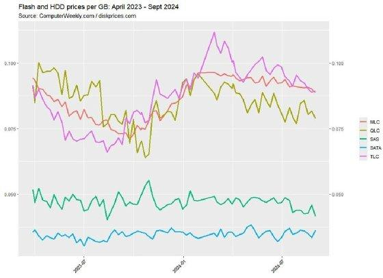

In today's fast-paced digital economy, pricing strategies have evolved to become more dynamic and sophisticated, increasingly supported by technologies such as machine learning and algorithmic trading. These strategies are critical for businesses seeking to optimize revenue and stay competitive. Flash pricing, real-time pricing, dynamic pricing, and algorithmic trading are interconnected methodologies that play significant roles in transforming the way markets operate.

Flash pricing aims to minimize the time delay between price quotes and actual prices, allowing businesses to capitalize on the immediacy of market changes. Real-time pricing involves instantaneous price adjustments based on current market conditions and demand fluctuations, thus providing businesses with the agility to respond quickly to market dynamics. Dynamic pricing, on the other hand, adjusts prices in response to an array of factors including demand, competition, and market trends. This adaptability helps businesses remain relevant to consumer needs while maximizing profitability.



The evolution from static to dynamic pricing systems has been driven by advancements in technology and data analytics. Pioneered in industries like airlines, hospitality, and e-commerce, dynamic pricing allows for revenue optimization by leveraging data-driven insights into market behavior. Machine learning algorithms further enhance these strategies by analyzing vast datasets to identify patterns and trends influencing pricing decisions. Similarly, algorithmic trading employs complex mathematical models to improve the efficiency of trade execution based on real-time market data.

These technologies present opportunities and challenges. While businesses can exploit cutting-edge tools for pricing optimization, they must also navigate ethical considerations, such as customer transparency and data privacy. As pricing strategies continue to advance, the integration of AI and big data will enable even more precise, personalized pricing, ensuring businesses can maintain their competitive edge while adhering to regulatory standards. Therefore, the landscape of pricing methodologies is not only about enhancing profitability but also ensuring long-term, sustainable growth.

## Table of Contents

## Understanding the Basics: Flash, Real-Time, and Dynamic Pricing

Flash pricing, real-time pricing, and dynamic pricing represent essential strategies in today's digital marketplace, each serving a unique role in pricing adaptability and efficiency.

**Flash Pricing** refers to the concept of providing price information almost instantaneously, significantly reducing or eliminating the time lag between when a price is quoted and the price is executed. This approach is particularly crucial in industries where market conditions fluctuate rapidly, and even small delays can lead to significant pricing discrepancies. Flash pricing ensures that consumers and businesses receive the most current pricing data, which is critical for maintaining competitiveness and operational efficiency.

**Real-Time Pricing** takes the principle of immediate price adjustments a step further by altering prices instantaneously based on the prevailing market conditions and demand fluctuations. This method utilizes live market data to adjust prices continuously, ensuring that they reflect the current supply-demand balance. Real-time pricing is of paramount importance in volatile markets where rapid changes in demand can occur, such as in energy markets and stock exchanges. The dynamic adaptation of prices allows businesses to respond promptly to changes, maximizing revenue opportunities while minimizing risks.

**Dynamic Pricing** involves strategically adjusting prices in response to not only demand and competition but also a myriad of other influencing market factors. This method is more comprehensive in scope than real-time pricing, as it considers a broader set of dynamic variables, including consumer behavior, market trends, and inventory levels. Dynamic pricing algorithms often use historical data and predictive analytics to optimize pricing strategies, with the objective of achieving the best possible balance between sales volume and profit margins.

The implementation of these pricing strategies requires sophisticated technological infrastructure and analytical tools, such as [machine learning](/wiki/machine-learning) models, to process large datasets and execute pricing decisions efficiently. In Python, for instance, businesses might use libraries such as `pandas` for data manipulation, `scikit-learn` for machine learning models, and `numpy` for numerical operations to support these pricing mechanisms. Here’s a simple representation of how a dynamic pricing adjustment might be coded:

```python
import numpy as np
from sklearn.linear_model import LinearRegression

# Historical data for demand and price
demand = np.array([200, 220, 250, 270, 300])
price = np.array([10, 11, 12, 13, 15])

# Reshape for sklearn
demand = demand.reshape(-1, 1)

# Train a linear regression model
model = LinearRegression().fit(demand, price)

# Predict price for a new demand point
new_demand = np.array([[280]])
predicted_price = model.predict(new_demand)

print("The predicted price for the new demand is:", predicted_price[0])
```

This simple linear regression model predicts prices based on the historical relationship between demand and pricing. In practice, however, businesses employ more complex models that incorporate various factors to better handle the multifaceted nature of market pricing. 

By using these pricing strategies, businesses can ensure they remain agile and responsive to market dynamics, maintaining their competitiveness in rapidly changing environments.

## Evolution of Pricing Strategies

Pricing strategies have evolved significantly from static models to dynamic systems, primarily driven by technological advancements and the integration of data analytics. Historically, pricing was a largely static process, characterized by fixed prices that were seldom adjusted once set. This approach, although simple and easy to manage, did not account for variations in demand or market conditions.

Dynamic pricing emerged as a transformative strategy, revolutionizing industries by allowing prices to fluctuate in response to real-time conditions. This adaptability is particularly evident in sectors such as airlines, hospitality, and e-commerce. Airlines, for instance, modify ticket prices based on a variety of factors including seat availability, seasonality, and the proximity of the flight date, a practice known as yield management. Similarly, hotels adjust room rates dynamically to match booking trends and anticipated demand during peak seasons or events. E-commerce platforms use algorithms to adjust product prices considering competitive pricing, customer behavior, and inventory levels. 

The evolution towards dynamic pricing is intricately linked to advancements in technology, particularly in the fields of machine learning and big data. Machine learning algorithms enable businesses to analyze vast datasets rapidly, identifying patterns and predicting consumer behavior. This capability allows for precise price adjustments that maximize revenue. For example, a machine learning model might analyze historical sales data and customer patterns to determine optimal pricing strategies for different products or services.

In addition to machine learning, big data analytics plays a crucial role in refining pricing strategies. The ability to process and interpret large volumes of data from diverse sources provides businesses with actionable insights into consumer trends, competitive landscapes, and market conditions. This data-driven approach ensures that pricing strategies are not only responsive but also predictive, allowing firms to preemptively adjust prices to capitalize on market trends.

In summary, the shift from static to dynamic pricing strategies marks a significant evolution in how businesses approach pricing. The integration of machine learning and big data analytics has made these strategies more responsive and effective, enabling businesses across various industries to optimize revenue while meeting the demands of fluctuating market conditions.

## The Role of Machine Learning and Algo Trading in Pricing

Machine learning and [algorithmic trading](/wiki/algorithmic-trading) have become indispensable tools in devising efficient pricing strategies. Machine learning algorithms, with their capacity to analyze large volumes of data, are pivotal in identifying patterns and trends that inform pricing decisions. These algorithms can process structured and unstructured data, extracting insights about consumer behaviors, market trends, and competitive dynamics. By leveraging techniques such as supervised learning, unsupervised learning, and [reinforcement learning](/wiki/reinforcement-learning), machine learning facilitates the continuous refinement of pricing models to react promptly to market shifts.

### Machine Learning Algorithms in Pricing

One essential application of machine learning in pricing is the development of predictive models that forecast future demand and price elasticity. These models use historical sales data, customer preferences, and external factors like economic indicators and seasonal trends. For instance, a regression model might be used to predict sales [volume](/wiki/volume-trading-strategy) based on price changes, allowing businesses to determine optimal pricing points. Additionally, clustering algorithms help segment consumers into distinct groups based on purchasing behavior, enabling personalized pricing strategies that maximize revenue based on individual willingness to pay.

```python
from sklearn.linear_model import LinearRegression
import numpy as np

# Sample data
X = np.array([[5], [10], [15], [20], [25]])
y = np.array([100, 90, 85, 80, 70])

# Create and train the model
model = LinearRegression()
model.fit(X, y)

# Predict using the model
predicted_price = model.predict([[30]])
print(f"Predicted sales at price 30: {predicted_price}")
```

### Algorithmic Trading

Algorithmic trading, which often complements dynamic pricing strategies, involves executing trade orders using pre-programmed instructions based on variables like time, price, and volume. These algorithms incorporate complex mathematical models to make trading decisions within milliseconds, a capability that is crucial in high-frequency trading environments. Real-time data analysis enables these algorithms to adapt trade execution strategies dynamically in response to swiftly changing market conditions, optimizing buy and sell decisions, and minimizing execution costs.

Algorithmic trading algorithms can be categorized into several types, including statistical [arbitrage](/wiki/arbitrage), [market making](/wiki/market-making), and [trend following](/wiki/trend-following). For example, [statistical arbitrage](/wiki/statistical-arbitrage) exploits price discrepancies between related financial instruments by employing statistical models to identify trading opportunities. The cornerstone of these strategies is the efficient processing of large datasets, ensuring that trading actions are grounded in timely and accurate information.

### Synergy of Machine Learning and Algorithmic Trading

The integration of machine learning and algorithmic trading leads to the creation of adaptive pricing systems that enhance business competitiveness. Machine learning algorithms feed algorithmic trading systems with insightful data, allowing businesses to adjust prices more effectively and rapidly than traditional methods would allow. This synergy not only improves the precision of pricing decisions but also enables firms to remain agile in the face of volatile market dynamics.

By harnessing the power of these technologies, businesses can fine-tune their pricing strategies to achieve greater revenue optimization and respond adeptly to consumer demand and competitive pressures. As advancements continue, the role of machine learning and algorithmic trading in pricing will likely expand, offering even more sophisticated tools for businesses to maintain an edge in increasingly competitive markets.

## Applications of Dynamic Pricing Across Industries

Dynamic pricing, a method where prices are adjusted continually based on market demand and supply conditions, has revolutionized several industries. This approach is particularly beneficial in sectors like retail, travel, hospitality, and e-commerce, where pricing flexibility can significantly impact revenue and customer engagement.

In the retail industry, dynamic pricing is frequently employed during promotional periods and for seasonal adjustments. Retailers analyze market demand, competition, and inventory levels to modulate their prices dynamically. For example, during a flash sale or a festive season, prices may be lowered to attract more customers, while they might increase when demand peaks.

The travel and hospitality sectors, including airlines and hotels, have long relied on dynamic pricing strategies. Airlines adjust ticket prices based on several variables, such as seat availability, booking window period, and historical demand patterns. Similarly, hotels fluctuate room rates according to occupancy rates and upcoming events in the area. The dynamic pricing model here helps in maximizing occupancy while capitalizing on periods of high demand.

E-commerce platforms have embraced dynamic pricing to a significant degree, using it to offer personalized experiences to consumers. By leveraging data analytics and algorithms, these platforms can change prices based on user behavior, purchase history, and even time of browsing. This level of personalization helps in improving customer satisfaction and potentially increases sales conversion rates. 

A practical implementation of dynamic pricing in Python might involve using libraries such as `pandas` for handling data and `scikit-learn` for machine learning models. For example, a simple model can adjust prices based on demand predictions:

```python
import pandas as pd
from sklearn.linear_model import LinearRegression

# Sample data
data = {'demand': [100, 150, 200, 250, 300], 'price': [90, 85, 80, 75, 70]}
df = pd.DataFrame(data)

# Model initialization and fitting
X = df[['demand']]
y = df['price']
model = LinearRegression().fit(X, y)

# Predicting price for an anticipated demand
anticipated_demand = 220
predicted_price = model.predict([[anticipated_demand]])
print(f"Predicted price for demand {anticipated_demand}: ${predicted_price[0]:.2f}")
```

The example above demonstrates how businesses can deploy linear regression to predict pricing adjustments based on expected demand changes.

Overall, dynamic pricing across industries aids in optimizing revenues and responding efficiently to market trends, making it indispensable in today's competitive business landscape.

## Challenges and Ethical Considerations

Dynamic pricing, while advantageous in many respects, brings about a variety of challenges and ethical considerations that businesses must navigate carefully. One of the primary challenges is managing customer perception. Consumers may view frequent price changes negatively, feeling that the method is unfair or opportunistic, which could lead to a loss of trust. For instance, if a customer notices that the price of a product fluctuates significantly within a short period, they may perceive this as price gouging, fostering a sense of distrust towards the retailer.

Trust issues are closely tied to customer perception. Dynamic pricing can lead to situations where two customers paying different prices for the same product or service, based purely on demand fluctuations or personal data, feel discriminated against. This sense of inequity can erode customer loyalty, as individuals may feel they are being exploited rather than benefiting from a competitively priced market.

Regulatory compliance poses another significant challenge. Various jurisdictions have different regulations surrounding pricing strategies, which necessitates keen awareness and understanding to avoid legal complications. Businesses must navigate antitrust laws that may restrict certain pricing practices deemed as manipulative or predatory. The introduction of legislation such as the General Data Protection Regulation (GDPR) in Europe has added layers of complexity in managing data used for dynamic pricing. Compliance with such regulations is crucial to avoid penalties and legal repercussions.

Moreover, maintaining transparent and ethical pricing practices is essential to circumvent possible backlash. Transparency helps in reducing misunderstandings and enhances customer relations by explaining the rationale behind price variations to consumers. Communicating how dynamic pricing can benefit customers, perhaps by offering lower prices during less busy times, can help in gaining customer acceptance.

Data privacy and security are of paramount importance when employing dynamic pricing models. The collection and analysis of consumer data are fundamental to these pricing strategies, making it essential to safeguard this information. Protecting data from breaches not only ensures compliance with legal frameworks but also maintains consumer confidence. Encryption, frequent audits, and rigorous access controls are some of the practices businesses should implement to safeguard sensitive pricing data. 

In this technologically-driven era, companies must balance the efficient application of dynamic pricing with ethical considerations and regulatory adherence to foster long-term customer relationships and sustainable business growth.

## Future Trends and Innovations in Pricing Strategies

The future of dynamic pricing will be characterized by heightened personalization, driven by advancements in [artificial intelligence](/wiki/ai-artificial-intelligence) (AI) technologies. These advancements enable businesses to better tailor prices to individual consumer preferences, behaviors, and purchasing habits. By utilizing machine learning algorithms, businesses can analyze consumer data to predict purchasing patterns, thereby allowing for more targeted pricing strategies.

Integration with the Internet of Things (IoT) and big data analytics is expected to enhance real-time insights into consumer behavior and market conditions. IoT devices, capable of collecting vast amounts of data from various touchpoints, provide valuable information that can be used to adjust prices dynamically. This real-time data, coupled with sophisticated analytics, allows businesses to fine-tune pricing strategies with precision, ensuring they reflect current supply and demand conditions.

AI-powered platforms are anticipated to continue their evolution, offering businesses increasingly sophisticated tools for automated pricing optimization. These platforms leverage AI to dynamically adjust pricing structures, ensuring optimal revenue generation. Such tools often employ predictive analytics to forecast future trends and adjust pricing strategies accordingly, enabling businesses to maintain a competitive edge.

Furthermore, the use of AI and machine learning models can be extended to include various factors such as competitor pricing, historical sales data, and economic indicators. This holistic approach to pricing optimization can improve the accuracy and effectiveness of dynamic pricing strategies.

Python, a versatile programming language, can be employed to implement these advanced pricing strategies. By using libraries such as pandas for data manipulation and scikit-learn for machine learning, businesses can develop robust pricing models. For example, a simple machine learning algorithm in Python to predict optimum pricing could be:

```python
import pandas as pd
from sklearn.model_selection import train_test_split
from sklearn.linear_model import LinearRegression

# Sample data
data = {'demand': [100, 150, 200, 250, 300],
        'price': [10, 9, 8, 7, 6]}
df = pd.DataFrame(data)

# Splitting the dataset into training and testing sets
X = df[['demand']]
y = df['price']
X_train, X_test, y_train, y_test = train_test_split(X, y, test_size=0.2, random_state=42)

# Creating and fitting the model
model = LinearRegression()
model.fit(X_train, y_train)

# Predicting prices
predicted_prices = model.predict(X_test)
```

This example demonstrates the potential of using machine learning algorithms to analyze demand data and predict optimal pricing.

As the landscape of pricing strategies continues to evolve, businesses will increasingly rely on AI, IoT, and big data analytics to drive innovation in pricing. These technologies offer the promise of enhanced personalization, greater efficiency, and improved profitability, setting the stage for the future of dynamic pricing.

## Conclusion

Dynamic pricing and algorithmic trading are significantly transforming how businesses strategize their pricing systems, providing unparalleled flexibility and responsiveness to market changes. These innovative methodologies enable companies to modify prices dynamically, optimizing revenues by aligning pricing structures closely with real-time demand and competition fluctuations. The application of machine learning and sophisticated algorithms allows for the leveraging of vast datasets to identify patterns and trends, which are crucial for making informed pricing decisions. 

Businesses that integrate these cutting-edge technologies can maintain a competitive edge in the market while enhancing overall customer satisfaction. For instance, dynamic pricing allows companies to personalize offers and incentives, catering to individual consumer preferences and boosting customer loyalty. This customer-centric approach not only improves satisfaction but also fosters long-term business-client relationships.

However, as companies adopt these advanced pricing strategies, it is essential to address emerging ethical considerations and regulatory standards. Ensuring transparent pricing practices is vital to maintain consumer trust and mitigate potential backlash. Businesses must also focus on data privacy and security to ensure compliance with relevant regulations, as handling sensitive pricing data continues to pose significant challenges. 

Additionally, the evolving landscape necessitates that businesses remain vigilant about legislative changes that may impact pricing strategies. Adhering to regulatory requirements is crucial for businesses to sustain growth and avoid potential legal repercussions.

Overall, dynamic pricing and algorithmic trading offer substantial benefits that drive revenue optimization and market competitiveness. Companies that strategically embrace these technologies, while being mindful of ethical and regulatory concerns, are well-positioned to thrive in the fast-paced, continuously evolving economic environment.

## References & Further Reading

[1]: Chen, H., Chiang, R. H. L., & Storey, V. C. (2012). ["Business Intelligence and Analytics: From Big Data to Big Impact."](https://www.jstor.org/stable/41703503) MIS Quarterly, 36(4), 1165-1188.

[2]: Bertsimas, D., & Kallus, N. (2014). ["From Predictive to Prescriptive Analytics."](https://arxiv.org/abs/1402.5481) Management Science, 60(6), 1474-1496.

[3]: Phillips, R. (2005). ["Pricing and Revenue Optimization."](https://archive.org/details/pricingrevenueop0000phil) Stanford University Press.

[4]: Shapiro, C., & Varian, H. R. (1998). ["Information Rules: A Strategic Guide to the Network Economy."](https://link.springer.com/article/10.1023/A:1007897212472) Harvard Business Review Press.

[5]: Clempner, J. B., & Poznyak, A. S. (2017). ["Mathematical Optimization Theory and Operations Research."](https://www.sciencedirect.com/science/article/abs/pii/S0957417414008136) Springer.

[6]: Mithas, S., & Lucas, H. C. (2010). ["What is Your Digital Business Strategy?"](https://terpconnect.umd.edu/~smithas/papers/mithaslucas2010dbsitpro.pdf) IT Professional, 12(6), 4-6.

[7]: Happ, H., & Middendorf, M. (2019). ["Algorithmic Trading: A Practitioner’s Overview."](https://www.sciencedirect.com/science/article/pii/S0040162521008210) Chapman and Hall/CRC.