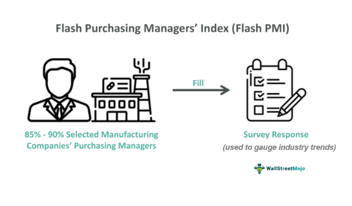

The Purchasing Managers' Index (PMI) serves as a crucial economic indicator, providing insights into the economic health of both the manufacturing and service sectors of a country. It reflects purchasing managers' activity, which often correlates with overall economic activity. Among the various PMI indices, the Flash Services PMI offers an advance glimpse into the health of the service sector. This preliminary estimate provides early signals about the economy, allowing investors and policymakers to make informed decisions and adjust strategies accordingly.

The Flash Services PMI stands out by offering a quick snapshot ahead of the final PMI data, typically released one week later. This early reporting is made possible by collecting and analyzing responses from purchasing executives in the service industry, covering areas such as transport, communication, and financial services. The survey usually accounts for about 85-90% of the total responses by the time it is published. Readings above 50 indicate expansion in the services sector, whereas readings below 50 suggest contraction.



Given its timely release, the Flash Services PMI can significantly influence market decisions and trading strategies. It serves as a precursor to more comprehensive economic reports, frequently impacting asset prices and economic forecasts. For traders and investors who must anticipate market trends and economic shifts, understanding the nuances of this indicator is essential. By interpreting the Flash Services PMI correctly, they can gain a strategic edge, positioning themselves advantageously in the fluctuating market landscape.

It's essential to differentiate the Flash Services PMI from other PMI indices. While other indices may focus on manufacturing or composite outputs, the Flash Services PMI zeroes in on the service sector, providing specificity and insight into this crucial part of the economy. As we proceed, we will examine the implications of the Flash Services PMI on economic indicators and its critical role in algorithmic trading.

## Table of Contents

## Understanding Flash Services PMI

Flash Services PMI serves as an early estimate of the Services Purchasing Managers' Index (PMI), offering an advanced preview of the economic conditions within the service sector before the release of the final PMI data. This index plays a critical role in providing insights into the performance and health of industries including transport, communication, and financial services.

The Flash Services PMI is derived from survey data collected from purchasing executives within the service sector. These executives provide insights based on current business conditions and their expectations for the future. This data is released approximately one week prior to the final Services PMI and typically reflects about 85-90% of total survey responses. By doing so, the Flash Services PMI offers an almost real-time snapshot of the economic landscape in the service sector.

The index operates on a scale where readings above 50 signify an expansion in the services sector, while readings below 50 indicate contraction. This threshold is crucial for analysts and policymakers as it helps them assess whether the sector is growing or shrinking. For example, a reading of 52 would suggest a moderate expansion, while a reading of 48 would suggest a slight contraction.

As an early indicator, the Flash Services PMI bridges the gap between monthly economic updates and real-time economic conditions, allowing businesses, investors, and policymakers to respond promptly to emerging trends. This timeliness is crucial for making informed decisions that affect financial markets and economic policy. The quick turnaround from data collection to publication enhances its utility in predicting future market conditions and making strategic adjustments.

## The Importance of Flash Services PMI in Economic Indicators

The Flash Services Purchasing Managers' Index (PMI) is among the earliest economic indicators made available each month, providing essential insights into evolving economic conditions. As an advance snapshot of the service sector's health, it plays a crucial role in identifying potential shifts in Gross Domestic Product (GDP) trends, inflation pressures, and employment rates.

The data gleaned from the Flash Services PMI is especially valuable for policymakers and financial institutions. The Federal Open Market Committee (FOMC), for instance, closely monitors this index to inform monetary policy decisions. A decline in the PMI could indicate a downturn in economic activity, encouraging the FOMC to adopt a more accommodative monetary policy to spur growth. Conversely, a rising PMI may push policymakers toward tightening policies to prevent overheating.

The influence of the Flash Services PMI extends to global financial markets as well. A positive or negative reading can have significant repercussions on currency markets, commodities, and equities. For currencies, a strong PMI is often associated with expectations of economic growth, potentially leading to an appreciation of the local currency in anticipation of higher interest rates. In contrast, weaker PMI figures might result in depreciations due to anticipated economic slowdowns.

In the commodities market, shifts in PMI can signal changes in demand dynamics, influencing the prices of raw materials and energy. For equities, a robust PMI often boosts investor confidence, driving stock prices higher, particularly in sectors sensitive to consumer demand and economic conditions.

Overall, Flash Services PMI reports are indispensable to investors and traders, offering real-time perspectives on economic trends and helping guide investment strategies. Constant absorption of PMI data, alongside other economic indicators, is vital for those aiming to understand and predict market behaviors effectively.

## Flash Services PMI and Algorithmic Trading

Algorithmic trading, which involves the use of automated systems to execute trades based on preset rules and data inputs, makes extensive use of economic indicators like the Flash Services PMI. This preliminary estimate of the Services Purchasing Managers' Index is particularly valuable for traders because it provides timely insights about the service sector, often influencing market dynamics that algorithms are designed to capitalize on.

High-frequency trading ([HFT](/wiki/high-frequency-trading-strategies)) systems, a subset of [algorithmic trading](/wiki/algorithmic-trading), are particularly adept at utilizing PMI data to predict market movements. These systems can execute thousands of trades in seconds, exploiting minor price discrepancies that may arise from unexpected PMI readings. If the Flash Services PMI diverges significantly from market forecasts, it can prompt immediate buy or sell signals, pushing prices to adjust quickly. This capability allows HFTs to respond efficiently, capturing short-term trends before manual traders can react.

An example of how this might be implemented in Python could involve setting up an algorithm to trigger trades based on PMI data:

```python
import requests

# Mock function to fetch the latest Flash Services PMI data
def get_flash_services_pmi():
    # In practice, this would pull data from a reliable financial data source
    return {'pmi_value': 55.0, 'expected_value': 54.5}

def trading_algorithm():
    data = get_flash_services_pmi()
    pmi_value = data['pmi_value']
    expected_value = data['expected_value']

    # Example trading condition based on PMI reading
    if pmi_value > expected_value:
        print("Initiate Buy Order: PMI indicates growth potential.")
    elif pmi_value < expected_value:
        print("Initiate Sell Order: PMI indicates potential downturn.")
    else:
        print("Hold Position: PMI aligns with expectations.")

trading_algorithm()
```

Beyond immediate reactions, traders also use Flash Services PMI as part of broader strategies to adjust portfolios and hedge against potential risks. These adjustments might involve reallocating assets based on anticipated economic conditions suggested by PMI trends. For instance, a higher-than-expected PMI reading might encourage investment in sectors expected to benefit from economic expansion.

Moreover, to maintain a competitive edge in dynamic markets, algorithms must process and interpret PMI data swiftly. This involves using sophisticated models to analyze data patterns, often with [machine learning](/wiki/machine-learning) techniques enhancing predictive accuracy. The integration of PMI data into these models allows traders to not only react to current conditions but also predict future market movements with greater precision.

Thus, the Flash Services PMI is not just a passive indicator but an active element in shaping the strategies of algorithmic trading systems, reaffirming its significance in today's fast-paced financial markets.

## Impact on Financial Markets

A strong Flash Services PMI reading is frequently associated with heightened market confidence, which often leads to an increase in stock prices, notably within the consumer and industrial sectors. This positive sentiment is driven by the perception that rising service activity signals robust economic health, thereby boosting investor confidence and encouraging investments in equities linked to economic growth. Conversely, if the Flash Services PMI falls below expectations, it may induce a bearish market sentiment, affecting riskier assets adversely. In such scenarios, investors might anticipate slower economic growth, prompting them to shift towards safer investments.

Currency markets also respond sensitively to the Flash Services PMI readings. A robust PMI can lead to the appreciation of the local currency as it suggests potential economic growth and might signal future [interest rate](/wiki/interest-rate-trading-strategies) hikes. These expectations increase investor demand for the currency as they foresee better returns on investments denominated in that currency. For example, if the Flash Services PMI indicates a substantial upturn, it could strengthen the currency by increasing speculation about tightening monetary policy.

In the bond market, positive PMI figures can cause bond yields to rise. Investors anticipating economic growth and potential inflationary pressures may demand higher yields to compensate for the decreased purchasing power of future cash flows. For instance, should the Flash Services PMI reveal vigorous economic activity, market participants might expect higher inflation, leading to a sell-off in bonds and a subsequent rise in yields.

Given these dynamics, monitoring PMI trends is crucial for investors and traders to manage market [volatility](/wiki/volatility-trading-strategies) effectively. By keeping abreast of PMI data, they can adjust their investment strategies to mitigate risks and capitalize on opportunities. For instance, a strategy might involve reallocating assets between equities, currencies, and bonds based on the anticipated economic trajectory suggested by the PMI data, optimizing portfolios in response to shifting market conditions.

## Conclusion

The Flash Services PMI is a vital tool for understanding the economic landscape and making informed investment decisions. This preliminary economic indicator provides an early glimpse into the service sector's dynamics, which constitutes a significant portion of many economies. By offering timely insights ahead of final PMI releases, it shapes market expectations and guides strategic responses.

For traders and investors, anticipating the Flash Services PMI results can offer a strategic advantage in navigating financial markets. Real-time access to this data allows stakeholders to adjust their strategies promptly, whether by reallocating assets or reconsidering risk exposure. The ability to react swiftly to PMI surprises is crucial in fast-paced markets where milliseconds can determine profitability.

Incorporating a continuous analysis of PMI data along with other economic indicators enhances one's capacity to forecast market behavior. While the PMI offers valuable information, it should be considered alongside broader economic trends and data sets to formulate a holistic market outlook. This comprehensive approach enables more accurate predictions and strategic decisions, potentially optimizing returns and mitigating risks.

Staying updated with PMI reports is essential for individuals involved in economic analysis, policy formulation, and trading. The timely dissemination of these reports ensures that all market participants, from policymakers to institutional traders, have access to pertinent information to guide their decisions. Thus, regular engagement with the Flash Services PMI and other economic indicators remains a cornerstone of informed market participation.

## References & Further Reading

[1]: ["Purchasing Managers' Index (PMI) by IHS Markit"](https://www.spglobal.com/market-intelligence/en/solutions/products/pmi) - Provides detailed insights into how PMI, including the Flash Services PMI, is compiled and used.

[2]: ["Understanding the PMI: A Tool for Economic Analysis"](https://www.cmcinvest.com/en-sg/learn/decoding-the-pmi-a-vital-economic-indicator) by Investopedia - An article offering an in-depth explanation of PMI and its components.

[3]: ["Algorithmic Trading & DMA: An Introduction to Direct Access Trading Strategies"](https://www.amazon.com/Algorithmic-Trading-DMA-introduction-strategies/dp/0956399207) by Barry Johnson - Offers insights into how economic indicators like PMI can influence algorithmic trading strategies.

[4]: ["High-Frequency Trading and the Flash Crash: A Discussion of the Business Model and Public Policy Proposals"](https://www.cftc.gov/sites/default/files/idc/groups/public/@economicanalysis/documents/file/oce_flashcrash0314.pdf) by Terrence Hendershott and Charles M. Jones - Discusses the influence of high-frequency trading strategies that might incorporate PMI data.

[5]: ["Trading Economics - Economic Calendar"](https://tradingeconomics.com/calendar) - Provides real-time updates on economic indicators, including the PMI, relevant for traders and economists.