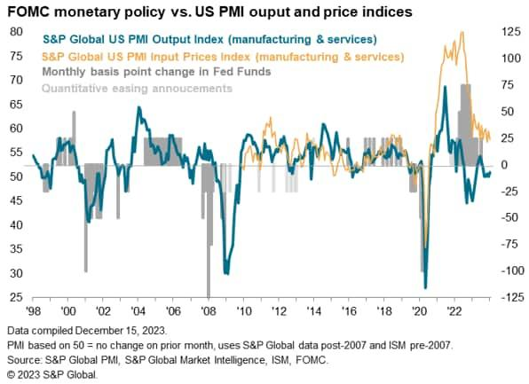

## Table of Contents

## What is the Flash Services Purchasing Managers' Index (PMI)?

The Flash Services Purchasing Managers' Index (PMI) is a quick estimate of how the services sector in an economy is doing. It's released before the final PMI data and gives businesses and investors an early look at whether the services part of the economy is growing or shrinking. The services sector includes things like restaurants, hotels, and professional services. The Flash PMI is based on answers from a survey sent to managers in the services industry, asking about things like new orders, employment, and business activity.

The Flash Services PMI is important because it helps people understand the health of the services sector quickly. If the PMI number is above 50, it means the services sector is growing. If it's below 50, it means the sector is shrinking. This early information can help businesses make decisions about hiring, investing, or changing their strategies. It also gives investors a heads-up on how the economy might be doing, which can affect their investment choices.

## How is the Flash Services PMI calculated?

The Flash Services PMI is calculated using answers from a survey sent to managers in the services industry. These managers answer questions about things like new orders, employment, and business activity. Their answers help create a number that shows if the services sector is growing or shrinking. The survey is sent to a group of managers that represent the whole services sector, so their answers give a good picture of what's happening in the economy.

To get the Flash PMI number, the answers from the survey are turned into a single number. Each question in the survey gets a score, and these scores are added up and turned into the PMI. If the PMI number is above 50, it means the services sector is growing. If it's below 50, it means the sector is shrinking. The Flash PMI is a quick estimate, so it comes out before the final PMI data, giving people an early look at how the services sector is doing.

## Who publishes the Flash Services PMI?

The Flash Services PMI is published by a company called IHS Markit. They are a big company that collects and shares information about different parts of the economy. IHS Markit sends out surveys to managers in the services industry and uses their answers to calculate the Flash PMI.

The Flash PMI is important because it gives people an early look at how the services sector is doing. It comes out before the final PMI data, so businesses and investors can use it to make quick decisions. If the Flash PMI number is above 50, it means the services sector is growing. If it's below 50, it means the sector is shrinking.

## How often is the Flash Services PMI released?

The Flash Services PMI comes out every month. It is released near the end of the month, giving people a quick look at how the services part of the economy is doing before the final PMI numbers are out.

This monthly release is important because it helps businesses and investors make decisions fast. They can see if the services sector is growing or shrinking and adjust their plans accordingly. If the Flash PMI number is above 50, it means the services sector is growing. If it's below 50, it means the sector is shrinking.

## What is the significance of the Flash Services PMI for the economy?

The Flash Services PMI is really important because it gives people a quick look at how the services part of the economy is doing. This part of the economy includes things like restaurants, hotels, and professional services. The Flash PMI comes out before the final PMI numbers, so businesses and investors can use it to make decisions fast. They can see if the services sector is growing or shrinking and adjust their plans accordingly. If the Flash PMI number is above 50, it means the services sector is growing. If it's below 50, it means the sector is shrinking.

This early information is helpful for businesses because it tells them if they should hire more people, invest in new things, or change their strategies. For investors, the Flash PMI can give them a heads-up on how the whole economy might be doing, which can affect their investment choices. Knowing whether the services sector is growing or shrinking helps everyone understand the overall health of the economy and make better decisions.

## How does the Flash Services PMI differ from the final Services PMI?

The Flash Services PMI and the final Services PMI are both important numbers that tell us how the services part of the economy is doing. The big difference is when they come out. The Flash PMI is a quick estimate that comes out near the end of the month, before the final PMI. It gives businesses and investors an early look at whether the services sector is growing or shrinking. The final PMI comes out a bit later, usually about a week after the Flash PMI, and it's based on more complete data.

Both the Flash and final PMIs are calculated using answers from a survey sent to managers in the services industry. They ask about things like new orders, employment, and business activity. The Flash PMI uses answers from a smaller group of managers to give a quick estimate. The final PMI uses answers from a bigger group, so it's more accurate but takes longer to come out. Both numbers are important, but the Flash PMI helps people make decisions faster because it comes out first.

## What are the key components that make up the Flash Services PMI?

The Flash Services PMI is made up of several key parts that help show how the services part of the economy is doing. The main parts are new orders, which tell us if businesses are getting more or fewer customers; employment, which shows if companies are hiring more people or letting people go; and business activity, which tells us how busy the businesses are. These parts are important because they give us a good picture of what's happening in the services sector.

To calculate the Flash PMI, a company called IHS Markit sends out a survey to managers in the services industry. These managers answer questions about the key parts like new orders, employment, and business activity. Their answers are then turned into a single number, the Flash PMI. If this number is above 50, it means the services sector is growing. If it's below 50, it means the sector is shrinking. This quick estimate helps businesses and investors make decisions fast.

## How can the Flash Services PMI be used to predict economic trends?

The Flash Services PMI can be used to predict economic trends because it gives a quick look at how the services part of the economy is doing. Since the services sector is a big part of the economy, knowing if it's growing or shrinking can tell us a lot about where the whole economy might be headed. If the Flash PMI number is above 50, it means the services sector is growing, which could mean the economy is doing well. If it's below 50, it means the services sector is shrinking, which could be a sign that the economy might be slowing down.

Businesses and investors use the Flash PMI to make predictions and plan ahead. For example, if the Flash PMI shows that the services sector is growing, businesses might decide to hire more people or invest in new things. Investors might see this as a good sign and decide to put more money into the economy. On the other hand, if the Flash PMI shows the services sector is shrinking, businesses might be more careful about hiring or spending, and investors might hold off on new investments. This early information helps everyone make better decisions about the future of the economy.

## What are the historical trends of the Flash Services PMI?

Over the years, the Flash Services PMI has shown some clear patterns that help us understand how the services part of the economy has been doing. During good times, like when the economy is growing, the Flash PMI often stays above 50. This means the services sector is getting more customers, hiring more people, and doing more business. For example, before the big economic crisis in 2008, the Flash PMI was often above 50, showing that the services sector was doing well. But when the economy goes through tough times, like during a recession, the Flash PMI can drop below 50. This happened during the 2008 financial crisis and again during the early stages of the COVID-19 pandemic in 2020, when businesses had to close and people stayed home.

The Flash Services PMI can also show us how quickly the services sector is getting better or worse. When the economy starts to recover from a downturn, the Flash PMI might start to go up, showing that the services sector is starting to grow again. This happened after the 2008 crisis and after the initial shock of the COVID-19 pandemic. On the other hand, if the Flash PMI keeps going down over a few months, it might mean the services sector is getting worse, and the economy might be heading into a downturn. By looking at these historical trends, businesses and investors can get a better idea of what might happen next in the economy.

## How does the Flash Services PMI correlate with other economic indicators?

The Flash Services PMI is closely connected to other economic indicators like the Gross Domestic Product (GDP), employment rates, and consumer confidence. When the Flash PMI is above 50, showing that the services sector is growing, it often means that the GDP is also growing. This is because the services sector is a big part of the economy. If businesses in the services sector are doing well, they might hire more people, which can lead to lower unemployment rates. Also, when people see that the services sector is doing well, they might feel more confident about the economy and spend more money, which can boost consumer confidence.

On the other hand, if the Flash PMI drops below 50, it can be a warning sign for other parts of the economy. A shrinking services sector might mean that businesses are not doing as well, which could lead to fewer jobs and higher unemployment rates. When people see that the services sector is struggling, they might feel less confident about the economy and spend less money, which can hurt consumer confidence. By looking at the Flash Services PMI along with other economic indicators, we can get a fuller picture of what's happening in the economy and make better predictions about where it might be headed.

## What are the limitations and criticisms of the Flash Services PMI?

The Flash Services PMI is a quick estimate that comes out before the final PMI numbers, but it has some limitations. One big limitation is that it's based on a smaller group of managers, so it might not be as accurate as the final PMI. This means the Flash PMI can sometimes give a different picture of the services sector than the final PMI. Another limitation is that the Flash PMI only looks at the services part of the economy, so it doesn't tell us about other important parts like manufacturing or construction. This can make it hard to get a full picture of the whole economy from just the Flash PMI.

Some people also criticize the Flash Services PMI because it can be affected by things that might not last, like short-term changes in business activity or new orders. This can make the Flash PMI seem like the economy is doing better or worse than it really is. Critics also say that the Flash PMI can be too focused on big businesses and might not show what's happening with smaller companies. This can be a problem because small businesses are a big part of the economy too. So, while the Flash PMI is useful for getting a quick look at the services sector, it's important to use it along with other economic indicators to get a more complete understanding of the economy.

## How do different countries' Flash Services PMIs compare and what does this indicate about global economic health?

The Flash Services PMIs from different countries can show us how the services part of the economy is doing around the world. When we look at these numbers together, we can see if the global economy is growing or shrinking. For example, if many countries have Flash PMIs above 50, it means their services sectors are growing, which is a good sign for the global economy. But if a lot of countries have Flash PMIs below 50, it might mean the global economy is slowing down. By comparing these numbers, we can get a better idea of what's happening in the world economy.

Different countries might have different Flash PMIs because of things like their own economic policies, how much people are spending, or what's happening in other parts of their economy. For example, if one country's Flash PMI is much higher than another's, it might mean that country's services sector is doing better. This can help us understand which parts of the world are doing well and which parts might need help. By looking at these trends, businesses and investors can make better decisions about where to put their money and how to plan for the future.

## References & Further Reading

[1]: ["Purchasing Managers' Index (PMI) by IHS Markit"](https://www.spglobal.com/market-intelligence/en/solutions/products/pmi) - Provides detailed insights into how PMI, including the Flash Services PMI, is compiled and used.

[2]: ["Understanding the PMI: A Tool for Economic Analysis"](https://www.cmcinvest.com/en-sg/learn/decoding-the-pmi-a-vital-economic-indicator) by Investopedia - An article offering an in-depth explanation of PMI and its components.

[3]: ["Algorithmic Trading & DMA: An Introduction to Direct Access Trading Strategies"](https://www.amazon.com/Algorithmic-Trading-DMA-introduction-strategies/dp/0956399207) by Barry Johnson - Offers insights into how economic indicators like PMI can influence algorithmic trading strategies.

[4]: ["High-Frequency Trading and the Flash Crash: A Discussion of the Business Model and Public Policy Proposals"](https://www.cftc.gov/sites/default/files/idc/groups/public/@economicanalysis/documents/file/oce_flashcrash0314.pdf) by Terrence Hendershott and Charles M. Jones - Discusses the influence of high-frequency trading strategies that might incorporate PMI data.

[5]: ["Trading Economics - Economic Calendar"](https://tradingeconomics.com/calendar) - Provides real-time updates on economic indicators, including the PMI, relevant for traders and economists.