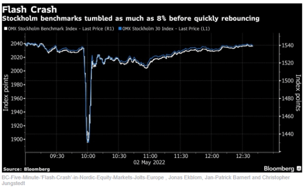

## Table of Contents

## What was the Flash Crash of 2010?

The Flash Crash of 2010 was a sudden and dramatic drop in the stock market that happened on May 6, 2010. It started around 2:42 p.m. EDT and lasted for about 36 minutes. During this time, the Dow Jones Industrial Average, which is a big measure of the stock market, fell by almost 1,000 points. This was very scary for people who were watching their money in the market because it happened so fast.

After the crash, people tried to figure out why it happened. They found out that a big trader sold a lot of a certain type of investment called an E-Mini S&P 500 futures contract. This sale was so big and fast that it caused other computer trading programs to start selling too. These programs were designed to buy and sell quickly, and they made the situation worse. Eventually, the market calmed down, but it showed everyone how computer trading could cause big problems very quickly.

## When did the Flash Crash occur?

The Flash Crash happened on May 6, 2010. It was a big and quick drop in the stock market that scared a lot of people. The crash started at about 2:42 p.m. Eastern Daylight Time and lasted for around 36 minutes.

During the Flash Crash, the Dow Jones Industrial Average, which is a big measure of how the stock market is doing, went down by almost 1,000 points. This was a huge drop and it happened very fast. People were worried because it showed how quickly things could go wrong in the market.

## What markets were affected by the Flash Crash?

The Flash Crash of 2010 affected many different markets. The biggest impact was seen in the stock market, especially the Dow Jones Industrial Average, which dropped by almost 1,000 points in just 36 minutes. This big drop scared a lot of people who had money in the market.

Other markets were affected too. The futures market, where people buy and sell contracts for future dates, also saw big changes. The E-Mini S&P 500 futures contract was at the center of the crash, causing other markets to react quickly. Even though the stock and futures markets were hit the hardest, the event showed how quickly problems in one market could spread to others.

## What caused the Flash Crash of 2010?

The Flash Crash of 2010 was mainly caused by a big trader selling a lot of E-Mini S&P 500 futures contracts very quickly. This sale was so big and fast that it made other computer trading programs start selling too. These programs were designed to buy and sell quickly based on what was happening in the market. When they saw the big sale, they thought the market was going down, so they started selling too. This made the prices drop even more and caused a lot of chaos.

After the crash, people looked into what happened and found out that these computer programs, called high-frequency trading algorithms, played a big role. They were set up to react quickly to changes in the market, but they didn't always understand the bigger picture. When one big trader started selling, it set off a chain reaction that made the whole market go down fast. This showed everyone how important it is to watch and control these computer trading programs to keep the market stable.

## How did the Flash Crash impact the stock market?

The Flash Crash of 2010 had a big impact on the stock market. On May 6, 2010, the Dow Jones Industrial Average, which is a big measure of the stock market, dropped by almost 1,000 points in just 36 minutes. This sudden drop scared a lot of people because it happened so fast and was so big. People who had money in the stock market were worried about losing a lot of money quickly.

The crash showed how computer trading programs could make things worse in the market. A big trader sold a lot of E-Mini S&P 500 futures contracts very quickly, which made other computer programs start selling too. These programs were set up to buy and sell quickly, but they didn't always understand what was really happening. This caused a chain reaction that made the market drop even more. After the crash, people learned that they needed to watch and control these computer programs better to keep the market stable.

## What was the role of high-frequency trading in the Flash Crash?

High-frequency trading played a big role in the Flash Crash of 2010. These are computer programs that buy and sell stocks very quickly, sometimes in just a few seconds. On May 6, 2010, a big trader sold a lot of E-Mini S&P 500 futures contracts very fast. This made the high-frequency trading programs think that the market was going down, so they started selling too. This caused a chain reaction where more and more stocks were sold quickly, making the market drop even faster.

The Flash Crash showed everyone how these high-frequency trading programs could make things worse in the market. They were set up to react quickly to changes, but they didn't always understand the bigger picture. When one big trader started selling, it set off a chain reaction that caused the whole market to go down very quickly. This event made people realize that they needed to watch and control these computer programs better to keep the market stable.

## What were the immediate responses from regulatory bodies?

Right after the Flash Crash of 2010, the regulatory bodies like the U.S. Securities and Exchange Commission (SEC) and the Commodity Futures Trading Commission (CFTC) started looking into what happened. They wanted to find out why the market dropped so fast and so much. They looked at a lot of data and talked to many people who worked in the market. They found out that a big trader selling a lot of E-Mini S&P 500 futures contracts quickly was a big part of the problem. This sale made other computer programs start selling too, which made the market crash.

After figuring out what caused the Flash Crash, the regulatory bodies took action to stop it from happening again. They made new rules to control how fast and how much traders could sell at one time. They also started watching the market more closely to catch any big changes quickly. They wanted to make sure that the computer programs, like the high-frequency trading ones, wouldn't cause another big drop in the market. These steps helped make the market more stable and safe for everyone.

## How did the Flash Crash affect individual investors?

The Flash Crash of 2010 scared a lot of individual investors. They saw the stock market drop by almost 1,000 points in just 36 minutes, which was very fast and big. This made many people worried about losing their money. Some investors who were watching the market that day might have sold their stocks quickly to avoid losing more money, which could have made the crash even worse. Others might have been too scared to invest in the market again for a while because they didn't want to go through something like that again.

After the Flash Crash, many individual investors learned more about how the market works and how computer trading can affect it. They started to understand that the market can change very quickly and that they need to be careful. This event also made some people more interested in learning about high-frequency trading and how it can cause big problems. Overall, the Flash Crash made individual investors more aware of the risks in the stock market and the need to stay informed about what's happening.

## What long-term changes were implemented in market regulations following the Flash Crash?

After the Flash Crash of 2010, the people who watch over the stock market, like the SEC and the CFTC, made some big changes to keep things safer. They made new rules to stop traders from selling too much too fast. They also started watching the market more closely to catch any big changes quickly. These rules were meant to stop another big crash from happening because of computer trading programs.

These changes helped make the market more stable. The new rules made sure that high-frequency trading programs couldn't cause another big drop in the market. They also helped individual investors feel safer about putting their money in the stock market. Overall, the Flash Crash taught everyone a lot about how the market works and how important it is to have good rules to keep it safe.

## What lessons were learned from the Flash Crash about market stability?

The Flash Crash of 2010 taught us a lot about how to keep the market stable. It showed that computer programs, like high-frequency trading ones, can cause big problems very quickly. When one big trader sold a lot of E-Mini S&P 500 futures contracts fast, it made other computer programs start selling too. This chain reaction made the market drop very fast. It was scary for everyone, and it made people realize that they need to watch these computer programs more closely to stop them from causing another big crash.

After the Flash Crash, the people who watch over the market, like the SEC and the CFTC, made new rules to keep things safer. They stopped traders from selling too much too fast and started watching the market more closely to catch any big changes quickly. These rules helped make the market more stable and made individual investors feel safer about putting their money in the stock market. The Flash Crash was a big lesson that showed everyone how important it is to have good rules to keep the market safe.

## How has technology evolved to prevent similar events since the Flash Crash?

Since the Flash Crash of 2010, technology has gotten better to help stop similar events from happening. One big change is that trading platforms now have something called "circuit breakers." These are like safety switches that stop trading for a little while if the market starts to drop too fast. This gives everyone time to calm down and figure out what's going on. Also, the computers that watch the market are now better at spotting when something weird is happening. They can see if a big trader is selling too much too fast and can slow things down to keep the market stable.

Another way technology has helped is by making high-frequency trading programs smarter. These programs now have rules that stop them from selling too much if the market starts to drop quickly. They also have to report more about what they're doing, so the people watching the market can see if anything strange is happening. All these changes have made the market safer and more stable, so people can feel better about putting their money in it.

## What are the ongoing debates among experts about the Flash Crash?

Experts still talk a lot about the Flash Crash of 2010. Some of them think that the big drop in the market was mainly because of high-frequency trading programs. They say these programs can make things worse very quickly if they start selling a lot of stocks at the same time. Other experts believe that there were other reasons too, like how the market was doing that day or other big trades happening at the same time. They think it's hard to say that high-frequency trading was the only reason for the crash.

Another big debate is about the rules that were made after the Flash Crash. Some experts think these rules have made the market safer and more stable. They say things like circuit breakers and better watching of the market have helped a lot. But other experts worry that these rules might make it harder for the market to work well. They think the rules might stop trading too much and could slow down the market when it doesn't need to be slowed down. These debates show that people are still trying to figure out the best way to keep the market safe without making it too hard for everyone to use.

## References & Further Reading

[1]: U.S. Securities and Exchange Commission and Commodity Futures Trading Commission. (2010). ["Findings Regarding the Market Events of May 6, 2010."](https://www.sec.gov/news/studies/2010/marketevents-report.pdf)

[2]: Aldridge, I. (2013). ["High-Frequency Trading: A Practical Guide to Algorithmic Strategies and Trading Systems."](https://www.wiley.com/en-us/High+Frequency+Trading%3A+A+Practical+Guide+to+Algorithmic+Strategies+and+Trading+Systems%2C+2nd+Edition-p-9781118343500) Wiley.

[3]: Kirilenko, A. A., Kyle, A. S., Samadi, M., and Tuzun, T. (2017). ["The Flash Crash: High-Frequency Trading in an Electronic Market."](https://onlinelibrary.wiley.com/doi/abs/10.1111/jofi.12498) Review of Financial Studies.

[4]: Patterson, S. (2013). ["Dark Pools: The Rise of the Machine Traders and the Rigging of the U.S. Stock Market."](https://www.amazon.com/Dark-Pools-Machine-Traders-Rigging/dp/0307887189) Crown Business.

[5]: Easley, D., López de Prado, M. M., and O'Hara, M. (2011). ["The Microstructure of the 'Flash Crash': Flow Toxicity, Liquidity Crashes, and the Probability of Informed Trading."](https://academic.oup.com/rfs/article-abstract/25/5/1457/1569929) Journal of Portfolio Management.