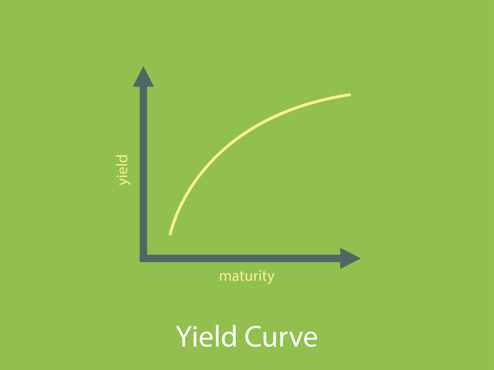

## Table of Contents

## What is a Flat Bond?

A flat bond is a type of bond that does not have any special features attached to it. It's a simple bond that pays a fixed interest rate to the investor at regular intervals until it matures. When the bond reaches its maturity date, the investor gets back the amount they originally invested, which is called the principal.

These bonds are often seen as safe investments because they offer predictable returns. Investors know exactly how much interest they will earn and when they will get their money back. This makes flat bonds a popular choice for people who want a steady income without taking on too much risk.

## How does a Flat Bond differ from other types of bonds?

A flat bond is different from other types of bonds because it is very simple. It just pays a fixed interest rate at regular times until it matures. When it matures, you get your original money back. Other bonds might have extra features that can make them more complicated. For example, some bonds might let you turn them into company shares, or they might have a rate that can change over time.

Another way flat bonds are different is that they are usually seen as safer. Because they have a fixed interest rate and a set maturity date, you know exactly what you will get and when. This makes them good for people who want a steady income without taking big risks. Other bonds, like high-yield bonds, might offer more money but come with more risk because the companies issuing them might have a harder time paying back the money.

In summary, flat bonds are simpler and safer than many other types of bonds. They don't have extra features that can make things more complicated, and they offer a predictable return. This makes them a good choice for people who want to keep their investments straightforward and low-risk.

## What are the key features of a Flat Bond?

A flat bond is a simple type of bond that pays a fixed interest rate to the investor at regular times. This means if you buy a flat bond, you will get the same amount of interest every time it is due, like every month or every year. When the bond reaches its maturity date, you get back the money you originally invested, which is called the principal. This makes flat bonds easy to understand because you know exactly how much money you will get and when.

Flat bonds are often seen as safe investments. They don't have any special features that can make things more complicated, like the ability to turn them into company shares or having an interest rate that can change. Because of this, flat bonds are good for people who want a steady income without taking big risks. They are a popular choice for investors who want to keep their investments simple and predictable.

## Who typically issues Flat Bonds?

Flat bonds are usually issued by governments and big, stable companies. Governments issue flat bonds to raise money for things like building roads or schools. These bonds are seen as very safe because governments can usually pay back the money they borrow. Big companies also issue flat bonds to get money for their business. These companies are often well-known and have a good history of paying back their debts, so their bonds are also seen as safe.

Sometimes, smaller companies or local governments might issue flat bonds too. But these are riskier because these organizations might have a harder time paying back the money. Investors need to be careful and do their research before buying these bonds. Overall, flat bonds are a popular choice for people who want a steady and predictable income from their investments.

## What are the benefits of investing in Flat Bonds?

Investing in flat bonds has several benefits. One big benefit is that they are safe. Flat bonds are often issued by governments or big, stable companies, so there's a low chance that they won't pay you back. This makes them a good choice if you don't want to take big risks with your money. Another benefit is that flat bonds give you a steady income. You know exactly how much interest you will get and when, which can help you plan your finances better.

Another advantage of flat bonds is their simplicity. They don't have any complicated features like some other bonds do. This means you don't have to worry about things like interest rates changing or being able to turn your bond into company shares. Flat bonds are easy to understand, which makes them a good choice for people who want to keep their investments simple. Overall, flat bonds are a good option if you want a safe and predictable way to earn money from your investments.

## What are the risks associated with Flat Bonds?

Even though flat bonds are usually seen as safe, there are still some risks. One risk is that the issuer might not be able to pay back the money they owe you. This is more likely to happen if the bond is from a smaller company or a local government that doesn't have a lot of money. If they can't pay you back, you might lose some or all of your investment.

Another risk is that flat bonds might not keep up with inflation. Inflation means that the value of money goes down over time. If the interest rate on your flat bond is lower than the rate of inflation, the money you get back might not be worth as much as when you first invested it. This can make your investment less valuable in the long run.

Lastly, flat bonds might not give you as much money as other types of investments. If you want to grow your money faster, you might need to take more risks. Flat bonds are good for steady income, but they usually don't offer high returns. So, if you're looking for big gains, flat bonds might not be the best choice for you.

## How is the interest rate determined for Flat Bonds?

The interest rate for flat bonds is set when the bond is first issued. The issuer, which could be a government or a company, decides on the rate based on several things. They look at how much money they need to borrow, how long they want to borrow it for, and what other interest rates are like at the time. They also think about their own credit rating, which is how trustworthy they are at paying back money. If the issuer has a high credit rating, they might offer a lower interest rate because people see them as safe to lend to.

The interest rate also depends on what investors are willing to accept. If there are a lot of other good investment options out there, the issuer might need to offer a higher interest rate to make their bond look attractive. On the other hand, if there aren't many other good options, they might be able to offer a lower rate. Once the interest rate is set, it stays the same for the whole time the bond is active, which is why flat bonds are called "flat" – the rate doesn't change.

## What is the typical maturity period for a Flat Bond?

The typical maturity period for a flat bond can vary, but it usually ranges from one to thirty years. Shorter-term flat bonds might mature in one to five years, while longer-term ones can take up to thirty years to reach their maturity date. The exact length of time depends on what the issuer needs and what investors want.

When a government or a company issues a flat bond, they decide how long they want to borrow the money for. This decision affects the interest rate they offer. Shorter-term bonds usually have lower interest rates because investors get their money back sooner. Longer-term bonds might offer higher rates to make up for the fact that investors have to wait longer to get their principal back.

## How can one purchase a Flat Bond?

You can buy a flat bond through a broker or directly from the issuer. If you use a broker, you'll need to find one that deals in bonds. You can search online or ask for recommendations from friends or financial advisors. Once you have a broker, you can tell them what kind of flat bond you want, like one from a government or a big company. They will then help you buy the bond.

You can also buy flat bonds directly from the issuer. For example, if you want to buy a government bond, you can often do this through the government's website. Companies might sell their bonds through their own websites or through special events called bond offerings. To buy directly, you'll need to follow the instructions on the issuer's website or in their offering documents. Either way, once you buy the bond, you'll start getting regular interest payments until the bond matures.

## What are the tax implications of investing in Flat Bonds?

When you invest in flat bonds, you need to think about taxes. The interest you get from flat bonds is usually taxable. This means you have to pay taxes on the interest every year, even before the bond matures. The tax rate depends on your income and where you live. If you buy bonds from your own country, the interest is usually taxed as regular income. But if you buy bonds from another country, there might be different rules and you might have to pay taxes in that country too.

Sometimes, there are ways to reduce the taxes you pay on flat bonds. For example, some government bonds might be tax-free or have lower tax rates. These are often called municipal bonds in the United States. If you invest in these, you might not have to pay federal taxes on the interest, and sometimes you don't have to pay state taxes either. It's a good idea to talk to a tax advisor to understand how flat bonds will affect your taxes and to find out about any special rules or benefits that might apply to you.

## How do Flat Bonds perform in different economic conditions?

Flat bonds can be a good choice in many economic conditions because they offer a steady income. When the economy is doing well, flat bonds might not give you as much money as riskier investments like stocks. But they are still safe and reliable. You know exactly how much interest you will get, which can be comforting when things are going well. Plus, if you need a steady income, flat bonds can help you plan your finances better.

In tough economic times, flat bonds can be even more valuable. They are seen as safe investments because the interest rate stays the same, no matter what happens in the economy. This means you still get your regular interest payments even if the stock market is going down or if there are other financial problems. But remember, if the issuer of the bond has big money troubles, there's a small chance they might not be able to pay you back. Still, flat bonds from governments or big companies are usually a safe bet during economic downturns.

## What advanced strategies can be used when investing in Flat Bonds?

One advanced strategy for investing in flat bonds is called laddering. This means you buy several flat bonds that mature at different times. For example, you could buy bonds that mature in one year, three years, and five years. This way, you get your money back at different times, which can help you manage your cash flow better. It also lets you take advantage of different interest rates. If rates go up, you can reinvest the money from the bond that matures soonest at a higher rate. If rates go down, you still have bonds that are earning the higher rate from when you bought them.

Another strategy is to use flat bonds to balance out riskier investments. If you have a lot of money in stocks or other investments that can go up and down a lot, flat bonds can help keep your overall investment safe. They give you a steady income and can help you sleep better at night knowing that part of your money is safe. This is called diversification, and it can help you manage risk while still trying to grow your money. By mixing flat bonds with other investments, you can aim for both safety and growth.

## What is the understanding of flat bonds?

A flat bond refers to the situation where the bond's price is quoted without any accrued interest. In the context of bond trading, the price quoted in such a manner is termed the clean price. This contrasts with the full or 'dirty' price, which includes accrued interest up to the settlement date. Understanding the distinction between these two pricing methods is essential for investors seeking to accurately gauge the value and performance of fixed-income securities.

In many markets, particularly in the United States, bonds are quoted using their clean prices. The clean price equals the bond's market value minus any interest that has accumulated since the last coupon payment. This approach helps avoid misleading investors about the bond's yield to maturity by stripping away the temporary impact of accrued interest. Yield to maturity (YTM) is a crucial metric, representing the total return anticipated on a bond if held until it matures, assuming all payments are made as scheduled.

The concept of flat pricing is particularly significant because the accrued interest contributes to variances in pricing that can obscure an investor's understanding of a bond's true market dynamics. By focusing on the clean price, investors can better compare the intrinsic value of bonds without the noise introduced by differing payment schedules.

In mathematical terms, the relationship between clean and dirty prices can be represented as follows:

$$
\text{Dirty Price} = \text{Clean Price} + \text{Accrued Interest}
$$

Where the accrued interest can be computed depending on the coupon rate, the face value of the bond, and the fraction of the current coupon period, typically using the formula:

$$
\text{Accrued Interest} = \frac{\text{Coupon Rate} \times \text{Face Value} \times \text{Days Since Last Coupon}}{\text{Days in Coupon Period}}
$$

Python code provides a simple way to calculate the clean price if the dirty price and accrued interest are known:

```python
def calculate_clean_price(dirty_price, accrued_interest):
    return dirty_price - accrued_interest

dirty_price = 105.75  # Example dirty price
accrued_interest = 0.75  # Example accrued interest

clean_price = calculate_clean_price(dirty_price, accrued_interest)
print("Clean Price:", clean_price)
```

Using flat pricing helps to standardize bond quotes across the market and simplifies comparisons between bonds with different coupon schedules. This method makes it easier for traders, investors, and analysts to assess the value of a bond without being misled by short-term variations due to accrued interest, facilitating a clearer understanding of the bond's yield and overall value proposition.

## What are the Mechanics of Bond Pricing?

Bond pricing is a fundamental aspect of fixed-income securities, as it involves evaluating the bond's worth based on its future cash flows, which encompass periodic coupon payments and the value at maturity. The goal is to determine the present value of these cash flows, considering various influencing factors.

### Present Value of Cash Flows

The present value (PV) of a bond is calculated by discounting its future cash flows at a rate equivalent to the bond's yield to maturity (YTM). The formula for calculating the present value of a bond is:

$$

PV = \sum_{t=1}^{N} \frac{C}{(1 + r)^t} + \frac{F}{(1 + r)^N}
$$

Where:
- $C$ is the coupon payment,
- $r$ is the yield to maturity,
- $t$ is the time period,
- $N$ is the total number of periods, and
- $F$ is the face value of the bond.

### Clean and Dirty Prices

A critical distinction in bond pricing is between the clean price and the dirty price: 

- **Clean Price:** This is the quoted price of the bond excluding any accrued interest. It reflects the intrinsic value of the bond itself.
- **Dirty Price:** This is the actual price paid by the buyer, reflecting both the clean price and the accrued interest since the last coupon payment. 

The dirty price is calculated as:

$$
\text{Dirty Price} = \text{Clean Price} + \text{Accrued Interest}
$$

Accrued interest is determined by the formula:

$$
\text{Accrued Interest} = \frac{\text{Coupon Payment} \times \text{Days Since Last Payment}}{\text{Days in Coupon Period}}
$$

This differentiation ensures clarity for investors regarding the actual cost and yield of the bond, which is essential in markets where bonds do not trade on the coupon date.

### Calculating Flat Bond Prices

For practical scenarios in bond trading, understanding how to adjust prices and calculate flat bond prices is vital. Consider a scenario where a bond pays a semi-annual coupon, and a trade occurs between payment dates:

1. **Identify the amount of accrued interest** using the formula above.
2. **Compute the dirty price** by adding this accrued interest to the clean price.
3. **Determine the clean price** by adjusting the quoted price to remove the accrued interest if only given the dirty price.

### Illustration with Python

The calculation can be implemented easily in Python. Below is a simple Python function that can calculate the clean price given the dirty price and accrued interest:

```python
def calculate_clean_price(dirty_price, accrued_interest):
    clean_price = dirty_price - accrued_interest
    return clean_price

dirty_price = 1050  # Example dirty price in dollars
accrued_interest = 30  # Example accrued interest in dollars

clean_price = calculate_clean_price(dirty_price, accrued_interest)
print(f"The clean price of the bond is ${clean_price}")
```

The example illustrates the conversion from a dirty price to a clean price, which is crucial for accurate pricing and yield calculations across various market conditions and trading strategies.

Understanding these calculations and pricing distinctions is key in recognizing the bond's value and ensuring transparent financial analysis.

## References & Further Reading

[1]: Fabozzi, F. J. (2004). ["Fixed Income Analysis."](https://archive.org/details/fixedincomeanaly0002fabo) CFA Institute Investment Series.

[2]: Bangia, A., Diebold, F. X., Kronimus, A., Schagen, C., & Schuermann, T. (2002). ["Rating Migration and the Value of Credit."](http://www.ssc.upenn.edu/~fdiebold/papers/paper37/bds.pdf) Journal of Banking & Finance.

[3]: Hendershott, T., Jones, C. M., & Menkveld, A. J. (2011). ["Does Algorithmic Trading Improve Liquidity?"](https://onlinelibrary.wiley.com/doi/full/10.1111/j.1540-6261.2010.01624.x) Journal of Finance.

[4]: Treynor, J. L. (1973). ["The Economics of the Bond Market."](https://onlinelibrary.wiley.com/doi/abs/10.1002/9780470061602.eqf01038) Financial Analysts Journal.

[5]: Harris, L. (2003). ["Trading and Exchanges: Market Microstructure for Practitioners."](https://academic.oup.com/book/52292) Oxford University Press.