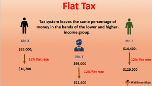

The currency mechanism plays a fundamental role in the financial world, serving as the system through which countries exchange goods and services across borders. At its core, it involves various elements, including exchange rates, monetary policies, and the intricate operations of financial institutions like central banks. These components collectively ensure that global trade and investment can function efficiently, impacting everything from the price of imported goods to the returns on foreign investments. Key factors influencing currency mechanisms include interest rates, inflation rates, and geopolitical events. The modulation in exchange rates can have profound effects on an economy, influencing inflation, employment, and overall economic growth.

The 'flat dollar' is a nuanced financial concept referring to a stable dollar system where exchange rates remain relatively constant over a period. This model aims to minimize currency risk for businesses engaged in international trade by providing predictability in the value of cross-border transactions. Historically, the concept emerged as economies sought ways to mitigate the adverse impacts of volatile currency swings on international business and trade. Compared to floating exchange models where currencies fluctuate based on market forces, the flat dollar offers economic stability and predictability, albeit with its own set of advantages and disadvantages.



Algorithmic trading, a significant innovation in financial markets, uses computer algorithms to execute trades at the speed and precision surpassing human capability. It has transformed financial markets by enhancing liquidity, improving market efficiency, and reducing transaction costs. The evolution of algorithmic trading has been marked by the development of various models, each designed to exploit specific market inefficiencies. Technology and innovation have played a critical role in this evolution, enabling traders and institutions to develop sophisticated strategies that incorporate everything from market data analysis to predictive modeling. Despite its benefits, algorithmic trading also introduces risks, such as market volatility and the potential for systemic errors.

This article aims to explore the intertwined nature of currency mechanisms, the flat dollar concept, and algorithmic trading through practical examples. By examining these intersections, the article seeks to provide financial professionals with insights that can enhance decision-making. Understanding how these concepts complement each other can lead to more informed and strategic financial decisions, ultimately benefiting investors and analysts alike. Through the integration of these paradigms, the financial community can better navigate the complexities of global markets and innovate within these frameworks.

## Table of Contents

## Understanding the Currency Mechanism

A currency mechanism refers to the systematic framework governing the valuation, exchange, and stabilization of a country's currency. This framework includes policies and infrastructures that dictate how currencies are priced and exchanged on international markets, influencing global trade and the financial health of nations. 

Currency mechanisms significantly impact global trade and finance by facilitating or hindering the flow of goods, services, and capital across borders. When a currency is stable and its exchange rates are predictable, it encourages international trade and investment. Conversely, wild fluctuations can lead to uncertainty, stifle cross-border transactions, and destabilize economies. For instance, the exchange rate determines how much exporters receive in their local currency for goods sold abroad and how much importers pay for foreign goods, directly impacting trade balances and economic health.

Several key factors influence currency exchange rates, including interest rates, inflation, political stability, economic performance, and market psychology. Interest rate differentials between countries can attract foreign capital seeking higher returns, thus affecting the demand for a currency. Inflation rates also play a crucial role; generally, countries with lower inflation rates see an appreciation in their currency's value against the currencies of higher-inflation countries. Political stability and sound economic performance typically attract foreign investment, supporting currency strength. Additionally, perceptions and speculative activities by traders can lead to short-term fluctuations, driven by expectations about future movements.

Major institutions play a pivotal role in regulating and stabilizing currency mechanisms. Central banks, such as the Federal Reserve in the United States and the European Central Bank, are crucial in managing currency supply, setting interest rates, and intervening in foreign exchange markets to stabilize or adjust their currency's value. International institutions like the International Monetary Fund (IMF) provide financial support and policy advice to countries dealing with balance of payments problems, thereby influencing currency stability.

Currency fluctuations can have profound impacts on the economy. They directly affect inflation, purchasing power, and competitiveness. For example, a depreciating currency makes imports more expensive, contributing to inflationary pressures, while potentially making exports cheaper and more competitive abroad. However, prolonged currency depreciation can erode investor and consumer confidence, leading to broader economic instability. On the other hand, an appreciating currency might reduce inflation and increase purchasing power but could hurt export competitiveness, affecting the trade balance.

Understanding and leveraging these mechanisms are essential for financial professionals and policymakers to ensure economic stability and optimize financial strategies globally.

## Decoding the Flat Dollar Concept

The flat dollar concept represents a theoretical perspective in financial systems where a currency maintains a constant exchange rate relative to a specific reference benchmark, typically a basket of goods or currencies. This stability is intended to simplify international transactions, reduce inflation variability, and enhance economic predictability.

Historically, the flat dollar emerged as a response to the volatile nature of floating exchange rates which many economies encountered post-Bretton Woods system. Unlike fiat currencies, which derive their value from government regulation or law and are prone to fluctuations influenced by market speculation and economic policies, the flat dollar proposes a stable alternative aiming to mitigate these risks.

A key distinction between the flat dollar and other currency models, such as fiat or commodity-backed currencies, lies in its fixed nature against a reference which acts as a stabilizer. Where fiat currencies can appreciate or depreciate due to policy shifts, market sentiment, or economic crises, the flat dollar remains constant barring adjustments in the reference basket itself. Commodity-backed currencies, like the gold standard, tie currency value to tangible assets which can influence supply constraints and value inflation, differing from the systematic predictability of a flat dollar.

The economic role of the flat dollar pivots around its potential for promoting economic stability. By maintaining a consistent value, it reduces the uncertainty in trade and investment decisions, household savings, and government fiscal planning. This stable financial environment encourages long-term investments and economic planning without the concern of unforeseen currency depreciation or appreciation.

Several regions have experimented with or indirectly influenced by the concepts akin to the flat dollar. For instance, countries in currency unions, like the Eurozone, aim to achieve similar stability by aligning multiple national currencies to a common one. Simultaneously, some nations employ a pegged exchange rate system where their currency is directly linked to another, echoing the flat dollar's idea by setting predetermined exchange values. However, outright adoption of a flat dollar has seen limited empirical implementation, often due to the challenges inherent in managing and administrating such a system without relinquishing national monetary policy controls.

In summary, while the flat dollar concept may not be widely implemented, it offers a unique approach to achieving currency stability, showcasing how currencies can be engineered to enhance economic resilience and planning.

 to Algorithmic Trading

Algorithmic trading, also known as algo trading, is the use of computer algorithms to execute trading orders automatically based on predefined criteria and strategies. This approach has significantly transformed financial markets by enhancing efficiency and precision in trade execution. The evolution of [algorithmic trading](/wiki/algorithmic-trading) began in the late 20th century with the advent of electronic trading platforms. Over time, advancements in technology and data analytics have propelled its growth, leading to widespread adoption across various asset classes, including equities, commodities, and currencies.

A primary advantage of algorithmic trading is the ability to execute trades at optimal speeds that surpass human capability. With algorithms, trades can be executed based on quantitative models utilizing historical data and statistical analysis without emotional bias, reducing human intervention and thereby enhancing market [liquidity](/wiki/liquidity-risk-premium) and price efficiency. These strategies also enable traders to capitalize on short-term market opportunities by reacting instantaneously to price changes.

There are several types of algorithmic trading models employed by traders, each serving different purposes. Trend-following algorithms, for example, capitalize on technical analysis by identifying and following market trends. Mean-reversion strategies operate on the assumption that asset prices will revert to their historical mean over time, thus profiting from fluctuations around this average. Another common model is [arbitrage](/wiki/arbitrage), which exploits price discrepancies across different markets to generate profits. These algorithms are designed to identify and execute trades that benefit from temporary market inefficiencies.

Technological innovation is integral to the advancement of algorithmic trading. High-frequency trading ([HFT](/wiki/high-frequency-trading-strategies)), a subset of algorithmic trading, relies heavily on cutting-edge technology to execute a large number of orders at extremely high speeds. Developments in [artificial intelligence](/wiki/ai-artificial-intelligence) (AI) and [machine learning](/wiki/machine-learning) (ML) have further expanded the capabilities of algorithmic trading systems. These technologies enable the creation of adaptive algorithms that continuously learn from new data and adjust to evolving market conditions.

However, algorithmic trading also poses potential risks and challenges. One significant risk is the increase in market [volatility](/wiki/volatility-trading-strategies) due to the sheer [volume](/wiki/volume-trading-strategy) and speed of trades executed by high-frequency traders. This can lead to incidents like the "Flash Crash" of May 2010, where the Dow Jones Industrial Average experienced a rapid and severe drop in value within minutes before quickly recovering. Additionally, the reliance on complex algorithms and vast datasets raises concerns about system errors, data integrity, and cybersecurity threats. There is also a risk of regulatory challenges as market authorities strive to keep up with the pace of innovation while ensuring fair and orderly markets.

In summary, algorithmic trading represents a pivotal shift in the financial markets, leveraging technology to optimize trade execution and strategy implementation. While it brings considerable benefits in terms of speed and efficiency, it also necessitates caution to mitigate associated risks and challenges.

## Practical Examples of Algorithmic Trading in Currency Markets

Algorithmic trading in currency markets has gained significant traction due to its ability to process vast amounts of data rapidly and execute trades at optimal timings. This section explores practical examples of algorithmic trading strategies that have been effective in such markets. Additionally, it discusses how these strategies can incorporate flat dollar scenarios, adapt to sudden market changes, and react to currency fluctuations.

### Case Studies and Examples of Successful Algorithmic Trading

One notable example of a successful algorithmic trading strategy in currency markets is the use of [momentum](/wiki/momentum)-based algorithms. These strategies exploit trends by entering trades in the direction of price movement. For instance, a momentum algorithm might use a simple moving average (SMA) crossover system where a buy signal is generated when a short-term moving average crosses above a long-term moving average, and a sell signal is generated when it crosses below.

```python
# Example Python code for a momentum-based algorithm
def moving_average(series, n):
    return sum(series[-n:]) / n

def trading_signals(prices, short_window, long_window):
    short_ma = moving_average(prices, short_window)
    long_ma = moving_average(prices, long_window)
    if short_ma > long_ma:
        return "Buy"
    elif short_ma < long_ma:
        return "Sell"
    else:
        return "Hold"

# Sample price data
prices = [1.25, 1.26, 1.30, 1.28, 1.27, 1.29, 1.31]
print(trading_signals(prices, 3, 5))
```

### Integration of Flat Dollar Scenarios in Algorithmic Trading

The concept of the flat dollar can be integrated into algorithmic trading by developing strategies that maintain a currency's value relative to a stable benchmark, such as a composite index of major global currencies. This stabilization approach can mitigate exposure to currency devaluation, aligning with traders' risk management objectives.

### Industry Expert Insights

Hypothetically, let's consider a conversation with an algorithmic trading strategist who highlights the incorporation of currency mechanisms into algo trading frameworks. The strategist emphasizes the importance of adapting algorithms to incorporate economic indicators, like interest rates and inflation data, which impact currency values.

### Adaptability of Algorithms to Market Changes

Algorithms must be flexible enough to adapt to sudden market changes, such as currency devaluation. Modern strategies use machine learning techniques to dynamically adjust their parameters. For example, a [reinforcement learning](/wiki/reinforcement-learning) model might be used to continuously update the trading parameters based on real-time feedback from the market.

```python
# Pseudo-code for a reinforcement learning algorithm adapting to market changes
class TradingAgent:
    def __init__(self):
        self.q_table = {}

    def choose_action(self, state):
        # Select action based on current state
        return max(self.q_table[state], key=self.q_table[state].get, default='Hold')

    def update_q_table(self, state, action, reward, new_state):
        # Update Q-values based on the received reward and new state
        old_value = self.q_table[state][action]
        future_rewards = max(self.q_table[new_state].values())
        self.q_table[state][action] = old_value + learning_rate * (reward + discount_factor * future_rewards - old_value)

# Initialize the trading agent
agent = TradingAgent()
```

### Example of a Trading Algorithm Reacting to Currency Fluctuations

A volatility-based trading algorithm could be designed to react to fluctuations in the currency market by adjusting the position sizes according to the ATR (Average True Range) indicator, which measures market volatility.

```python
# Example Python code for a volatility-based algorithm
def average_true_range(high, low, close, n=14):
    tr = max(high - low, abs(high - close[-1]), abs(low - close[-1]))
    atr = (sum(true_ranges[-n:]) + tr) / n
    return atr

def adjust_position_size(capital, atr):
    risk_per_trade = 0.02 * capital
    return risk_per_trade / atr

# Example market data
high, low, close = [1.32, 1.30, 1.31], [1.28, 1.29, 1.30], [1.29, 1.31, 1.30]
print(adjust_position_size(10000, average_true_range(high, low, close)))
```

In conclusion, algorithmic trading in currency markets offers numerous strategic opportunities by leveraging advanced data analytics and these algorithms' ability to react swiftly to market conditions. With ongoing technological developments, including machine learning and reinforcement learning, these strategies continue to evolve, providing robust tools for navigating complex currency environments effectively.

## Convergence of Currency Mechanism, Flat Dollar, and Algo Trading

The convergence of currency mechanisms, the flat dollar concept, and algorithmic trading represents a multidisciplinary approach in financial systems, blending monetary policy, market stability, and technological innovation. 

Currency mechanisms serve as the backbone of global finance, dictating exchange rates and influencing global trade. As financial markets become increasingly sophisticated, professionals in finance leverage these mechanisms alongside the flat dollar concept to navigate monetary stability. The flat dollar concept, which advocates for a stable currency unaffected by inflationary pressures, allows economies to plan long-term without the uncertainties of fluctuating currency values.

Algorithmic trading, with its genesis in exploiting market inefficiencies through technology, has become an essential tool in handling the complexities of currency markets. The integration of stable currency mechanisms like the flat dollar into algorithmic trading models ensures that trading strategies are both robust and adaptable to various market conditions. For instance, by programming algorithms to recognize a flat dollar environment, traders can execute strategies that optimize for stability rather than volatility.

Financial professionals are increasingly leveraging the intersection of these areas through advanced trading platforms, which incorporate data analytics, predictive modeling, and real-time processing. Such integration allows them to make informed decisions quickly, capitalizing on even the smallest currency fluctuations. One example is the use of conditional logic in trading algorithms, where a set exchange rate triggers buy/sell actions, maintaining adherence to currency stability principles.

Looking to the future, Artificial Intelligence (AI) and Machine Learning (ML) are poised to revolutionize this convergence. AI-driven algorithms can process vast datasets, identifying patterns and potential pitfalls that may not be evident to human analysts. Machine learning models can dynamically adjust trading strategies based on real-time data, learning from past successes and failures to optimize outcomes continuously.

The potential developments at this junction are vast. With increased computational power, algorithms could potentially predict macroeconomic changes, adjusting strategies in anticipation rather than reaction. Moreover, as more countries explore flat dollar policies, incorporating these stable currencies into global trading systems could result in less market volatility and more predictable economic growth.

In conclusion, understanding the convergence of currency mechanisms, the flat dollar, and algorithmic trading is crucial for navigating future financial landscapes. This amalgamation not only supports more intelligent trading strategies but also prompts a rethinking of how economies can be stabilized in an ever-fluctuating global market. Financial experts are encouraged to explore innovative frameworks further, assuring that these concepts evolve synergistically to foster a more resilient and efficient financial system.

## Conclusion

In this article, we explored the intricate connections between currency mechanisms, the flat dollar concept, and algorithmic trading. These core concepts serve as vital components of modern financial systems. The currency mechanism plays a pivotal role in global trade, influencing exchange rates and impacting the economy through various factors such as interest rates, economic indicators, and geopolitical events. Meanwhile, the flat dollar concept provides a unique perspective on economic stability, offering potential benefits compared to other currency models.

Algorithmic trading has revolutionized financial markets by introducing automation and high-speed data processing capabilities. Its integration into currency markets allows traders to react swiftly to market changes, like currency devaluation, optimizing their strategies for maximum profitability. As technology continues to evolve, the use of Artificial Intelligence and Machine Learning within algorithmic trading frameworks will likely enhance decision-making processes, providing more robust and adaptive trading models.

The convergence of these elements presents both opportunities and challenges for investors and financial analysts. Understanding how currency mechanisms, the flat dollar concept, and algorithmic trading intersect can help financial professionals make more informed decisions. It is essential to remain abreast of these developments for continued success in the financial sector.

For those seeking more comprehensive insights, consider exploring the vast resources available on these topics. Engaging in further research and discussions can expand your knowledge and understanding, encouraging innovation in this dynamic field. Financial experts are urged to leverage these concepts effectively, driving advancements and achieving more sophisticated trading and investment strategies.

## References & Further Reading

[1]: ["Advances in Financial Machine Learning"](https://www.amazon.com/Advances-Financial-Machine-Learning-Marcos/dp/1119482089) by Marcos Lopez de Prado

[2]: ["Machine Learning for Algorithmic Trading"](https://github.com/stefan-jansen/machine-learning-for-trading) by Stefan Jansen

[3]: ["Quantitative Trading: How to Build Your Own Algorithmic Trading Business"](https://www.amazon.com/Quantitative-Trading-Build-Algorithmic-Business/dp/1119800064) by Ernest P. Chan

[4]: ["Evidence-Based Technical Analysis: Applying the Scientific Method and Statistical Inference to Trading Signals"](https://www.amazon.com/Evidence-Based-Technical-Analysis-Scientific-Statistical/dp/0470008741) by David Aronson

[5]: Neely, C. J., Weller, P. A., & Ulrich, J. M. (2009). ["The Adaptive Markets Hypothesis: Evidence from the Foreign Exchange Market"](https://www.cambridge.org/core/journals/journal-of-financial-and-quantitative-analysis/article/abs/adaptive-markets-hypothesis-evidence-from-the-foreign-exchange-market/9D336CDCA83233819EB5CDD0F4BC0DAA). Federal Reserve System International Finance Discussion Papers.