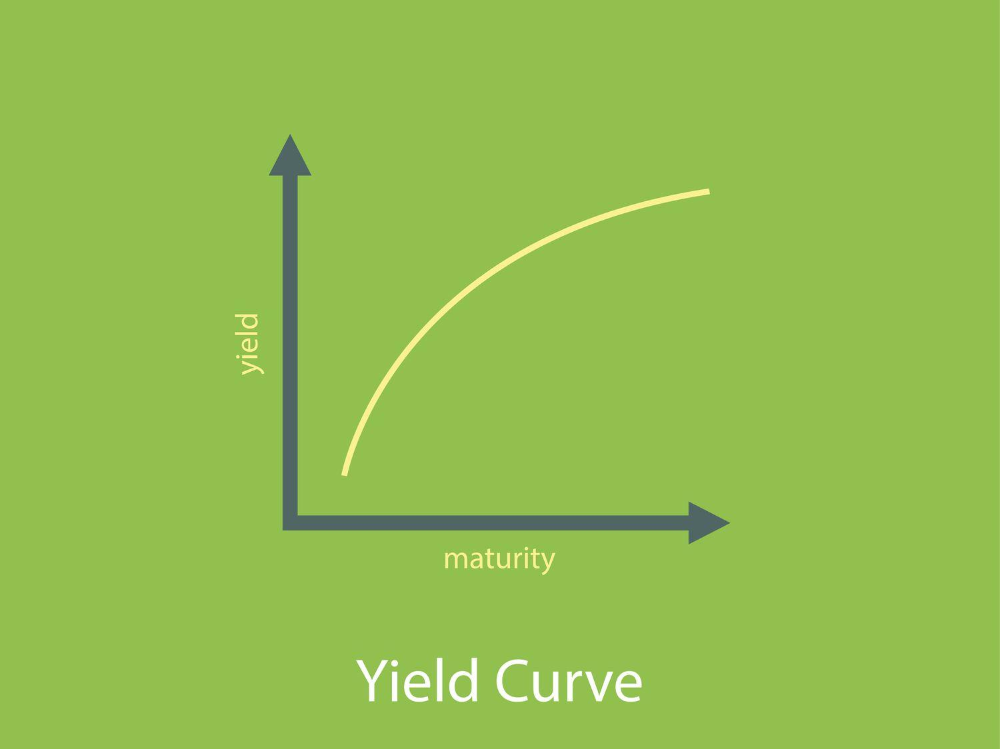

## Table of Contents

## What is a yield curve?

A yield curve is a graph that shows the interest rates on bonds of different lengths of time. It helps people see how much they can earn from bonds that last for different periods, like 2 years, 5 years, or 10 years. Usually, the longer the time until the bond matures, the higher the interest rate, making the yield curve slope upwards.

Sometimes, the yield curve can be flat or even go downwards. A flat yield curve means that short-term and long-term bonds have similar interest rates. A downward, or inverted, yield curve happens when long-term bonds have lower interest rates than short-term bonds. This can be a sign that people think the economy might slow down or go into a recession soon.

## What does a flat yield curve indicate?

A flat yield curve shows that the interest rates for short-term and long-term bonds are about the same. Normally, you would expect to get more money for waiting longer, so when this doesn't happen, it can mean that people are not sure about what will happen with the economy in the future.

It can be a sign that the economy might be slowing down. When people think the economy will not grow much, they might not want to take big risks with their money. So, they might choose to buy long-term bonds even if they don't offer much more interest than short-term ones. This can make the yield curve flat.

## How is a flat yield curve different from a normal or inverted yield curve?

A flat yield curve shows that the interest rates for short-term and long-term bonds are almost the same. Normally, people expect to get more money for waiting longer with their money, so a normal yield curve slopes upwards. But when the yield curve is flat, it means people are not sure about the future of the economy. They might think the economy will not grow much, so they are okay with getting the same [interest rate](/wiki/interest-rate-trading-strategies) for both short and long periods.

An inverted yield curve is different because it slopes downwards. This happens when the interest rates for long-term bonds are lower than for short-term bonds. It's a big sign that people think the economy might get worse soon, maybe even go into a recession. They want to lock in the higher short-term rates because they think rates will drop in the future.

So, a normal yield curve goes up, showing that longer waits get higher rewards. A flat yield curve stays level, showing uncertainty about the economy. And an inverted yield curve goes down, warning that tough economic times might be coming.

## What are the economic conditions that typically lead to a flat yield curve?

A flat yield curve often happens when people are not sure about where the economy is going. They think the economy might not grow very fast in the future. When this happens, people might not want to take big risks with their money. Instead, they might choose to put their money into long-term bonds even if these bonds don't offer much more interest than short-term ones. This makes the interest rates for short and long-term bonds about the same, causing the yield curve to flatten.

Another reason for a flat yield curve can be when the central bank, like the Federal Reserve, changes interest rates. If the central bank raises short-term interest rates to slow down the economy, but people still think long-term rates won't go up much, the difference between short and long-term rates gets smaller. This can also make the yield curve flat. So, a flat yield curve can show that people are unsure about the economy and that the central bank is trying to control economic growth.

## How does a flat yield curve affect banks and financial institutions?

A flat yield curve can make things hard for banks and financial institutions. Banks usually make money by borrowing money at a low interest rate for a short time and then lending it out at a higher interest rate for a longer time. But when the yield curve is flat, the difference between the short-term and long-term interest rates is small. This means banks don't make as much money from the difference in rates, which can hurt their profits.

Also, when the yield curve is flat, it can make people think the economy might not do well soon. If people are worried about the economy, they might not want to borrow money from banks. This means fewer loans, which is another way banks make money. So, a flat yield curve can make it harder for banks to make money and grow, which can affect the whole financial system.

## What are the implications of a flat yield curve for bond investors?

For bond investors, a flat yield curve means they won't get much more money for buying bonds that last a long time compared to short ones. Normally, they would expect to get more interest for waiting longer, but when the yield curve is flat, that's not the case. This can make them think twice about buying long-term bonds if they're not getting a good reward for waiting.

But a flat yield curve can also be a sign that the economy might not do well soon. If bond investors think the economy will slow down, they might want to buy long-term bonds anyway. Even if the interest rate isn't much higher, long-term bonds can be safer in tough economic times. So, a flat yield curve can make bond investors more cautious and change how they choose to invest their money.

## How might a flat yield curve influence stock market performance?

A flat yield curve can make people in the stock market feel worried. When the yield curve is flat, it often means that people are not sure about the economy's future. They might think the economy won't grow much or might even get worse. This uncertainty can make people less likely to buy stocks because they want to wait and see what happens. If fewer people are buying stocks, the stock market might not do as well, and stock prices could go down.

On the other hand, some people might see a flat yield curve as a chance to buy stocks at lower prices. They might think that even if the economy slows down a bit, it won't be too bad, and the stocks they buy now will go up in value later. So, while a flat yield curve can make the stock market go down in the short term, it might also lead to some people buying stocks, hoping for better times ahead.

## What strategies can investors use to manage risk during periods of a flat yield curve?

When the yield curve is flat, investors can manage risk by being careful and spreading their money around. They might want to put some money into safe investments like government bonds, which can protect their money if the economy gets worse. They could also look at different types of investments, like stocks from different countries or industries, so if one area does badly, the others might do better. This way, they don't put all their eggs in one basket.

Another strategy is to keep some money ready to use. If the stock market goes down because of the flat yield curve, having cash on hand can let investors buy stocks at lower prices. They can wait for the right time to invest more, hoping to make money when the market goes back up. By being patient and ready to act, investors can turn a tough situation into an opportunity.

## How can investors position their portfolios in anticipation of a flat yield curve?

When investors think the yield curve might flatten, they can start by making their investments safer. They might want to put more money into things like government bonds, which are less risky. Government bonds can help protect their money if the economy slows down. They can also spread their money across different types of investments, like stocks from different countries or industries. This way, if one part of their portfolio does badly, other parts might do better, helping to balance out the risk.

Another way to get ready for a flat yield curve is to keep some money in cash or cash-like investments. If the stock market goes down because of the flat yield curve, having cash ready can let investors buy stocks at lower prices. This strategy means they need to be patient and wait for the right time to invest more. By doing this, they can turn a tough situation into a chance to make money when the market gets better.

## What historical examples illustrate the impact of a flat yield curve on the economy?

One good example of a flat yield curve affecting the economy happened in the United States in the late 1990s. Back then, the yield curve started to flatten as the Federal Reserve raised short-term interest rates to slow down the fast-growing economy. People were not sure if the economy would keep growing or start to slow down. This uncertainty made investors more careful, and it affected how banks made money. Banks found it harder to make a profit because the difference between short-term and long-term interest rates got smaller. This situation showed how a flat yield curve can make the economy less sure and affect banks and investors.

Another time was in the mid-2000s, before the big financial crisis in 2008. The yield curve began to flatten as the Federal Reserve again raised short-term rates to control inflation. Many people thought the economy might slow down, and this made them more cautious about investing. The flat yield curve made banks less willing to lend money, which can slow down the economy even more. It was a warning sign that tough times might be coming, and it played a part in the events leading up to the 2008 financial crisis. This example shows how a flat yield curve can be a sign of economic trouble ahead.

## How do central bank policies respond to a flat yield curve, and what are the potential outcomes?

When central banks see a flat yield curve, they might change their policies to help the economy. They could lower short-term interest rates to make the difference between short and long-term rates bigger again. This can help banks make more money from lending and encourage people to borrow and spend. Central banks might also use other tools, like buying bonds, to keep long-term interest rates from going too low. By doing these things, they hope to make the economy stronger and get the yield curve to slope up again.

The outcomes of these central bank actions can be different. If the central bank's policies work well, the economy might start to grow again, and people might feel more sure about the future. This could make the yield curve go back to normal, with long-term rates higher than short-term ones. But if the central bank doesn't do enough, or if other big problems are affecting the economy, the flat yield curve might stay the same or even get worse. This could lead to a slowdown or a recession, making it harder for everyone, including banks and investors, to make money.

## What advanced metrics or indicators should expert investors monitor when a flat yield curve is present?

When the yield curve is flat, expert investors should keep an eye on some advanced metrics and indicators. One important thing to watch is the spread between different types of bonds, like the difference between corporate bonds and government bonds. If this spread gets bigger, it might mean that investors are worried about companies not being able to pay back their debts. Another thing to look at is the economic surprise index, which shows if the economy is doing better or worse than people expected. If this index is low, it could mean that the economy is slowing down, which is something to be careful about.

Another useful indicator is the money supply growth rate. If the money supply is growing slowly, it might mean that banks are not lending as much, which can hurt the economy. Expert investors should also pay attention to the yield curve's slope over time. If the yield curve stays flat for a long time or starts to invert, it could be a stronger warning sign that a recession is coming. By watching these metrics and indicators closely, investors can get a better idea of what might happen next and make smarter choices about where to put their money.

## What is the impact of interest rates on investments?

Interest rates serve as a pivotal [factor](/wiki/factor-investing) in shaping the investment landscape, influencing both fixed-income securities and equities. The centrality of interest rates arises from their dual impact on bond prices and the cost of borrowing, which in turn, affects overall market sentiment.

### Impact on Bond Prices

In the bond market, there is an inverse relationship between interest rates and bond prices. When interest rates rise, the prices of existing bonds typically fall. This inverse relationship can be understood through the lens of yield calculations. The yield of a bond is essentially the return on investment it offers, and it increases when the bond's price decreases in a rising interest rate environment:

$$
\text{Yield} = \frac{\text{Coupon Payment}}{\text{Current Bond Price}}
$$

As yields become more attractive on new bonds, older ones with lower interest rates become less desirable, leading to a decrease in their prices.

### Influence on Equity Markets

Interest rates also exert significant influence over equity markets. Lower interest rates reduce the cost of borrowing for companies, leading to increased capital investment and expansion, potentially boosting stock prices. Conversely, rising interest rates can increase borrowing costs, compressing profit margins and possibly leading to lower stock prices. Moreover, higher rates can offer more attractive returns through less risky debt instruments, which might divert investment away from equities.

### Sector-Specific Responses

Different sectors react uniquely to changes in interest rates. For instance, financial institutions like banks may benefit from rising rates due to improved interest margins. Conversely, industries reliant on heavy capital expenditure, such as real estate and utilities, may face increased costs, negatively impacting their stock performance.

### Flat Yield Curves Context

In a flat yield curve scenario, the difference between short-term and long-term interest rates is minimal. This condition often signals economic uncertainty or a transition phase. In such contexts, both borrowers and investors might perceive increased risk in making long-term commitments. For instance, financial institutions might experience squeezed profit margins due to reduced spreads between borrowing and lending rates.

### Balancing Risk and Opportunity

Understanding the dynamics of interest rate changes is crucial for investors to balance risk and opportunity effectively. By recognizing sector-specific responses and the macroeconomic implications of a flat yield curve, investors can make informed decisions to optimize their portfolios.

### Historical Case Studies

Historically, there are several instances where changes in interest rate policies have significantly impacted markets. For example, the Federal Reserve’s interest rate hikes in the late 1970s and early 1980s, aimed at curbing inflation, led to increased bond yields and a challenging environment for equity investors.

Through careful analysis of these scenarios, investors can draw valuable lessons, aiding them in navigating both current and future market conditions. Understanding past patterns equips investors with the foresight needed to anticipate potential impacts and adjust their strategies accordingly.

 to Algorithmic Trading

Algorithmic trading, often referred to as algo trading, involves using computer programs to perform trading activities based on defined criteria. These criteria can range from simple instructions like moving average crossovers to complex strategies involving predictive analytics and [machine learning](/wiki/machine-learning). With advancements in technology, particularly in computing power and data analytics, [algorithmic trading](/wiki/algorithmic-trading) has become a dominant force in contemporary financial markets.

The main advantages of algorithmic trading include speed, precision, and the ability to manage large volumes of data efficiently. Algorithms can analyze market conditions in real-time, execute trades faster than any human could, and minimize manual intervention, which reduces errors arising from human judgment or emotional decision-making. For example, high-frequency trading ([HFT](/wiki/high-frequency-trading-strategies)), a subset of algo trading, thrives on executing millions of trades per day based on minute price movements, often in milliseconds.

Several types of algorithms are commonly utilized within the trading domain. These include:

1. **Trend-Following Algorithms**: These algorithms exploit market trends and follow price movements, often based on technical indicators like moving averages.

2. **Arbitrage Algorithms**: Designed to capitalize on price discrepancies between different markets or instruments, these algorithms seek risk-free profit opportunities.

3. **Mean Reversion**: The principle behind these algorithms is that prices and returns eventually return to their historical mean, so they buy when an asset's price is low and sell when it is high.

4. **Sentiment Analysis Algorithms**: These use natural language processing (NLP) and machine learning to gauge market sentiment from news articles or social media, adjusting trading strategies accordingly.

5. **Machine Learning Algorithms**: More sophisticated, these algorithms learn from and adapt to market data, predicting future movements based on historical patterns and data inputs.

Investors are gravitating towards algorithmic trading due to several compelling reasons. It allows for the rapid execution of complex strategies that would be impossible for a human to perform manually, such as managing a portfolio of thousands of assets or implementing intricate [arbitrage](/wiki/arbitrage) opportunities between global markets. Furthermore, algorithmic strategies can be tested against historical data to validate their effectiveness, a process known as [backtesting](/wiki/backtesting).

Here's a simple Python example of a moving average crossover strategy:

```python
import numpy as np
import pandas as pd

# Fetch historical price data
data = pd.DataFrame({
    'Price': [100, 102, 104, 103, 105, 108, 109, 110, 112, 108, 107, 105, 108, 110]
})

# Calculate moving averages
short_window = 3
long_window = 5
data['Short_MA'] = data['Price'].rolling(window=short_window, min_periods=1).mean()
data['Long_MA'] = data['Price'].rolling(window=long_window, min_periods=1).mean()

# Generate signals
data['Signal'] = np.where(data['Short_MA'] > data['Long_MA'], 1, 0)

print(data)
```

In this example, a buy signal is generated when the short-term moving average is greater than the long-term moving average, suggesting an upward trend. Such automated strategies can be scaled and adapted for diverse market conditions, offering flexibility and precision that enhance investment decision-making.

Overall, as technology continues to evolve, the role of algorithmic trading in financial markets is set to expand, offering investors unprecedented tools and approaches to maximize their return on investment. Understanding these strategies provides a valuable perspective on why this method is increasingly favored in finance.

## References & Further Reading

[1]: ["The Econometrics of the Yield Curve in the Short- and Long-Run"](https://direct.mit.edu/rest/article/90/1/182/58639/The-Yield-Curve-as-a-Predictor-of-Growth-Long-Run) by Jörg Breitung, in Springer Series in Statistics.

[2]: Ang, A., & Piazzesi, M. (2003). ["A No-Arbitrage Vector Autoregression of Term Structure Dynamics with Macroeconomic and Latent Variables."](https://www.nber.org/papers/w8363) Journal of Monetary Economics, 50(4), 745-787.

[3]: ["Advances in Financial Machine Learning"](https://www.amazon.com/Advances-Financial-Machine-Learning-Marcos/dp/1119482089) by Marcos Lopez de Prado.

[4]: ["Evidence-Based Technical Analysis: Applying the Scientific Method and Statistical Inference to Trading Signals"](https://www.amazon.com/Evidence-Based-Technical-Analysis-Scientific-Statistical/dp/0470008741) by David Aronson.

[5]: Gurkaynak, R. S., Sack, B., & Wright, J. H. (2007). ["The U.S. Treasury Yield Curve: 1961 to the Present."](https://www.federalreserve.gov/pubs/feds/2006/200628/200628pap.pdf) Journal of Monetary Economics, 54(8), 2291-2304.

[6]: ["Machine Learning for Algorithmic Trading"](https://github.com/stefan-jansen/machine-learning-for-trading) by Stefan Jansen.

[7]: ["Quantitative Trading: How to Build Your Own Algorithmic Trading Business"](https://books.google.com/books/about/Quantitative_Trading.html?id=j70yEAAAQBAJ) by Ernest P. Chan.

[8]: Campbell, J. Y., & Viceira, L. M. (2005). ["The Term Structure of the Risk-Return Trade-Off."](https://scholar.harvard.edu/campbell/publications/term-structure-risk-return-tradeoff) Financial Analysts Journal, 61(1), 34-44.