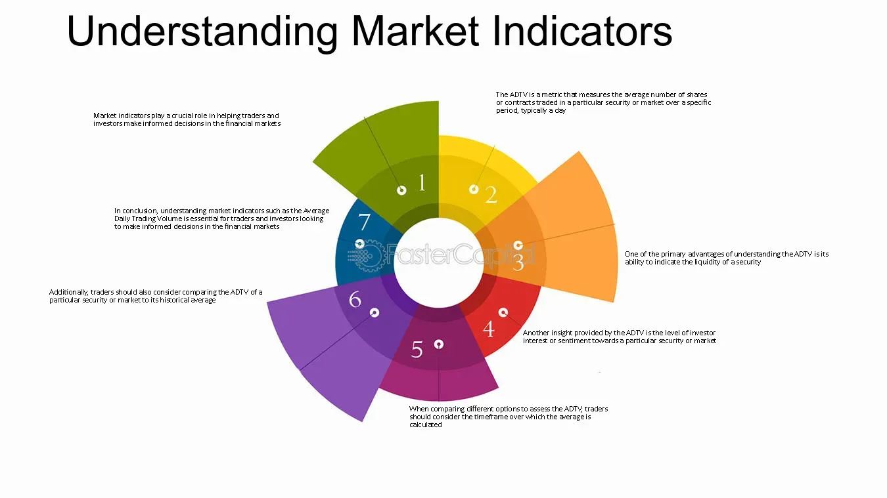

## Table of Contents

## What are market indicators and why are they important?

Market indicators are tools that help people understand how well the economy or specific markets are doing. They can be things like stock prices, interest rates, or even how many people have jobs. These indicators give us clues about whether the economy is growing or shrinking, and they help investors and businesses make decisions about where to put their money or how to plan for the future.

These indicators are important because they help us see trends and patterns in the economy. For example, if stock prices are going up, it might mean that people are feeling confident about the future and are willing to invest more. On the other hand, if unemployment is high, it could signal that the economy is struggling, and people might be more cautious with their money. By keeping an eye on these indicators, people can make smarter choices and be better prepared for what might happen next.

## Can you name some commonly used major market indicators?

Some commonly used major market indicators include the stock market indexes like the Dow Jones Industrial Average, the S&P 500, and the Nasdaq Composite. These indexes show how well big groups of stocks are doing. Another important indicator is the unemployment rate, which tells us how many people are out of work. The Gross Domestic Product (GDP) is also a key indicator that measures the total value of all goods and services produced in a country.

Interest rates are another major indicator that can affect the economy a lot. When interest rates go up, it can make borrowing money more expensive, which might slow down spending and investment. The Consumer Price Index (CPI) is used to track inflation, showing how prices for things we buy every day are changing. These indicators together give us a good picture of the economy's health and help us understand what might happen next.

## What are the basic flaws in using market indicators for investment decisions?

Market indicators can be helpful, but they aren't perfect. One big problem is that they often look at the past, not the future. For example, if you see that the stock market has been going up, that doesn't mean it will keep going up. By the time you notice a trend, it might already be too late to make a good investment decision based on it. Also, market indicators can be affected by things that are hard to predict, like sudden news events or changes in government policies. This means they might not always give you a clear picture of what's going to happen next.

Another issue is that market indicators can sometimes give mixed signals. For instance, the stock market might be doing well, but at the same time, unemployment could be high. It can be tough to figure out which indicator to trust more. Plus, people's feelings and guesses about the market can make indicators move in ways that don't make sense based on the actual data. So, while market indicators are useful tools, they shouldn't be the only thing you rely on when making investment choices. It's important to look at the bigger picture and maybe even talk to a financial advisor to get a more complete understanding.

## How can the lag in market indicators affect their reliability?

Market indicators often show what has already happened, not what will happen next. This lag means that by the time you see a trend, it might be too late to use it to make a smart investment choice. For example, if the stock market has been going up for a while, you might think it's a good time to invest. But the market could be about to change direction, and you wouldn't know it from the indicators.

This delay can make market indicators less reliable because they don't give you a real-time view of what's happening. If you're making decisions based on old information, you might miss out on new opportunities or make choices that don't work out well. It's like trying to drive a car by only looking in the rearview mirror; you can see where you've been, but not where you're going.

## What is the impact of data revisions on the accuracy of market indicators?

Data revisions can mess with how accurate market indicators are. Sometimes, the first numbers we get about things like unemployment or GDP are just guesses. Later on, when more information comes in, these numbers can change. If you made a decision based on the first numbers, you might end up with the wrong idea about what's really going on in the economy.

This can be a big deal for people who use these indicators to make choices about investing or planning. If the numbers keep changing, it's hard to trust them. Imagine you're trying to build a house, but the blueprints keep getting changed. It would be really tough to know if you're building on a solid foundation. That's kind of what it's like when market indicators get revised a lot.

## How do market indicators sometimes fail to predict economic downturns?

Market indicators sometimes don't see economic downturns coming because they focus on what has already happened, not what will happen next. For example, if the stock market looks good, people might think the economy is strong. But sometimes, bad things can be happening behind the scenes that the indicators don't show until it's too late. Like, companies might be struggling even though their stock prices are high.

Another reason is that market indicators can be affected by things that are hard to predict, like sudden news or changes in government rules. These things can make the economy change quickly, and the indicators might not catch up in time. For example, if there's a big surprise like a financial crisis, the indicators might not show it until after it's already started to hurt the economy. So, relying only on market indicators can leave people unprepared for downturns.

## What role does manipulation play in the distortion of market indicators?

Manipulation can mess up market indicators by making them show a false picture of what's really going on. For example, some people might buy a lot of a certain stock to make its price go up, even if the company isn't doing well. This can make the stock market look healthier than it really is. Or, people might share false information to scare others into selling, which can make the market look worse than it is. When this happens, the indicators don't give a true view of the economy, and people might make bad choices because of it.

This kind of trickery can be hard to spot because it's often done in secret. But when it does happen, it can lead to big problems. For example, if a lot of people start believing the false information and act on it, it can cause the market to swing wildly. This makes it even harder to trust market indicators because they can be pushed around by people trying to gain an advantage. So, while market indicators are useful, it's important to know that sometimes they can be influenced by those who want to bend the truth for their own benefit.

## How can over-reliance on a single market indicator lead to flawed investment strategies?

Over-reliance on just one market indicator can lead to bad investment choices because it's like trying to understand a whole story by only reading one page. For example, if you only look at the stock market to decide where to invest, you might think everything is great when stock prices are high. But if you don't also check other things like unemployment rates or interest rates, you might miss signs that the economy is actually struggling. This can make you put your money into investments that seem good at first but turn out to be risky.

Using just one indicator can also make you miss out on important details. Each indicator tells a part of the story, but not the whole thing. For instance, the Consumer Price Index (CPI) might show that prices are going up, which could mean inflation is a problem. But if you don't look at other indicators like GDP growth, you might not realize that the economy is still growing overall. By only focusing on one piece of information, you might make decisions that don't take into account the bigger picture, leading to investments that don't work out as well as you hoped.

## What advanced statistical methods can be used to identify flaws in market indicators?

One advanced statistical method that can help find flaws in market indicators is called regression analysis. This method looks at how different indicators relate to each other. For example, it can show if changes in the stock market are really connected to changes in unemployment rates or if they're just moving by chance. By using regression analysis, you can see if an indicator is giving a true picture of the economy or if it's being influenced by other factors that aren't so obvious.

Another useful method is time series analysis. This technique looks at how market indicators change over time and can help spot patterns that might not be easy to see at first. It can show if an indicator is lagging behind what's really happening in the economy or if it's being affected by short-term events that don't reflect the bigger picture. By understanding these patterns, you can figure out if an indicator is reliable or if it's missing important information that could affect your investment decisions.

## How do global economic factors influence the effectiveness of domestic market indicators?

Global economic factors can really change how useful domestic market indicators are. For example, if the economy in another country is doing badly, it can affect our own economy. If that country is a big trading partner, their problems can lead to fewer sales for our companies, which can make our stock market go down even if our own economy looks good on paper. So, if you're only looking at domestic indicators like the stock market or unemployment rate, you might miss these global effects and make decisions based on incomplete information.

On the other hand, global events like changes in oil prices or international interest rates can also mess with our domestic indicators. If oil prices go up a lot because of problems in oil-producing countries, it can make everything more expensive at home, which can show up as higher inflation in our Consumer Price Index (CPI). But if you're not looking at what's happening around the world, you might think the high inflation is just a domestic problem and not see the bigger picture. So, it's important to consider global factors when using domestic market indicators to get a fuller understanding of what's really going on.

## What are some emerging alternative indicators that address the flaws of traditional ones?

Some new kinds of indicators are being used to fix the problems with the old ones. One example is the use of big data and social media sentiment analysis. This means looking at what people are saying online to see how they feel about the economy. If a lot of people are talking about losing their jobs or not being able to buy things, it might mean the economy is in trouble, even if the traditional indicators like stock prices don't show it yet. This can give a quicker and sometimes more accurate picture of what's happening.

Another new indicator is the use of real-time economic data. Instead of waiting for monthly or quarterly reports, some people now look at things like credit card spending or online sales data that can be updated every day or even every hour. This can help catch changes in the economy faster than traditional indicators, which often come out with a delay. By using these new kinds of data, people can get a better and more up-to-date understanding of the economy, helping them make smarter decisions.

## How can machine learning and AI be utilized to improve the predictive power of market indicators despite their flaws?

Machine learning and AI can make market indicators better at predicting what will happen in the economy by looking at huge amounts of data really quickly. These technologies can find patterns and connections that people might miss. For example, AI can look at things like social media posts, news articles, and even satellite images to see how people are feeling about the economy or to spot changes in how much stuff is being made or sold. By using all this extra information, AI can give a more complete picture of what's going on and help predict things like economic downturns before they show up in traditional indicators.

Another way AI can help is by constantly learning and getting better over time. Traditional market indicators can be slow to change and might not catch up with new trends. But AI can update its predictions as soon as new data comes in, making it more reliable. It can also figure out which indicators are most important for predicting certain things, like stock market crashes or changes in unemployment. By focusing on the right data, AI can help people make better decisions and be more prepared for what might happen next in the economy.

## What is the key to understanding economic metrics?

Economic metrics are essential quantitative indicators that provide a snapshot of an economy's health and performance. These metrics are instrumental for traders and investors in interpreting market conditions and making informed decisions. Among the fundamental economic metrics are Gross Domestic Product (GDP), Gross National Product (GNP), Consumer Price Index (CPI), and Producer Price Index (PPI).

**Gross Domestic Product (GDP)** is one of the most widely recognized economic metrics. It measures the total value of goods and services produced within a country's borders over a specified period, usually annually or quarterly. GDP is an essential indicator of economic activity and often reflects the overall economic strength of a nation. It is calculated using the formula:

$$
\text{GDP} = C + I + G + (X - M)
$$

where $C$ is consumption, $I$ is investment, $G$ is government spending, $X$ is exports, and $M$ is imports.

**Gross National Product (GNP)** extends the concept of GDP by including the value of goods and services produced by a country's residents, regardless of their location. Thus, it accounts for domestic and international activities of a nation's residents. GNP is useful for understanding the economic performance of a country's citizens and businesses globally.

**Consumer Price Index (CPI)** is a measure that examines the weighted average of prices of a basket of consumer goods and services, such as transportation, food, and medical care. It is a crucial indicator of inflation and reflects changes in purchasing power and cost of living. A rising CPI indicates inflationary pressures, while a declining CPI suggests deflation.

**Producer Price Index (PPI)** gauges average changes in selling prices received by domestic producers for their output. Unlike CPI, which measures price changes from the consumer's perspective, PPI provides insights from the perspective of industries and producers in the early production and marketing stages. It is a vital indicator for forecasting inflationary trends.

While these metrics provide valuable insights into economic performance, it is important to recognize their potential limitations. For instance, GDP might not fully capture informal economic activities, income distribution inequalities, or environmental factors. Similarly, CPI may not accurately reflect the cost of living for all socio-economic groups due to differences in consumption patterns.

Considering these factors, traders and investors should adopt a comprehensive approach by integrating multiple metrics and perspectives to form a nuanced understanding of the economy. This holistic view allows for better anticipation of market movements and identification of potential investment opportunities, leading to informed and strategic decision-making in the complex landscape of financial markets.

## References & Further Reading

[1]: Bergstra, J., Bardenet, R., Bengio, Y., & Kégl, B. (2011). ["Algorithms for Hyper-Parameter Optimization."](https://dl.acm.org/doi/10.5555/2986459.2986743) Advances in Neural Information Processing Systems 24.

[2]: ["Advances in Financial Machine Learning"](https://www.amazon.com/Advances-Financial-Machine-Learning-Marcos/dp/1119482089) by Marcos Lopez de Prado

[3]: ["Evidence-Based Technical Analysis: Applying the Scientific Method and Statistical Inference to Trading Signals"](https://www.amazon.com/Evidence-Based-Technical-Analysis-Scientific-Statistical/dp/0470008741) by David Aronson

[4]: ["Machine Learning for Algorithmic Trading"](https://github.com/stefan-jansen/machine-learning-for-trading) by Stefan Jansen

[5]: ["Quantitative Trading: How to Build Your Own Algorithmic Trading Business"](https://www.amazon.com/Quantitative-Trading-Build-Algorithmic-Business/dp/1119800064) by Ernest P. Chan