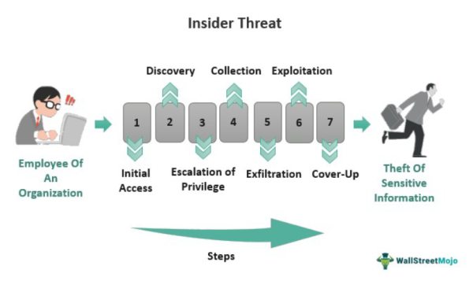

In today's fast-paced financial markets, the mastery of economic metrics, financial analysis, and market indicators is pivotal for achieving trading success. The advent of algorithmic trading, also known as algo trading, has revolutionized how these elements are utilized to automate and enhance trading strategies. By systematically employing economic metrics, financial analysis, and market indicators, algo trading allows traders to make swift, data-driven decisions that aim to optimize returns and mitigate risks.

This article explores the intricate linkages between these crucial components and algorithmic trading, highlighting their collective influence on trading decision-making processes. The integration of economic metrics, which quantitatively assess an economy's vitality, with thorough financial analysis and market indicators, enables traders to construct robust, automated trading strategies that adapt to the dynamics of financial markets.



Whether you are an experienced trader or entering the trading world for the first time, gaining a comprehensive understanding of these elements will equip you with the skills necessary to navigate the complexities of financial markets. Through this exploration, the article aims to provide valuable insights into how economic metrics, financial analysis, and market indicators converge in algorithmic trading to form a sophisticated system for enhanced trading efficiency and effectiveness.

## Table of Contents

## Understanding Economic Metrics

Economic metrics are essential quantitative indicators that provide a snapshot of an economy's health and performance. These metrics are instrumental for traders and investors in interpreting market conditions and making informed decisions. Among the fundamental economic metrics are Gross Domestic Product (GDP), Gross National Product (GNP), Consumer Price Index (CPI), and Producer Price Index (PPI).

**Gross Domestic Product (GDP)** is one of the most widely recognized economic metrics. It measures the total value of goods and services produced within a country's borders over a specified period, usually annually or quarterly. GDP is an essential indicator of economic activity and often reflects the overall economic strength of a nation. It is calculated using the formula:

$$
\text{GDP} = C + I + G + (X - M)
$$

where $C$ is consumption, $I$ is investment, $G$ is government spending, $X$ is exports, and $M$ is imports.

**Gross National Product (GNP)** extends the concept of GDP by including the value of goods and services produced by a country's residents, regardless of their location. Thus, it accounts for domestic and international activities of a nation's residents. GNP is useful for understanding the economic performance of a country's citizens and businesses globally.

**Consumer Price Index (CPI)** is a measure that examines the weighted average of prices of a basket of consumer goods and services, such as transportation, food, and medical care. It is a crucial indicator of inflation and reflects changes in purchasing power and cost of living. A rising CPI indicates inflationary pressures, while a declining CPI suggests deflation.

**Producer Price Index (PPI)** gauges average changes in selling prices received by domestic producers for their output. Unlike CPI, which measures price changes from the consumer's perspective, PPI provides insights from the perspective of industries and producers in the early production and marketing stages. It is a vital indicator for forecasting inflationary trends.

While these metrics provide valuable insights into economic performance, it is important to recognize their potential limitations. For instance, GDP might not fully capture informal economic activities, income distribution inequalities, or environmental factors. Similarly, CPI may not accurately reflect the cost of living for all socio-economic groups due to differences in consumption patterns.

Considering these factors, traders and investors should adopt a comprehensive approach by integrating multiple metrics and perspectives to form a nuanced understanding of the economy. This holistic view allows for better anticipation of market movements and identification of potential investment opportunities, leading to informed and strategic decision-making in the complex landscape of financial markets.

## The Role of Financial Analysis

Financial analysis is a critical component in assessing the viability, profitability, and overall performance of investments, budgets, and projects. It serves as a foundational element in the decision-making process for both individual traders and financial institutions. A core aspect of financial analysis is [fundamental analysis](/wiki/fundamental-analysis), which focuses on evaluating a company's financial health and its market position. This involves scrutinizing financial statements, such as balance sheets, income statements, and cash flow statements, to evaluate key performance indicators (KPIs) such as revenue growth, profit margins, return on assets, and debt-to-equity ratios.

Fundamental analysis provides traders with insights into the intrinsic value of a security, enabling them to make more informed investment decisions. By understanding a company's financial health, traders can gauge its potential for future growth and profitability, which is critical in constructing a diversified investment portfolio. The process of fundamental analysis typically involves both quantitative and qualitative assessments, where the former is driven by numerical evaluation of financial data, and the latter considers factors such as management effectiveness, industry conditions, and competitive advantages.

In the context of algorithmic (algo) trading, financial analysis plays a significant role in refining and enhancing trading strategies. By incorporating detailed financial analysis, algo trading systems can be programmed to consider a range of financial indicators and economic conditions, thus improving the accuracy and reliability of trading decisions. For instance, an algorithm might be designed to execute trades only when a company's earnings per share (EPS) exceeds a certain threshold or when its price-to-earnings (P/E) ratio falls below industry averages.

To optimize trading algorithms, traders frequently analyze large datasets, seeking patterns and insights that conventional methods might miss. The integration of financial analysis within these algorithms allows for better risk management and return optimization. A simplified Python script could look like this:

```python
import pandas as pd

def calculate_pe_ratio(market_price, earnings_per_share):
    return market_price / earnings_per_share

def trade_decision(market_data):
    for ticker in market_data:
        pe_ratio = calculate_pe_ratio(market_data[ticker]['market_price'], market_data[ticker]['eps'])
        if pe_ratio < market_data[ticker]['industry_average']:
            print(f"Consider buying {ticker}: Favorable P/E ratio")
        else:
            print(f"Hold or sell {ticker}: Unfavorable P/E ratio")

# Example usage with mock data
market_data = {
    'ABC': {'market_price': 150, 'eps': 5, 'industry_average': 35},
    'XYZ': {'market_price': 100, 'eps': 10, 'industry_average': 8}
}

trade_decision(market_data)
```

This script evaluates whether particular stocks have P/E ratios below their industry averages, suggesting potential buy opportunities.

Incorporating financial analysis into trading algorithms requires continuous evaluation and adaptation to changing market conditions. As such, traders must be diligent in keeping their financial data and assumptions up to date to maintain the relevance and effectiveness of their trading strategies. Financial analysis, when adeptly applied within the framework of [algorithmic trading](/wiki/algorithmic-trading), significantly enhances the decision-making processes, ultimately leading to more robust and successful trading outcomes.

## Importance of Market Indicators

Market indicators are pivotal in forecasting the future movements of financial markets, and their significance in algorithmic trading cannot be overstated. These indicators, essentially quantitative metrics derived from historical price and [volume](/wiki/volume-trading-strategy) data, offer critical insights into trends, [momentum](/wiki/momentum), and [volatility](/wiki/volatility-trading-strategies), all of which are paramount for traders aiming to refine their trading strategies and risk management protocols.

### Technical Indicators

Among the most widely used market indicators in algorithmic trading are technical indicators such as Moving Averages, Relative Strength Index (RSI), and Moving Average Convergence Divergence (MACD). Each of these serves unique analytical purposes:

1. **Moving Averages (MA)**: MAs smooth out price data to identify the direction of the current trend. Common types include the Simple Moving Average (SMA) and Exponential Moving Average (EMA). In algorithmic trading, MAs are often used to create crossover signals, where a short-term MA intersects a long-term MA, potentially indicating buy or sell opportunities.

    ```python
    # Example of calculating a simple moving average in Python
    def simple_moving_average(prices, window_size):
        weights = np.repeat(1.0, window_size) / window_size
        return np.convolve(prices, weights, 'valid')
    ```

2. **Relative Strength Index (RSI)**: This momentum oscillator measures the speed and change of price movements. RSI values range from 0 to 100, with values over 70 indicating overbought conditions and below 30 indicating oversold conditions, helping traders identify potential reversal points.

    ```python
    # Example of calculating RSI in Python
    def compute_rsi(data, window=14):
        delta = data.diff()
        gain = (delta.where(delta > 0, 0)).rolling(window=window).mean()
        loss = (-delta.where(delta < 0, 0)).rolling(window=window).mean()
        rs = gain / loss
        rsi = 100 - (100 / (1 + rs))
        return rsi
    ```

3. **Moving Average Convergence Divergence (MACD)**: This indicator shows the relationship between two EMAs, typically the 12-period and 26-period EMAs. MACD helps signal bullish or bearish market conditions, with the MACD line crossing above or below its signal line indicating possible buy or sell signals.

    ```python
    # Example of calculating the MACD line and signal line in Python
    def macd(prices, n_fast=12, n_slow=26, n_signal=9):
        ema_fast = prices.ewm(span=n_fast, min_periods=n_slow).mean()
        ema_slow = prices.ewm(span=n_slow, min_periods=n_slow).mean()
        macd_line = ema_fast - ema_slow
        signal_line = macd_line.ewm(span=n_signal, min_periods=n_signal).mean()
        return macd_line, signal_line
    ```

### Trading Signals and Strategy Enhancement

The data gleaned from these indicators are instrumental in generating trading signals. By interpreting the crossover points, overbought or oversold conditions, and momentum shifts, algorithmic systems can execute trades automatically and efficiently. This systematic approach reduces human error, increases speed, and improves accuracy.

Furthermore, a robust comprehension of market indicators allows traders to optimize strategies and manage risks better. By employing a variety of indicators, traders reduce over-reliance on any single metric, mitigating the risk of false signals and enhancing the reliability of the trading system.

In summary, market indicators are an integral component of successful algorithmic trading systems. Their ability to translate historical data into actionable insights empowers traders to develop sophisticated strategies that are adaptive to the dynamic nature of financial markets.

## Algorithmic Trading: An Overview

Algorithmic trading, commonly known as algo trading, employs automated software to execute trades based on predefined criteria. This process leverages computational algorithms that utilize economic metrics, financial analysis, and market indicators to make informed trading decisions. The integration of these elements allows for a systematic and data-driven approach, optimizing the efficiency and accuracy of trade execution.

The benefits of algorithmic trading are extensive, with speed and precision being among the most significant advantages. Algorithms can process and analyze vast amounts of data much faster than any human, enabling them to execute trades at optimal prices and minimizing the delay between the signal generation and trade execution. This capability is particularly advantageous in financial markets where conditions can change in fractions of a second.

Moreover, algorithmic trading systems excel at handling complex datasets, which can include multiple sources of structured and unstructured data, and generating actionable insights. Through automation, these systems eliminate the emotional and psychological biases that often influence human trading decisions, resulting in more consistent and objective outcomes.

Continuous evaluation and optimization of trading algorithms are paramount to maintaining their performance amid shifting market dynamics. Given the ever-changing nature of financial markets, strategies that were once effective may lose their edge, necessitating adjustments. Regular [backtesting](/wiki/backtesting)—testing a strategy on historical data—allows traders to assess the algorithm’s effectiveness and make necessary refinements to adapt to current market conditions.

Algo trading platforms offer a suite of features that support strategy development, risk management, and performance evaluation. Backtesting capabilities are integral to these platforms, allowing traders to simulate the execution of their strategies over a specified historical timeframe. Furthermore, sophisticated risk management tools enable traders to define risk parameters and execute trades while adhering to these constraints, thereby minimizing potential losses.

The combination of algorithmic trading's speed, accuracy, and data-processing abilities positions it as a vital component of modern trading strategies. For traders seeking to harness these benefits, a thorough understanding of both the technical infrastructure and the economic and financial inputs is essential for success.

## Integrating Economic Metrics and Indicators in Algo Trading

Integrating economic metrics and market indicators in algorithmic trading is a critical process that can significantly enhance the performance of trading strategies. Economic metrics offer a comprehensive macroeconomic perspective, providing traders with insights into broader economic conditions. Key metrics, such as Gross Domestic Product (GDP), Consumer Price Index (CPI), and unemployment rates, furnish essential data points that illuminate the economic environment in which markets operate. These metrics inform traders about fundamental factors that might influence market movements on a larger scale.

Conversely, market indicators provide a more granular view, concentrating on specific market movements and price behaviors. Indicators such as Moving Averages, Relative Strength Index (RSI), and Moving Average Convergence Divergence (MACD) serve as tools for interpreting market trends, momentum, and price volatility. By analyzing these indicators, traders can make informed predictions about future market behaviors.

The integration process begins with the collection and analysis of historical and real-time data. Through sophisticated algorithms, traders can automatically generate trade signals that leverage both economic and market insights. For instance, if an algorithm identifies an upward trend in GDP growth alongside bullish market indicators, it might initiate a buy order based on the converging positive signals from both macroeconomic and market-specific data.

Employing a combination of different indicators is a strategic approach to mitigate the risk of false signals. Relying solely on a single indicator can lead to inaccuracies, as market conditions and economic environments are inherently complex and multifaceted. By diversifying the metrics and indicators used, traders can cross-verify signals, reducing the likelihood of erroneous interpretation.

Python, with its rich ecosystem of financial and data analysis libraries, is often used in this context. For instance, traders can utilize libraries like Pandas for data manipulation, NumPy for numerical operations, and TA-Lib for technical analysis. A simple example might involve using these libraries to compute a moving average crossover strategy:

```python
import pandas as pd
import talib

# Load historical market data
data = pd.read_csv('market_data.csv')

# Calculate moving averages
short_window = 40
long_window = 100

data['MA40'] = talib.SMA(data['Close'], timeperiod=short_window)
data['MA100'] = talib.SMA(data['Close'], timeperiod=long_window)

# Identify crossover points for buy/sell signals
data['Signal'] = 0
data.loc[data['MA40'] > data['MA100'], 'Signal'] = 1  # Buy
data.loc[data['MA40'] < data['MA100'], 'Signal'] = -1  # Sell

# Generate trade signals
data['Position'] = data['Signal'].diff()
```

In summary, strategically integrating economic metrics and market indicators in algorithmic trading requires a comprehensive understanding of both macroeconomic and market-specific factors. This integration enhances the robustness and efficacy of trading algorithms, enabling them to adapt and respond to complex and dynamic market conditions.

## Challenges and Considerations

Algorithmic trading, although highly beneficial, presents several challenges that traders must address to ensure success. One of the primary issues is the over-reliance on technical indicators without considering fundamental economic context. Technical indicators, such as moving averages or the Relative Strength Index (RSI), are widely used for their ability to interpret trends and signals. However, solely depending on these without integrating fundamental analysis can lead to misleading conclusions, as technical indicators alone may not fully capture the complexities of market dynamics influenced by macroeconomic factors.

Market conditions are another significant challenge, as they can change rapidly and unpredictably, requiring traders to adopt agile and adaptive algorithmic strategies. An algorithm that performs well under certain market conditions may not necessarily be effective when those conditions shift. This necessitates the use of adaptive algorithms that can adjust their parameters in response to market changes. For instance, [machine learning](/wiki/machine-learning) techniques can be employed to allow algorithms to learn from historical data and adapt to new market conditions dynamically.

Backtesting and continuous monitoring form the backbone of maintaining effective trading algorithms. Backtesting involves simulating the trading strategy on historical data to assess its potential performance. This process helps to identify the flaws and strengths of the algorithm before it is deployed in live markets. Continuous monitoring post-deployment is equally important to track the algorithm's performance and make real-time adjustments. Python, with libraries such as pandas and [backtrader](/wiki/backtrader), offers robust tools for both backtesting and live monitoring:

```python
import backtrader as bt
import pandas as pd

# Sample Backtrader strategy
class MyStrategy(bt.Strategy):
    def __init__(self):
        self.sma = bt.indicators.SimpleMovingAverage(self.data.close, period=15)

    def next(self):
        if self.data.close[0] > self.sma[0]:
            self.buy()
        elif self.data.close[0] < self.sma[0]:
            self.sell()

# Initialize Cerebro engine
cerebro = bt.Cerebro()
data = bt.feeds.PandasData(dataname=pd.read_csv('historical_data.csv'))
cerebro.adddata(data)
cerebro.addstrategy(MyStrategy)
cerebro.run()
```

Regulatory changes present another layer of complexity. Given the ever-evolving landscape of financial regulations, traders engaged in algorithmic trading must remain informed about legal and compliance requirements. Regulations may impact aspects such as data handling, execution speed, and fairness of market access. Being out-of-compliance can lead to significant legal repercussions, necessitating regular updates to trading strategies to align with regulatory standards.

In conclusion, while algorithmic trading offers substantial advantages such as speed and efficiency, traders must vigilantly navigate its inherent challenges. Incorporating both technical and fundamental analysis, adapting to swiftly changing market environments, engaging in rigorous backtesting and monitoring, and maintaining compliance with regulations are essential practices for success and sustainability in algorithmic trading.

## Conclusion

Understanding economic metrics, financial analysis, and market indicators is crucial for effective trading. These elements form the foundational pillars upon which algorithmic trading operates, facilitating enhanced efficiency and informed decision-making within financial markets. By effectively aligning economic insights with technical analysis, traders can optimize their strategies and improve overall performance. For instance, they can leverage Gross Domestic Product (GDP) and Consumer Price Index (CPI) data to inform macroeconomic forecasts while using Moving Average Convergence Divergence (MACD) and Relative Strength Index (RSI) for technical analysis insights. Such integration enables a comprehensive approach to market analysis and trading execution.

Python code snippets demonstrate the practical applications of these concepts, such as using pandas and numpy libraries for data manipulation and quantitative analysis:

```python
import pandas as pd
import numpy as np

# Example: Calculate simple moving average (SMA)
def calculate_sma(data, window):
    return data.rolling(window=window).mean()

# Example dataset of closing prices
closing_prices = pd.Series([100, 102, 101, 105, 107, 110])

# Calculate 3-day SMA
sma_3 = calculate_sma(closing_prices, 3)
print(sma_3)
```

Continuous learning and adaptation are essential for successfully navigating the evolving landscape of algorithmic trading. The financial markets are characterized by their dynamic nature, where changes occur rapidly due to market sentiment, geopolitical events, and technological advancements. Traders must stay updated with these changes to ensure their trading algorithms and strategies remain effective and profitable. This requires regular backtesting, monitoring, and adjustments to trading models, ensuring adaptability to new data and patterns.

As markets evolve, the integration of economic metrics, financial analysis, and market indicators will remain a vital component of trading success. Algorithmic trading will continue to innovate, leveraging advancements in [artificial intelligence](/wiki/ai-artificial-intelligence) and machine learning to improve predictive accuracy and trading efficiency. The strategic integration of diverse data sources and analytical tools will empower traders to make more informed decisions, navigate complexities, and capitalize on market opportunities. This adaptive approach is pivotal to thriving in the fast-paced and ever-changing world of financial trading.

## References & Further Reading

[1]: Bergstra, J., Bardenet, R., Bengio, Y., & Kégl, B. (2011). ["Algorithms for Hyper-Parameter Optimization."](https://dl.acm.org/doi/10.5555/2986459.2986743) Advances in Neural Information Processing Systems 24.

[2]: ["Advances in Financial Machine Learning"](https://www.amazon.com/Advances-Financial-Machine-Learning-Marcos/dp/1119482089) by Marcos Lopez de Prado

[3]: ["Evidence-Based Technical Analysis: Applying the Scientific Method and Statistical Inference to Trading Signals"](https://www.amazon.com/Evidence-Based-Technical-Analysis-Scientific-Statistical/dp/0470008741) by David Aronson

[4]: ["Machine Learning for Algorithmic Trading"](https://github.com/stefan-jansen/machine-learning-for-trading) by Stefan Jansen

[5]: ["Quantitative Trading: How to Build Your Own Algorithmic Trading Business"](https://www.amazon.com/Quantitative-Trading-Build-Algorithmic-Business/dp/1119800064) by Ernest P. Chan