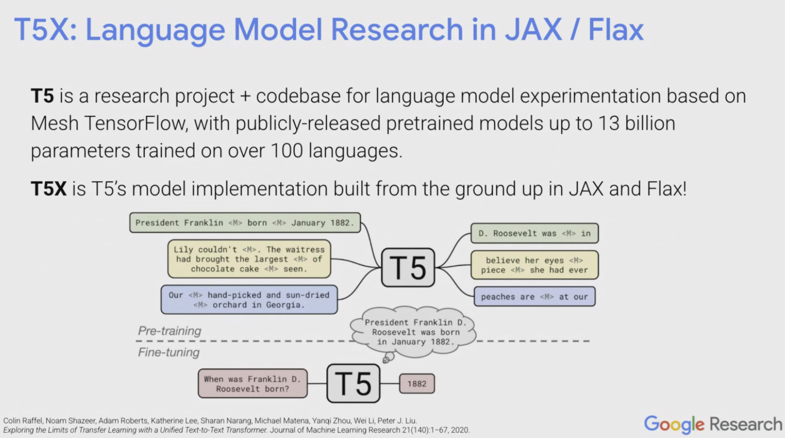

## Table of Contents

## What is Flaxformer and what is its primary purpose in machine learning?

Flaxformer is a library designed to make it easier to work with transformer models in the Flax framework, which is a machine learning library developed by Google. Transformers are a type of neural network architecture that are very good at understanding and generating text, among other tasks. Flaxformer helps researchers and developers by providing pre-built components and tools specifically for transformer models, making it simpler to create, train, and use these models.

The primary purpose of Flaxformer in machine learning is to streamline the process of building and experimenting with transformer models. By offering a set of ready-to-use modules and utilities, Flaxformer reduces the time and effort needed to set up and tweak these complex models. This allows users to focus more on improving the performance of their models or trying out new ideas, rather than getting bogged down in the technical details of implementation.

## How does Flaxformer differ from other transformer models?

Flaxformer is different from other transformer models because it's built on top of the Flax framework, which is made by Google. This means Flaxformer uses Flax's way of doing things, like how it handles data and runs calculations. Other transformer models might be built on different frameworks, like PyTorch or TensorFlow, which have their own ways of working. Flaxformer also comes with special tools and parts that are made just for transformer models, making it easier to build and play around with these models without starting from scratch.

Another way Flaxformer stands out is that it's designed to make building and using transformer models simpler. It gives you ready-to-use pieces that you can put together to make a model, kind of like building with Lego blocks. This can save a lot of time compared to other models where you might have to write a lot of code yourself. Also, because Flaxformer is focused on transformers, it includes things like attention mechanisms and encoder-decoder setups that are important for these models, making it easier to get good results quickly.

## What are the key components of Flaxformer architecture?

The Flaxformer architecture includes several key components that help it work well with transformer models. One important part is the attention mechanism, which helps the model focus on different parts of the input when processing it. This is crucial for understanding and generating text because it allows the model to weigh the importance of different words or parts of a sentence. Another key component is the encoder-decoder structure, which is used in many transformer models. The encoder takes in the input and turns it into a format that the decoder can use to generate output. This setup is helpful for tasks like translation, where you need to understand one language and then produce text in another.

In addition to these, Flaxformer also includes modules for things like positional encoding, which helps the model understand the order of words in a sentence. This is important because, unlike some other types of models, transformers don't naturally understand the sequence of data without this help. Flaxformer also provides tools for managing model parameters and optimizing the training process, making it easier to experiment and improve the performance of transformer models. By offering these pre-built components, Flaxformer simplifies the process of building and using transformer models, allowing users to focus more on the task at hand rather than the technical details.

## Can you explain the training process of a Flaxformer model?

Training a Flaxformer model involves feeding it lots of data and adjusting its parameters so it can learn from that data. You start by giving the model some input, like a sentence, and then it tries to predict something based on that input, like the next word in the sentence. The model makes a guess, and then you compare that guess to the correct answer. If the guess is wrong, you use something called a loss function to figure out how wrong it is. The loss function gives you a number that tells you how far off the model's guess was. Then, you use a technique called backpropagation to figure out how to change the model's parameters to make the guess better next time. This process repeats over and over, with the model getting a little better each time, until it's good enough at making predictions.

During training, you also use something called an optimizer to help adjust the model's parameters. The optimizer takes the information from the loss function and decides how to change the parameters in a way that will reduce the loss over time. You can think of the optimizer like a coach that helps the model learn more effectively. As the model trains, you might also use techniques like batching, where you train the model on small groups of data at a time, and you might use validation data to check how well the model is doing on data it hasn't seen before. This helps you make sure the model isn't just memorizing the training data but is actually learning to understand the patterns in it.

## What types of data can Flaxformer effectively process?

Flaxformer can handle different kinds of data, but it's really good with text. It can understand and create sentences, translate languages, and even answer questions based on what it reads. This is because Flaxformer uses transformer models, which are great at figuring out the relationships between words in a sentence. So, if you have a bunch of text data, like books, articles, or messages, Flaxformer can learn from it and do things like summarize it or generate new text that sounds similar.

Besides text, Flaxformer can also work with other types of data, like numbers or images, but it might need some extra steps to do so. For numbers, you might need to turn them into a format that the model can understand, like a sequence of values. For images, you might need to break them down into smaller parts, like pixels or features, before feeding them into the model. Once you do that, Flaxformer can learn from these different types of data and make predictions or generate new content based on what it's learned.

## How does Flaxformer handle sequence-to-sequence tasks?

Flaxformer is really good at handling sequence-to-sequence tasks, like translating sentences from one language to another. It does this by using an encoder-decoder setup. The encoder takes in the input sequence, like a sentence in English, and turns it into something the decoder can understand. The decoder then looks at what the encoder made and tries to create a new sequence, like the same sentence but in French. This back-and-forth between the encoder and decoder helps Flaxformer understand and generate text accurately.

When Flaxformer is training for these tasks, it learns to pay attention to different parts of the input sequence. This is called the attention mechanism, and it's like the model is deciding which words are important to focus on when translating or summarizing. By adjusting its parameters during training, Flaxformer gets better at figuring out which parts of the input it should use to create the right output sequence. This makes it really effective for tasks where you need to understand one sequence and produce another, like in language translation or text summarization.

## What are the performance benefits of using Flaxformer over traditional models?

Flaxformer can make things faster and easier when you're working with transformer models. It's built on the Flax framework, which is made by Google and is known for being quick and efficient. Because Flaxformer uses Flax, it can take advantage of these speed benefits, making it faster to train and use transformer models. Also, Flaxformer comes with ready-to-use parts that you can put together to make a model, so you don't have to start from scratch. This can save a lot of time and effort compared to building everything yourself with traditional models.

Another performance benefit of Flaxformer is that it's designed specifically for transformer models. This means it includes special tools and ways of working that make it easier to get good results with these kinds of models. For example, Flaxformer has built-in support for attention mechanisms and encoder-decoder setups, which are really important for transformer models. By using these pre-built components, you can focus more on making your model better, instead of worrying about the technical details. This can lead to better performance and faster progress in your machine learning projects.

## How can Flaxformer be integrated with other machine learning frameworks?

Flaxformer can be integrated with other machine learning frameworks, like PyTorch or TensorFlow, by using special tools that help different systems talk to each other. For example, if you want to use Flaxformer with PyTorch, you can use libraries like `jax2torch` to convert Flax models into PyTorch models. This way, you can use Flaxformer's transformer components in a PyTorch project, making it easier to combine the strengths of both frameworks.

Another way to integrate Flaxformer is by using APIs or interfaces that allow different frameworks to work together. For instance, you might use Flaxformer to build a model and then use TensorFlow's serving tools to deploy it. By using these kinds of tools, you can take advantage of Flaxformer's efficiency and ease of use while still being able to work with other popular frameworks. This flexibility can help you build better machine learning projects by mixing and matching the best parts of different systems.

## What are some common applications of Flaxformer in industry?

Flaxformer is used a lot in the language translation industry. Companies use it to make apps and services that can translate text from one language to another quickly and accurately. This is because Flaxformer is good at understanding the meaning of sentences and figuring out how to say the same thing in a different language. For example, a company might use Flaxformer to help customers who speak different languages understand each other on a website or in a chat app.

Another common use of Flaxformer is in text summarization. Businesses use it to take long documents, like reports or articles, and turn them into short summaries that are easy to read. This can save a lot of time for people who need to go through a lot of information quickly. For instance, a news organization might use Flaxformer to summarize news stories so that readers can get the main points without reading the whole article.

Flaxformer is also used in customer service to answer questions and provide information. Companies can train Flaxformer models to understand customer questions and give helpful answers. This can improve the customer experience by making it easier and faster to get the information they need. For example, a company might use Flaxformer in a chatbot to help customers find answers to common questions about products or services.

## What are the current limitations or challenges faced by Flaxformer?

One of the main challenges with Flaxformer is that it's built on the Flax framework, which isn't as widely used as other frameworks like PyTorch or TensorFlow. This means there might be fewer people who know how to use Flaxformer, and fewer tools and resources available for it. If you're working on a project and need help, it might be harder to find support or pre-built solutions compared to more popular frameworks. Also, because Flaxformer is focused on transformer models, it might not be the best choice for every kind of machine learning task. If you need to work with different types of models or data, you might have to use other tools alongside Flaxformer, which can make things more complicated.

Another limitation is that training transformer models, like those used in Flaxformer, can take a lot of time and computer power. These models have many parameters and need a lot of data to learn well, so they can be slow to train and might need special hardware like GPUs to speed things up. This can be a challenge for smaller teams or companies that don't have a lot of resources. Also, while Flaxformer makes it easier to build and use transformer models, you still need to know a lot about how these models work to use them effectively. If you're new to machine learning, it might take some time to learn how to get the best results with Flaxformer.

## How can one optimize Flaxformer for specific use cases?

To optimize Flaxformer for specific use cases, you need to start by understanding what your task is and what kind of data you're working with. If you're doing language translation, you might want to focus on making the model better at understanding different languages. This could mean training the model on a lot of text in those languages or using special techniques to help it learn the differences between them. You can also change the model's size by adjusting the number of layers or the number of parameters. A bigger model might be better at understanding complex patterns, but it will take longer to train and need more computer power.

Another way to optimize Flaxformer is by tweaking the training process. You can try different optimizers or learning rates to see what works best for your task. Sometimes, using a technique called fine-tuning can help, where you start with a model that's already been trained on a lot of data and then train it a bit more on your specific data. This can make the model learn faster and perform better on your task. Also, you can use data augmentation to make your training data more varied, which can help the model learn to handle different situations. By trying out these different approaches and seeing what works best, you can make Flaxformer work better for your specific use case.

## What are the latest advancements or research directions in Flaxformer technology?

Recent advancements in Flaxformer technology have focused on making transformer models even more efficient and powerful. Researchers are working on ways to reduce the amount of computer power needed to train these models. One approach is called "sparse attention," where the model only looks at some parts of the input instead of all of it. This can make training faster and use less memory. Another direction is improving the model's ability to understand and generate long sequences of text. By using techniques like "long-range dependencies," Flaxformer can better capture the relationships between words that are far apart in a sentence or document.

In addition to efficiency, researchers are exploring how to make Flaxformer models more adaptable to different tasks. One exciting area is "multitask learning," where a single Flaxformer model can be trained to do several things at once, like translating languages and summarizing text. This can make the model more useful and versatile. Another research direction is "few-shot learning," where the model can learn new tasks with just a few examples. This could make it easier to use Flaxformer in situations where you don't have a lot of data. Overall, these advancements are helping to make Flaxformer a more powerful and flexible tool for machine learning.