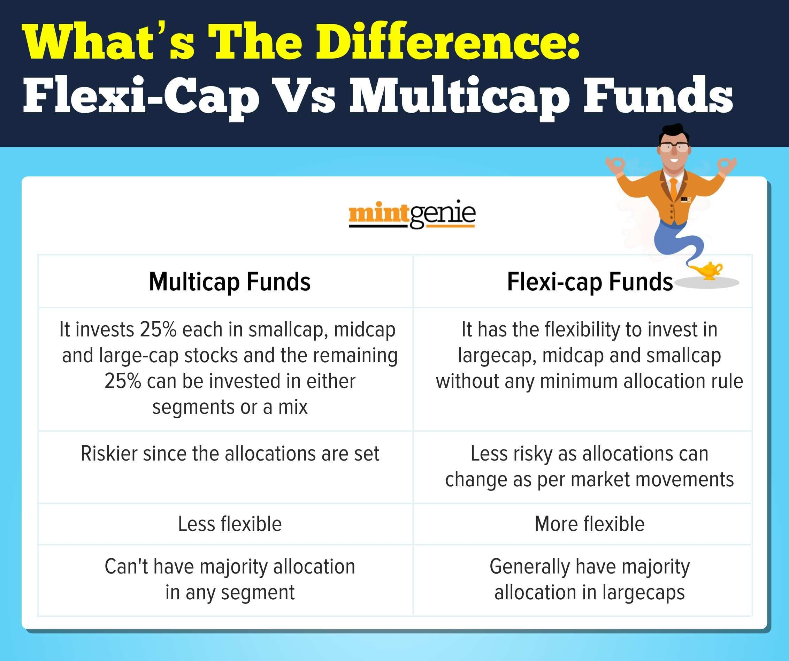

Flexi-cap funds have gained prominence among investors due to their ability to offer diversification and adaptability within a single investment vehicle. These funds do not limit their investments to a particular market capitalization and instead allocate resources across large-cap, mid-cap, and small-cap stocks. This characteristic allows for a balanced exposure to different segments of the market, potentially mitigating risk and capitalizing on growth opportunities in various economic conditions.

Investors are increasingly drawn to these funds for their ability to dynamically adjust portfolios in response to market movements. Such adaptability is critical in today's volatile financial landscape, where shifts in economic policies, technological advancements, and geopolitical developments can significantly impact market dynamics. Flexi-cap funds, by design, provide the flexibility to navigate these changes, potentially offering both stability and growth.



This article seeks to explore the strategies that underpin flexi-cap funds and their integration with mutual funds and algorithmic trading. Algorithmic trading, or algo trading, involves using automated trading systems to execute orders based on pre-defined criteria and is particularly relevant in enhancing the efficacy of flexi-cap fund investment strategies. The use of algorithms can optimize decision-making processes, improve execution speed, and minimize market impact, all of which are essential for maintaining competitiveness in the financial markets.

By examining the operational mechanism of flexi-cap funds, we aim to highlight their advantages and the role of algorithmic trading in elevating investment strategies. This evaluation will provide investors with insights into how these funds can be leveraged to achieve diversified and flexible investment goals while considering the potential for optimized returns through advanced trading technologies.

## Table of Contents

## Understanding Flexi-Cap Funds

Flexi-cap funds are a category of equity mutual funds that offer considerable flexibility to fund managers in terms of their investment strategies. Unlike funds that are strictly defined by market capitalization, such as large-cap, mid-cap, or small-cap funds, flexi-cap funds do not adhere to predefined investment limits for different company sizes. This absence of rigid allocation constraints allows managers to dynamically adjust their portfolios according to prevailing market conditions and emerging opportunities.

The hallmark of flexi-cap funds is their ability to traverse the entire market capitalization spectrum. By investing in companies across large, mid, and small-cap categories, these funds significantly boost their diversification potential. Diversification is a well-recognized method for managing investment risk; by spreading investments across various sectors and market capitalizations, flexi-cap funds are better positioned to mitigate the impact of market volatility.

Fund managers leveraging flexi-cap strategies aim to combine the stability typically associated with large-cap stocks with the growth potential often seen in mid and small-cap stocks. This blend seeks to provide a balanced risk-return profile, appealing to investors who desire exposure to both established market players and emerging growth enterprises. For instance, during periods of economic expansion, managers may increase allocations to mid and small-cap stocks to capitalize on their growth prospects. Conversely, in more uncertain economic climates, a greater focus might be placed on large-cap stocks to harness their stability.

The versatility of flexi-cap funds enables fund managers to align investment strategies with economic cycles and market sentiment, optimizing the potential for stable returns even amidst fluctuating market environments. This dynamic reallocation can be particularly advantageous for active portfolio management, allowing managers to respond promptly to changes in market dynamics.

Overall, the structure and operational flexibility of flexi-cap funds create a unique investment avenue for those seeking a comprehensive equity exposure. Through prudent fund management, flexi-cap funds can offer investors a harmonious balance of growth potential and risk management, leveraging their capacity to seamlessly adjust to varying market environments.

## Benefits of Investing in Flexi-Cap Funds

Flexi-cap funds are a category of mutual funds offering significant benefits for investors due to their inherent flexibility and broad diversification. By investing across various sectors and company sizes—encompassing large-cap, mid-cap, and small-cap stocks—these funds introduce a diversification strategy that aids in effective risk management. Diversification is a fundamental investment principle designed to reduce risk by allocating investments among various financial instruments, industries, and other categories. The flexi-cap fund achieves this by spreading investments, thus minimizing the impact of poor performance in any single security or sector.

The flexibility of flexi-cap funds allows them to be highly adaptable to shifting market conditions and economic dynamics. Fund managers have the liberty to adjust the fund's portfolio to align with current market trends, pivot during economic shifts, and capitalize on emerging opportunities. This adaptability is particularly advantageous during volatile market phases, where quick realignment of investments can preserve capital and exploit potential growth areas.

The potential for higher returns is a critical advantage of flexi-cap funds, especially during favorable market conditions. By strategically allocating resources across a broad market spectrum, fund managers can optimize returns by focusing on sectors or stocks poised for growth. This strategic allocation often includes rotating investments among different market cap segments based on performance forecasts and market [momentum](/wiki/momentum).

In summary, flexi-cap funds provide investors with an efficient mechanism for achieving diversification, enhancing risk management, and potentially realizing higher returns. While the success of such investments significantly depends on the expertise of the fund managers in navigating market fluctuations, the inherent flexibility and broad scope of investments make flexi-cap funds an attractive option for those seeking to balance risk and returns effectively.

## The Role of Algorithmic Trading in Mutual Funds

Algorithmic trading, often referred to as algo trading, is an advanced trading method utilizing automated and pre-programmed trading instructions to execute buy and sell orders in financial markets. This systematic approach allows investors to perform trades at speeds and frequencies that would be impossible for human traders. The use of algorithms reduces the impact of human emotions and biases on trading decisions, resulting in more consistent and reliable investment outcomes.

In mutual funds, especially flexi-cap funds, [algorithmic trading](/wiki/algorithmic-trading) plays a significant role in enhancing decision-making efficiency and execution speed. By integrating algorithmic models, fund managers can systematically analyze vast amounts of market data to identify optimal investment opportunities. These models work by examining historical data, market trends, and economic indicators to predict future market movements and make informed trading decisions.

The capabilities of algorithmic trading include not just speed but also precision. Algorithms can be adjusted to execute trades under specific conditions, such as price movements, [volume](/wiki/volume-trading-strategy) changes, or specified time intervals. This precision allows flexi-cap fund managers to dynamically adjust their portfolios in response to market fluctuations, ensuring optimal asset allocation.

Moreover, algorithmic trading can help in optimizing fund performance by employing strategies like statistical [arbitrage](/wiki/arbitrage), [trend following](/wiki/trend-following), and mean reversion. For example, a mean reversion strategy may use an algorithm to detect when a stock's price will revert to its historical average, prompting timely buy or sell decisions. Similarly, trend-following algorithms can capitalize on the upward or downward trends in stock prices, aligning with the adaptive nature of flexi-cap funds to secure potential gains.

The benefits of algorithmic trading extend to risk management, as these models can set predefined risk parameters that automatically limit losses and protect portfolio value. Additionally, by utilizing technology and computation, fund managers can conduct [backtesting](/wiki/backtesting) on various strategies, evaluating their effectiveness with historical data before implementing them in real trading scenarios.

Overall, the integration of algorithmic trading into the management of flexi-cap funds offers a robust framework for improving investment returns. It streamlines the trading process, minimizes human error, and leverages data-driven insights to enhance the adaptability and performance of mutual funds in a complex market environment.

## Example Strategies Using Flexi-Cap Funds and Algo Trading

Flexi-cap funds provide unique opportunities for incorporating algorithmic trading strategies to enhance investment returns. One such strategy is leveraging algorithmic trading to detect underperforming sectors within the flexi-cap fund. By employing sophisticated algorithms, fund managers can realign assets towards sectors with growth potential, optimizing the portfolio for potential gains. 

For instance, algorithmic models can analyze real-time market data alongside historical performance metrics to uncover sectors or companies that are either lagging or exhibit signs of recovery potential. This dynamic approach allows for quick reallocation of assets that can capitalize on short-term undervaluation or market corrections.

By integrating quantitative analysis with flexi-cap fund strategies, investors can dynamically adjust portfolios based on predictive modeling. This predictive modeling involves utilizing statistical methods and [machine learning](/wiki/machine-learning) algorithms to forecast market trends and stock performance. These models assess vast datasets, including historical prices, economic indicators, and market sentiment, to generate insights that guide investment decisions.

To illustrate, consider a predictive model that employs a linear regression analysis to forecast returns based on historical market data. Such a model might identify that small-cap stocks within the flexi-cap fund are undervalued. An investor could then use this insight to adjust their portfolio allocation to increase exposure to these stocks, anticipating a market correction that could enhance returns.

Here's a simplified Python example of using linear regression for predicting stock returns:

```python
import numpy as np
import pandas as pd
from sklearn.linear_model import LinearRegression
from sklearn.model_selection import train_test_split

# Hypothetical dataset of stock returns and market factors
data = pd.DataFrame({
    'historical_return': np.random.rand(100),
    'market_trend': np.random.rand(100),
    'economic_indicator': np.random.rand(100)
})

# Target variable
target = data['historical_return']

# Features
features = data.drop('historical_return', axis=1)

# Train-test split
X_train, X_test, y_train, y_test = train_test_split(features, target, test_size=0.2, random_state=42)

# Linear regression model
model = LinearRegression()
model.fit(X_train, y_train)

# Predict returns
predicted_returns = model.predict(X_test)

# Output predicted returns
print(predicted_returns)
```

Additionally, historical cases demonstrate how algorithmic trading has enhanced fund returns by seizing timely market opportunities. For example, during periods of market [volatility](/wiki/volatility-trading-strategies), algorithms configured for short-term trading can swiftly execute buy and sell orders capitalizing on price fluctuations. This capability reduces human error and enhances execution speed, potentially increasing the fund's profitability.

Overall, combining algorithmic trading with flexi-cap fund strategies can provide a robust framework for achieving superior returns by exploiting market inefficiencies and dynamically adjusting investments in response to evolving market conditions.

## Considerations and Challenges

Investors venturing into flexi-cap funds must thoroughly examine several critical factors to optimize their investments. First and foremost, the expertise and track record of fund managers play a pivotal role. Successful navigation through market volatility largely relies on the manager's ability to make informed decisions. Experienced fund managers who have demonstrated consistent performance across different market conditions can offer a level of assurance for investors.

Incorporating algorithmic trading into investment strategies brings about its own set of risks. While algorithmic trading has the potential to improve efficiency and capture market opportunities, it also introduces technology-related risks. System errors, software glitches, or unexpected market events can lead to unintended consequences or significant financial losses. Hence, it is essential to ensure robust technological infrastructure and regular system audits to mitigate these risks.

The expense ratio is another crucial consideration. An expense ratio represents the percentage of a fund's assets that are used for administrative and other operating expenses. Investors should aim for a balance between the expense ratio and the net returns of the investment. High operational costs, if not justified by superior fund performance, can erode the investment gains significantly. For instance, if a flexi-cap fund has an annual return rate of 8% and an expense ratio of 2%, the net return effectively reduces to 6%.

Investors must maintain a vigilant approach, regularly reviewing the performance of their investments against these critical considerations. This balanced assessment can lead to more informed investment decisions, aligning with both risk appetite and financial goals.

## Conclusion

Flexi-cap funds are a versatile and adaptable option within the mutual fund landscape, offering unique advantages due to their ability to invest across various market capitalizations. This capability allows fund managers to strategically allocate resources based on market conditions, catering to diverse risk appetites and investment goals. Such adaptability is further enhanced when combined with algorithmic trading, which can effectively identify and exploit market opportunities, boosting the potential for returns.

Algorithmic trading, with its automated execution and data-driven analysis, complements the flexibility of flexi-cap funds by enabling quick adaptations to market fluctuations. This synergy helps in optimizing asset allocation and maintaining an optimal balance between risk and return. Through algorithms, investors can dynamically adjust portfolios, ensuring that investments align with current market trajectories and investment predictions.

For investors, it is vital to align their risk profiles and long-term objectives with the inherent capabilities of flexi-cap funds. This involves understanding both the scope and the limitations of such investment vehicles and leveraging their flexibility to achieve specific financial goals. By assessing individual risk tolerance and defining clear investment targets, investors can harness the full potential of flexi-cap funds, while also managing the risks associated with market volatility and technological integrations like algorithmic trading.

In conclusion, flexi-cap funds, when paired strategically with algorithmic trading, provide enhanced flexibility and the prospect of improved returns. By aligning investment strategies with personal financial objectives, investors can maximize portfolio performance and potentially achieve superior growth.

## References & Further Reading

[1]: Marcos Lopez de Prado. ["Advances in Financial Machine Learning,"](https://www.amazon.com/Advances-Financial-Machine-Learning-Marcos/dp/1119482089) Wiley, 2018.

[2]: Stefan Jansen. ["Machine Learning for Algorithmic Trading, Second Edition,"](https://github.com/stefan-jansen/machine-learning-for-trading) Packt Publishing, 2020.

[3]: David Aronson. ["Evidence-Based Technical Analysis: Applying the Scientific Method and Statistical Inference to Trading Signals,"](https://www.amazon.com/Evidence-Based-Technical-Analysis-Scientific-Statistical/dp/0470008741) Wiley, 2006.

[4]: Ernest P. Chan. ["Quantitative Trading: How to Build Your Own Algorithmic Trading Business,"](https://www.amazon.com/Quantitative-Trading-Build-Algorithmic-Business/dp/0470284889) Wiley, 2008.

[5]: Bergstra, J., Bardenet, R., Bengio, Y., & Kégl, B. (2011). ["Algorithms for Hyper-Parameter Optimization."](https://dl.acm.org/doi/10.5555/2986459.2986743) Advances in Neural Information Processing Systems 24.